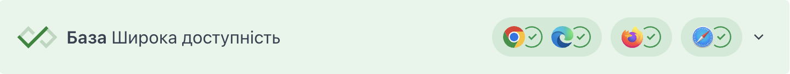
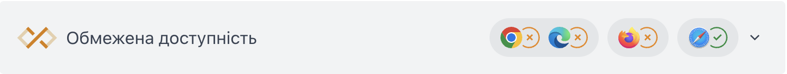

{{GlossarySidebar}}

**База** позначає доступність можливостей вебплатформи в різних браузерах, в тому числі API, властивостей CSS і записів синтаксису JavaScript. База описує можливості вебу як такі, що мають широку доступність або з'явилися нещодавно. Про можливості, що не відповідають критеріям Бази, кажуть, що вони мають обмежену доступність.

База відстежує підтримку в наступних браузерах:

- Apple Safari (iOS)
- Apple Safari (macOS)
- Google Chrome (Android)
- Google Chrome (стільничний)
- Microsoft Edge (стільничний)
- Mozilla Firefox (Android)
- Mozilla Firefox (стільничний)

База – це підсумок браузерної підтримки. Це не заміна для перевірок доступності, зручності, швидкодії, безпечності та іншого тестування. База може не підказати, чи працює якась можливість:

- На старих пристроях і версіях браузерів
- У браузерах, що не покриваються визначенням Бази, наприклад, вбудованих вебвіконцях операційних систем.
- В допоміжних технологіях, таких як читачі з екрана.

## Картки Бази

Можливості, вказані з **широкою доступністю**, мають сталу історію підтримки в кожному з браузерів Бази вже щонайменше 2,5 роки.

Можливості, вказані як **доступні віднедавна**, працюють у щонайменше останній стабільній версії кожного з браузерів Бази, але можуть не працювати на старших браузерах або пристроях.

Можливості, вказані з **обмеженою доступністю**, поки доступні _не_ в усіх браузерах.

## Дивіться також

- [Кросбраузерне тестування](/uk/docs/Learn/Tools_and_testing/Cross_browser_testing)
- [Репозиторій web-platform-dx/feature-set](https://github.com/web-platform-dx/feature-set)
- [Група спільноти WebDX W3C](https://www.w3.org/community/webdx/)
- [Репозиторій mdn/browser-compat-data](https://github.com/mdn/browser-compat-data)
- [caniuse.com](https://caniuse.com/)
- [a11ysupport.io](https://a11ysupport.io/)
