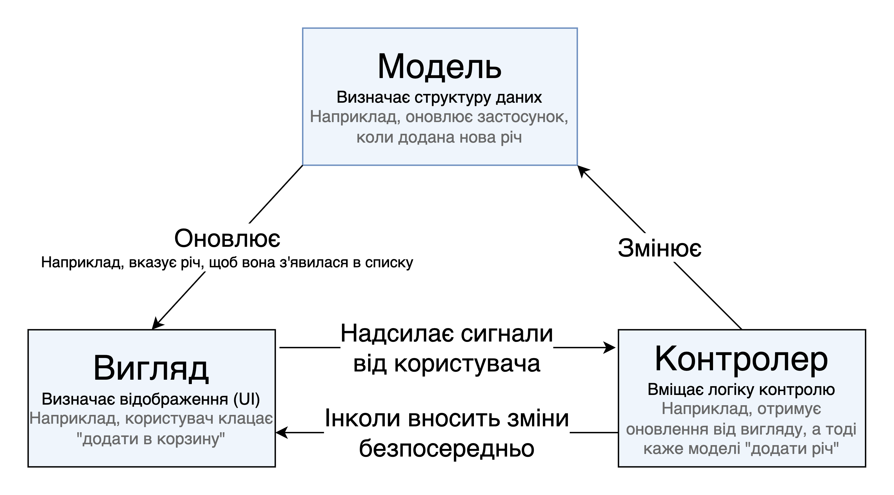

{{GlossarySidebar}}

**MVC** (Model-View-Controller, модель – вигляд – контролер) – це патерн у проєктуванні програмного забезпечення, що поширений у реалізації користувацьких інтерфейсів, даних і логіки контролю. Він наголошує на розділенні між бізнес-логікою програмного забезпечення та відображенням. Таке "розділення обов'язків" забезпечує кращий розподіл праці та поліпшує обслуговування. Деякі інші патерни проєктування базуються на MVC, такі як MVVM (Model-View-Viewmodel, модель – вигляд – модель вигляду), MVP (Model-View-Presenter, модель – вигляд – презентатор) та MVW (Model-View-Whatever, модель – вигляд – що завгодно).

Три частини патерну проєктування програмного забезпечення MVC можна описати наступним чином:

1. Модель – керує даними та бізнес-логікою.
2. Вигляд – займається компонуванням і відображенням.
3. Контролер – спрямовує команди до моделі та вигляду.

## Приклад Моделі – Вигляду – Контролера

Imagine a simple shopping list app. All we want is a list of the name, quantity and price of each item we need to buy this week. Below we'll describe how we could implement some of this functionality using MVC.

Уявімо нескладний застосунок для списку покупок. Усе, що потрібно – список з назвою, кількістю й ціною кожної речі, яку треба купити цього тижня. Нижче описано, як можна було б реалізувати частину цих можливостей за допомогою MVC.

### Модель

Модель визначає те, які дані повинен вміщати застосунок. Якщо стан його даних змінюється, то модель зазвичай сповіщає про це вигляд (щоб відображення за потреби могло змінитися), а також іноді контролер (якщо для керування оновленим виглядом потрібна інша логіка).

Повертаючись до застосунку зі списком покупок, модель визначає, які дані повинен містити список – назва речі, ціна тощо – та які речі вже присутні в списку.

### Вигляд

Вигляд визначає те, як дані застосунку повинні відображатися.

У нашому застосунку вигляд визначає те, як список подається користувачу, та отримує дані для відображення з боку моделі.

### Контролер

Контролер вміщає логіку, що оновлює модель чи вигляд у відповідь на введення з боку користувачів застосунку.

Тож, наприклад, список покупок може мати форми для введення та кнопки, що дають змогу додавати й видаляти речі. Ці дії вимагають оновлення моделі, тож введення надсилається контролеру, який потім відповідним чином змінює модель, яка, своєю чергою, надсилає оновлені дані до вигляду.

Проте можна також просто оновити вигляд, аби показати дані в іншому форматі, наприклад, змінити порядок речей на алфавітний, або за зростанням ціни. У такому випадку контролер може зробити це безпосередньо, без потреби оновлювати модель.

## MVC у Вебі

Кожному веброзробнику, ймовірно, цей патерн доволі знайомий, навіть якщо ніколи не використовувався свідомо. Модель даних, мабуть, вміщена в якогось роду базі даних (або традиційній серверній, штибу MySQL, або клієнтському рішенні штибу [IndexedDB](/uk/docs/Web/API/IndexedDB_API).) Контрольний код застосунку, ймовірно, написаний на HTML і JavaScript, а користувацький інтерфейс – на HTML, CSS і ще чому завгодно. Це звучить доволі подібно до MVC, але MVC змушує ці компоненти відповідати більш жорсткому патерну.

Колись у Вебі архітектура MVC здебільшого реалізовувалась на серверному боці, а клієнт отримував оновлення за допомогою форм і посилань, а також отримання оновлених виглядів для відображення в браузері. Проте нині значна частина логіки віддається клієнту, завдяки появі клієнтських сховищ даних та [Fetch API](/uk/docs/Web/API/Fetch_API), що дає змогу оновлювати частини сторінки за потреби.

Усі вебфреймворки штибу [AngularJS](https://uk.wikipedia.org/wiki/AngularJS) та [Ember.js](https://uk.wikipedia.org/wiki/Ember.js) реалізують архітектуру MVC, хоча й трохи по-різному.

## Дивіться також

- [Модель-вид-контролер](https://uk.wikipedia.org/wiki/%D0%9C%D0%BE%D0%B4%D0%B5%D0%BB%D1%8C-%D0%B2%D0%B8%D0%B4-%D0%BA%D0%BE%D0%BD%D1%82%D1%80%D0%BE%D0%BB%D0%B5%D1%80) на Вікіпедії
