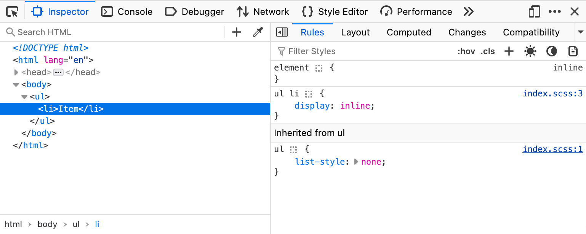
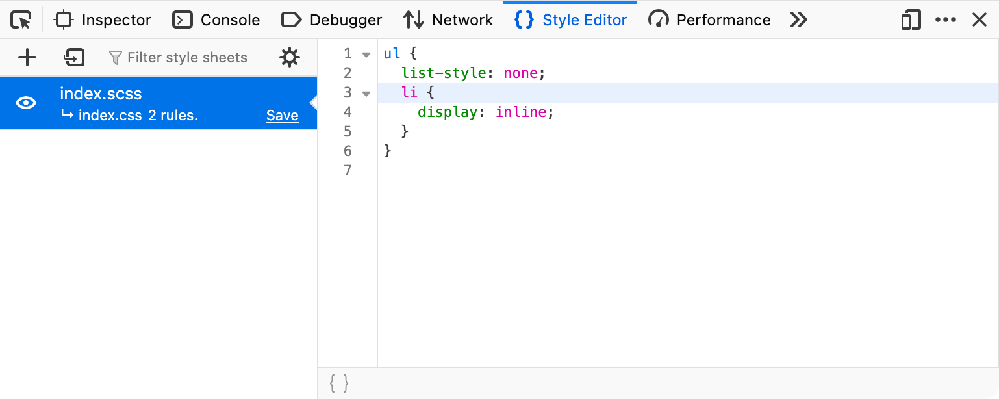

{{GlossarySidebar}}

**Карта коду** – це формат файлу {{Glossary("JSON")}}, що містить відображення між мініфікованим або перетвореним кодом, отриманим браузером, і його вихідною незміненою формою, що дає змогу відновити вихідний код та використовувати його під час зневадження.

Код, що виконується браузером, нерідко певним чином перетворений відносно вихідного коду, створеного розробником. Це може бути зроблено з кількох причин:

- Аби зробити доставлення коду з сервера більш ефективним шляхом об'єднання та мініфікації вихідних файлів.
- Аби підтримувати старші браузери, перетворюючи сучасні можливості на їхні старі еквіваленти.
- Аби користуватися мовами, які браузери не підтримують, такими як {{Glossary("TypeScript")}} або [Sass](https://sass-lang.com/).

У таких ситуаціях зневадження вихідного коду набагато простіше, ніж зневадження коду в перетвореному стані, який браузер звантажив.
Браузери виявляють карту коду за допомогою заголовка HTTP {{HTTPHeader("SourceMap")}} для ресурсу або анотації `sourceMappingURL` у згенерованому коді.

## Приклад

Для прикладу, розгляньмо такий синтаксис SCSS мови Sass:

```scss
ul {
  list-style: none;
  li {
    display: inline;
  }
}
```

Під час процесу збирання SCSS перетворюється на CSS.
Генерується і підключається з CSS у коментарі в кінці файл карти коду `index.css.map`:

```css
ul {
  list-style: none;
}
ul li {
  display: inline;
}

/*# sourceMappingURL=index.css.map */
```

Цей файл карти містить не лише відображення між вихідним SCSS і згенерованим CSS, але й вихідний код SCSS у закодованому вигляді. Він ігнорується розбирачем CSS браузера, але використовується Інструментами розробника в браузері:

```json
{
  "version": 3,
  "sourceRoot": "",
  "sources": ["index.scss"],
  "names": [],
  "mappings": "AAAA;EACC;;AACA;EACC",
  "file": "index.css"
}
```

Ця карта коду дає Інструментам розробника в браузері змогу посилатися на конкретні рядки в оригінальному файлі SCSS та показувати вихідний код:





## Дивіться також

- [Специфікація формату карти коду](https://tc39.es/ecma426/2024/)
- Заголовок відповіді HTTP {{HTTPHeader("SourceMap")}}
- [Інструменти розробника Firefox – використання карт коду](https://firefox-source-docs.mozilla.org/devtools-user/debugger/how_to/use_a_source_map/index.html)
