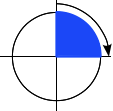
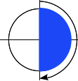
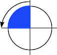
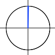

{{CSSRef}}

[Тип даних](/uk/docs/Web/CSS/CSS_Types) [CSS](/uk/docs/Web/CSS) **`<angle>`** (кут) представляє кутове значення, виражене в градусах, градах, радіанах або обертах. Він використовується, наприклад, в {{cssxref("&lt;gradient&gt;", "градієнтах")}} та частині функцій {{cssxref("transform")}}.

{{EmbedInteractiveExample("pages/css/type-angle.html")}}

## Синтаксис

Тип даних `<angle>` складається з {{cssxref("&lt;number&gt;")}}, після якого стоїть одна з одиниць вимірювання, описаних нижче. Як і з рештою мір, немає пробілу між літералом одиниць виміру та числом. Одиниця вимірювання кута є необов'язковою для числа `0`.

На початку може стояти необов'язковий одинарний знак `+` або `-`. Додатні числа представляють кути за годинниковою стрілкою, а від'ємні – проти. Для статичних властивостей будь-який кут може бути представлений різними рівносильними значеннями. Наприклад, `90deg` дорівнює `-270deg`, і `1turn` дорівнює `4turn`. Для динамічних властивостей, як то при застосуванні {{cssxref("animation")}} чи {{cssxref("transition")}}, ефект буде усе ж різним.

### Одиниці вимірювання

- `deg`
  - : Представляє кут у [градусах](<https://uk.wikipedia.org/wiki/%D0%93%D1%80%D0%B0%D0%B4%D1%83%D1%81_(%D0%B3%D0%B5%D0%BE%D0%BC%D0%B5%D1%82%D1%80%D1%96%D1%8F)>). Одне повне коло – це `360deg`. Приклади: `0deg`, `90deg`, `14.23deg`.
- `grad`
  - : Представляє кут у [градах](<https://uk.wikipedia.org/wiki/%D0%93%D1%80%D0%B0%D0%B4_(%D0%BE%D0%B4%D0%B8%D0%BD%D0%B8%D1%86%D1%8F_%D0%B2%D0%B8%D0%BC%D1%96%D1%80%D1%8E%D0%B2%D0%B0%D0%BD%D0%BD%D1%8F)>). Одне повне коло – це `400grad`. Приклади: `0grad`, `100grad`, `38.8grad`.
- `rad`
  - : Представляє кут у [радіанах](https://uk.wikipedia.org/wiki/%D0%A0%D0%B0%D0%B4%D1%96%D0%B0%D0%BD). Одне повне коло – це 2π радіанів, що приблизно дорівнює `6.2832rad`. `1rad` – це 180/π градусів. Приклади: `0rad`, `1.0708rad`, `6.2832rad`.
- `turn`
  - : Представляє кут у вигляді кількості обертів. Одне повне коло - це `1turn`. Приклади: `0turn`, `0.25turn`, `1.2turn`.

## Приклади

### Задання прямого кута за годинниковою стрілкою

<table class="standard-table">
  <tbody>
    <tr>
      <td></td>
      <td><code>90deg = 100grad = 0.25turn ≈ 1.5708rad</code></td>
    </tr>
  </tbody>
</table>

### Задання розгорнутого кута

<table class="standard-table">
  <tbody>
    <tr>
      <td></td>
      <td><code>180deg = 200grad = 0.5turn ≈ 3.1416rad</code></td>
    </tr>
  </tbody>
</table>

### Задання прямого кута проти годинникової стрілки

<table class="standard-table">
  <tbody>
    <tr>
      <td></td>
      <td><code>-90deg = -100grad = -0.25turn ≈ -1.5708rad</code></td>
    </tr>
  </tbody>
</table>

### Задання нульового кута

<table class="standard-table">
  <tbody>
    <tr>
      <td></td>
      <td><code>0 = 0deg = 0grad = 0turn = 0rad</code></td>
    </tr>
  </tbody>
</table>

## Специфікації

{{Specifications}}

## Сумісність із браузерами

{{Compat}}

## Дивіться також

- [Типи даних CSS](/uk/docs/Web/CSS/CSS_Types)
- Тип [`<gradient>`](/uk/docs/Web/CSS/gradient)
- Перетворення обертання CSS: [`rotate()`](/uk/docs/Web/CSS/transform-function/rotate), [`rotate3d()`](/uk/docs/Web/CSS/transform-function/rotate3d), [`rotateX()`](/uk/docs/Web/CSS/transform-function/rotateX), [`rotateY()`](/uk/docs/Web/CSS/transform-function/rotateY) і [`rotateZ()`](/uk/docs/Web/CSS/transform-function/rotateZ)
- [Перетворення CSS](/uk/docs/Web/CSS/CSS_transforms)
- [Застосування перетворень CSS](/uk/docs/Web/CSS/CSS_transforms/Using_CSS_transforms)
- [Застосування градієнтів CSS](/uk/docs/Web/CSS/CSS_images/Using_CSS_gradients)
