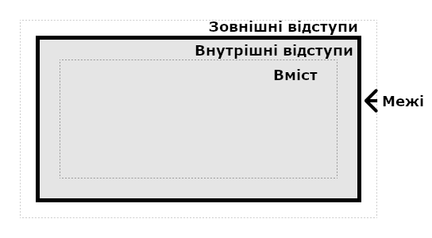

{{CSSRef}}

На розмір і положення елемента нерідко впливає його **контейнерний блок**. Найчастіше контейнерним блоком є [область вмісту](/uk/docs/Web/CSS/CSS_box_model/Introduction_to_the_CSS_box_model#oblast-vmistu) найближчого предка елемента, причому такого, що належить до [блокового рівня](/uk/docs/Glossary/Block-level_content), але це не завжди так. У цій статті розглядаються чинники, котрі впливають на визначення контейнерного блока елемента.

Коли користувацький агент (як то ваш браузер) компонує документ, він генерує для кожного елемента рамку. Кожна рамка поділяється на чотири області:

1. Область вмісту
2. Область внутрішніх відступів
3. Область меж
4. Область зовнішніх відступів



Чимало розробників вважає, що контейнерний блок елемента завжди є областю вмісту його предка, але це не обов'язково так. Дослідімо чинники, котрі впливають на те, що є контейнерним блоком елемента.

## Дія контейнерного блока

Перед вивченням того, що визначає контейнерний блок елемента, корисно знати, чому це, врешті решт, важливо.

На розмір і положення елемента нерідко впливає його контейнерний блок. Відсоткові значення, застосовані до властивостей {{cssxref("width")}}, {{cssxref("height")}}, {{cssxref("padding")}}, {{cssxref("margin")}} і, а також властивостей відступу елемента з абсолютним позиціюванням (тобто елемента, чия властивість {{cssxref("position")}} має значення `absolute` або `fixed`) обчислюються відносно контейнерного блока елемента.

## Вибір контейнерного блока

Процес вибору контейнерного блока цілком залежить від значення властивості {{cssxref("position")}} елемента:

1. Коли властивість `position` має значення **`static`**, **`relative`** або **`sticky`**, контейнерний блок формується на краю _рамок вмісту_ найближчого предка, котрий або є **блоковим контейнером** (наприклад, елементом inline-block, block або list-item) або **задає контекст форматування** (як то табличний контейнер, гнучкий контейнер, сітковий контейнер або сам блоковий контейнер).
2. Коли властивість `position` має значення **`absolute`**, контейнерний блок формується на краю _рамок внутрішніх відступів_ найближчого предка, що має значення `position`, відмінне від `static` (тобто `fixed`, `absolute`, `relative` або `sticky`).
3. Коли властивість `position` має значення **`fixed`**, контейнерний блок задається {{glossary("viewport", "областю перегляду")}} (у випадку безперервного виводу) або областю сторінки (у випадку виводу сторінками).
4. Коли властивість `position` має значення **`absolute`** або **`fixed`**, контейнерний блок може також формуватися краєм _рамок внутрішніх відступів_ найближчого елемента-предка, котрий виконує одну з наступних умов:

   1. Має властивість {{cssxref("transform")}} чи {{cssxref("perspective")}}, чиє значення – не `none`
   2. Має властивість {{cssxref("will-change")}} зі значенням `transform` або `perspective`
   3. Має властивість {{cssxref("filter")}}, чиє значення – не `none`, або властивість `will-change` зі значенням `filter` (останнє працює лише в Firefox)
   4. Має властивість {{cssxref("contain")}} зі значенням `layout`, `paint`, `strict` або `content` (наприклад, `contain: paint;`)
   5. Має властивість {{cssxref("container-type")}} зі значенням, відмінним від `normal`
   6. Має властивість {{cssxref("backdrop-filter")}}, чи значення – не `none` (наприклад, `backdrop-filter: blur(10px);`)

> **Примітка:** Контейнерний блок, в котрому знаходиться кореневий елемент ({{HTMLElement("html")}}), – це прямокутник, що зветься **початковим контейнерним блоком**. Він має розміри, що дорівнюють розмірам області перегляду (при безперервному виводі) або області сторінки (при сторінковому виводі).

> **Примітка:** Браузери по-різному обробляють властивості `perspective` і `filter` при формуванні контейнерного блока.

## Обчислення відсоткових значень на основі контейнерного блока

Як зазначено вище, коли певні властивості отримують відсоткове значення, то обчислене значення залежить від контейнерного блока елемента. Властивості, котрі так працюють – **властивості рамкової моделі** та **властивості зміщення**:

1. Властивості {{cssxref("height")}}, {{cssxref("top")}} і {{cssxref("bottom")}} обчислюють відсоткові значення відносно `height` контейнерного блока.
2. Властивості {{cssxref("width")}}, {{cssxref("left")}}, {{cssxref("right")}}, {{cssxref("padding")}} і {{cssxref("margin")}} обчислюють відсоткові значення відносно `width` контейнерного блока.

> **Примітка:** **Контейнери-блоки** (як то елементи inline-block, block або list-item) містять або лише рамки рядкового рівня, що беруть участь в рядковому контексті форматування, або лише рамки блокового рівня, що беруть участь в блоковому контексті форматування. Елемент є контейнером-блоком лише тоді, коли він містить рамки блокового рівня або рядкового рівня.

## Трохи прикладів

Код HTML для всіх прикладів – такий:

```html
<body>
  <section>
    <p>Це абзац!</p>
  </section>
</body>
```

У кожному зразку нижче змінюється лише CSS.

### Приклад 1

У цьому прикладі абзац позиціюється статично, тож його контейнерний блок – {{HTMLElement("section")}}, тому що це найближчий предок, котрий є блоковим контейнером (у зв'язку з `display: block`).

```html hidden
<body>
  <section>
    <p>Це абзац!</p>
  </section>
</body>
```

```css
body {
  background: beige;
}

section {
  display: block;
  width: 400px;
  height: 160px;
  background: lightgray;
}

p {
  width: 50%; /* == 400px * .5 = 200px */
  height: 25%; /* == 160px * .25 = 40px */
  margin: 5%; /* == 400px * .05 = 20px */
  padding: 5%; /* == 400px * .05 = 20px */
  background: cyan;
}
```

{{EmbedLiveSample('pryklad-1','100%','300')}}

### Приклад 2

У цьому прикладі контейнерний блок абзацу – елемент {{HTMLElement("body")}}, адже `<section>` не є блоковим контейнером (у зв'язку з `display: inline`) і не задає контексту форматування.

```html hidden
<body>
  <section>
    <p>Це абзац!</p>
  </section>
</body>
```

```css
body {
  background: beige;
}

section {
  display: inline;
  background: lightgray;
}

p {
  width: 50%; /* == половина ширини body */
  height: 200px; /* Примітка: відсоткове значення було б 0 */
  background: cyan;
}
```

{{EmbedLiveSample('pryklad-2','100%','300')}}

### Приклад 3

У цьому прикладі контейнерний блок абзацу – `<section>`, бо властивість `position` останнього має значення `absolute`. На відсоткові значення абзацу впливає `padding` його контейнерного блоку; якби значенням властивості {{cssxref("box-sizing")}} контейнерного блоку було `border-box` — це було б не так.

```html hidden
<body>
  <section>
    <p>Це абзац!</p>
  </section>
</body>
```

```css
body {
  background: beige;
}

section {
  position: absolute;
  left: 30px;
  top: 30px;
  width: 400px;
  height: 160px;
  padding: 30px 20px;
  background: lightgray;
}

p {
  position: absolute;
  width: 50%; /* == (400px + 20px + 20px) * .5 = 220px */
  height: 25%; /* == (160px + 30px + 30px) * .25 = 55px */
  margin: 5%; /* == (400px + 20px + 20px) * .05 = 22px */
  padding: 5%; /* == (400px + 20px + 20px) * .05 = 22px */
  background: cyan;
}
```

{{EmbedLiveSample('pryklad-3','100%','300')}}

### Приклад 4

У цьому прикладі властивість `position` абзацу має значення `fixed`, тож його контейнерний блок – це початковий контейнерний блок (на екранах це область перегляду). Таким чином, розмір абзацу залежить від розмірів вікна браузера.

```html hidden
<body>
  <section>
    <p>Це абзац!</p>
  </section>
</body>
```

```css
body {
  background: beige;
}

section {
  width: 400px;
  height: 480px;
  margin: 30px;
  padding: 15px;
  background: lightgray;
}

p {
  position: fixed;
  width: 50%; /* == (50vw - (ширина смуги вертикального прокручування)) */
  height: 50%; /* == (50vh - (висота смуги горизонтального прокручування)) */
  margin: 5%; /* == (5vw - (ширина смуги вертикального прокручування)) */
  padding: 5%; /* == (5vw - (ширина смуги вертикального прокручування)) */
  background: cyan;
}
```

{{EmbedLiveSample('pryklad-4','100%','300')}}

### Приклад 5

У цьому прикладі властивість `position` абзацу має значення `absolute`, тож його контейнерний блок – `<section>`, котрий є найближчим предком, чия властивість {{cssxref("transform")}} не має значення `none`.

```html hidden
<body>
  <section>
    <p>Це абзац!</p>
  </section>
</body>
```

```css
body {
  background: beige;
}

section {
  transform: rotate(0deg);
  width: 400px;
  height: 160px;
  background: lightgray;
}

p {
  position: absolute;
  left: 80px;
  top: 30px;
  width: 50%; /* == 200px */
  height: 25%; /* == 40px */
  margin: 5%; /* == 20px */
  padding: 5%; /* == 20px */
  background: cyan;
}
```

{{EmbedLiveSample('pryklad-5','100%','300')}}

## Дивіться також

- Властивість {{cssxref("all")}} відкидає усі оголошення CSS до заданого відомого стану
- Ключові концепції CSS:
  - [Синтаксис CSS](/uk/docs/Web/CSS/Syntax)
  - [Директиви](/uk/docs/Web/CSS/At-rule)
  - [Коментарі](/uk/docs/Web/CSS/Comments)
  - [Специфічність](/uk/docs/Web/CSS/Specificity)
  - [Успадкування](/uk/docs/Web/CSS/Inheritance)
  - [Рамкова модель](/uk/docs/Web/CSS/CSS_box_model/Introduction_to_the_CSS_box_model)
  - [Режими компонування](/uk/docs/Web/CSS/Layout_mode)
  - [Моделі візуального форматування](/uk/docs/Web/CSS/Visual_formatting_model)
  - [Перекриття зовнішніх відступів](/uk/docs/Web/CSS/CSS_box_model/Mastering_margin_collapsing)
  - Значення
    - [Початкові значення](/uk/docs/Web/CSS/initial_value)
    - [Обчислені значення](/uk/docs/Web/CSS/computed_value)
    - [Застосовані значення](/uk/docs/Web/CSS/used_value)
    - [Фактичні значення](/uk/docs/Web/CSS/actual_value)
  - [Синтаксис визначення значень](/uk/docs/Web/CSS/Value_definition_syntax)
  - [Властивості-скорочення](/uk/docs/Web/CSS/Shorthand_properties)
  - [Заміщені елементи](/uk/docs/Web/CSS/Replaced_element)
