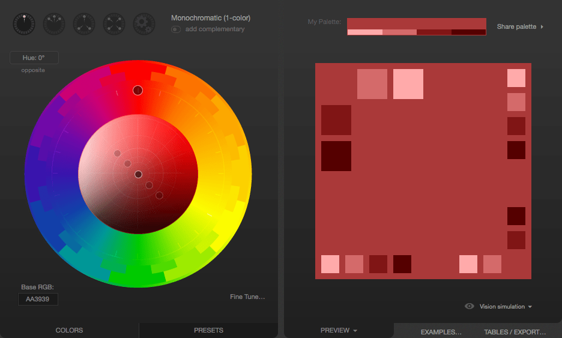
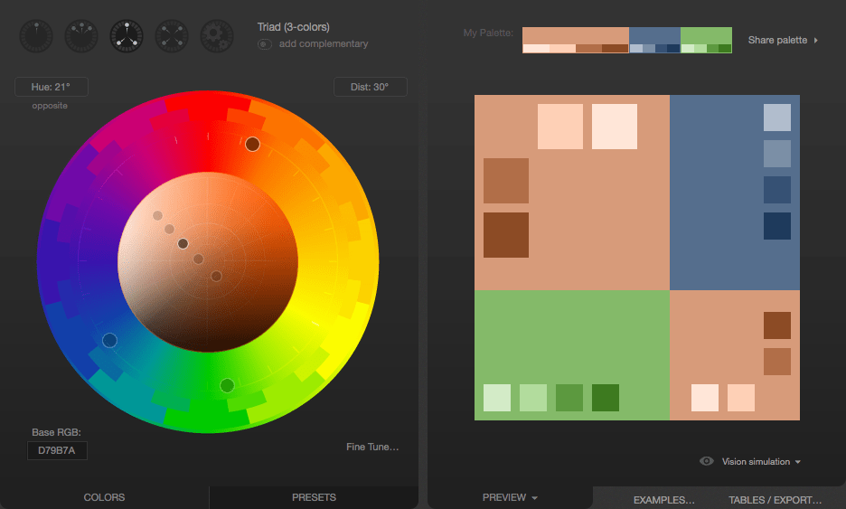

{{CSSRef}}

Ця стаття – вступний матеріал, що знайомить з кожним зі способів застосування кольору CSS до HTML.

Використання кольору – це фундаментальна форма людського вираження. Діти експериментують з кольором, навіть не маючи моторної вправності для малювання. Можливо, тому колір – одна з перших речей, з якими люди часто хочуть експериментувати, навчаючись розробляти вебсайти. Є багато способів додавання кольору до ваших [елементів](/uk/docs/Web/HTML/Element) [HTML](/uk/docs/Web/HTML) за допомогою [CSS](/uk/docs/Web/CSS), щоб створити саме той вигляд, який ви хочете.

Ми торкнемося більшості необхідних для використання кольору знань, в тому числі [списку того, що можна розфарбувати, і які CSS властивості для цього використовуються](#rechi-shcho-mozhut-maty-kolir), [як описувати кольори](#yak-opysati-kolir) і як насправді [використовувати кольори як у таблицях стилів, так і в сценаріях](#vykorystannia-koloriv). Ми також розглянемо, як [дозволити користувачу вибрати колір](#vybir-koloru-korystuvachem).

Потім ми підсумуємо все це коротким описом того, як [користуватися кольорами з розумом](#korystuvannia-koloramy-z-rozumom): як обирати відповідні кольори, з урахуванням потреб людей з різними зоровими можливостями.

## Речі, що можуть мати колір

На рівні елементів до всього в HTML можна застосувати колір. Проте погляньмо на речі щодо різновидів штук, які малюються в елементах, тобто тексту, меж і так далі. Для кожного з цих різновидів побачимо список CSS властивостей, які до них застосовують колір.

На фундаментальному рівні властивість {{cssxref("color")}} визначає колір переднього плану вмісту елемента HTML, а властивість {{cssxref("background-color")}} визначає колір фону елемента. Ці властивості можна використовувати практично на будь-якому елементі.

### Текст

Щоразу, коли візуалізується елемент, ці властивості використовуються для з'ясування кольорів тексту, його фону та можливих прикрас тексту.

- {{cssxref("color")}}
  - : Колір, що використовується для нанесення тексту та можливих [прикрас тексту](/uk/docs/Learn/CSS/Styling_text/Fundamentals#font-style-font-weight-peretvorennia-tekstu-ta-prykrashannia-tekstu) (наприклад: додавання підкреслення чи надкреслення, перекреслення тощо.
- {{cssxref("background-color")}}
  - : Колір фону тексту.
- {{cssxref("text-shadow")}}
  - : Налаштовує ефект тіні для застосування до тексту. Серед параметрів тіні – базовий колір тіні (який потім розмивається та змішується з фоном на основі інших параметрів). Більше про це в розділі [Відкидання тіней текстом](/uk/docs/Learn/CSS/Styling_text/Fundamentals#vidkydannia-tinei-tekstom).
- {{cssxref("text-decoration-color")}}
  - : Усталено прикраси тексту (як то підкреслення, перекреслення тощо) використовують властивість `color` як власний колір. Проте це можна відкинути, задавши інший колір для них за допомогою властивості `text-decoration-color`.
- {{cssxref("text-emphasis-color")}}
  - : Колір, що використовується для нанесення символів наголосу поруч із кожним символом тексту. Це використовується переважно при нанесенні тексту для східноазіатських мов.
- {{cssxref("caret-color")}}
  - : Колір для використання при нанесенні {{Glossary("caret", "каретки")}} (іноді називається курсором текстового вводу) всередині елемента. Це корисно лише для редаговних елементів, таких як {{HTMLElement("input")}} і {{HTMLElement("textarea")}}, або елементів, в яких задано атрибут HTML [`contenteditable`](/uk/docs/Web/HTML/Global_attributes#contenteditable).

### Рамки

Кожний елемент – це рамка з якогось роду вмістом, а також має фон та межу, крім вмісту, який є всередині.

- [Borders](#borders_2)
  - : Дивіться список властивостей CSS, які можна використовувати для задання кольорів меж рамок, у розділі [Меж](#mezhi).
- {{cssxref("background-color")}}
  - : Колір фону для використання в областях елемента, які не мають вмісту на передньому плані.
- {{cssxref("column-rule-color")}}
  - : Колір для використання при нанесенні лінії, що розділяє колонки тексту.
- {{cssxref("outline-color")}}
  - : Колір для використання при нанесенні контуру навколо елемента. Цей контур відрізняється від меж тим, що для нього в документі не відводиться простір (тож він може накладатися на інший вміст). Зазвичай він використовується як індикатор фокусування, щоб показати, який елемент отримує події введення.

### Межі

Усі елементи можуть мати накреслені навколо них [межі](/uk/docs/Learn/CSS/Building_blocks/Backgrounds_and_borders). Базова межа елемента – це лінія, нанесена навколо країв його вмісту. Про відношення між елементами та їхніми межами читайте у статті [Рамкова модель](/uk/docs/Learn/CSS/Building_blocks/The_box_model), а про застосування стилів до меж – у статті [Оформлення меж за допомогою CSS](/uk/docs/Learn/CSS/Building_blocks/Backgrounds_and_borders).

Ви можете скористатися властивістю-скороченням {{cssxref("border")}}, яка дозволяє налаштувати все, що стосується межі, одним махом (в тому числі неколірні особливості меж, такі як [ширина](/uk/docs/Web/CSS/border-width), [стиль](/uk/docs/Web/CSS/border-style) (суцільний, штриховий тощо) і так далі.

- {{cssxref("border-color")}}
  - : Задає один колір для використання на всіх сторонах межі елемента.
- {{cssxref("border-left-color")}}, {{cssxref("border-right-color")}}, {{cssxref("border-top-color")}} і {{cssxref("border-bottom-color")}}
  - : Дають змогу задати колір відповідної сторони межі елемента.
- {{cssxref("border-block-start-color")}} і {{cssxref("border-block-end-color")}}
  - : Завдяки цим властивостям можна задавати колір, що використовується для нанесення меж, які найближчі до початку та кінця блоку, який оточує ця межа. При письмі зліва направо (так, як пишеться українська) початкова межа блоку – це верхній край, а кінцева – нижній. Це відрізняється від рядкових початку та кінця, які є лівим і правим краями (відповідно до того, де починається і закінчується кожний рядок тексту в рамці).
- {{cssxref("border-inline-start-color")}} і {{cssxref("border-inline-end-color")}}
  - : Завдяки цим властивостям можна фарбувати краї межі, що найближчі до початку та кінця рядків тексту всередині рамки. Яка саме сторона є початковою, а яка кінцевою – це залежить від властивостей {{cssxref("writing-mode")}}, {{cssxref("direction")}} і {{cssxref("text-orientation")}}, які зазвичай (але не завжди) використовуються для налаштування напрямку тексту відповідно до мови, яку він відображає. Наприклад, якщо текст рамки відображається справа наліво, то властивість `border-inline-start-color` застосовується до правої сторони межі.

### Інші способи використання кольору

CSS – не єдина вебтехнологія, яка підтримує кольори. Є графічні технології, які доступні у Вебі, що також підтримують кольори.

- [API полотен](/uk/docs/Web/API/Canvas_API) HTML
  - : Дає змогу наносити двовимірну графіку з бітовими зображеннями в елементі {{HTMLElement("canvas")}}. Більше про це в нашому [Підручнику з полотен](/uk/docs/Web/API/Canvas_API/Tutorial).
- [SVG](/uk/docs/Web/SVG) (Масштабована векторна графіка)
  - : Дає змогу малювати зображення за допомогою команд, що малюють конкретні фігури, патерни та лінії. Команди SVG форматуються як XML, і можуть бути вбудовані безпосередньо в вебсторінку, або можуть бути розміщені на сторінці за допомогою елемента {{HTMLElement("img")}}, як і зображення будь-якого іншого типу.
- [WebGL](/uk/docs/Web/API/WebGL_API)
  - : Бібліотека вебграфіки – це API на основі OpenGL ES для нанесення високопродуктивної двовимірної та тривимірної графіки у Вебі. Більше про це в нашому [Підручнику з WebGL](/uk/docs/Web/API/WebGL_API/Tutorial).

## Як описувати кольори

Щоб представити колір у CSS, необхідно знайти спосіб перекласти аналогову концепцію "кольору" на цифрову форму, якою може скористатися комп'ютер. Зазвичай це робиться шляхом розбиття кольору на компоненти, наприклад, за тим, скільки кожного з набору основних кольорів потрібно змішати разом, або як робити колір яскравішим. Таким чином, є кілька способів описати колір у CSS.

Докладніше про кожен з типів значень кольору дивіться у довідці щодо типу даних CSS {{cssxref("&lt;color&gt;")}}.

### Ключові слова

Визначена низка стандартних назв кольорів, що дають змогу використовувати ключові слова замість числових представлень, якщо обрати такий спосіб опису кольорів, попри те, що має бути ключове слово, яке представляє саме той колір, який ви хочете використати. Серед ключових слів кольорів – стандартні первинні та вторинні кольори (наприклад, `red`, `blue` й `orange`), відтінки сірого (від `black` до `white`, включно з кольорами штибу `darkgray` і `lightgrey`), а також різноманітні інші змішані кольори, серед яких `lightseagreen`, `cornflowerblue` та `rebeccapurple`.

Дивіться більше про колірні ключові слова на сторінці [Іменованих кольорів](/uk/docs/Web/CSS/named-color).

### Значення RGB

Є три способи представити колір RGB у CSS.

#### Шістнадцятковий рядковий запис

Шістнадцятковий рядковий запис представляє колір за допомогою шістнадцяткових цифр, щоб подати кожну з компонент кольору (червоний, зелений та синій). Він також може включати четверту компоненту – альфа-канал (або непрозорість). Кожна компонента кольору може бути представлена як число від 0 до 255 (0x00 і 0xFF) або, за бажанням, як число від 0 до 15 (0x0 і 0xF). Всі компоненти _повинні_ бути вказані за допомогою однакової кількості цифр. Якщо використовується одноцифровий запис, то остаточний колір обчислюється шляхом подвоєння кожної цифри компоненти; тобто `"#D"` при нанесенні стає `"#DD"`.

Колір у шістнадцятковому рядковому записі завжди починається з символу `"#"`. Після нього йдуть шістнадцяткові цифри коду кольору. Такий рядок не чутливий до регістру.

- `"#rrggbb"`
  - : Задає повністю непрозорий колір, чия червона компонента – шістнадцяткове число `0xrr`, зелена компонента – `0xgg`, а синя компонента – `0xbb`.
- `"#rrggbbaa"`
  - : Задає колір, чия червона компонента – шістнадцяткове число `0xrr`, зелена компонента – `0xgg`, а синя компонента – `0xbb`. Альфа-канал задається як `0xaa`; чим менше це значення, тим більш прозорим стає колір.
- `"#rgb"`
  - : Задає колір, чия червона компонента – шістнадцяткове число `0xrr`, зелена компонента – `0xgg`, а синя компонента – `0xbb`.
- `"#rgba"`
  - : Задає колір, чия червона компонента – шістнадцяткове число `0xrr`, зелена компонента – `0xgg`, а синя компонента – `0xbb`. Альфа-канал задається як `0xaa`; чим менше це значення, тим більш прозорим стає колір.

Наприклад, непрозорий яскраво-синій колір можна представити як `"#0000ff"` або `"#00f"`. Щоб зробити його на 25% прозорим, можна використати `"#0000ff44"` або `"#00f4"`.

#### Функційний запис RGB

Функційний запис RGB (Red, Green, Blue – червоний, зелений, синій), як і шістнадцятковий рядковий запис, представляє колір за допомогою його червоної, зеленої та синьої компонент (а також, необов'язково, альфа-каналу для непрозорості). Проте замість рядка колір визначається за допомогою функції CSS {{cssxref("color_value", "rgb()", "#rgb()")}}. Ця функція приймає за вхідні параметри значення червоної, зеленої та синьої компонент, а також необов'язковий четвертий параметр – значення альфа-каналу.

Припустимі значення кожного з цих параметрів:

- `red`, `green` і `blue`
  - : Кожне з цих значень повинно бути значенням {{cssxref("&lt;integer&gt;")}} від 0 до 255 (включно), або значенням {{cssxref("&lt;percentage&gt;")}} від 0% до 100%.
- `alpha`
  - : Альфа-канал задається у вигляді відсоткового значення, від 0% (повністю прозорого) до 100% (повністю непрозорого), або числа від 0.0 (рівносильного 0%) і 1.0 (рівносильного 100%).

Наприклад, яскраво-червоний колір, на 50% прозорий, можна представити як `rgb(255 0 0 / 50%)` or `rgb(100% 0 0 / 0.5)`.

### Колірні функції з компонентою барви

Крім `rgb()`, можна використовувати `hsl()` і `hwb()`, які приймають компоненту `<hue>`.
Компонента [`<hue>`](/uk/docs/Web/CSS/hue) – це властивість, що дає змогу зауважити відмінність або подібність між кольорами, такими як червоний, помаранчевий, жовтий, зелений, синій тощо.
Ключова концепція полягає в тому, що можна задати барву як [`<angle>`](/uk/docs/Web/CSS/angle), оскільки більшість моделей кольору описують барви, використовуючи {{glossary("color wheel", "колірне коло")}}.
Більше про класифікацію цих функцій – в розділі [Колірних просторів і колірних моделей](#kolirni-prostory-ta-kolirni-modeli).

#### Функційний запис HSL

Дизайнери та митці нерідко віддають перевагу колірному методу [HSL](https://uk.wikipedia.org/wiki/HSL_%D1%96_HSV) (Hue, Saturation, Luminosity – барва, насиченість, світність).
Функція CSS `hsl()` в іншому подібна до функції `rgb()`.

Діаграма нижче показує циліндр кольорів HSL. Барва визначається як [кут](/uk/docs/Web/CSS/angle) на {{glossary("color wheel", "колірному колі")}}.
Насиченість – це відсотки того, де колір перебуває між відтінком сірого та максимально можливою кількістю заданої барви.
При зростанні значення світності (або яскравості) колір переходить від найтемнішого до найсвітлішого (від чорного до білого).


Зображення люб'язно надано користувачем [SharkD](https://commons.wikimedia.org/wiki/User:SharkD) для [Wikipedia](https://en.wikipedia.org/), поширюється за ліцензією [CC BY-SA 3.0](https://creativecommons.org/licenses/by-sa/3.0/).

Значення компоненти барви (H) кольору HSL – це кут від червоного через жовтий, зелений, бірюзовий, синій та пурпуровий (знову повертаючись до червоного при 360°), який визначає те, яким є базовий колір. Це значення можна задати в будь-яких одиницях вимірювання {{cssxref("&lt;angle&gt;")}}, які підтримуються CSS, в тому числі в градусах (`deg`), радіанах (`rad`), градах (`grad`) і поворотах (`turn`). Але це не впливає на те, наскільки яскравим чи тьмяним, або наскільки світлим чи темним є колір.

Компонент насиченості (S) кольору визначає, який відсоток остаточного кольору складається зі вказаної барви. Решта визначається сірим рівнем, який надає компонента світності (L).

Уявіть це, як створення ідеального кольору фарби:

1. Ви починаєте з базової фарби, яка є максимально інтенсивною для даного кольору, наприклад, найяскравішого синього, який може бути представлений екраном користувача. Це компонента **барви** (H): значення, що представляє кут {{glossary("color wheel", "колірного кола")}} для яскравої барви, яку ми хочемо використовувати як базу для кольору.
2. Потім обираєте сіру фарбу, яка відповідає тому, наскільки яскравим ви хочете, щоб був колір; це світність. Чи хочете ви, щоб він був дуже яскравим і майже білим, чи дуже темним і ближчим до чорного, чи десь посередині? Це вказується відсотком, де 0% – це чисто чорний, а 100% – чисто білий (незалежно від насиченості чи барви). Значення між ними – це буквально сіра зона.
3. Тепер, коли ви маєте сіру фарбу та ідеально інтенсивний колір, необхідно змішати їх докупи. Компонента насиченості (S) кольору вказує, який відсоток остаточного кольору складається зі вказаної барви. Решта визначається сірим рівнем, який надає компонента світності (L).

Ще можна (необов'язково) додати альфа-канал, щоб зробити колір прозорішим.

Ось кілька зразків кольорів у записі HSL:

```css hidden
table {
  border: 1px solid black;
  font:
    16px "Open Sans",
    Helvetica,
    Arial,
    sans-serif;
  border-spacing: 0;
  border-collapse: collapse;
}

th,
td {
  border: 1px solid black;
  padding: 4px 6px;
  text-align: left;
}

th {
  background-color: hsl(0 0% 75%);
}
```

```html
<table>
  <thead>
    <tr>
      <th scope="col">Колір у записі HSL</th>
      <th scope="col">Приклад</th>
    </tr>
  </thead>
  <tbody>
    <tr>
      <td><code>hsl(90deg 100% 50%)</code></td>
      <td style="background-color: hsl(90deg 100% 50%);">&nbsp;</td>
    </tr>
    <tr>
      <td><code>hsl(90 100% 50%)</code></td>
      <td style="background-color: hsl(90 100% 50%);">&nbsp;</td>
    </tr>
    <tr>
      <td><code>hsl(0.15turn 50% 75%)</code></td>
      <td style="background-color: hsl(0.15turn 50% 75%);">&nbsp;</td>
    </tr>
    <tr>
      <td><code>hsl(0.15turn 90% 75%)</code></td>
      <td style="background-color: hsl(0.15turn 90% 75%);">&nbsp;</td>
    </tr>
    <tr>
      <td><code>hsl(0.15turn 90% 50%)</code></td>
      <td style="background-color: hsl(0.15turn 90% 50%);">&nbsp;</td>
    </tr>
    <tr>
      <td><code>hsl(270deg 90% 50%)</code></td>
      <td style="background-color: hsl(270deg 90% 50%);">&nbsp;</td>
    </tr>
  </tbody>
</table>
```

{{EmbedLiveSample("funktsiinyi-zapys-hsl", 300, 260)}}

> **Примітка:** Якщо пропустити одиницю вимірювання барви, то вважається, що вона вказана в градусах (`deg`).

#### Функційний запис HWB

Подібно до функційного запису HSL вище, функція [hwb()](/uk/docs/Web/CSS/color_value/hwb) використовує те саме значення барви. Але замість світності та насиченості задаються значення білизни та чорноти у відсотках. Значення **не** розділяються комами, а необов'язкове значення альфа-каналу може бути додане (перед ним повинна стояти скісна риска `/`).

Ось кілька прикладів використання запису HWB:

```css
/* Всі ці приклади задають різні відтінки лаймового кольору. */
hwb(90 10% 10%)
hwb(90 10% 10%)
hwb(90 50% 10%)
hwb(90deg 10% 10%)
hwb(1.5708rad 60% 0%)
hwb(.25turn 0% 40%)

/* Той самий лаймовий колір, але з альфа-каналом */
hwb(90 10% 10% / 0.5)
hwb(90 10% 10% / 50%)
```

### Колірні простори та колірні моделі

Шістнадцяткові кольори, іменовані кольори та функція `rgb()` використовують модель [RGB](/uk/docs/Glossary/RGB) та пов'язані з колірним простором sRGB (`srgb`).
Можна зустріти взаємозамінне використання термінів "колірна модель" і "колірний простір", але між ними є різниця, варта уваги:

- Колірна модель – це математична модель, що представляє кольори за допомогою числових значень.
  Колірні моделі описують, як створювати доступні кольори у межах колірного простору.
- Колірний простір – це система групування кольорів таким чином, щоб опис будь-якого конкретного кольору був послідовним.
  Якщо перетворювати колір між різними колірними просторами, то він матиме однаковий вигляд.

Функції `hsl()` і `hwb()`, використані вище, використовують колірний простір sRGB, і вони обидві використовують _циліндричні_ моделі; саме тому кут `<hue>` дає змогу керувати властивостями кольору, як на [колірному колі](/uk/docs/Glossary/Color_wheel).
Погляньмо на інші доступні колірні простори та на те, який може бути зміст їх використання.

#### Колірні простори CIELAB та Oklab

Колірні простори CIELAB та Oklab базуються на експериментах із зором людини та представляють увесь спектр кольорів, які людина може бачити.
Основне призначення цих моделей полягає в тому, що вони є рівномірними, тому відстань між будь-якими двома точками у колірному просторі повинна виглядати однаковою для спостерігача.

Для використання колірного простору CIELAB можна використовувати функції `lab()` і `lch()`.
Функція `lch()` використовує світність (L), інтенсивність (C) та барву (H), а модель Lab використовує світність (L), червоність-зеленість і жовтизну-синяву вздовж осей "a" і "b" (прямокутні координати) у колірному просторі.

Приклад нижче демонструє вплив зміни значень компонентів у функціях `lab()` і `lch()`, де кожен ряд змінює одну компоненту.
Перший ряд показує зміни значення світності `lch()`, тоді як другий ряд змінює компоненту барви `lch()`.
Третій ряд змінює значення на осі "b" `lab()`, тому виходить інший ефект, ніж у `lch()`, оскільки поступово додається більше жовтого, а не обхід по всьому колірному колу:

```css hidden live-sample___lch-colors
/* Різні відтінки фіолетового */
.container {
  display: grid;
  font-family: sans-serif;
  font-size: 14px;
  color: white;
  grid-template-columns: repeat(6, 1fr);
  gap: 4px;
}

.container div {
  border-radius: 8px;
  padding: 0.75rem;
}

#lch-20 {
  background-color: lch(20 40 0);
}
#lch-30 {
  background-color: lch(30 40 0);
}
#lch-40 {
  background-color: lch(40 40 0);
}

#lch-50 {
  background-color: lch(50 40 0);
}
#lch-60 {
  background-color: lch(60 40 0);
}
#lch-70 {
  background-color: lch(70 40 0);
}

#lch-hue-10 {
  background-color: lch(70 40 10);
}
#lch-hue-20 {
  background-color: lch(70 40 20);
}
#lch-hue-30 {
  background-color: lch(70 40 30);
}
#lch-hue-40 {
  background-color: lch(70 40 40);
}
#lch-hue-50 {
  background-color: lch(70 40 50);
}
#lch-hue-60 {
  background-color: lch(70 40 60);
}
#lab-10 {
  background-color: lab(70 40 10);
}
#lab-20 {
  background-color: lab(70 40 20);
}
#lab-30 {
  background-color: lab(70 40 30);
}
#lab-40 {
  background-color: lab(70 40 40);
}
#lab-50 {
  background-color: lab(70 40 50);
}
#lab-60 {
  background-color: lab(70 40 60);
}
```

```html hidden live-sample___lch-colors
<div class="container">
  <div id="lch-20">lch(20 40 0)</div>
  <div id="lch-30">lch(30 40 0)</div>
  <div id="lch-40">lch(40 40 0)</div>
  <div id="lch-50">lch(50 40 0)</div>
  <div id="lch-60">lch(60 40 0)</div>
  <div id="lch-70">lch(70 40 0)</div>
  <div id="lch-hue-10">lch(70 40 10)</div>
  <div id="lch-hue-20">lch(70 40 20)</div>
  <div id="lch-hue-30">lch(70 40 30)</div>
  <div id="lch-hue-40">lch(70 40 40)</div>
  <div id="lch-hue-50">lch(70 40 50)</div>
  <div id="lch-hue-50">lch(70 40 60)</div>
  <div id="lab-10">lab(70 40 10)</div>
  <div id="lab-20">lab(70 40 20)</div>
  <div id="lab-30">lab(70 40 30)</div>
  <div id="lab-40">lab(70 40 40)</div>
  <div id="lab-50">lab(70 40 50)</div>
  <div id="lab-60">lab(70 40 60)</div>
</div>
```

{{embedlivesample("lch-colors", '100', '150')}}

Oklab – це колірний простір, що використовує модель того ж типу, що й CIELAB, але побудований за допомогою додаткових кроків числової оптимізації, тому значення вважаються більш точними, ніж у CIELAB.
У зв'язку з цією оптимізацією барви здаються рівномірнішими, тому Oklab – чудовий вибір для градієнтів.
Якщо ви вже розумієте `lab()` і `lch()`, то можете використовувати ці функції аналогічним чином:

```css
.oklch-red {
  color: oklch(0.93 0.39 28);
}
.oklab-green {
  color: oklab(0.87 -0.2 0.18);
}
```

#### Функція `color()`

Якщо ви хочете явного контролю над колірними просторами при визначенні кольорів, то можете скористатися функцією [`color()`](/uk/docs/Web/CSS/color_value/color).
Вона корисна для опису кольорів для пристроїв з високою роздільною здатністю та широкою колірною [гамою](/uk/docs/Glossary/Gamut).
Наприклад, якщо ми хочемо показати колір `display-p3 0 0 1`, який знаходиться за межами гами sRGB, то можна використати директиву [`@media`](/uk/docs/Web/CSS/@media/color-gamut) для визначення того, чи підтримує апаратне забезпечення клієнта кольори в цьому діапазоні:

```css
.vibrant {
  background-color: color(display-p3 0 0 1);
  /* Рівносильно rgb(-27 55 153) за межами гами */
}

@media (color-gamut: p3) {
  .vibrant {
    background-color: color(display-p3 0 0 1);
  }
}
```

## Застосування кольорів

Тепер, коли ви знаєте, які є властивості CSS, що дають змогу застосовувати до елементів кольори, і формати, які можна використовувати для опису кольорів, ви можете почати користуватися кольорами. Як ви, можливо, помітили зі списку у розділі [Речі, що можуть мати колір](#rechi-shcho-mozhut-maty-kolir), є багато речей, які можна розфарбувати за допомогою CSS. Розгляньмо це з двох сторін: використання кольору в межах {{Glossary("stylesheet", "списку стилів")}} і додавання та зміна кольору за допомогою коду {{Glossary("JavaScript")}}, щоб змінювати стилі елементів.

### Задання кольорів у списках стилів

Найлегший спосіб застосування кольору до елементів – це вказати кольори в CSS, який використовується при візуалізації елементів. Ми не будемо використовувати кожну властивість, згадану вище, але розглянемо кілька прикладів. Концепція однакова будь-де, де використовується колір.

Погляньмо на приклад, починаючи з результатів, які ми намагаємося отримати:

{{EmbedLiveSample("zadannia-koloriv-u-spyskakh-styliv", 650, 150)}}

#### HTML

HTML, відповідальний за створення прикладу вище, показаний тут:

```html
<div class="wrapper">
  <div class="box boxLeft">
    <p>Це перша рамка.</p>
  </div>
  <div class="box boxRight">
    <p>Це друга рамка.</p>
  </div>
</div>
```

Цей код доволі простий, використовує {{HTMLElement("div")}} як обгортку навколо вмісту, який складається з двох інших `<div>`, кожен з яких оформлюється по-різному, маючи один абзац ({{HTMLElement("p")}}) у кожній з рамок.

Магія відбувається, як завжди, у CSS, де ми застосуємо кольори та визначимо макет для HTML вище.

#### CSS

Погляньмо на CSS для створення результатів вище по частинах, щоб розглянути цікаві моменти по черзі.

```css
.wrapper {
  width: 620px;
  height: 110px;
  margin: 0;
  padding: 10px;
  border: 6px solid mediumturquoise;
}
```

Клас `.wrapper` використовується для присвоєння стилів елементу {{HTMLElement("div")}}, який оточує весь інший вміст. Це задає розмір контейнера за допомогою {{cssxref("width")}} і {{cssxref("height")}}, а також його {{cssxref("margin", "зовнішні")}} та {{cssxref("padding", "внутрішні")}} відступи.

Цікавішим для поточної теми є використання властивості {{cssxref("border")}} для встановлення межі навколо зовнішнього краю елемента. Ця межа – це суцільна лінія шириною 6 пікселів, кольору `mediumturquoise`.

Дві кольорові рамки мають кілька спільних властивостей, тому ми задаємо клас `.box`, який визначає ці спільні властивості:

```css
.box {
  width: 290px;
  height: 100px;
  margin: 0;
  padding: 4px 6px;
  font:
    28px "Marker Felt",
    "Zapfino",
    cursive;
  display: flex;
  justify-content: center;
  align-items: center;
}
```

Якщо стисло, то `.box` задає розмір кожної рамки, а також конфігурацію шрифту, що використовується всередині. Також використовується [Флексбокс CSS](/uk/docs/Web/CSS/CSS_flexible_box_layout), щоб легко відцентрувати вміст кожної з рамок. Режим `flex` задається за допомогою {{cssxref("display", "display: flex")}}, а {{cssxref("justify-content")}} і {{cssxref("align-items")}} встановлюються в `center`. Потім можна створити клас для кожної з двох рамок, який визначає властивості, що відрізняються між ними.

```css
.boxLeft {
  float: left;
  background-color: rgb(245 130 130);
  outline: 2px solid darkred;
}
```

Клас `.boxLeft` – це, як ви, можливо, вже здогадалися, клас, який використовується для оформлення рамки зліва. Він спрямовує рамку по лівому краю, а потім задає кольори:

- Фоновий колір рамки задається зміною значення властивості CSS {{cssxref("background-color")}} на `rgb(245 130 130)`.
- Для рамки задається контур. На відміну від більш поширеного використання `border`, {{cssxref("outline")}} не впливає на макет взагалі; контур наноситься поверх того, що знаходиться за межами рамки елемента, а не виділяє собі місце, як це робить `border`. Цей контур – це суцільна темно-червона лінія товщиною 2 пікселі. Зверніть увагу на використання ключового слова `darkred` при вказанні кольору.
- Зауважте, що колір тексту не задається явно. Це означає, що значення {{cssxref("color")}} буде успадковано від найближчого елемента-контейнера, який визначає його. Усталено це чорний.

```css
.boxRight {
  float: right;
  background-color: hsl(270deg 50% 75%);
  outline: 4px dashed rgb(110 20 120);
  color: hsl(0deg 100% 100%);
  text-decoration: underline wavy #88ff88;
  text-shadow: 2px 2px 3px black;
}
```

> **Примітка:** Якщо спробувати показати це в Safari, то воно не буде відображатися належним чином. Це пов'язано з тим, що Safari не підтримує `text-decoration: underline wavy #88ff88`.

Врешті-решт, клас `.boxRight` описує унікальні властивості рамки, що наноситься праворуч. Він налаштований так, щоб рамка линула праворуч, щоб вона з'явилася поруч з попередньою рамкою. Потім задаються такі кольори:

- Властивість `background-color` задається за допомогою значення HSL, вказаного за допомогою `hsl(270deg 50% 75%)`. Це середній фіолетовий колір.
- Властивість `outline` рамки використовується для задання того, що вона повинна бути оточена пунктирною лінією товщиною чотири пікселі, кольором якої є трохи глибший фіолетовий (`rgb(110 20 120)`).
- Колір переднього плану (тексту) задається за допомогою властивості {{cssxref("color")}} зі значенням `hsl(0deg 100% 100%)`. Це один із багатьох способів задати колір білий.
- Додаємо зелену хвилясту лінію під текстом за допомогою {{cssxref("text-decoration")}}.
- Врешті-решт, до тексту додається дрібка тіні, за допомогою {{cssxref("text-shadow")}}. Її параметр `color` задається значенням `black`.

## Вибір кольору користувачем

Є чимало ситуацій, у яких вашому вебсайту може знадобитися дозволити користувачеві вибрати колір. Можливо, у вас налаштовний користувацький інтерфейс, або ви реалізуєте програму для малювання. Можливо, у вас є редаговний текст і потрібно дати користувачеві змогу вибрати колір тексту. Або, можливо, ваша програма дозволяє користувачеві призначати кольори текам або елементам. Хоча історично було необхідно реалізувати власний [інтерфейс вибору кольору](https://en.wikipedia.org/wiki/Color_picker), HTML тепер надає підтримку для того, щоб браузери надавали його для вашого використання за допомогою елемента {{HTMLElement("input")}}, використовуючи `"color"` як значення його атрибута [`type`](/uk/docs/Web/HTML/Element/input#type-typ).

Елемент `<input>` представляє колір лише у [шістнадцятковому рядковому записі](#shistnadtsiadkovyi-riadkovyi-zapys), який розглядався вище.

### Приклад: Вибір кольору

Погляньмо на простий приклад, у якому користувач повинен обрати колір. Коли користувач налаштовує колір, то рамка навколо прикладу змінюється, щоб відображати новий колір. Після завершення вибору кольору відображається його значення.

{{EmbedLiveSample("pryklad-vybir-koloru", 525, 275)}}

> **Примітка:** У macOS ви сповіщаєте про закінчення процесу вибору кольору, закриваючи віконце вибору кольору.

#### HTML

HTML тут створює рамку, що містить контрольний елемент вибору кольору (з підписом, створеним за допомогою елемента {{HTMLElement("label")}}) і порожній елемент абзацу ({{HTMLElement("p")}}), у який виводиться певний текст із коду JavaScript.

```html
<div id="box">
  <label for="colorPicker">Колір межі:</label>
  <input type="color" value="#8888ff" id="colorPicker" />
  <p id="output"></p>
</div>
```

#### CSS

CSS задає розмір для рамки та певний базовий стиль зовнішнього вигляду. Також межі задана товщина 2 пікселі та колір.

```css
#box {
  width: 500px;
  height: 200px;
  border: 2px solid rgb(245 220 225);
  padding: 4px 6px;
  font:
    16px "Lucida Grande",
    "Helvetica",
    "Arial",
    "sans-serif";
}
```

#### JavaScript

Сценарій тут обробляє задачу оновлення стартового кольору межі згідно зі значенням вибору кольору. Потім для роботи зі введенням з елемента [`<input type="color">`](/uk/docs/Web/HTML/Element/input/color) додаються два обробники подій.

```js
const colorPicker = document.getElementById("colorPicker");
const box = document.getElementById("box");
const output = document.getElementById("output");

box.style.borderColor = colorPicker.value;

colorPicker.addEventListener(
  "input",
  (event) => {
    box.style.borderColor = event.target.value;
  },
  false,
);

colorPicker.addEventListener(
  "change",
  (event) => {
    output.innerText = `Заданий колір – ${colorPicker.value}.`;
  },
  false,
);
```

Подія {{domxref("Element/input_event", "input")}} надсилається щоразу, коли змінюється значення елемента; тобто кожного разу, коли користувач налаштовує колір в інтерфейсі вибору кольору. Кожного разу, коли приходить ця подія, колір межі задається згідно з поточним значенням вибору кольору.

Подія {{domxref("HTMLElement/change_event", "change")}} отримується тоді, коли значення вибору кольору визначено остаточно. Ми реагуємо на це, задаючи вміст елемента `<p>` з ідентифікатором `"output"` як рядок, що описує вибраний колір.

## Мудре використання кольору

Правильний вибір при виборі кольорів для дизайну вебсайту може бути складним процесом, особливо якщо ви не маєте досвіду в образотворенні, графічному дизайні або хоча б базових знань кольорознавства. Неправильний вибір кольору може зробити ваш сайт непривабливим, або ще гірше, зробити вміст нечитабельним через поганий контраст або конфлікти кольорів. Ще гірше, якщо використання неправильних кольорів призведе до того, що ваш вміст буде просто непридатним для використання людьми з певними проблемами зі зором, особливо з колірною сліпотою.

### Пошук правильних кольорів

Вибір саме тих кольорів, які потрібні, може бути складним, особливо без підготовки в образотворенні або графічному дизайні. На щастя, є інструменти, які можуть допомогти. Хоч вони не можуть замінити доброго дизайнера, що допоміг би прийняти такі рішення, вони точно дадуть добрий початок.

#### Базовий колір

Перший крок – це вибір **базового кольору**. Це той колір, який певним чином визначає ваш вебсайт або його тему. Так само, як ми пов'язуємо зелений колір з напоєм [Mountain Dew](https://uk.wikipedia.org/wiki/Mountain_Dew), або можна подумати про колір синій у зв'язку з небом або океаном, так і вибір відповідного базового кольору для представлення вашого сайту – це хороше місце для початку. Є багато способів вибору базового кольору; ось декілька ідей:

- Колір, що природним чином пов'язаний з темою вашого вмісту, наприклад, наявний колір, що ідентифікується з продуктом або ідеєю, або колір, що представляє емоцію, яку ви хочете передати.
- Колір, що походить від образів, пов'язаних з тим, про що йде мова на вашому вебсайті. Якщо ви створюєте вебсайт про певну річ або продукт, виберіть колір, який фізично присутній на цій речі.
- Погортайте вебсайти, що дозволяють переглядати багато наявних колірних палітр і зображень, щоб знайти натхнення.

При спробах прийняти рішення щодо базового кольору можна з'ясувати, що браузерні розширення, які дають змогу вибирати кольори з вебвмісту, бувають особливо корисними. Деякі з них навіть спеціально призначені для допомоги у цій справі. Наприклад, вебсайт [ColorZilla](https://www.colorzilla.com/) пропонує розширення (для [Chrome](https://www.colorzilla.com/chrome/) і [Firefox](https://www.colorzilla.com/firefox/)), яке пропонує піпетку для вибору кольорів з вебу. Ці розширення також здатні брати середнє значення кольорів пікселів у різноманітних областях або навіть вибраної частини сторінки.

> **Примітка:** Перевага середнього значення кольорів може бути в тому, що часто те, що виглядає як суцільний колір, насправді є дивовижно різноманітною кількістю пов'язаних кольорів, які всі використовуються разом, змішуючись, щоб створити бажаний ефект. Вибір лише одного з цих пікселів може призвести до отримання кольору, який сам по собі має геть не той вигляд.

#### Наповнення палітри

Коли обрано базовий колір, можна скористатися багатьма онлайн-інструментами, що допоможуть створити палітру відповідних кольорів для використання разом з базовим кольором, застосовуючи до нього кольорознавство. Чимало з цих інструментів також підтримують перегляд кольорів крізь фільтри, які дають змогу побачити, який вигляд вони матимуть для людей з різними формами колірної сліпоти. Дивіться коротке пояснення того, чому це важливо, в розділі [Колір і доступність](#kolir-i-dostupnist).

Кілька прикладів (усі безкоштовні на час останнього оновлення цього списку):

- [Інструмент вибору кольору MDN](/uk/docs/Web/CSS/CSS_colors/Color_picker_tool)
- [Paletton](https://paletton.com/)
- [Онлайнове колірне коло Adobe Color CC](https://color.adobe.com/create/color-wheel)

Проєктуючи свою палітру, не забудьте, що, крім кольорів, які зазвичай генерують ці інструменти, вам, ймовірно, також потрібно буде додати деякі основні нейтральні кольори, такі як білий (або майже білий), чорний (або майже чорний) і деяку кількість відтінків сірого.

> **Примітка:** Зазвичай набагато краще використовувати якомога меншу кількість кольорів. Використовуючи колір для наголошення, а не для додавання кольору до всього на сторінці, ви зберігаєте легкість читання вашого вмісту, і тоді кольори, що використовуються, мають набагато більший вплив.

### Ресурси з кольорознавства

Повний розгляд кольорознавства лежить поза межами теми цієї статті, але є чимало статей з кольорознавства, а також курсів, які можна знайти в найближчих школах і університетах. Декілька корисних ресурсів про кольорознавство:

- [Колірна наука](https://www.khanacademy.org/computing/pixar/color) ([Khan Academy](https://www.khanacademy.org/) у співпраці з [Pixar](https://www.pixar.com/))
  - : Онлайн-курс, що знайомить з концепціями штибу того, чим є колір, як він сприймається та як використовувати кольори для вираження ідей. Представлений художниками та дизайнерами Pixar.
- [Кольорознавство](https://uk.wikipedia.org/wiki/%D0%9A%D0%BE%D0%BB%D1%8C%D0%BE%D1%80%D0%BE%D0%B7%D0%BD%D0%B0%D0%B2%D1%81%D1%82%D0%B2%D0%BE) на Вікіпедії
  - : Сторінка на Вікіпедії про кольорознавство, що містить чимало чудової інформації з технічної точки зору. Це не зовсім ресурс для допомоги при виборі кольору, але все ж містить чимало корисної інформації.

### Колір і доступність

Є декілька ситуацій, при яких колір може стати проблемою для {{Glossary("accessibility", "доступності")}}. Неправильне або недбале використання кольору може спричинити створення вебсайту або застосунку, яким певна частина вашої цільової аудиторії не зможе користуватися належним чином, що призведе до втрати трафіку, втрати прибутку, а можливо, навіть до репутаційних проблем. Тому важливо ретельно розглянути використання кольору.

Слід провести щонайменше базове дослідження на тему [колірної сліпоти](https://uk.wikipedia.org/wiki/%D0%94%D0%B0%D0%BB%D1%8C%D1%82%D0%BE%D0%BD%D1%96%D0%B7%D0%BC). Є кілька її різновидів; найпоширеніший – це червоно-зелена колірна сліпота, яка призводить до того, що людина не може розрізняти червоний і зелений кольори. Є й інші, від нездатності розрізняти певні кольори до повної нездатності бачити колір взагалі.

> **Примітка:** Найважливіше правило: ніколи не використовуйте колір як єдиний спосіб щось повідомити. Якщо, наприклад, ви сповіщаєте про успіх чи невдачу операції шляхом зміни кольору фігури з білого на зелений у випадку успіху та на червоний у випадку невдачі, то користувачі з червоно-зеленою колірною сліпотою не зможуть користуватися вашим сайтом належним чином. Замість цього, можливо, використовуйте як текст, так і колір разом, щоб кожен міг зрозуміти, що відбувається.

Більше інформації про колірну сліпоту можна знайти в наступних статтях:

- [Medline Plus: Колірна сліпота](https://medlineplus.gov/colorblindness.html) (Національний інститут охорони здоров'я США)
- [Американська академія офтальмології: Що таке колірна сліпота?](https://www.aao.org/eye-health/diseases/what-is-color-blindness)
- [Колірна сліпота та вебдизайн](https://www.usability.gov/get-involved/blog/2010/02/color-blindness.html) (Usability.gov: Міністерство охорони здоров'я і соціальних служб США)

### Приклад проєктування палітри

Розгляньмо невеликий приклад вибору відповідної колірної палітри для сайту. Уявімо, що створюється вебсайт для нової гри, чия дія розгортається на планеті Марс. Тож виконаймо [пошук Google за фотографіями Марса](<https://www.google.com/search?q=%D0%9C%D0%B0%D1%80%D1%81&tbm=isch&lr=(-lang_ru)>). Там багато хороших прикладів марсіанського забарвлення. Ретельно уникаймо імітацій та фото з кінострічок. Вирішуємо використати фото, зроблене одним із марсоходів, які людство доставило на поверхню цієї планети за останні кілька десятиліть, оскільки дія гри відбувається на поверхні Марсу. Використовуємо інструмент вибору кольору, щоб вибрати зразок кольору.

За допомогою піпетки вибираємо вподобаний колір та з'ясовуємо, що це колір `#D79C7A`, який є відповідним іржавим помаранчево-червоним кольором, таким стереотипним для марсіанської поверхні.

Обравши базовий колір, необхідно сформувати палітру. Вирішуємо скористатися [Paletton](https://www.paletton.com/), щоб вибрати інші необхідні кольори. Після відкриття Paletton бачимо:



Далі вводимо шістнадцятковий код нашого кольору (`D79C7A`) у поле "Base RGB" у лівому нижньому кутку інструмента:


Тепер спостерігаємо моноколірну палітру, засновану на кольорі, який ми вибрали з фотографії Марса. Якщо з якоїсь причини потрібні чимало споріднених кольорів, то кольори з цієї палітри, ймовірно, підійдуть. Але насправді нам потрібен колір для логічного наголосу. Щось, що буде виділятися поряд з базовим кольором. Щоб знайти його, натискаємо перемикач "add complementary" під меню, що дозволяє вибрати тип палітри (наразі "Monochromatic"). Paletton обчислює відповідний колір наголосу; клацання цього кольору в правому нижньому кутку показує, що це колір `#508D7C`.


Якщо вам не подобається запропонований колір, то можна змінити схему кольорів, щоб пошукати щось краще. Наприклад, якщо нам не подобається запропонований зеленувато-синій колір, то можна клацнути іконку схеми Тріади, що пропонує наступне:



Цей сіруватий синій колір у правому верхньому кутку має досить добрий вигляд. Клацнувши на нього, ми бачимо, що це колір `#556E8D`. Його можна використовувати як колір наголосу, наприклад, для заголовків або для підсвічування вкладок чи інших індикаторів на сайті:


Тепер ми маємо базовий колір і наголос. Крім них маємо декілька доповняльних відтінків кожного з них, на випадок, якщо нам знадобляться вони для градієнтів та інших подібних речей. Кольори можна експортувати у різних форматах.

Маючи ці кольори, може все одно знадобитися обрати відповідні нейтральні кольори. Звична практика в дизайні – намагатися знайти таку золоту середину, коли контрасту досить, щоб текст був чітким і читабельним, але не настільки, щоб ставати надто різким для очей. Легко перестаратися в одну чи іншу сторону, тому не забудьте отримати відгуки щодо ваших кольорів, як тільки їх оберете, і мати приклади їх використання. Якщо контраст надто низький, то текст буде мати блідий вигляд на тлі, що робить його нечитабельним, але якщо контраст надто високий, то користувач може вважати сайт крикливо яскравим і неприємним для очей.

### Кольори, фони, контраст і друк

Те, що має гарний вигляд на екрані, може мати геть інший вигляд на папері.
Крім цього, чорнило може бути дорогим, і якщо користувач друкує вашу сторінку, то він не обов'язково хоче, щоб усі фони та інше використовували його дорогоцінне чорнило, коли все, що має значення, – це сам текст.
Чимало браузерів усталено прибирають зображення фону, коли друкують документи.

Якщо ваші кольори та зображення фону були обрані ретельно чи є важливими для корисності вмісту, то можна скористатися властивістю CSS {{cssxref("print-color-adjust")}}, щоб сказати браузеру, що він не повинен вносити зміни до вигляду вмісту.

Усталене значення `print-color-adjust`, `economy`, вказує браузеру, що він може вносити зміни до вигляду вмісту, які вважає необхідними для оптимізації читабельності чи економії при друку вмісту, враховуючи тип пристрою виводу, на який наноситься документ.

Можна задати `print-color-adjust` як `exact`, щоб сказати браузеру, що елемент або елементи, на яких ви його використовуєте, були спеціально розроблені для найкращої роботи з кольорами та зображеннями та що вони мають залишатися такими, які вони є.
При такому налаштуванні браузер не буде втручатися у вигляд елемента і буде наносити його так, як вказано в CSS.

> **Примітка:** Проте немає гарантій, що `print-color-adjust: exact` призведе до того, що CSS буде використовуватися точно так, як задано.
> Якщо браузер надає користувачеві можливість змінювати вивід (наприклад, поле для галочки "не друкувати фон" у діалоговому віконці друку), то це відкине значення `print-color-adjust`.

## Дивіться також

- [Нанесення графіки](/uk/docs/Learn/JavaScript/Client-side_web_APIs/Drawing_graphics)
- [Графіка у Вебі](/uk/docs/Learn/HTML/Multimedia_and_embedding/Images_in_HTML#insha-hrafika-u-vebi)
- [Модуль Кольору CSS](/uk/docs/Web/CSS/CSS_colors)
