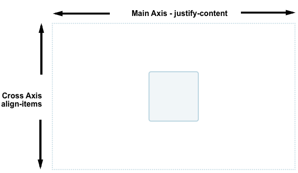
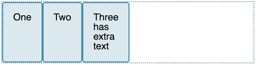
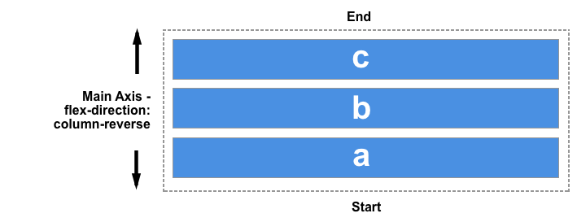

{{CSSRef}}

Одна з причин того, що Флексбокс ("гнучкі рамки") швидко захопив інтерес веброзробників – те, що ця концепція вперше принесла у Веб годящу можливість шикування. Стало можливим пристойно виконувати вертикальне вирівнювання, так що, врешті решт, можна легко відцентрувати елемент. У цих настановах – докладний огляд того, як властивості шикування та вирівнювання працюють у Флексбоксі.

Аби відцентрувати елемент, слід використати властивість `align-items`, шикуючи елемент за поперечною віссю, котра у цьому випадку є вертикальною віссю блока. Слід використати `justify-content`, аби шикувати елемент за основною віссю, котра у цьому випадку є горизонтальною рядковою віссю.

Погляньте на код прикладу нижче. Змініть розмір контейнера чи вкладеного елемента, – вкладений елемент завжди залишатиметься відцентрованим.

{{EmbedGHLiveSample("css-examples/flexbox/alignment/intro.html", '100%', 700)}}

## Властивості, що керують шикуванням

У цих настановах розглядаються наступні властивості:

- {{cssxref("justify-content")}} — керує шикуванням всіх елементів на головній осі.
- {{cssxref("align-items")}} — керує шикуванням всіх елементів на поперечній осі.
- {{cssxref("align-self")}} — керує шикуванням окремого гнучкого елемента на поперечній осі.
- {{cssxref("align-content")}} — описана у специфікації як "нагромадження гнучких рядків"; керує простором між гнучкими рядками на поперечній осі.
- {{cssxref("gap")}}, {{cssxref("column-gap")}} та {{cssxref("row-gap")}} — використовуються для створення вертикальних і горизонтальних розривів між гнучкими елементами.

Іще одна тема для розгляду – те, як автоматичні зовнішні поля можуть бути використані для шикування у гнучких контейнерах.

## Поперечна вісь

Властивості `align-items` та `align-self` керують шикуванням елементів гнучкої розкладки на поперечній осі – у колонках, якщо значення властивості `flex-direction` – `row`, і у рядах, якщо `flex-direction` – `column`.

Погляньмо на використання шикування на поперечній осі у найпростішому прикладі гнучкої розкладки. Якщо додати контейнерові `display: flex`, то дочірні елементи стануть гнучкими елементами, впорядкованими у ряд. Вони будуть розтягнені, аби бути настільки ж високими, як найвищий елемент, оскільки такий елемент визначає висоту елементів на поперечній осі. Якщо гнучкий контейнер має явно вказану висоту, то всі елементи розтягнуться до його висоти, незалежно від того, скільки вмісту вони мають.

Причиною того, що елементи отримують однакову висоту, є те, що початкове значення `align-items`, властивості, котра керує шикуванням на поперечній осі, – `stretch` (розтягування).

Можна використати інші значення, аби керувати шикуванням елементів:

- `align-items: flex-start` (шикувати до початку гнучкого контейнера)
- `align-items: flex-end` (шикувати до кінця гнучкого контейнера)
- `align-items: center` (шикувати до центру)
- `align-items: stretch` (розтягнути)
- `align-items: baseline` (шикувати за основною лінією)

У живому прикладі нижче значення `align-items` – `stretch`. Спробуйте інші значення і перевірте, як елементи шикуватимуться відносно одне одного у flex-контейнері.

{{EmbedGHLiveSample("css-examples/flexbox/alignment/align-items.html", '100%', 520)}}

### Вирівнювання одного певного елемента за допомогою `align-self`

Властивість `align-items` встановлює значення властивості `align-self` на всіх гнучких елементах як на групі. Отже, можна явно оголосити властивість `align-self`, аби точково вплинути на один елемент. Властивість `align-self` приймає такі ж значення, як `align-items`, і на додачу – `auto`, котре скидає значення до визначеного гнучким контейнером.

У наступному живому прикладі гнучкий контейнер має `align-items: flex-start`, а тобто – усі елементи вишикувані до початку поперечної осі. Перший елемент обрано за допомогою селектора `first-child`, і вказано йому `align-self: stretch`; інший елемент був обраний за допомогою свого класу `selected`, йому додано `align-self: center`. Можна змінити значення `align-items` або змінити значення `align-self` на окремих елементах, аби побачити, як це працює.

{{EmbedGHLiveSample("css-examples/flexbox/alignment/align-self.html", '100%', 650)}}

### Переміна головної осі

Досі розглядалась поведінка шикування у гнучкому контейнері за умови, що значення `flex-direction` – `row` (ряд), і мова використовує написання рядків згори донизу. Це означає, що головна вісь напрямлена вздовж ряду – горизонтально, а шикування поперечної осі рухає елементи вгору-вниз.

Якщо змінити `flex-direction` на колонкову, то `align-items` і `align-self` шикуватимуть елементи вліво-вправо.

В прикладі нижче можна це спробувати у гнучкому контейнері із `flex-direction: column`, що у решті є ідентичним до попереднього прикладу.

{{EmbedGHLiveSample("css-examples/flexbox/alignment/align-self-column.html", '100%', 730)}}

## Шикування вмісту на поперечній осі – властивість align-content

Досі у прикладах цієї статті шикувались елементи, або окремий елемент, всередині області, визначеної гнучким контейнером. Якщо є гнучкий контейнер з кількома рядами вмісту, можна також використати властивість `align-content`, щоб керувати розподілом простору між рядами. У специфікації це описано як [нагромадження гнучких рядків (англ.)](https://drafts.csswg.org/css-flexbox/#align-content-property).

Щоб `align-content` працювала, гнучкий контейнер повинен мати більшу висоту, ніж необхідно для показу елементів. Тоді це працює на усіх елементах як на групі, і диктує поведінку вільного простору, а також шикування усієї групи елементів в ньому.

Властивість `align-content` приймає наступні значення:

- `align-content: flex-start`
- `align-content: flex-end`
- `align-content: center`
- `align-content: space-between`
- `align-content: space-around`
- `align-content: stretch`
- `align-content: space-evenly` (не визначене у специфікації Флексбоксу)

У живому прикладі нижче гнучкий контейнер має висоту 400 пікселів, а це більше, ніж потрібно для показу елементів. Значення `align-content` – `space-between`, тож доступний простір розподілений _між_ гнучкими рядами, котрі розташовані рівномірно між початком та кінцем контейнера на поперечній осі.

Спробуйте інші значення і перевірте, як працює властивість `align-content`.

{{EmbedGHLiveSample("css-examples/flexbox/alignment/align-content.html", '100%', 850)}}

Іще раз повернімось до значення `flex-direction` `column`, аби перевірити, як ця властивість поводиться при роботі з колонками. Як і раніше, потрібно більше простору на поперечній осі, щоб мати трохи вільного місця, не зайнятого елементами.

{{EmbedGHLiveSample("css-examples/flexbox/alignment/align-content-column.html", '100%', 860)}}

> **Примітка:** Значення `space-evenly` не описане специфікацією Флексбоксу і є пізнішим додатком до специфікації Box Alignment. Підтримка браузерами цього значення не є такою доброю, як для інших значень, описаних у специфікації Флексбоксу.

## Шикування вмісту на головній осі

Після шикування на поперечній осі – варто розглянути головну ось. Для шикування на ній доступна єдина властивість — `justify-content`. Причина цього – те, що на головній осі елементи обробляються лише як група. За допомогою `justify-content` можна керувати тим, що відбувається із доступним простором, якщо доступно більше простору, ніж необхідно для показу елементів.

У прикладі вище з `display: flex` на контейнері елементи показані як ряд, вишикуваний на початку контейнера. Так відбувається, тому що початкове значення `justify-content` – `flex-start`. Будь-який доступний додатковий простір залишається в кінці ряду елементів.

Властивість `justify-content` приймає такі ж значення, як `align-content`.

- `justify-content: flex-start`
- `justify-content: flex-end`
- `justify-content: center`
- `justify-content: space-between`
- `justify-content: space-around`
- `justify-content: space-evenly` (не визначений у специфікації Флексбоксу)

У прикладі нижче значення `justify-content` – `space-between`. Доступний простір, не зайнятий елементами, розподілений у проміжках між елементами. Крайній лівий та правий елементи розташовані безпосередньо на початку та в кінці рядка, відповідно.

{{EmbedGHLiveSample("css-examples/flexbox/alignment/justify-content.html", '100%', 480)}}

Якщо головна вісь збігається із блоковим напрямком (значення `flex-direction` – `column`), то `justify-content` розподілятиме простір між елементами у відповідному вимірі доти, доки у гнучкому контейнері більше не залишиться простору для розподілу.

{{EmbedGHLiveSample("css-examples/flexbox/alignment/justify-content-column.html", '100%', 880)}}

### Шикування та режими письма

Не забуваймо, що для усіх методів шикування дія значень `flex-start` та `flex-end` залежить від режиму письма. Якщо значення `justify-content` – `flex-start`, а режим письма - зліва направо, як в українській мові, то елементи будуть шикуватися з лівого боку контейнера.

Втім, якщо режим письма – справа наліво, як в арабській мові, елементи шикуватимуться починаючи з правого боку контейнера.

Живий приклад нижче має властивість `direction`, встановлену у значення `rtl`, щоб примусити елементи до плину справа наліво. Це можна прибрати, або встановити значення властивості `justify-content`, щоб перевірити поведінку flexbox в умовах, коли початок рядків знаходиться справа.

{{EmbedGHLiveSample("css-examples/flexbox/alignment/justify-content-writing-mode.html", '100%', 440)}}

## Шикування та flex-direction

Початок рядка також зміниться, якщо змінити значення властивості `flex-direction` — наприклад, вказати `row-reverse` замість `row`.

У наступному прикладі елементи розкладені із `flex-direction: row-reverse` та `justify-content: flex-end`. У мовах зліва направо елементи вишикуються зліва. Спробуйте замінити `flex-direction: row-reverse` на `flex-direction: row`. Елементи перемістяться до правого краю.

{{EmbedGHLiveSample("css-examples/flexbox/alignment/justify-content-reverse.html", '100%', 440)}}

Це може трохи спантеличувати, втім, слід запам'ятати правило: поки не вказано інакше, гнучкі елементи розкладаються у тому напрямку, в якому ставлять літери тієї мови, яку має документ в цілому, вздовж рядкової, горизонтальної осі. `flex-start`, таким чином, буде там, де почалось би речення.

Можна перемкнутись на показ у блоковому (вертикальному) напрямку для мови документа, встановивши `flex-direction: column`. Тоді `flex-start` буде там, де почався б перший абзац тексту.

Якщо змінити `flex-direction` на одне зі зворотних значень, то елементи розставлятимуться починаючи від кінця осі у зворотному порядку до написання слів мовою документа. `flex-start` тоді означатиме кінець тієї осі – тож місце, де б відбувалось перенесення (при роботі з рядами), або кінець останнього параграфа тексту (при роботі з колонками).

## Використання автоматичних зовнішніх полів для шикування головної осі

Немає властивостей `justify-items` чи `justify-self` на головній осі, оскільки елементи на цій осі обробляються як єдина група. Втім, можливо виконати певне окреме шикування для відділення елемента чи групи елементів від решти за допомогою автоматичних зовнішніх полів вкупі із flexbox.

Загальноприйнятим зразком є панель навігації, на котрій певні ключові елементи вишикувані до правого краю, а головна група – до лівого. Можна було б припустити, що це має бути приклад використання властивості `justify-self`, однак погляньмо на зображення нижче. Є три елементи з одного боку і два з іншого. Якби можна було використати `justify-self` на елементі _d_, це б також змінило шикування елемента _e_, який йде наступним, що може бути як доречним, так і небажаним.

Замість цього, можна взяти 4 елемент і відділити його від перших трьох елементів, вказавши його властивості `margin-left` значення `auto`. Автоматичні зовнішні поля займають увесь простір, котрий можуть, за своєю віссю, – так працює центрування блока за допомогою автоматичних лівого та правого зовнішніх полів. Кожен бік намагається захопити стільки простору, скільки може, і блок виштовхується в середину.

У наступному живому прикладі гнучкі елементи утворюють ряд із базовими значеннями flex, а клас `push` має `margin-left: auto`. Можна спробувати прибрати це, або додати клас до іншого елемента, щоб перевірити, як це вплине.

{{EmbedGHLiveSample("css-examples/flexbox/alignment/auto-margins.html", '100%', 470)}}

## Утворення розривів між елементами

Щоб створити розрив між гнучкими елементами, слід використати властивості {{cssxref("gap")}}, {{cssxref("column-gap")}} та {{cssxref("row-gap")}}. Властивість {{cssxref("column-gap")}} утворює розриви між елементами на головній осі. Властивість {{cssxref("row-gap")}} утворює розриви між гнучкими рядами, коли властивість {{cssxref("flex-wrap")}} має значення `wrap`. Властивість {{cssxref("gap")}} – скорочений спосіб вказати обидві вищезгадані властивості разом.

{{EmbedGHLiveSample("css-examples/box-alignment/flexbox/gap.html", '100%', 700)}}

## Дивіться також

- [Шикування елементів](/uk/docs/Web/CSS/CSS_box_alignment)
- [Шикування елементів у Флексбоксі](/uk/docs/Web/CSS/CSS_box_alignment/Box_alignment_in_flexbox)
- [Шикування елементів при сітковій розкладці](/uk/docs/Web/CSS/CSS_box_alignment/Box_alignment_in_grid_layout)
