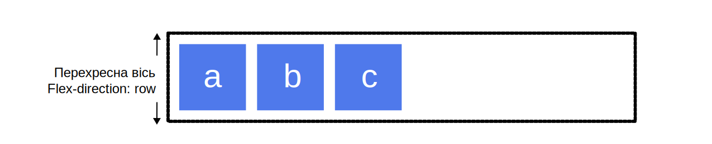
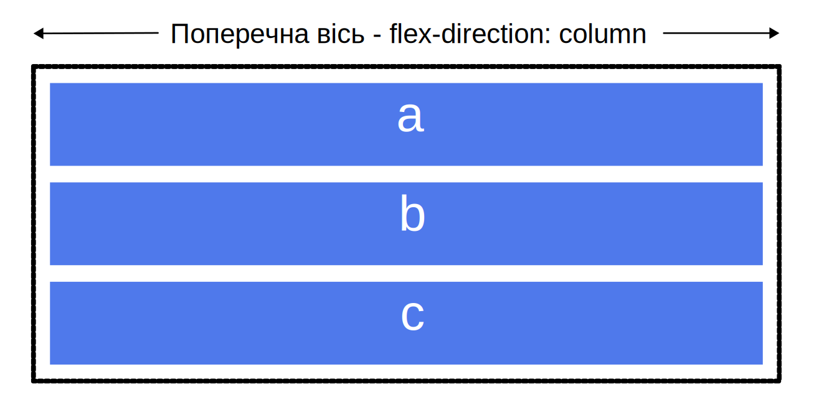
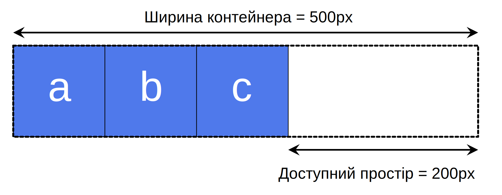

{{CSSRef}}

Модуль [компонування гнучкої рамки](/uk/docs/Web/CSS/CSS_flexible_box_layout) (який зазвичай звуть флексбоксом) – це одновимірна модель компонування для розподілу простору між елементами, що пропонує чимало можливостей для вирівнювання. Ця стаття дає нарис основних можливостей флексбокса, котрі розглядаються більш докладно в інших посібниках.

Коли флексбокс описують як одновимірну систему, то мають на увазі, що він виконує розкладку в одному вимірі за раз – або в ряду, або в колонці. Це контрастує із двовимірною моделлю [сіткової розкладки CSS](/uk/docs/Web/CSS/CSS_grid_layout), котра керує колонками та рядами водночас.

## Дві осі флексбокса

При роботі із флексбоксом необхідно мислити поняттями двох осей: _головної_ та _поперечної_. [Головна вісь](#holovna-vis) визначена властивістю {{cssxref("flex-direction")}}, а [поперечна вісь](#poperechna-vis) – перпендикулярна до неї. Все, що виконується за допомогою флексбокса, використовує ці осі, тож варто розуміти їх суть з самого початку.

### Головна вісь

{{glossary("main axis", "Головна вісь")}} визначається властивістю `flex-direction`, котра має чотири можливі значення:

- `row`
- `row-reverse`
- `column`
- `column-reverse`

Якщо обрати `row` або `row-reverse`, то головна вісь буде напрямлена горизонтально у **рядковому напрямку**.

Якщо обрати `column` або `column-reverse`, то головна вісь буде напрямлена у **блоковому напрямку**, від верху сторінки до низу.

### Поперечна вісь

{{glossary("cross axis", "Поперечна вісь")}} напрямлена перпендикулярно до головної. Тож якщо `flex-direction` (головна вісь) має значення `row` або `row-reverse`, то поперечна вісь напрямлена вертикально.

Якщо головна вісь – `column` або `column-reverse`, то поперечна вісь напрямлена горизонтально.

## Початкова та кінцева лінії

Іще одна життєво важлива для розуміння тема – те, як флексбокс не робить припущень щодо режиму письма документа. Флексбокс не робить припущень про те, що всі лінії тексту починаються у лівому верхньому куті документа і прямуватиме в бік правої руки, а наступні рядки з'являться знизу, один за одним. Замість цього він підтримує всі напрямки письма, подібно до інших [логічних властивостей і значень](/uk/docs/Web/CSS/CSS_logical_properties_and_values).

Можна [дізнатись більше про взаємини між флексбоксом та напрямками письма](/uk/docs/Web/CSS/CSS_flexible_box_layout/Relationship_of_flexbox_to_other_layout_methods#napriamky-pysma) у пізнішій статті; втім, подальший опис повинен допомогти усвідомити, чому мова не йде про ліве та праве, про верх та низ, коли описуються напрями плину гнучких елементів.

Якщо значення `flex-direction` – `row`, а мова – українська, то початковий край головної осі буде зліва, а кінцевий край – справа.

Якщо мова – арабська, то початковий край головної осі – справа, а кінцевий край – зліва.

В обох випадках початковий край поперечної осі – згори гнучкого контейнера, а кінцевий – внизу, оскільки обидві мови мають горизонтальний режим письма.

З часом мислення категоріями початку та кінця замість ліва та права стає звичним, а це буде корисним при роботі з іншими способами розкладки, наприклад, із сітковою розкладкою CSS, котра має такі ж принципи.

## Гнучкий контейнер

Область документа, скомпонована за допомогою флексбокса, називається **гнучким контейнером**. Щоб створити {{glossary("flex container", "гнучкий контейнер")}}, слід вказати для контейнера області властивість {{cssxref("display")}} зі значенням `flex`. Коли це зроблено, то безпосередні нащадки такого контейнера стають **гнучкими елементами**. Контролювати, чи відображається сам контейнер в контексті рядка, або ж в контексті блокового контексту форматування, можна за допомогою значень `inline flex` або `inline-flex` для рядкових гнучких контейнерів, і `block flex` або `flex` для гнучких контейнерів блокового рівня.

### Початкові значення

Як і в випадку всіх інших властивостей CSS, існують певні визначені початкові значення, тож вміст нового гнучкого контейнера поводитиметься так:

- Елементи виводяться в ряду (властивість {{cssxref("flex-direction")}} має усталене значення `row`).
- Елементи починаються з початкового краю головної осі.
- Елементи не розтягуються за головним виміром, але можуть скорочуватися (усталене значення властивості гнучкого елемента {{cssxref("flex-grow")}} – `0`, а усталене значення його властивості {{cssxref("flex-shrink")}} – `1`).
- Елементи розтягуються, аби заповнити доступний простір за поперечною віссю (усталене значення властивості {{cssxref("align-items")}} – `stretch`).
- Властивість гнучкого елемента {{cssxref("flex-basis")}} має усталене значення `auto`. Це означає, що в кожному випадку вона буде рівною значенню {{cssxref("width")}} гнучкого елемента при горизонтальному письмі, або значенню {{cssxref("height")}} – при вертикальному письмі. Якщо відповідне значення `width` чи `height` також має значення `auto`, то використовується значення `flex-basis` `content`.
- Усі елементи будуть в одному ряду (усталене значення властивості {{cssxref("flex-wrap")}} – `nowrap`), переповнюючи свій контейнер, якщо їх сумарна ширина чи висота перевищує, відповідно, ширину чи висоту їх контейнера.

Як наслідок – елементи стануть в ряд, використовуючи розмір вмісту як свій розмір за головною віссю. Якщо елементів більше, ніж може вмістити контейнер, то вони будуть переповнювати його, а не перейдуть на наступний ряд. Якщо деякі елементи вищі за інших, то всі елементи будуть розтягнені за всією довжиною поперечної осі.

У живому прикладі нижче видно, як це працює. Спробуйте редагувати елементи або додати елементи, щоб перевірити усталену поведінку флексбокса.

{{EmbedGHLiveSample("css-examples/flexbox/basics/the-flex-container.html", '100%', 480)}}

### Зміна flex-direction

Властивість гнучкого контейнера {{cssxref("flex-direction")}} дає змогу змінити напрям виводу гнучких елементів. Встановлення `flex-direction: row-reverse` змусить елементи надалі виводитись в ряд, але змінить місцями початок та кінець ряду.

Якщо змінити значення `flex-direction` на `column`, то головна вісь перемкнеться, і елементи будуть виведені у стовпчик. Якщо задати `column-reverse`, то початок та кінець знову поміняються місцями.

У живому прикладі нижче `flex-direction` має значення `row-reverse`. Спробуйте інші значення: `row`, `column` і `column-reverse`, – і погляньте, що станеться із вмістом.

{{EmbedGHLiveSample("css-examples/flexbox/basics/flex-direction.html", '100%', 350)}}

## Багаторядні гнучкі контейнери із flex-wrap

Хоч флексбокс і є одновимірною моделлю, можна змусити гнучкі елементи переходити на кілька рядів. Щоб це зробити, слід розглядати кожен ряд як новий гнучкий контейнер. Будь-який розподіл простору діятиме для кожного ряду окремо, без зв'язку з попередніми та наступними рядами.

Щоб ввімкнути переведення рядів, слід додати властивість {{cssxref("flex-wrap")}} зі значенням `wrap`. Після цього, якщо елементи завеликі, аби бути виведеними в одному ряду, вони будуть перенесені на наступний. Живий приклад нижче містить елементи зі заданою шириною, і сумарна ширина елементів завелика для гнучкого контейнера. Оскільки властивість `flex-wrap` має значення `wrap`, то елементи переходять на нові ряди. Якщо встановити значення `nowrap`, котре, до речі, є початковим, то елементи скоротяться, щоб вміститись у контейнері. Вони скоротяться, тому що мають початкові значення флексбокса, серед яких `flex-shrink: 1`, що дає елементам змогу скорочуватись. Використання `nowrap` призвело б до [переповнення](/uk/docs/Learn/CSS/Building_blocks/Overflowing_content), якби елементи не могли скорочуватись, або якби не могли скоротитись настільки, щоб поміститися.

{{EmbedGHLiveSample("css-examples/flexbox/basics/flex-wrap.html", '100%', 400)}}

Довідайтесь більше про перенесення гнучких елементів на новий ряд у настановах [Опанування переведення гнучких елементів на новий ряд](/uk/docs/Web/CSS/CSS_flexible_box_layout/Mastering_wrapping_of_flex_items).

## Скорочення flex-flow

Можна поєднати властивості `flex-direction` та `flex-wrap` у скороченні {{cssxref("flex-flow")}}.

У живому прикладі нижче спробуйте змінити перше значення на одне з дозволених значень `flex-direction` - `row`, `row-reverse`, `column` чи `column-reverse`, а також змінити друге на `wrap` чи `nowrap`.

{{EmbedGHLiveSample("css-examples/flexbox/basics/flex-flow.html", '100%', 400)}}

## Властивості, що застосовуються до гнучких елементів

Щоб контролювати рядний розмір кожного гнучкого елемента, слід націлитись на них безпосередньо, за допомогою трьох властивостей:

- {{cssxref("flex-grow")}}
- {{cssxref("flex-shrink")}}
- {{cssxref("flex-basis")}}

Нижче – короткий позір на ці властивості, а повніший виклад інформації слід шукати в посібнику [Керування співвідношеннями гнучких елементів за головною віссю](/uk/docs/Web/CSS/CSS_flexible_box_layout/Controlling_ratios_of_flex_items_along_the_main_axis).

Перед усвідомленням цих властивостей слід взяти до уваги концепцію **доступного простору**. При зміні значень цих гнучких властивостей – змінюється спосіб розподілу доступного простору між елементами. Ця концепція також важлива при вирівнюванні елементів.

Якщо є три 100-піксельні елементи у контейнері, що має ширину 500 пікселів, то простір, необхідний для розкладання елементів, – 300 пікселів. Це залишає 200 пікселів доступного простору. Якщо не змінити початкові значення, то флексбокс залишить цей простір вільним за останнім елементом.

Якби натомість було бажано, щоб елементи зростали й заповнювали простір, то був би потрібен спосіб розподілу залишкового простору між елементами. Властивості `flex`, що застосовуються до самих елементів, дають змогу вказати, як доступний простір повинен розподілятися поміж сестринських гнучких елементів.

### Властивість flex-basis

`flex-basis` – те, що визначає розмір елемента щодо простору, який він залишає як доступний. Початкове значення цієї властивості – `auto`, – в такому випадку браузер перевіряє, чи має елемент розмір. У прикладі вище усі елементи мають ширину 100 пікселів. Це значення використовується як `flex-basis`.

Якщо елементи не мають ширини, то `flex-basis` отримує значення розміру вмісту. Саме тому коли на предку просто оголошено `display: flex` для створення гнучких елементів, то елементи стають в ряд і займають лише той простір, котрий потрібен їм для виводу свого вмісту.

### Властивість flex-grow

Коли властивість `flex-grow` має значення додатного цілого числа і є доступний простір, гнучкий елемент може зростати за головною віссю понад свій `flex-basis`. Те, чи цей елемент розтягується для зайняття всього доступного простору на цій осі, чи лишень частку доступного простору, залежить від того, чи дозволено також рости іншим елементам і які значення в їхніх властивостей `flex-grow`.

Кожний елемент з додатним значенням з'їдає частку доступного простору, що залежить від його значення `flex-grow`. Якби всі елементи в прикладі вище мали значення `flex-grow` 1, то доступний простір у гнучкому контейнері був би порівну поділений між цими елементами, і вони розтягнулися б для заповнення контейнера за головною віссю. Якщо дати першому елементу значення `flex-grow` 2, а іншим елементам – кожному 1, то буде сумарно 4 частини; 2 частини доступного простору дістануться першому елементу (100px з 200px, коли мова про приклад вище), а по 1 частині – кожному з решти двох (50px кожному з 200px загалом).

### Властивість flex-shrink

Коли властивість `flex-grow` займається додаванням простору за головною віссю, властивість `flex-shrink` керує її відбором. Якщо в контейнері немає достатнього простору для розкладання елементів, і `flex-shrink` має значення додатного цілого числа, то елемент стає меншим за `flex-basis`. Як і з `flex-grow`, різні значення можуть бути присвоєні, щоб один елемент скорочувався швидше за інших: елемент із більшим значенням `flex-shrink` скорочуватиметься швидше за братерні елементи із меншими значеннями.

Цей мінімальний розмір береться до уваги при роботі з дієвим розміром скорочення, тобто `flex-shrink` потенційно може здаватись менш послідовним у поведінці за `flex-grow`. Для більш детального розгляду того, як цей алгоритм працює, дивіться статтю [Керування співвідношеннями гнучких елементів за головною віссю](/uk/docs/Web/CSS/CSS_flexible_box_layout/Controlling_ratios_of_flex_items_along_the_main_axis).

> [!NOTE]
> Ці значення: `flex-grow` та `flex-shrink` – пропорції. Зазвичай якби усі елементи мали `flex: 1 1 200px`, а тоді хотіли, щоб один елемент зростав з подвійною швидкістю, то задали б йому `flex: 2 1 200px`. Втім, також за бажання можна було б використати `flex: 10 1 200px` чи `flex: 20 1 200px`.

### Скорочені значення гнучких властивостей

Рідко можна побачити використання окремо властивостей `flex-grow`, `flex-shrink` і `flex-basis`; натомість їх поєднують у скорочення {{cssxref("flex")}}. Скорочення `flex` дає змогу встановити три значення у такому порядку: `flex-grow`, `flex-shrink`, `flex-basis`.

Живий приклад нижче дає змогу спробувати різні значення скорочення `flex`; пам'ятайте, що перше значення – `flex-grow`. Коли це значення – додатне, то це означає, що елемент може зростати. Друге значення – `flex-shrink`: із додатним значенням тут елементи можуть скорочуватись, втім, це може відбутись лише за умови, що сума розмірів елементів за головною віссю утворює переповнення. Останнє значення – `flex-basis`; це значення, котре елементи використовують як свій базовий розмір, від котрого відбувається зростання та скорочення.

{{EmbedGHLiveSample("css-examples/flexbox/basics/flex-properties.html", '100%', 510)}}

Також є наперед визначені значення скорочення, що покривають більшість випадків. Їх часто можна побачити у настановах, і в багатьох випадках достатньо буде їх. Наперед визначені значення – наступні:

- `flex: initial`
- `flex: auto`
- `flex: none`
- `flex: <positive-number>`

Значення `initial` – це [глобальне значення](/uk/docs/Web/CSS/CSS_Values_and_Units#hlobalni-znachennia), що представляє початкове значення властивості. Задання `flex: initial` скидає елемент до [початкових значень](#pochatkovi-znachennia) всіх трьох властивостей-складових, і це те саме, що `flex: 0 1 auto`. Початкове значення `flex-grow` – `0`, тож елементи не зростатимуть понад свій розмір `flex-basis`. Початкове значення `flex-shrink` – `1`, тож елементи можуть скоротитись, якщо потрібно, замість переповнення контейнера. Початкове значення `flex-basis` – `auto`. Елементи або скористаються якимось розміром, заданим для елемента за головною віссю, або отримають розмір на основі розміру вмісту.

Використання `flex: auto` – це саме, що `flex: 1 1 auto`; це схоже на `flex: initial`, але елементи можуть зростати та заповнювати контейнер, як і скоротитись, якщо потрібно.

Використання `flex: none` створить цілком негнучкі елементи гнучкого контейнера. Це еквівалентно до `flex: 0 0 auto`. Елементи не можуть зростати або скорочуватись, і будуть розкладені за допомогою флексбоксу зі значенням `flex-basis` – `auto`.

Скорочений запис, котрий часто можна побачити у настановах: `flex: 1`, `flex: 2`, і так далі. Це те саме, що `flex: 1 1 0` або, відповідно, `flex: 2 1 0`. Елементи можуть зростати та скорочуватись, маючи `flex-basis` зі значенням `0`.

Спробуйте такі значення скороченого запису у живому прикладі нижче.

{{EmbedGHLiveSample("css-examples/flexbox/basics/flex-shorthands.html", '100%', 510)}}

## Вирівнювання та розподіл вільного простору між елементами

Ключова здібність флексбоксу – можливість вирівнювати елементи за головною та поперечною осями, а також розподіляти простір між гнучкими елементами. Зверніть увагу, що такі властивості мусять бути встановлені на гнучкому контейнері, а не на елементах.

### align-items

Властивість {{cssxref("align-items")}} вирівнює всі гнучкі елементи на поперечній осі.

Початкове значення цієї властивості – `stretch`, і саме тому гнучкі елементи усталено розтягуються до висоти гнучкого контейнера (або ширини, якщо `flex-direction` має значення `column` або `column-reverse`). Така висота може бути продиктована висотою найвищого елемента у контейнері або розміром, заданим на самому контейнері.

Натомість можна задати `align-items` зі значенням `flex-start`, або просто `start`, аби елементи вишикувалися на початку гнучкого контейнера, `flex-end` або просто `end` – щоб вирівняти їх до кінця, або `center` – аби вирівняти їх по центру. Спробуйте це в живому прикладі: я задав гнучкому контейнері висоту, аби ви могли побачити, як елементи можна рухати всередині контейнера. Подивіться, що відбудеться, якщо задати значення align-items:

- `stretch`
- `flex-start`
- `flex-end`
- `start`
- `end`
- `center`
- `baseline`
- `last baseline`

{{EmbedGHLiveSample("css-examples/flexbox/basics/align-items.html", '100%', 520)}}

Властивість `align-items` задана на гнучкому контейнері та впливає на всі гнучкі елементи. Якщо хочеться вирівняти один гнучкий елемент не так, як інші, можна задати на ньому {{cssxref("align-self")}}.

### justify-content

Властивість {{cssxref("justify-content")}} використовується для вирівнювання елементів на головній осі, напрям якої встановлений властивістю `flex-direction`. Початкове значення – `flex-start`, що змушує елементи стати в початок контейнера, але можна також встановити значення `flex-end`, аби виставити їх у кінці, або `center`, щоб виставити у центрі.

Також можна використати значення `space-between`, аби захопити увесь незайнятий після розкладання елементів простір, і поділити його порівну між елементами так, щоб між кожними двома суміжними елементами був однаковий проміжок. Щоб зліва та справа (або, у разі колонок, – згори та знизу) від кожного елемента був однаковий простір, потрібно встановити значення `space-around`. З `space-around` же елементи отримують по половинці простору з обох боків. Іще можна змусити елементи мати однаковий простір навколо себе за допомогою значення `space-evenly`. З `space-evenly` елементи мають цілий однаковий простір з обох кінців.

Спробуйте наступні значення `justify-content` у живому прикладі:

- `start`
- `end`
- `left`
- `right`
- `normal`
- `flex-start`
- `flex-end`
- `center`
- `space-around`
- `space-between`
- `space-evenly`
- `stretch`

{{EmbedGHLiveSample("css-examples/flexbox/basics/justify-content.html", '100%', 380)}}

Стаття [Вирівнювання елементів у гнучкому контейнері](/uk/docs/Web/CSS/CSS_flexible_box_layout/Aligning_items_in_a_flex_container) більше заглиблюється в ці властивості, аби отримати краще розуміння їх роботи. Втім, у більшості випадків будуть корисними й наведені вище прості приклади.

### justify-items

Властивість [`justify-items`](/uk/docs/Web/CSS/justify-items) ігнорується при компонуванні гнучкого блока.

### place-items і place-content

Властивість [`place-items`](/uk/docs/Web/CSS/place-items) – це властивість-скорочення для `align-items` і `justify-items`. Коли задати її на гнучкому контейнері, вона задає вирівнювання за головною, але не поперечною віссю, і `justify-items` у флексбоксі ігнорується.
Є інша властивість-скорочення, [`place-content`](/uk/docs/Web/CSS/place-content), яка визначає властивості {{cssxref("align-content")}} і `justify-content`. Властивість `align-content` впливає лише на гнучкі контейнери, що можуть загортатися на нові ряди, і про це мова йде у [Вирівнюванні елементів у гнучкому контейнері](/uk/docs/Web/CSS/CSS_flexible_box_layout/Aligning_items_in_a_flex_container).

## Наступні кроки

Після прочитання цієї статті має сформуватись розуміння основних можливостей флексбоксу. У наступній статті розглядається те, [як ця специфікація пов'язана з іншими частинами CSS](/uk/docs/Web/CSS/CSS_flexible_box_layout/Relationship_of_flexbox_to_other_layout_methods).
