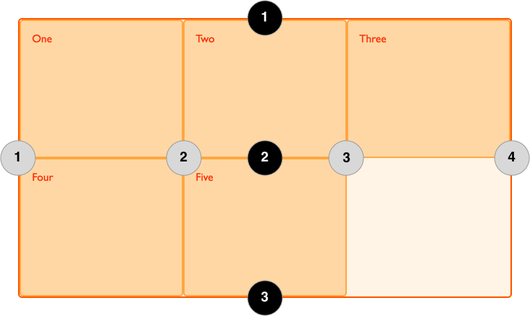
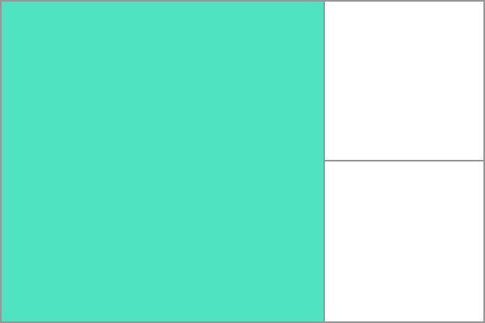

{{CSSRef}}

[Сіткове компонування CSS](/uk/docs/Web/CSS/CSS_grid_layout) запроваджує в CSS двовимірну сіткову систему. Сітки можуть використовуватися для компонування головних частин сторінки чи невеликих елементів користувацького інтерфейсу. Ця стаття знайомить з Сітковим компонуванням CSS та новою термінологією, що є частиною специфікації Сіткового компонування CSS 1 рівня. Можливості, показані в цьому огляді, надалі пояснюються докладніше в решті цього посібника.

## Що таке сітка?

Сітка – це набір горизонтальних і вертикальних ліній, що перетинаються та утворюють колонки й ряди. Елементи можуть бути розташовані на сітці в межах цих колонок та рядів. Сіткове компонування CSS має наступні можливості:

### Фіксований та гнучкий розмір доріжок

Можна створити сітку з доріжками фіксованого розміру – використовуючи, наприклад, пікселі. Це надасть сітці конкретний розмір, що відповідатиме бажаному компонуванню. Крім цього, можна створити сітку з гнучкими розмірами – за допомогою відсотків або розробленої для цієї потреби одиниці вимірювання `fr`.

### Розташування елементів

Елементи можна розташовувати в конкретних місцях на сітці – за допомогою номерів рядів та колонок, імен, або шляхом вказання конкретної області сітки. Сітка також містить алгоритм контролю розташування елементів, котрим не задано конкретне положення на сітці.

### Створення додаткових доріжок для розміщення вмісту

За допомогою сіткового компонування можна визначити сітку явно. Специфікація Сіткового компонування є достатньо гнучкою, аби додавати додаткові ряди й колонки, коли це потрібно. Можливості штибу додавання "стількох колонок, скільки вмістить контейнер" – в неї включені.

### Контроль шикування

Сітка включає можливості шикування, тож можна контролювати те, як елементи шикуються, бувши розташованими в області сітки, і те, як шикується вся сітка.

### Контроль перекриття вмісту

В комірку чи область сітки може бути розміщений більш ніж один елемент, такі елементи можуть частково накладатися один на одного. Таке нашарування можна контролювати за допомогою властивості {{cssxref("z-index")}}.

Сітка – потужна специфікація, котра у поєднанні з іншими частинами CSS, як то [флексбоксом](/uk/docs/Web/CSS/CSS_flexible_box_layout), може допомогти створити компонування, котрі в минулому було неможливо збудувати на CSS. Все починається зі створення сітки в **сітковому контейнері**.

## Сітковий контейнер

_Сітковий контейнер_ утворюється шляхом оголошення на елементі `display: grid` або `display: inline-grid`. Щойно це зроблено, всі _безпосередні нащадки_ такого елемента стають _сітковими елементами_.

В цьому прикладі – контейнерний div з класом wrapper, всередині якого – п'ять дочірніх елементів.

```html
<div class="wrapper">
  <div>Один</div>
  <div>Два</div>
  <div>Три</div>
  <div>Чотири</div>
  <div>П'ять</div>
</div>
```

`.wrapper` стає сітковим контейнером.

```css
.wrapper {
  display: grid;
}
```

```css hidden
* {
  box-sizing: border-box;
}

.wrapper {
  border: 2px solid #f76707;
  border-radius: 5px;
  background-color: #fff4e6;
}

.wrapper > div {
  border: 2px solid #ffa94d;
  border-radius: 5px;
  background-color: #ffd8a8;
  padding: 1em;
  color: #d9480f;
}
```

{{EmbedLiveSample('sitkovyi-konteiner', '200', '330')}}

Відтепер всі безпосередні нащадки стали сітковими елементами. У веббраузері не буде помітна жодна різниця щодо того, як ці елементи виводилися до перетворення їх на сітку, адже сітка створила для елементів одноколонкову сітку. На цьому етапі може мати зміст скористатися [Сітковим дослідником (англ.)](https://firefox-source-docs.mozilla.org/devtools-user/page_inspector/how_to/examine_grid_layouts/index.html), доступним як частина Інструментів розробника Firefox. Якщо переглянути цей приклад за допомогою інспектора Firefox, то буде помітна невелика піктограма біля значення `grid`. Клацніть на неї – і сітка елемента з'явиться у вікні браузера.


По ходу вивчення, а згодом – роботи з Сітковим компонуванням CSS цей інструмент дасть краще візуальне уявлення про те, що відбувається з сітками.

Щоб приклад став більше схожий на сітку, треба додати колонкові доріжки.

## Сіткові доріжки

Ряди й колонки сітки визначаються властивостями {{cssxref("grid-template-rows")}} і {{cssxref("grid-template-columns")}}. Вони визначають сіткові доріжки. _Сіткова доріжка_ – це простір між будь-якими двома лініями сітки. На зображенні нижче виділена доріжка – це доріжка першого ряду сітки.


Сіткові доріжки визначаються в явній сітці за допомогою властивостей `grid-template-columns` і `grid-template-rows` або властивостей-скорочень `grid` і `grid-template`. Крім того, в неявній сітці доріжки створюються шляхом розташування елемента сітки поза доріжками, створеними в явній сітці.

### Базовий приклад

До попереднього прикладу можна додати властивість `grid-template-columns`, після чого – визначити розмір колонкових доріжок.

З'являється сітка з трьома колонковими доріжками 200 пікселів завширшки. Дочірні елементи можуть бути компоновані на такій сітці по одному в кожній сітковій комірці.

```html
<div class="wrapper">
  <div>Один</div>
  <div>Два</div>
  <div>Три</div>
  <div>Чотири</div>
  <div>П'ять</div>
</div>
```

```css
.wrapper {
  display: grid;
  grid-template-columns: 200px 200px 200px;
}
```

```css hidden
* {
  box-sizing: border-box;
}

.wrapper {
  border: 2px solid #f76707;
  border-radius: 5px;
  background-color: #fff4e6;
}

.wrapper > div {
  border: 2px solid #ffa94d;
  border-radius: 5px;
  background-color: #ffd8a8;
  padding: 1em;
  color: #d9480f;
}
```

{{EmbedLiveSample('bazovyi-pryklad', '610', '140')}}

### Одиниця вимірювання fr

Доріжки можуть бути визначені з будь-якою одиницею вимірювання довжини. Крім цього, сітка запроваджує додаткову одиницю вимірювання довжини, котра допомагає створювати гнучкі сіткові доріжки. Нова одиниця `fr` представляє частку ("fraction") доступного в сітковому контейнері простору. Оголошення сітки нижче утворює три доріжки однакової довжини, що зростають і скорочуються згідно з доступним простором.

```html
<div class="wrapper">
  <div>Один</div>
  <div>Два</div>
  <div>Три</div>
  <div>Чотири</div>
  <div>П'ять</div>
</div>
```

```css
.wrapper {
  display: grid;
  grid-template-columns: 1fr 1fr 1fr;
}
```

```css hidden
* {
  box-sizing: border-box;
}

.wrapper {
  border: 2px solid #f76707;
  border-radius: 5px;
  background-color: #fff4e6;
}

.wrapper > div {
  border: 2px solid #ffa94d;
  border-radius: 5px;
  background-color: #ffd8a8;
  padding: 1em;
  color: #d9480f;
}
```

{{EmbedLiveSample('odynytsia-vymiriuvannia-fr', '220', '140')}}

### Нерівні розміри

В наступному прикладі – оголошення з доріжкою `2fr`, після якої – дві доріжки `1fr`. Доступний простір ділиться на чотири частини. Дві частини віддаються першій доріжці, і по одній – кожній з наступних доріжок.

```html
<div class="wrapper">
  <div>Один</div>
  <div>Два</div>
  <div>Три</div>
  <div>Чотири</div>
  <div>П'ять</div>
</div>
```

```css
.wrapper {
  display: grid;
  grid-template-columns: 2fr 1fr 1fr;
}
```

```css hidden
* {
  box-sizing: border-box;
}

.wrapper {
  border: 2px solid #f76707;
  border-radius: 5px;
  background-color: #fff4e6;
}

.wrapper > div {
  border: 2px solid #ffa94d;
  border-radius: 5px;
  background-color: #ffd8a8;
  padding: 1em;
  color: #d9480f;
}
```

{{EmbedLiveSample('nerivni-rozmiry', '220', '140')}}

### Змішування гнучких та абсолютних розмірів

У цьому завершальному прикладі змішуються доріжки з абсолютним розміром та одиниці `fr`. Перша доріжка - 500 пікселів, тож від доступного простору віднімається фіксована ширина. Решта простору ділиться натроє й пропорційно присвоюється двом гнучким доріжкам.

```html
<div class="wrapper">
  <div>Один</div>
  <div>Два</div>
  <div>Три</div>
  <div>Чотири</div>
  <div>П'ять</div>
</div>
```

```css
.wrapper {
  display: grid;
  grid-template-columns: 500px 1fr 2fr;
}
```

```css hidden
* {
  box-sizing: border-box;
}

.wrapper {
  border: 2px solid #f76707;
  border-radius: 5px;
  background-color: #fff4e6;
}

.wrapper > div {
  border: 2px solid #ffa94d;
  border-radius: 5px;
  background-color: #ffd8a8;
  padding: 1em;
  color: #d9480f;
}
```

{{EmbedLiveSample('zmishuvannia-hnuchkykh-ta-absoliutnykh-rozmiriv', '220', '140')}}

### Перелічення доріжок з записом repeat()

Великі сітки з багатьма доріжками можуть використовувати запис `repeat()`, котрий дає змогу повторити весь перелік доріжок чи його частину. Наприклад, таке визначення сітки:

```css
.wrapper {
  display: grid;
  grid-template-columns: 1fr 1fr 1fr;
}
```

Може також бути записано так:

```css
.wrapper {
  display: grid;
  grid-template-columns: repeat(3, 1fr);
}
```

Запис повторення може застосовуватися для частини переліку доріжок. В наступному прикладі – сітка з 20-піксельною доріжкою на початку, після якої – повторюваний розділ з 6 доріжок `1fr`, а потім – кінцева 20-піксельна доріжка.

```css
.wrapper {
  display: grid;
  grid-template-columns: 20px repeat(6, 1fr) 20px;
}
```

Запис повторення приймає перелік доріжок і використовує його для утворення повторюваного патерну доріжок. В наступному прикладі сітка складається з 10 доріжок, де за доріжкою `1fr` слідує доріжка `2fr`. Цей патерн повторюється п'ять разів.

```css
.wrapper {
  display: grid;
  grid-template-columns: repeat(5, 1fr 2fr);
}
```

### Явні та неявні сітки

При створенні сітки-прикладу колонкові доріжки були явно визначені властивістю {{cssxref("grid-template-columns")}}, але ряди сітка створила сама. Ці ряди є частиною неявної сітки. Натомість явна сітка складається з усіх рядів та колонок, визначених за допомогою {{cssxref("grid-template-columns")}} чи {{cssxref("grid-template-rows")}}.

Якщо щось розташовується поза визначеною сіткою, або якщо у зв'язку з кількістю вмісту необхідно більше доріжок, то сітка створює ряди й колонки неявної сітки. Такі доріжки усталено автоматично калібруються, завдяки чому їх розмір заснований на вмісті, що в них є.

Крім того, можна визначити доріжкам, створеним у неявній сітці, конкретний розмір за допомогою властивостей {{cssxref("grid-auto-rows")}} і {{cssxref("grid-auto-columns")}}.

У прикладі нижче `grid-auto-rows` застосовується для певності, що доріжки, створені в неявній сітці, мають 200 пікселів заввишки.

```html
<div class="wrapper">
  <div>Один</div>
  <div>Два</div>
  <div>Три</div>
  <div>Чотири</div>
  <div>П'ять</div>
</div>
```

```css
.wrapper {
  display: grid;
  grid-template-columns: repeat(3, 1fr);
  grid-auto-rows: 200px;
}
```

```css hidden
* {
  box-sizing: border-box;
}

.wrapper {
  border: 2px solid #f76707;
  border-radius: 5px;
  background-color: #fff4e6;
}

.wrapper > div {
  border: 2px solid #ffa94d;
  border-radius: 5px;
  background-color: #ffd8a8;
  padding: 1em;
  color: #d9480f;
}
```

{{EmbedLiveSample('yavni-ta-neiavni-sitky', '230', '450')}}

### Калібрування доріжок та minmax

При налаштуванні явної сітки чи визначенні калібрування для автоматично створених рядів чи колонок може з'явитись потреба надати доріжкам мінімального розміру, але, крім того, пересвідчитись, що доріжки розширюються, аби вмістити будь-який доданий вміст. Наприклад, може бути потреба, щоб ряди ніколи не ставали меншими за 100 пікселів, але щоб коли вміст розтягується до 300 пікселів заввишки, то ряд розтягувався до такої висоти.

Сітка має розв'язання цієї задачі у вигляді функції {{cssxref("minmax", "minmax()")}}. В наступному прикладі `minmax()` використовується у значенні {{cssxref("grid-auto-rows")}}. Це означає, що автоматично утворені ряди будуть мінімум 100 пікселів заввишки, а максимум – `auto`. Застосування `auto` означає, що розмір відповідатиме розмірові вмісту й розтягуватиметься для надання простору найвищому елементові в комірках цього ряду.

```css
.wrapper {
  display: grid;
  grid-template-columns: repeat(3, 1fr);
  grid-auto-rows: minmax(100px, auto);
}
```

```css hidden
* {
  box-sizing: border-box;
}

.wrapper {
  border: 2px solid #f76707;
  border-radius: 5px;
  background-color: #fff4e6;
}

.wrapper > div {
  border: 2px solid #ffa94d;
  border-radius: 5px;
  background-color: #ffd8a8;
  padding: 1em;
  color: #d9480f;
}
```

```html
<div class="wrapper">
  <div>Один</div>
  <div>
    Два
    <p>Я маю в собі ще трохи вмісту.</p>
    <p>Це робить мене вище 100 пікселів.</p>
  </div>
  <div>Три</div>
  <div>Чотири</div>
  <div>П'ять</div>
</div>
```

{{EmbedLiveSample('kalibruvannia-dorizhok-ta-minmax', '240', '470')}}

## Сіткові лінії

Слід зауважити, що при визначенні сітки визначаються сіткові доріжки, а не лінії. Опісля сітка надає пронумеровані лінії, на котрих можна розташовувати елементи. В цій триколонковій дворядовій сітці – чотири колонкові лінії.



Лінії нумеруються згідно з напрямом письма документа. При письмі зліва направо лінія 1 – з лівого боку сітки. При письмі справа наліво – вона з правого боку сітки. Крім цього, лінії можуть бути іменованими, про це пізніше в цій серії статей.

### Розташування елементів на лініях

Розташування на основі ліній буде докладно досліджуватися в пізнішій статті. Наступний переклад демонструє, як це просто реалізувати. При розташуванні елемента задається лінія – а не доріжка.

В наступному прикладі перші два елементи розташовуються на триколонковій сітці за допомогою властивостей {{cssxref("grid-column-start")}}, {{cssxref("grid-column-end")}}, {{cssxref("grid-row-start")}} і {{cssxref("grid-row-end")}}. По ходу обробки зліва направо, перший елемент розташовується біля колонкової лінії 1 і розтягується до колонкової лінії 4, котра в цьому випадку є найправішою лінією сітки. Він починається від рядної лінії 1 і закінчується на рядній лінії 3, таким чином простягаючись на двох рядних доріжках.

Другий елемент починається на сітковій колонковій лінії 1 і лежить на одній доріжці. Це усталений варіант, тому немає потреби вказувати кінцеву лінію. Він також лежить на двох рядних доріжках, від рядної лінії 3 до рядної лінії 5. Решта елементів розташуються на порожніх місцях сітки.

```html
<div class="wrapper">
  <div class="box1">Один</div>
  <div class="box2">Два</div>
  <div class="box3">Три</div>
  <div class="box4">Чотири</div>
  <div class="box5">П'ять</div>
</div>
```

```css
.wrapper {
  display: grid;
  grid-template-columns: repeat(3, 1fr);
  grid-auto-rows: 100px;
}

.box1 {
  grid-column-start: 1;
  grid-column-end: 4;
  grid-row-start: 1;
  grid-row-end: 3;
}

.box2 {
  grid-column-start: 1;
  grid-row-start: 3;
  grid-row-end: 5;
}
```

```css hidden
* {
  box-sizing: border-box;
}

.wrapper {
  border: 2px solid #f76707;
  border-radius: 5px;
  background-color: #fff4e6;
}

.wrapper > div {
  border: 2px solid #ffa94d;
  border-radius: 5px;
  background-color: #ffd8a8;
  padding: 1em;
  color: #d9480f;
}
```

{{EmbedLiveSample('roztashuvannia-elementiv-na-liniiakh', '230', '450')}}

> **Примітка:** Не слід забувати про доступність в Інструментах розробника Firefox [Сіткового дослідника (англ.)](https://firefox-source-docs.mozilla.org/devtools-user/page_inspector/how_to/examine_grid_layouts/index.html), котрий дає змогу побачити, як елементи розташовуються біля ліній сітки.

### Скорочення лінійного розташування

Розгорнуті значення, використані вище, можуть бути стиснені в один рядок: для колонок – за допомогою {{cssxref("grid-column")}}, для рядів – {{cssxref("grid-row")}}. Наступний приклад пропонує таке ж розташування, як попередній код, але з куди меншою кількістю CSS. Значення перед символом скісної риски (`/`) – початкова лінія, значення після нього – кінцева лінія.

Кінцеве значення можна опустити, якщо область лежить лише на одній доріжці.

```css
.wrapper {
  display: grid;
  grid-template-columns: repeat(3, 1fr);
  grid-auto-rows: 100px;
}

.box1 {
  grid-column: 1 / 4;
  grid-row: 1 / 3;
}

.box2 {
  grid-column: 1;
  grid-row: 3 / 5;
}
```

## Сіткові комірки

_Сіткова комірка_ – найменша одиниця сітки. Концептуально вона подібна до табличної комірки. Як видно з попередніх прикладів, щойно сітка визначена за предка, дочірні елементи компонуються по одному на комірку визначеної сітки.


## Сіткові області

Елементи можуть займати одну чи більше комірок як за рядами, так за колонками, що утворює _сіткову область_. Сіткові області мусять бути прямокутними: наприклад, неможливо створити область у формі літери Г. Виділена сіткова область лежить на двох рядних і двох колонкових доріжках.



## Жолоби

_Жолоби_ чи _коридори_ між сітковими комірками можуть бути утворені властивостями {{cssxref("column-gap")}} і {{cssxref("row-gap")}}, або – скороченням {{cssxref("gap")}}. У прикладі нижче утворюється 10-піксельна прогалина між колонками та прогалина `1em` між рядами.

```css
.wrapper {
  display: grid;
  grid-template-columns: repeat(3, 1fr);
  column-gap: 10px;
  row-gap: 1em;
}
```

> **Примітка:** Коли сітка вперше з'явилася в браузерах, {{cssxref("column-gap")}}, {{cssxref("row-gap")}} і {{cssxref("gap")}} мали префікс `grid-`: `grid-column-gap`, `grid-row-gap` і `grid-gap` відповідно.
>
> Тепер всі браузери підтримують значення без префіксів, проте варіанти з префіксами й надалі підтримуватимуться, що робить їх безпечними у використанні.

```html
<div class="wrapper">
  <div>Один</div>
  <div>Два</div>
  <div>Три</div>
  <div>Чотири</div>
  <div>П'ять</div>
</div>
```

```css hidden
* {
  box-sizing: border-box;
}

.wrapper {
  column-gap: 10px;
  row-gap: 1em;
  border: 2px solid #f76707;
  border-radius: 5px;
  background-color: #fff4e6;
}

.wrapper > div {
  border: 2px solid #ffa94d;
  border-radius: 5px;
  background-color: #ffd8a8;
  padding: 1em;
  color: #d9480f;
}
```

{{EmbedLiveSample('zholoby')}}

Будь-який простір, зайнятий прогалинами, враховуватиметься до присвоєння простору доріжкам гнучкої довжини `fr`; для потреб калібрування прогалини діють як звичайні сіткові доріжки, хоч на цих доріжках і не можна нічого розмістити. При розташуванні на основі ліній прогалини діють як товсті суцільні лінії.

## Вкладені сітки

Сітковий елемент може стати сітковим контейнером. У наступному прикладі – створена раніше триколонкова сітка, що має два розташовані елементи. В цьому випадку перший елемент має певні піделементи. Оскільки ці елементи не є безпосередніми нащадками сітки, вони не беруть участі в сітковому компонуванні, а тому – виводяться звичайним потоком документа.


### Вкладення без підсітки

Якщо задати `box1` правило `display: grid`, то цьому елементові можна надати визначення доріжок, і він сам стане сіткою. Тоді елементи будуть компоновані на цій новій сітці.

```css
.box1 {
  grid-column-start: 1;
  grid-column-end: 4;
  grid-row-start: 1;
  grid-row-end: 3;
  display: grid;
  grid-template-columns: repeat(3, 1fr);
}
```

```html hidden
<div class="wrapper">
  <div class="box box1">
    <div class="nested">а</div>
    <div class="nested">б</div>
    <div class="nested">в</div>
  </div>
  <div class="box box2">Два</div>
  <div class="box box3">Три</div>
  <div class="box box4">Чотири</div>
  <div class="box box5">П'ять</div>
</div>
```

```css
* {
  box-sizing: border-box;
}

.wrapper {
  border: 2px solid #f76707;
  border-radius: 5px;
  gap: 3px;
  background-color: #fff4e6;
  display: grid;
  grid-template-columns: repeat(3, 1fr);
}

.box {
  border: 2px solid #ffa94d;
  border-radius: 5px;
  background-color: #ffd8a8;
  padding: 1em;
  color: #d9480f;
}

.box1 {
  grid-column: 1 / 4;
}

.nested {
  border: 2px solid #ffec99;
  border-radius: 5px;
  background-color: #fff9db;
  padding: 1em;
}
```

{{EmbedLiveSample('vkladennia-bez-pidsitky', '600', '340')}}

В цьому випадку вкладена сітка не має взаємин з батьківською. Як це можна помітити у прикладі, вона не успадкувала {{cssxref("gap")}} предка, і лінії у вкладеній сітці не шикуються до ліній батьківської.

### Підсітка

На додачу до звичайних сіток, _підсітка_ дає змогу створювати вкладені сітки, що використовують визначення доріжок батьківської сітки.

Щоб використати підсітку, відредагуймо приклад вкладених сіток вище, аби змінити визначення доріжок `grid-template-columns: repeat(3, 1fr)` на `grid-template-columns: subgrid`. Тоді вкладена сітка використовуватиме для розкладання елементів доріжки батьківської сітки.

```css
.box1 {
  grid-column-start: 1;
  grid-column-end: 4;
  grid-row-start: 1;
  grid-row-end: 3;
  display: grid;
  grid-template-columns: subgrid;
}
```

## Нашарування елементів за допомогою z-index

Кілька сіткових елементів можуть займати одну комірку, і в такому випадку можна застосувати властивість {{cssxref("z-index")}}, аби контролювати порядок, в котрому нагромаджуються елементи, що перекриваються.

### Перекриття без z-index

Коли повернутися до прикладу з елементами, розташованими за номерами ліній, можна його змінити, аби два елементи перекривалися.

```html
<div class="wrapper">
  <div class="box box1">Один</div>
  <div class="box box2">Два</div>
  <div class="box box3">Три</div>
  <div class="box box4">Чотири</div>
  <div class="box box5">П'ять</div>
</div>
```

```css
.wrapper {
  display: grid;
  grid-template-columns: repeat(3, 1fr);
  grid-auto-rows: 100px;
}

.box1 {
  grid-column-start: 1;
  grid-column-end: 4;
  grid-row-start: 1;
  grid-row-end: 3;
}

.box2 {
  grid-column-start: 1;
  grid-row-start: 2;
  grid-row-end: 4;
}
```

```css hidden
* {
  box-sizing: border-box;
}

.wrapper {
  border: 2px solid #f76707;
  border-radius: 5px;
  background-color: #fff4e6;
}

.box {
  border: 2px solid #ffa94d;
  border-radius: 5px;
  background-color: #ffd8a8;
  padding: 1em;
  color: #d9480f;
}
```

{{EmbedLiveSample('perekryttia-bez-z-index', '230', '460')}}

Елемент `box2` тепер перекриває `box1` і виводиться поверх, адже стоїть пізніше в коді.

### Контроль порядку

Порядок, в якому нагромаджуються елементи, можна контролювати за допомогою властивості `z-index` – як із будь-якими нестатично позиціонованими елементами. Можна дати `box2` менший `z-index`, ніж в `box1`, і він буде показаний під `box1`.

```css
.wrapper {
  display: grid;
  grid-template-columns: repeat(3, 1fr);
  grid-auto-rows: 100px;
}

.box1 {
  grid-column-start: 1;
  grid-column-end: 4;
  grid-row-start: 1;
  grid-row-end: 3;
  z-index: 2;
}

.box2 {
  grid-column-start: 1;
  grid-row-start: 2;
  grid-row-end: 4;
  z-index: 1;
}
```

```html hidden
<div class="wrapper">
  <div class="box box1">Один</div>
  <div class="box box2">Два</div>
  <div class="box box3">Три</div>
  <div class="box box4">Чотири</div>
  <div class="box box5">П'ять</div>
</div>
```

```css hidden
* {
  box-sizing: border-box;
}

.wrapper {
  border: 2px solid #f76707;
  border-radius: 5px;
  background-color: #fff4e6;
}

.box {
  border: 2px solid #ffa94d;
  border-radius: 5px;
  background-color: #ffd8a8;
  padding: 1em;
  color: #d9480f;
}
```

{{EmbedLiveSample('kontrol-poriadku', '230', '460')}}

## Наступні кроки

У цій статті проведено дуже стислий огляд можливостей сіткового компонування. Дослідіть його, пограйтесь з прикладами коду, а потім – переходьте до [наступної частини цього посібника](/uk/docs/Web/CSS/CSS_grid_layout/Relationship_of_grid_layout_with_other_layout_methods), де починається справжнє заглиблення в деталі Сіткового компонування CSS.
