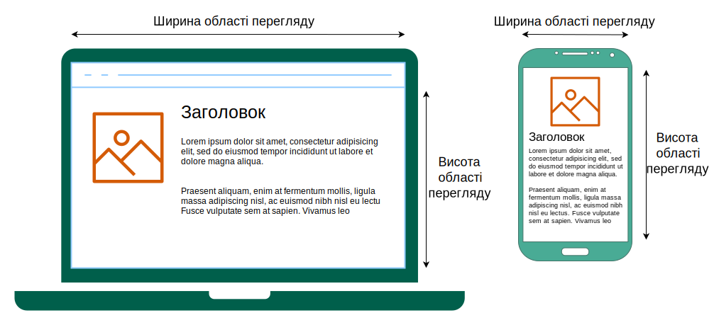

{{CSSRef}}

**Медіазапити CSS** – це ключова компонента [чуйного дизайну](/uk/docs/Learn/CSS/CSS_layout/Responsive_Design), який дає змогу застосовувати стилі CSS в залежності від наявності або значень характеристик пристрою.

Заведено застосовувати медіазапит на основі розміру {{Glossary("viewport", "області перегляду")}}, щоб можна було приймати рішення щодо компонування для пристроїв з різними розмірами екранів. Наприклад, може бути менший розмір шрифту для менших екранів, збільшити внутрішній відступ між абзацами, коли сторінка переглядається в портретному режимі, або збільшити розмір кнопок на сенсорних екранах.

У [CSS](/uk/docs/Web/CSS) можна використати [директиву](/uk/docs/Web/CSS/At-rule) {{cssxref("@media")}}, щоб умовно застосувати частину списку стилів на основі результату медіазапиту.
Щоб умовно застосувати цілий список стилів, слід використати {{cssxref("@import")}}.

При розробці компонентів HTML для багаторазового використання також можна скористатися [контейнерними запитами](/uk/docs/Web/CSS/CSS_container_queries), які дають змогу застосовувати стилі на основі розміру контейнерного елемента, а не області перегляду чи інших характеристик пристрою.

### Медіазапити в HTML

В [HTML](/uk/docs/Web/HTML) медіазапити можуть застосовуватися до різних елементів:

- В атрибуті [`media`](/uk/docs/Web/HTML/Element/link#media) елемента {{HTMLElement("link")}} вони визначають засоби візуалізації, до яких повинен застосовуватися сполучений ресурс (зазвичай CSS).
- В атрибуті [`media`](/uk/docs/Web/HTML/Element/source#media) елемента {{HTMLElement("source")}} вони визначають засоби візуалізації, до яких повинен застосовуватися вихідний код. (Це діє лише всередині елементів {{HTMLElement("picture")}}.)
- В атрибуті [`media`](/uk/docs/Web/HTML/Element/style#media) елемента {{HTMLElement("style")}} вони визначають засоби візуалізації, до яких стиль повинен бути застосований.

### Медіазапити в JavaScript

У [JavaScript](/uk/docs/Web/JavaScript) можна скористатися методом {{domxref("Window.matchMedia()")}}, щоб перевірити вікно на відповідність медіазапитові.
Також можна використати {{domxref("MediaQueryList.addListener()")}}, щоб отримати сповіщення про зміну стану запиту.
З такою функціональністю сайт або застосунок може реагувати на зміни в конфігурації, орієнтації чи стані пристрою.

Дізнатися більше про програмне використання медіазапитів можна на сторінці [Перевірка медіазапитів](/uk/docs/Web/CSS/CSS_media_queries/Testing_media_queries).

## Довідка

### Директиви

- {{cssxref("@import")}}
- {{cssxref("@media")}}

## Посібники

- [Застосування медіазапитів](/uk/docs/Web/CSS/CSS_media_queries/Using_media_queries)
  - : Знайомить з медіазапитом, їхнім синтаксисом, а також операторами та можливостями медіа, що використовуються для конструювання виразів медіазапитів.
- [Перевірка медіазапитів програмно](/uk/docs/Web/CSS/CSS_media_queries/Testing_media_queries)
  - : Описує, як використовувати медіазапити в коді JavaScript, щоб з'ясовувати стан пристрою, а також задавати слухачів, що сповіщають код, коли результати медіазапитів змінюються (наприклад, коли користувач обертає екран або змінює розмір вікна браузера).
- [Використання медіазапитів заради доступності](/uk/docs/Web/CSS/CSS_media_queries/Using_media_queries_for_accessibility)
  - : Дізнайтеся, як Медіазапити можуть допомогти розуміти ваш вебсайт краще.
- [Друк](/uk/docs/Web/CSS/CSS_media_queries/Printing)
  - : Поради та прийоми, які допоможуть покращити виведення вебвмісту на принтер.

## Специфікації

{{Specifications}}

## Дивіться також

- [Контейнерні запити](/uk/docs/Web/CSS/CSS_container_queries)
- Використовуйте {{cssxref("@supports")}}, щоб застосовувати стилі, що залежать від браузерної підтримки різних технологій CSS.
