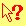
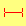
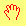
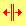
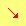

{{CSSRef}}

Властивість [CSS](/uk/docs/Web/CSS) **`cursor`** (покажчик) встановлює курсор миші, котрий повинен бути показаний, коли вказівник миші розташований над елементом.

Встановлення курсора повинне повідомити користувачів про дії, котрі можна виконати за допомогою миші в поточному положенні, включаючи: вибір тексту, активацію помічника або контекстних меню, копіювання вмісту, зміну розміру таблиць, і так далі.
Можна вказати або _тип_ курсора за допомогою ключового слова, або завантажити певний значок (з необов'язковими зображеннями запасного варіанту, а також з обов'язковим ключовим словом як з остаточним запасним варіантом).

{{EmbedInteractiveExample("pages/css/cursor.html")}}

## Синтаксис

```css
/* Ключові слова */
cursor: auto;
cursor: pointer;
/* … */
cursor: zoom-out;

/* URL з обов‘язковим запасним варіантом – ключовим словом */
cursor: url(hand.cur), pointer;

/* URL і координати, з обов‘язковим запасним варіантом – ключовим словом */
cursor:
  url(cursor_1.png) 4 12,
  auto;
cursor:
  url(cursor_2.png) 2 2,
  pointer;

/* URL'и та URL'и – запасні варіанти (деякі – із координатами), з обов‘язковим запасним варіантом – ключовим словом */
cursor:
  url(cursor_1.svg) 4 5,
  url(cursor_2.svg),
  /* … ,*/ url(cursor_n.cur) 5 5,
  progress;

/* Глобальні значення */
cursor: inherit;
cursor: initial;
cursor: revert;
cursor: revert-layer;
cursor: unset;
```

Властивість `cursor` встановлюється довільною кількістю значень `<url>` (нуль чи більше), розділених комами, з обов'язковим ключовим словом у кінці.
Кожен `<url>` повинен вказувати на файл зображення.
Браузер намагатиметься завантажити перше вказане зображення, переходячи до наступного у випадку невдачі, і переходить до використання ключового слова, якщо жодне з зображень не вдалось завантажити (або якщо жодне не було вказано).

Кожен `<url>` може мати на додачу два розділені пробілами числові значення, котрі встановлюють координати `<x>` та `<y>` розташування гарячої точки курсора на зображенні, відносно його лівого верхнього кута.

### Значення

- `<url>` {{optional_inline}}
  - : `url()` або розділений комами список `url(), url(), …` – посилання на файл зображення.
    На випадок того, що якісь типи зображень курсорів не підтримуються, можна вказати більш ніж одне значення {{cssxref("url", "url()")}}.
    Запасний варіант з одного або більше ключових слів _мусить_ бути присутнім в кінці списку запасних варіантів.
- `<x>`, `<y>` {{optional_inline}}

  - : Необов'язкові x та y координати вказують гарячу точку курсора; точну позицію всередині курсора, на котру відбувається вказування.

    Числа – в одиницях пікселів зображення.
    Вони відносні щодо лівого верхнього кута зображення, що відповідає "`0 0`", і обрізаються в межах зображення курсора.
    Якщо ці значення не вказані, то вони можуть бути прочитані з самого файлу, а інакше – усталено вважатимуться "`0 0`".

- `keyword`

  - : Ключове слово _мусить_ бути вказаним, позначаючи, який тип курсора використати, або запасний варіант курсора для використання, якщо всі вказані значки не вдалось завантажити.

    Доступні ключові слова вказані у таблиці нижче. Для всіх, крім `none` – відсутності курсора, додано зображення, котре демонструє, як раніше зображався курсор.
    Можна навести мишу на ряди таблиці, щоб побачити дію різних ключових слів курсора на браузер нині.

    <table class="standard-table">
      <thead>
        <tr>
          <th scope="col">Категорія</th>
          <th scope="col">Ключове слово</th>
          <th scope="col">Приклад</th>
          <th scope="col">Опис</th>
        </tr>
      </thead>
      <tbody>
        <tr style="cursor: auto">
          <th rowspan="3" scope="row">Загальні</th>
          <td><code>auto</code></td>
          <td></td>
          <td>
            Користувацький агент визначить курсор на основі поточного контексту. Наприклад, еквівалентно до <code>text</code>, коли вказівник знаходиться над текстом.
          </td>
        </tr>
        <tr style="cursor: default">
          <td><code>default</code></td>
          <td></td>
          <td>Залежний від платформи усталений курсор. Зазвичай – стрілка.</td>
        </tr>
        <tr style="cursor: none">
          <td><code>none</code></td>
          <td></td>
          <td>Не показано жодного курсора.</td>
        </tr>
        <tr style="cursor: context-menu">
          <th rowspan="5" scope="row" style="cursor: auto">Посилання та статус</th>
          <td><code>context-menu</code></td>
          <td></td>
          <td>Доступне контекстне меню.</td>
        </tr>
        <tr style="cursor: help">
          <td><code>help</code></td>
          <td></td>
          <td>Доступна допоміжна інформація.</td>
        </tr>
        <tr style="cursor: pointer">
          <td><code>pointer</code></td>
          <td></td>
          <td>
            Курсор – вказівник, що показує посилання. Зазвичай зображення руки, що вказує пальцем.
          </td>
        </tr>
        <tr style="cursor: progress">
          <td><code>progress</code></td>
          <td></td>
          <td>
            Програма зайнята у фоні, але користувач може надалі взаємодіяти з інтерфейсом (на відміну від <code>wait</code>).
          </td>
        </tr>
        <tr style="cursor: wait">
          <td><code>wait</code></td>
          <td></td>
          <td>
            Програма зайнята, і користувач не може взаємодіяти з інтерфейсом (на відміну від <code>progress</code>).
            Іноді – зображення піскового або кишенькового годинника.
          </td>
        </tr>
        <tr style="cursor: cell">
          <th rowspan="4" scope="row" style="cursor: auto">Вибір</th>
          <td><code>cell</code></td>
          <td></td>
          <td>Комірка таблиці або набір комірок, що можна вибрати.</td>
        </tr>
        <tr style="cursor: crosshair">
          <td><code>crosshair</code></td>
          <td></td>
          <td>Хрестовий курсор. Часто використовується для показу вибору на растровому зображенні.</td>
        </tr>
        <tr style="cursor: text">
          <td><code>text</code></td>
          <td></td>
          <td>Текст може бути виділеним. Зазвичай має форму двотавра.</td>
        </tr>
        <tr style="cursor: vertical-text">
          <td><code>vertical-text</code></td>
          <td></td>
          <td>
            Вертикальний текст може бути виділеним. Зазвичай має форму горизонтального двотавра.
          </td>
        </tr>
        <tr style="cursor: alias">
          <th rowspan="7" scope="row" style="cursor: auto">Drag &#x26; drop</th>
          <td><code>alias</code></td>
          <td></td>
          <td>Буде створений псевдонім чи ярлик.</td>
        </tr>
        <tr style="cursor: copy">
          <td><code>copy</code></td>
          <td></td>
          <td>Дещо буде скопійовано.</td>
        </tr>
        <tr style="cursor: move">
          <td><code>move</code></td>
          <td></td>
          <td>Дещо буде переміщено.</td>
        </tr>
        <tr style="cursor: no-drop">
          <td><code>no-drop</code></td>
          <td>
            
          </td>
          <td>
            Елемент не може бути кинутим в поточному положенні.<br />[Вада Firefox 275173](https://bugzil.la/275173): На Windows та macOS <code>no-drop</code> еквівалентно <code>not-allowed</code>.
          </td>
        </tr>
        <tr style="cursor: not-allowed">
          <td><code>not-allowed</code></td>
          <td></td>
          <td>Дія не може бути виконана.</td>
        </tr>
        <tr style="cursor: grab">
          <td><code>grab</code></td>
          <td></td>
          <td>Дещо може бути схоплено (перетягнуто чи переміщено).</td>
        </tr>
        <tr style="cursor: grabbing">
          <td><code>grabbing</code></td>
          <td></td>
          <td>Щось схоплено (перетягується чи переміщується).</td>
        </tr>
        <tr style="cursor: all-scroll">
          <th rowspan="15" scope="row" style="cursor: auto">
            Зміна розміру та прокручування
          </th>
          <td><code>all-scroll</code></td>
          <td></td>
          <td>
            Дещо може бути прокручено у будь-якому напрямку (панорамовано).<br />
            [Вада Firefox 275174](https://bugzil.la/275174): На Windows <code>all-scroll</code> еквівалентно <code>move</code>.
          </td>
        </tr>
        <tr style="cursor: col-resize">
          <td><code>col-resize</code></td>
          <td></td>
          <td>
            Елемент чи колонка може змінити розмір по горизонталі.
            Часто зображується у вигляді стрілок, напрямлених наліво та направо із вертикальною смугою між ними.
          </td>
        </tr>
        <tr style="cursor: row-resize">
          <td><code>row-resize</code></td>
          <td></td>
          <td>
            Елемент чи ряд може змінити розмір по вертикалі.
            Часто зображається у вигляді стрілок, напрямлених вгору та вниз із горизонтальною смугою між ними.
          </td>
        </tr>
        <tr style="cursor: n-resize">
          <td><code>n-resize</code></td>
          <td>
            
          </td>
          <td rowspan="8" style="cursor: auto">
            Якийсь край може бути переміщений. Наприклад, курсор <code>se-resize</code> використовується, коли рух починається із <em>південно-східного</em> кута рамок.<br />
            У певних середовищах зображається еквівалентний двонапрямлений курсор зміни розміру. Наприклад, <code>n-resize</code> та <code>s-resize</code> такі самі, як <code>ns-resize</code>.
          </td>
        </tr>
        <tr style="cursor: e-resize">
          <td><code>e-resize</code></td>
          <td>
            
          </td>
        </tr>
        <tr style="cursor: s-resize">
          <td><code>s-resize</code></td>
          <td>
            
          </td>
        </tr>
        <tr style="cursor: w-resize">
          <td><code>w-resize</code></td>
          <td>
            
          </td>
        </tr>
        <tr style="cursor: ne-resize">
          <td><code>ne-resize</code></td>
          <td>
            
          </td>
        </tr>
        <tr style="cursor: nw-resize">
          <td><code>nw-resize</code></td>
          <td>
            
          </td>
        </tr>
        <tr style="cursor: se-resize">
          <td><code>se-resize</code></td>
          <td>
            
          </td>
        </tr>
        <tr style="cursor: sw-resize">
          <td><code>sw-resize</code></td>
          <td>
            
          </td>
        </tr>
        <tr style="cursor: ew-resize">
          <td><code>ew-resize</code></td>
          <td></td>
          <td rowspan="4" style="cursor: auto">Двонапрямлений курсор зміни розміру.</td>
        </tr>
        <tr style="cursor: ns-resize">
          <td><code>ns-resize</code></td>
          <td></td>
        </tr>
        <tr style="cursor: nesw-resize">
          <td><code>nesw-resize</code></td>
          <td></td>
        </tr>
        <tr style="cursor: nwse-resize">
          <td><code>nwse-resize</code></td>
          <td></td>
        </tr>
        <tr style="cursor: zoom-in">
          <th rowspan="2" scope="row" style="cursor: auto">Масштабування</th>
          <td><code>zoom-in</code></td>
          <td></td>
          <td rowspan="2" style="cursor: auto">
            <p>Дещо масштабується в бік збільшення або зменшення.</p>
          </td>
        </tr>
        <tr style="cursor: zoom-out">
          <td><code>zoom-out</code></td>
          <td></td>
        </tr>
      </tbody>
    </table>

## Формальне визначення

{{cssinfo}}

## Формальний синтаксис

{{csssyntax}}

## Зауваження щодо використання

### Обмеження розмірів значків

Хоч специфікація не обмежує розмір зображення курсора, {{Glossary("user agent", "користувацькі агенти")}} зазвичай обмежують його, аби уникнути можливого зловживання.
Наприклад, у Firefox та Chromium зображення курсора усталено обмежені розміром 128x128 пікселів, хоча рекомендується обмежувати розмір зображення курсора до 32x32 пікселів. Заміна курсора з використанням більших зображень, ніж підтримується користувацьким агентом, буде в загальному просто проігнорована.

### Підтримувані формати файлів зображень

Специфікація вимагає від користувацьких факторів підтримки файлів PNG, файлів SVG версії 1.1 у безпечному статичному режимі, що мають природний розмір, та будь-яких інших неанімованих форматів файлів зображень, що підтримуються для зображень в інших властивостях.
Стільничні браузери також широко підтримують формат файлів `.cur`.

Далі специфікація показує, що користувацькі агенти _повинні_ також підтримувати файли SVG версії 1.1 files у безпечному анімованому режимі, що мають природний розмір, поруч із будь-якими іншими анімованими форматами файлів зображень, що підтримуються для зображень в інших властивостях.
Користувацькі агенти _можуть_ підтримувати як статичні, так анімовані SVG зображення, що не мають природного розміру.

### iPadOS

iPadOS підтримує пристрої-вказівники штибу трекпедів та мишей. Усталено курсор iPad виводиться у вигляді кола, і єдине підтримуване значення, що змінює вигляд вказівника — `text`.

### Інші примітки

Заміна курсора, що знаходиться на панелях інструментів, загальноприйнято заблокована для запобігання ошуканству.

## Приклади

### Встановлення типів курсорів

```css
.foo {
  cursor: crosshair;
}

.bar {
  cursor: zoom-in;
}

/* Запасний варіант у вигляді ключового слова обов‘язковий при використанні URL */
.baz {
  cursor: url("hyper.cur"), auto;
}
```

## Специфікації

{{Specifications}}

## Сумісність із браузерами

{{Compat}}

## Дивіться також

- {{cssxref("pointer-events")}}
- Функція {{cssxref("url", "url()")}}
