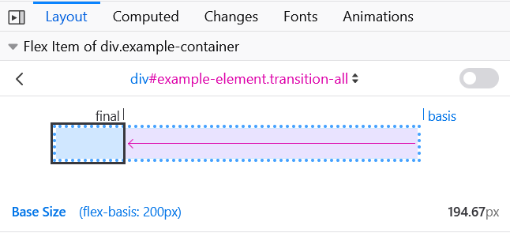

{{CSSRef}}

Властивість [CSS](/uk/docs/Web/CSS) **`flex-basis`** (основа гнучкості) задає початкову основну розмірність гнучкого елемента. Вона задає розмір рамки вмісту, якщо у {{Cssxref("box-sizing")}} не задано щось інше.

{{EmbedInteractiveExample("pages/css/flex-basis.html")}}

У цьому прикладі як властивість {{cssxref("flex-grow")}}, так і властивість {{cssxref("flex-shrink")}} мають значення `1` на всіх трьох елементах, що означає те, що гнучкі елементи можуть збільшуватися і зменшуватися відносно початкового значення `flex-basis`.

Це демо потім змінює `flex-basis` на першому елементі. Він буде збільшуватися і зменшуватися відносно свого flex-basis. Це означає, наприклад, що коли `flex-basis` першого елемента дорівнює `200px`, він спочатку буде мати розмір 200px, а потім зменшиться, щоб вміститися в доступний простір, при цьому інші елементи матимуть розмір, що не менше `min-content`.

Зображення нижче демонструє, як [Flexbox Inspector](https://firefox-source-docs.mozilla.org/devtools-user/page_inspector/how_to/examine_flexbox_layouts/index.html) Firefox допомагає зрозуміти розмір елементів:



> **Примітка:** Коли для елемента задано і `flex-basis` (зі значенням, відмінним від `auto`), і `width` (або `height` у випадку `flex-direction: column`), `flex-basis` має пріоритет.

## Синтаксис

```css
/* Задати <'width'> */
flex-basis: 10em;
flex-basis: 3px;
flex-basis: 50%;
flex-basis: auto;

/* Ключові слова природного розміру */
flex-basis: max-content;
flex-basis: min-content;
flex-basis: fit-content;

/* Задати розмір автоматично на основі вмісту гнучкого елемента */
flex-basis: content;

/* Глобальні значення */
flex-basis: inherit;
flex-basis: initial;
flex-basis: revert;
flex-basis: revert-layer;
flex-basis: unset;
```

Властивість `flex-basis` задається або ключовим словом `content`, або значенням `<'width'>`.

### Значення

- `<'width'>`

  - : Будь-яка з наступних одиниць вимірювання:
    - {{cssxref("&lt;length&gt;")}} задає абсолютне значення
    - {{cssxref("&lt;percentage&gt;")}} задає відсоткове значення відносно ширини або висоти області вмісту контейнерного блока
    - `auto` використовує значення [width](https://drafts.csswg.org/css2/#the-width-property) при горизонтальному напрямку письма і значення властивості {{cssxref("height")}} при вертикальному напрямку письма; коли відповідне значення також є `auto`, використовується значення `content`
    - `max-content` задає бажану природну ширину
    - `min-content` задає мінімальну природну ширину
    - `fit-content` задає максимально можливий розмір області вмісту контейнерного блока, обмежену значеннями `min-content` і `max-content`, що обчислюється на основі вмісту поточного елемента

- `content`

  - : Вказує на автоматичне визначення розміру на основі вмісту гнучкого елемента.

    > **Примітка:** Цього значення не було в Компонуванні гнучких рамок при початковому випуску, тому деякі старі реалізації його не підтримують. Рівносильного ефекту можна досягти, використовуючи `auto` разом із головним розміром ([width](https://drafts.csswg.org/css2/#the-width-property) або [height](https://drafts.csswg.org/css2/#the-height-property)) зі значенням `auto`.
    >
    > - Спершу `flex-basis:auto` означало "дивись на мою властивість `width` або `height`".
    > - Потім `flex-basis:auto` стало означати автоматичне визначення розміру, і додали ключове слово "main-size" на позначення "дивись на мою властивість `width` або `height`". Його реалізували у [ваді Firefox 1032922](https://bugzil.la/1032922).
    > - Потім ці зміни були відкинуті у [ваді Firefox 1093316](https://bugzil.la/1093316), тому `auto` знову означає "дивись на мою властивість `width` або `height`"; і вводиться нове ключове слово `content` для запуску автоматичного визначення розміру. ([Вада Firefox 1105111](https://bugzil.la/1105111) охоплює додавання цього ключового слова).

## Формальне визначення

{{cssinfo}}

## Формальний синтаксис

{{csssyntax}}

## Приклади

### Задання початкових розмірів гнучких елементів

#### HTML

```html
<ul class="container">
  <li class="flex flex1">1: перевірка flex-basis</li>
  <li class="flex flex2">2: перевірка flex-basis</li>
  <li class="flex flex3">3: перевірка flex-basis</li>
  <li class="flex flex4">4: перевірка flex-basis</li>
  <li class="flex flex5">5: перевірка flex-basis</li>
</ul>

<ul class="container">
  <li class="flex flex6">6: перевірка flex-basis</li>
</ul>
```

#### CSS

```css
.container {
  font-family: arial, sans-serif;
  margin: 0;
  padding: 0;
  list-style-type: none;
  display: flex;
  flex-wrap: wrap;
}

.flex {
  background: #6ab6d8;
  padding: 10px;
  margin-bottom: 50px;
  border: 3px solid #2e86bb;
  color: white;
  font-size: 14px;
  text-align: center;
  position: relative;
}

.flex::after {
  position: absolute;
  z-index: 1;
  left: 0;
  top: 100%;
  margin-top: 10px;
  width: 100%;
  color: #333;
  font-size: 12px;
}

.flex1 {
  flex-basis: auto;
}

.flex1::after {
  content: "auto";
}

.flex2 {
  flex-basis: max-content;
}

.flex2::after {
  content: "max-content";
}

.flex3 {
  flex-basis: min-content;
}

.flex3::after {
  content: "min-content";
}

.flex4 {
  flex-basis: fit-content;
}

.flex4::after {
  content: "fit-content";
}

.flex5 {
  flex-basis: content;
}

.flex5::after {
  content: "content";
}
```

#### Результати

{{EmbedLiveSample('zadannia-pochatkovykh-rozmiriv-hnuchkykh-elementiv', '', '360')}}

## Специфікації

{{Specifications}}

## Сумісність із браузерами

{{Compat}}

## Дивіться також

- Посібник із Флексбоксу CSS – _[Базові концепції Флексбоксу](/uk/docs/Web/CSS/CSS_flexible_box_layout/Basic_concepts_of_flexbox)_
- Посібник із Флексбоксу CSS – _[Контроль співвідношень між гнучкими елементами за головною віссю](/uk/docs/Web/CSS/CSS_flexible_box_layout/Controlling_ratios_of_flex_items_along_the_main_axis)_
- {{cssxref("width")}}
