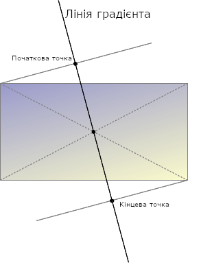

{{CSSRef}}

[Функція](/uk/docs/Web/CSS/CSS_Functions) [CSS](/uk/docs/Web/CSS) **`linear-gradient()`** (лінійний градієнт) створює зображення, що складається з поступового переходу між двома або більше кольорами уздовж прямої лінії. Її результатом є об'єкт типу даних {{CSSxRef("&lt;gradient&gt;")}}, котрий є особливим різновидом {{CSSxRef("&lt;image&gt;")}}.

{{EmbedInteractiveExample("pages/css/function-linear-gradient.html")}}

## Синтаксис

```css
/* Градієнт під кутом 45 градусів,
  починається синім і закінчується червоним */
linear-gradient(45deg, blue, red)

/* Градієнт з нижнього правого кута у верхній лівий кут,
   починається синім і закінчується червоним */
linear-gradient(to left top, blue, red)

/* Інтерполяція в прямокутному кольоровому просторі */
linear-gradient(in oklab, blue, red)

/* Інтерполяція в полярному кольоровому просторі */
linear-gradient(in hsl, blue, red)

/* Інтерполяція в полярному кольоровому просторі
   з довшим методом інтерполяції відтінку */
linear-gradient(in hsl longer hue, blue, red)

/* Зупинка кольору: градієнт йде знизу догори,
   починається синім, стає зеленим на 40% своєї довжини,
   і закінчується червоним */
linear-gradient(0deg, blue, green 40%, red)

/* Підказка кольору: градієнт іде зліва направо,
   починається червоним, досягає середнього кольору
   на 10% своєї довжини,
   витрачаючи решту 90% своєї довжини на перехід до синього */
linear-gradient(.25turn, red, 10%, blue)

/* Багатопозиційна зупинка кольору: градієнт під кутом 45 градусів,
   з червоною половиною знизу зліва і синьою половиною згори справа,
   з різкою лінією там, де градієнт переходить від червоного до синього */
linear-gradient(45deg, red 0 50%, blue 50% 100%)
```

### Значення

- `<side-or-corner>`

  - : Положення початкової точки лінії градієнта. Якщо задане, то складається зі слова `to` і не більш ніж двох ключових слів: одне вказує на бік по горизонталі (`left` або `right`), і одне – по вертикалі (`top` або `bottom`). Порядок ключових слів боків – неважливий. Якщо не задано, то приймається за `to bottom`.

    Значення `to top`, `to bottom`, `to left` і `to right` – рівносильні кутам `0deg`, `180deg`, `270deg` і `90deg` відповідно. Інші значення перетворюються на кути.

- {{CSSxRef("&lt;angle&gt;")}}
  - : Кут напряму лінії градієнта. Значення `0deg` рівносильне `to top`; збільшення значення обертає градієнт за годинниковою стрілкою.
- `<linear-color-stop>`
  - : Значення {{CSSxRef("&lt;color&gt;")}} для зупинки кольору, після якого стоять одна чи дві необов'язкові позиції зупинок, (кожна з яких – або {{CSSxRef("&lt;percentage&gt;")}}, або {{CSSxRef("&lt;length&gt;")}} відносно осі градієнта).
- `<color-hint>`
  - : Підказка {{glossary("interpolation", "інтерполяції")}}, котра визначає те, як градієнт просувається між зупинками кольору. Довжина визначає те, у якій точці між двома кольоровими зупинками колір градієнта повинен досягнути середньої точки переходу кольору. Якщо цього значення немає, то середнє значення кольору досягається в середній точці між двома зупинками кольору.

> [!NOTE]
> Відображення [кольорових зупинок градієнтів CSS](#kompozytsiia-liniinykh-hradiientiv) відповідає тим само правилам, що й кольорові зупинки [градієнтів SVG](/uk/docs/Web/SVG/Tutorial/Gradients).

## Опис

Як і будь-який градієнт, лінійний градієнт [не має власних розмірів](/uk/docs/Web/CSS/image#opys); тобто не має природного або бажаного розміру, як не має і бажаного співвідношення сторін. Його конкретний розмір відповідатиме розміру елемента, до якого застосовується.

Щоб створити лінійний градієнт, котрий повторюється для заповнення власного контейнера, слід натомість використовувати функцію {{cssxref("gradient/repeating-linear-gradient", "repeating-linear-gradient()")}}.

Через те, що `<gradient>` належить до типу даних `<image>`, градієнти можуть використовуватись лише там, де можуть використовуватися [`<image>`](/uk/docs/Web/CSS/image). Через це `linear-gradient()` не може працювати на {{CSSxRef("background-color")}} та інших властивостях, що використовують тип даних {{CSSxRef("&lt;color&gt;")}}.

### Композиція лінійних градієнтів

Лінійний градієнт визначається віссю – _лінією градієнта_ – і двома чи більше _точками зупинки кольору_. Кожна точка на осі є окремим кольором; для створення плавного градієнта функція `linear-gradient()` малює низку кольорових ліній, перпендикулярних до лінії градієнта, кожна з яких відповідає кольорові точки, де вона перетинається з лінією градієнта.



Лінія градієнта визначається центром рамок, що оточують зображення градієнта, і кутом. Кольори градієнта визначаються двома або більше точками: початковою точкою, кінцевою точкою та проміжними необов'язковими зупинками кольору.

_Початкова точка_ є місцем на лінії градієнта, де починається перший колір. _Кінцева точка_ – точка, де закінчується останній колір. Кожна з них визначена перетином лінії градієнта з перпендикулярною прямою, що виходить з кута рамок, котрий лежить в тому самому квадранті. Кінцева точка може усвідомлюватися як симетрична щодо початкової точки. Ці дещо складні визначення призводять до цікавого ефекту, котрий іноді звуть _чарівними кутами_: кути, найближчі до початкової й кінцевої точок, мають такий само колір, що й відповідні початкова й кінцева точки.

#### Налаштування градієнтів

Додавши більше кольорових зупинок на лінії градієнта, можна створити детально налаштований перехід між багатьма кольорами. Положення кольорової зупинки може бути явно визначене шляхом задання {{CSSxRef("&lt;length&gt;")}} або {{CSSxRef("&lt;percentage&gt;")}}. Якщо не задавати положення кольору, він розташовується посередині між попереднім і наступним. Наступні два градієнти – рівносильні.

```css
linear-gradient(red, orange, yellow, green, blue);
linear-gradient(red 0%, orange 25%, yellow 50%, green 75%, blue 100%);
```

Усталено кольори плавно переходять від кольору в одній кольоровій зупинці до кольору в наступній, і середня точка між кольорами стає серединою шляху переходу кольору. Цю середню точку можна перемістити в будь-яку позицію між двома кольоровими зупинками, додавши непідписану підказку кольору % між двома кольорами, аби вказати, де повинна лежати середина колірного переходу. Наступний приклад – яскраво-червоний від початку до позначки 10% і яскраво-синій від позначки 90% до кінця. Між 10% і 90% відбувається перехід кольору від червоного до синього, проте середня точка переходу – на позначці 30%, а не 50%, як вийшло б без підказки кольору 30%.

```css
linear-gradient(red 10%, 30%, blue 90%);
```

Якщо дві чи більше кольорових зупинок стоять в одному місці, то перехід буде різкою лінією між першим та останнім кольорами, оголошеними в такому місці.

Кольорові зупинки повинні бути перелічені в порядку зростання. Наступні кольорові зупинки з меншими значеннями відкидають значення попередньої колірної зупинки, утворюючи різкий перехід. Наступний градієнт змінюється з червоного до жовтого на позначці 40%, а потім переходить від жовтого до синього протягом 25% градієнта.

```css
linear-gradient(red 40%, yellow 30%, blue 65%);
```

Кольорові зупинки з багатьма положеннями – дозволені. Колір може бути оголошений для двох сусідніх колірних зупинок, включених в оголошення CSS. Три наступні градієнти – рівносильні.

```css
linear-gradient(red 0%, orange 10%, orange 30%, yellow 50%, yellow 70%, green 90%, green 100%);
linear-gradient(red, orange 10% 30%, yellow 50% 70%, green 90%);
linear-gradient(red 0%, orange 10% 30%, yellow 50% 70%, green 90% 100%);
```

Усталено, якщо немає кольору з зупинкою `0%`, то в цій точці буде перший оголошений колір. Аналогічно – останній колір буде продовжений до позначки `100%`, або буде поставлений на `100%`, якщо для останньої зупинки не оголошено довжини.

## Формальний синтаксис

{{csssyntax}}

## Приклади

### Градієнт під кутом 45 градусів

```css hidden
body {
  width: 100vw;
  height: 100vh;
}
```

```css
body {
  background: linear-gradient(45deg, red, blue);
}
```

{{EmbedLiveSample("hradiient-pid-kutom-45-hradusiv", 120, 120)}}

### Градієнт, що починається на 60% своєї лінії

```css hidden
body {
  width: 100vw;
  height: 100vh;
}
```

```css
body {
  background: linear-gradient(135deg, orange 60%, cyan);
}
```

{{EmbedLiveSample("hradiient-shcho-pochynaietsia-na-60-svoiei-linii", 120, 120)}}

### Інтерполяція в прямокутному кольоровому просторі

```css hidden
body {
  width: 100vw;
  height: 100vh;
}
```

```css
body {
  background: linear-gradient(90deg in oklab, blue, red);
}
```

{{EmbedLiveSample("interpoliatsiia-v-priamokutnomu-kolorovomu-prostori", 120, 120)}}

### Інтерполяція з відтінком

```html hidden
<div class="shorter">коротший відтінок</div>
<div class="longer">довший відтінок</div>
```

```css hidden
div {
  height: 50vh;
  color: white;
  font-weight: bolder;
}
```

У цьому прикладі інтерполяції використовується система кольорів [hsl](/uk/docs/Web/CSS/color_value/hsl), а інтерполюється [відтінок](/uk/docs/Web/CSS/hue).

```css
.shorter {
  background: linear-gradient(90deg in hsl shorter hue, red, blue);
}

.longer {
  background: linear-gradient(90deg in hsl longer hue, red, blue);
}
```

Рамка згори використовує [коротшу інтерполяцію](/uk/docs/Web/CSS/hue-interpolation-method#korotshyi), що означає, що колір йде прямо від червоного до синього, використовуючи коротку дугу на [колірному колесі](/uk/docs/Glossary/Color_wheel). Рамка знизу використовує [довшу інтерполяцію](/uk/docs/Web/CSS/hue-interpolation-method#dovshyi), що означає, що колір йде від червоного до синього, використовуючи довшу дугу, проходячи через зелені, жовті та помаранчеві.

{{EmbedLiveSample("interpoliatsiia-z-vidtinkom", 120, 120)}}

### Градієнт з колірними зупинками з багатьма положеннями

Цей приклад демонструє колірні зупинки з багатьма положеннями, де сусідні кольори мають однакове значення колірної зупинки, утворюючи ефект смуг.

```css hidden
body {
  width: 100vw;
  height: 100vh;
}
```

```css
body {
  background: linear-gradient(
    to right,
    red 20%,
    orange 20% 40%,
    yellow 40% 60%,
    green 60% 80%,
    blue 80%
  );
}
```

{{EmbedLiveSample("hradiient-z-kolirnymy-zupynkamy-z-bahatma-polozhenniamy", 120, 120)}}

### Більше прикладів linear-gradient

Будь ласка, дивіться більше прикладів у [використанні градієнтів CSS](/uk/docs/Web/CSS/CSS_images/Using_CSS_gradients).

## Специфікації

{{Specifications}}

## Сумісність із браузерами

{{Compat}}

## Дивіться також

- [Використання градієнтів CSS](/uk/docs/Web/CSS/CSS_images/Using_CSS_gradients)
- Інші функції градієнта: {{cssxref("gradient/repeating-linear-gradient", "repeating-linear-gradient()")}}, {{cssxref("gradient/radial-gradient", "radial-gradient()")}}, {{cssxref("gradient/repeating-radial-gradient", "repeating-radial-gradient()")}}, {{cssxref("gradient/conic-gradient", "conic-gradient()")}}, {{cssxref("gradient/repeating-conic-gradient", "repeating-conic-gradient()")}}
- [`<hue-interpolation-method>`](/uk/docs/Web/CSS/hue-interpolation-method)
- [`<color-interpolation-method>`](/uk/docs/Web/CSS/color-interpolation-method)
- {{CSSxRef("&lt;image&gt;")}}
- [Модуль зображень CSS](/uk/docs/Web/CSS/CSS_images)
