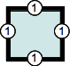
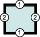
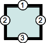
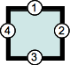
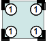
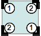
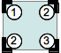
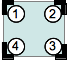

{{CSSRef}}

**_Властивості-скорочення_** – це властивості CSS, що дають змогу водночас задавати значення декількох інших властивостей CSS. За допомогою властивості-скорочення можна писати стисліші (а нерідко – краще читабельні) списки стилів, економлячи час та сили.

Специфікація CSS задає властивості-скорочення для групування означень поширених властивостей, що стосуються однією темою. Наприклад, властивість CSS {{cssxref("background")}} – властивість-скорочення, котра може задавати значення {{cssxref("background-color")}}, {{cssxref("background-image")}}, {{cssxref("background-repeat")}} і {{cssxref("background-position")}}. Подібно до цього, найважливіші властивості, що стосуються шрифту, можуть бути означені за допомогою скорочення {{cssxref("font")}}, а різні зовнішні відступи навколо рамки можуть бути означені за допомогою скорочення {{cssxref("margin")}}.

## Хитрі крайові випадки

Є кілька крайових випадків, про котрі не слід забувати при використанні властивостей-скорочень.

### Упускання властивостей

Значенню, котре не задано, задається його власне початкове значення. Це означає, що воно **відкидає** до того задані значення. Наприклад:

```css
p {
  background-color: red;
  background: url(images/bg.gif) no-repeat left top;
}
```

Такий код не задасть колір тла як `red`, а задасть усталене значення {{cssxref("background-color")}}, тобто `transparent`.

Лише окремі значення властивостей можуть успадковуватися. Оскільки пропущені значення замінюються відповідними початковими значеннями, то не є можливим дозволити успадкування окремих властивостей, коли вони опущені. До властивості може бути застосовано ключове слово `inherit`, але лише до всього скорочення, а не як ключове слово – значення замість якогось значення. Це означає, що єдиний спосіб зробити певне конкретне значення успадкованим – задати нескорочену властивість з ключовим словом `inherit`.

### Порядок властивостей

Властивості-скорочення намагаються не вимагати конкретного порядку значень тих властивостей, котрі вони замінюють. Це працює як слід, коли ці властивості використовують значення різних типів, адже порядок не має значення, але не працює настільки ж легко, коли декілька властивостей можуть мати ідентичні значення.

Є два важливі випадки:

- властивості, що стосуються сторін рамки, як то {{cssxref("border-style")}}, {{cssxref("margin")}} або {{cssxref("padding")}}
- властивості, що стосуються кутів рамки, як то {{cssxref("border-radius")}}

#### Сторони рамки

Скорочення, що вміщають властивості, котрі стосуються сторін рамки, як то {{cssxref("border-style")}}, {{cssxref("margin")}} і {{cssxref("padding")}}, завжди використовують сталий синтаксис від-1-до-4-значень, що представляє ці сторони:

- **синтаксис 1 значення:** `border-width: 1em` — Єдине значення, що представляє всі сторони: 

- **синтаксис 2 значень:** `border-width: 1em 2em` — Перше значення представляє вертикальні, верх і низ, сторони, а друге – горизонтальні, тобто ліву та праву: 

- **синтаксис 3 значень:** `border-width: 1em 2em 3em` — Перше значення представляє верхній бік, друге – горизонтальні сторони, тобто ліву та праву, а третє значення – нижній бік: 

- **синтаксис 4 значень:** `border-width: 1em 2em 3em 4em` — Чотири значення представляють верхню, праву, нижню та ліву сторони відповідно, і – завжди в такому порядку, тобто за годинниковою стрілкою, починаючи з верху:  Перші літери Top-Right-Bottom-Left (верх – права – низ – ліва) збігаються з порядком приголосних у слові _trouble_: TRBL. Також можна запам'ятати як порядок, в якому стрілки обертаються на циферблаті годинника: `1em` стає на позиції 12 годин, `2em` – на 3, `3em` – на 6, а `4em` – на 9 годинах.

#### Кути рамки

Подібно до цього, скорочення, що мають справу з властивостями, котрі стосуються кутів рамки, як то {{cssxref("border-radius")}}, завжди вживають сталий синтаксис від-1-до-4-значень, що представляє ці кути:

- **синтаксис 1 значення:** `border-radius: 1em` — Єдине значення для всіх кутів: 

- **синтаксис 2 значень:** `border-radius: 1em 2em` — Перше значення – для верхнього лівого і нижнього правого кутів, друге – для верхнього правого і нижнього лівого: 

- **синтаксис 3 значень:** `border-radius: 1em 2em 3em` — Перше значення – для верхнього лівого кута, друге – для верхнього правого і нижнього лівого, а третє – для нижнього правого кута: 

- **синтаксис 4 значень:** `border-radius: 1em 2em 3em 4em` — Чотири значення для верхнього лівого, верхнього правого, нижнього правого та нижнього лівого кутів відповідно, завжди в такому порядку, тобто за годинниковою стрілкою, починаючи від верхнього лівого кута: 

## Властивості тла

Для прикладу – тло з наступними властивостями:

```css
background-color: #000;
background-image: url(images/bg.gif);
background-repeat: no-repeat;
background-position: left top;
```

Ці чотири оголошення можуть бути скорочені до одного:

```css
background: #000 url(images/bg.gif) no-repeat left top;
```

(Скорочена форма фактично є рівносильною щодо розгорнутих властивостей вище плюс `background-attachment: scroll`, а також — у CSS3 — кількох додаткових властивостей.)

Дивіться детальніше на сторінці {{cssxref("background")}}, вкупі зі властивостями CSS3.

## Властивості шрифту

Для прикладу – наступні оголошення:

```css
font-style: italic;
font-weight: bold;
font-size: 0.8em;
line-height: 1.2;
font-family: Arial, sans-serif;
```

Ці 5 інструкцій можуть бути скорочені до такого:

```css
font:
  italic bold 0.8em/1.2 Arial,
  sans-serif;
```

Це оголошення-скорочення фактично є рівносильним щодо розгорнутих оголошень вище плюс `font-variant: normal`, `font-size-adjust: none` і `font-stretch: normal`.

## Властивості меж

Для меж їхні ширина, колір та стиль можуть бути спрощені до одного оголошення. Наприклад, наступний CSS:

```css
border-width: 1px;
border-style: solid;
border-color: #000;
```

Це може бути спрощено так:

```css
border: 1px solid #000;
```

## Властивості зовнішніх і внутрішніх відступів

Скорочені версії значень зовнішніх і внутрішніх відступів працюють подібно; властивість margin дає змогу задавати одне, два, три або чотири значення. Для прикладу – наступні оголошення CSS:

```css
margin-top: 10px;
margin-right: 5px;
margin-bottom: 10px;
margin-left: 5px;
```

Вони такі ж, як оголошення нижче, що використовують скорочення з чотирма значеннями. Зверніть увагу на те, що значення стоять в порядку за годинниковою стрілкою, починаючи від верху: верх, права, низ, а тоді ліва (TRBL, приголосні в слові "trouble").

```css
margin: 10px 5px 10px 5px;
```

Скорочення margin для оголошень з одним, двома, трьома або чотирма значеннями:

- Коли задано **одне** значення, то воно застосовує однаковий зовнішній відступ до **всіх чотирьох сторін**.
- Коли задано **два** значення, то перший зовнішній відступ застосовується до **верху та низу**, а другий – до **права та ліва**.
- Коли задано **три** значення, то перший зовнішній відступ застосовується до **верху**, другий – до **лівої та правої сторін**, а третій – до **низу**.
- Коли задано **чотири** значення, то зовнішні відступи застосовуються до **верху**, **права**, **низу** та **ліва** відповідно (за годинниковою стрілкою).

## Властивості позиціонування

Що до позиції, то скорочені версії top, right, bottom і left можуть бути спрощені до одного оголошення. Наприклад, отакий CSS:

```css
top: 0;
right: 20px;
bottom: 0;
left: 20px;
```

Може бути спрощений так:

```css
inset: 0 20px 0 20px;
```

Подібно до зовнішніх і внутрішніх відступів, значення inset мають порядок за годинниковою стрілкою: верх, права, низ, тоді ліва (TRBL).

## Універсальна властивість-скорочення

CSS має універсальну властивість-скорочення, {{cssxref("all")}}, котра застосовує своє значення до кожної властивості в документі. Її призначення – змінювати модель успадкування властивостей.

Більше про те, як в CSS працює успадкування, читайте в [Каскадності та успадкуванні](/uk/docs/Learn/CSS/Building_blocks/Cascade_and_inheritance) та [Знайомстві з каскадністю CSS](/uk/docs/Web/CSS/Cascade).

## Властивості-скорочення

- {{cssxref("all")}}
- {{cssxref("animation")}}
- {{cssxref("animation-range")}}
- {{cssxref("background")}}
- {{cssxref("border")}}
- {{cssxref("border-block")}}
- {{cssxref("border-block-end")}}
- {{cssxref("border-block-start")}}
- {{cssxref("border-bottom")}}
- {{cssxref("border-color")}}
- {{cssxref("border-image")}}
- {{cssxref("border-inline")}}
- {{cssxref("border-inline-end")}}
- {{cssxref("border-inline-start")}}
- {{cssxref("border-left")}}
- {{cssxref("border-radius")}}
- {{cssxref("border-right")}}
- {{cssxref("border-style")}}
- {{cssxref("border-top")}}
- {{cssxref("border-width")}}
- {{cssxref("column-rule")}}
- {{cssxref("columns")}}
- {{cssxref("contain-intrinsic-size")}}
- {{cssxref("container")}}
- {{cssxref("flex")}}
- {{cssxref("flex-flow")}}
- {{cssxref("font")}}
- {{cssxref("font-synthesis")}}
- {{cssxref("font-variant")}}
- {{cssxref("gap")}}
- {{cssxref("grid")}}
- {{cssxref("grid-area")}}
- {{cssxref("grid-column")}}
- {{cssxref("grid-row")}}
- {{cssxref("grid-template")}}
- {{cssxref("inset")}}
- {{cssxref("inset-block")}}
- {{cssxref("inset-inline")}}
- {{cssxref("list-style")}}
- {{cssxref("margin")}}
- {{cssxref("margin-block")}}
- {{cssxref("margin-inline")}}
- {{cssxref("mask")}}
- {{cssxref("mask-border")}}
- {{cssxref("offset")}}
- {{cssxref("outline")}}
- {{cssxref("overflow")}}
- {{cssxref("overscroll-behavior")}}
- {{cssxref("padding")}}
- {{cssxref("padding-block")}}
- {{cssxref("padding-inline")}}
- {{cssxref("place-content")}}
- {{cssxref("place-items")}}
- {{cssxref("place-self")}}
- {{cssxref("position-try")}}
- {{cssxref("scroll-margin")}}
- {{cssxref("scroll-margin-block")}}
- {{cssxref("scroll-margin-inline")}}
- {{cssxref("scroll-padding")}}
- {{cssxref("scroll-padding-block")}}
- {{cssxref("scroll-padding-inline")}}
- {{cssxref("scroll-timeline")}}
- {{cssxref("text-decoration")}}
- {{cssxref("text-emphasis")}}
- {{cssxref("text-wrap")}}
- {{cssxref("transition")}}
- {{cssxref("view-timeline")}}
- {{cssxref("-webkit-text-stroke")}}
- {{cssxref("-webkit-border-before")}}
- {{cssxref("-webkit-mask-box-image")}}

## Дивіться також

- [Синтаксис CSS](/uk/docs/Web/CSS/Syntax)
- [Директиви](/uk/docs/Web/CSS/At-rule)
- [Специфічність](/uk/docs/Web/CSS/Specificity)
- [Успадкування](/uk/docs/Web/CSS/Inheritance)
- [Знайомство з Каскадністю CSS](/uk/docs/Web/CSS/Cascade)
- [Вивчаймо – Каскадність, специфічність та успадкування](/uk/docs/Learn/CSS/Building_blocks/Cascade_and_inheritance)
- [Вивчаймо – Каскадні шари](/uk/docs/Learn/CSS/Building_blocks/Cascade_layers)
- Модуль [Каскадності та успадкування CSS](/uk/docs/Web/CSS/CSS_cascade)
- [Моделі візуального форматування](/uk/docs/Web/CSS/Visual_formatting_model)
- [Початкові](/uk/docs/Web/CSS/initial_value), [обраховані](/uk/docs/Web/CSS/computed_value), [вжиті](/uk/docs/Web/CSS/used_value) та [фактичні](/uk/docs/Web/CSS/actual_value) значення
- [Синтаксис визначення значень](/uk/docs/Web/CSS/Value_definition_syntax)
