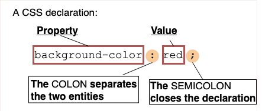
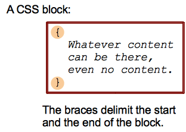
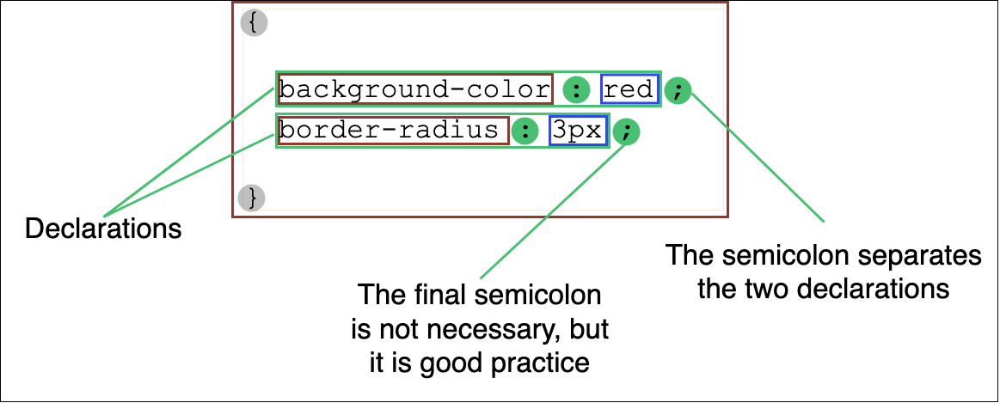
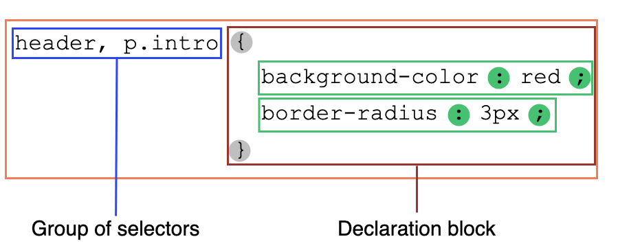
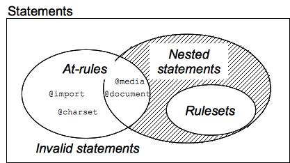

{{CSSRef}}

Засаднича мета мови Каскадних списків стилів ([CSS](/uk/docs/Web/CSS)) – дати рушієві браузера змогу малювати елементи сторінки з певними особливостями, як то кольорами, позиціонуванням та оздобленням. _Синтаксис CSS_ відповідає цій меті, а його основні цеглини – це:

- **Властивість**, що є ідентифікатором, тобто читабельним _ім'ям_, яке визначає, яка особливість взята до уваги.
- **Значення**, котре описує те, як особливість повинна оброблятися рушієм. Кожна властивість має множину дійсних значень, визначених формальною граматикою, а також семантичне значення, реалізоване рушієм браузера.

## Оголошення CSS

Задання властивостей CSS з конкретними значеннями – ключова функція мови CSS. Пара властивості та значення зветься **оголошенням**, і всі рушії CSS обчислюють те, які оголошення застосовуються до кожного елемента сторінки, аби належно виконати компонування та оформлення сторінки.

І властивості, і значення усталено в CSS є чутливими до регістру. Такі пари розділяються двокрапкою – '`:`' (`U+003A COLON`), а пробіли перед, між та після властивостей і значень, але не обов'язково – всередині них, ігноруються.

У CSS є понад [100 різних властивостей](/uk/docs/Web/CSS/Reference) і майже нескінченна кількість різних значень. Не всі пари властивостей і значень дозволені, і кожна властивість визначає, які значення є дійсними. Коли значення не є дійсним для певної властивості, оголошення вважається _недійсним_ і повністю ігнорується рушієм CSS.

## Блоки оголошень CSS

Оголошення групуються в **блоки**, тобто в структури, обмежені лівою фігурною дужкою – '`{`' (`U+007B LEFT CURLY BRACKET`), та правою – '`}`' (`U+007D RIGHT CURLY BRACKET`). Блоки іноді можуть бути вкладеними, тому ліві та праві дужки повинні відповідати одне одному.

Такі блоки називаються **блоками оголошень**, а оголошення всередині них розділяються крапкою з комою – '`;`' (`U+003B SEMICOLON`). Блок оголошень може бути порожнім, тобто містити нульове оголошення. Пробіли навколо оголошень – ігноруються. Останнє оголошення в блоку не потребує закінчення крапкою з комою, хоча часто вважається _добрим стилем_ додавати її, аби не забути додати цей знак при розширенні блоку іншим оголошенням.

Блок оголошень CSS візуалізований на діаграмі нижче.

> **Примітка:** Вміст блоку оголошень CSS, тобто список з розділених крапкою з комою оголошень, без лівої та правої фігурних дужок, може бути вміщений в атрибут HTML [`style`](/uk/docs/Web/HTML/Global_attributes#style).

## Набори правил CSS

Якби списки стилів могли застосовувати оголошення лише до кожного елемента вебсторінки, вони були б практично непотрібними. Справжня ціль – застосовувати різні оголошення до різних частин документа.

CSS дає змогу це робити за допомогою зв'язування умов з блоками оголошень. Перед кожним (дійсним) блоком оголошень стоїть один або більше розділених комами [**селекторів**](/uk/docs/Web/CSS/CSS_selectors), котрі є умовами, що вибирають на сторінці певні елементи. [Група селекторів](/uk/docs/Web/CSS/Selector_list) та пов'язаний з ними блок оголошень вкупі називаються **набором правил**, а також нерідко – просто **правилом**.

Набір правил (або правило) CSS візуалізовано на діаграмі нижче.

Оскільки елемент сторінки може відповідати декільком селекторам, а отже – декільком правилам, що потенційно містять певну властивість декілька разів, з різними значеннями, то стандарт CSS визначає те, яке правило має пріоритет над іншими та повинно бути застосовано, – це зветься алгоритмом [каскаду](/uk/docs/Learn/CSS/Building_blocks/Cascade_and_inheritance).

> **Примітка:** Важливо зауважити, що навіть попри те, що набір правил, описаний групою селекторів, – це певного роду скорочення, що заміняє набори правил з одним селектором кожен, це не стосується валідності самого набору правил.
>
> Це призводить до важливого наслідку: якщо один-єдиний базовий селектор є недійсним, наприклад, використовує невідомий псевдоелемент або псевдоклас, то ввесь _селектор_ є недійсним, а отже – все правило ігнорується (як недійсне теж).

## Інструкції CSS

Набори правил – це головні цеглинки списку стилів, що часто складається лише з великого списку наборів правил. Але є інша інформація, яку автор вебсторінки хоче передати в таблиці стилів, наприклад, набір символів, інші зовнішні таблиці стилів для імпорту, гарнітури шрифтів або лічильників списків та багато іншого. Для цього використовуються інші, специфічні види інструкцій.

**Інструкція** – це цеглинка, що починається з будь-якого непробільного символу, а закінчується при першій правій дужці або крапці з комою (поза рядком, неекранованій і не включеній в іншу пару {}, () або \[]).

Є два різновиди інструкцій:

- **Набори правил** (або _правила_), котрі, як видно, пов'язують колекцію оголошень CSS з умовою, описаною [селектором](/uk/docs/Web/CSS/CSS_selectors).
- **Директиви**, що починаються зі знаку '`@`' (`U+0040 COMMERCIAL AT`), після якого – ідентифікатор, а потім продовжуються до кінця інструкції, тобто до наступної крапки з комою (;) поза блоком, або до кінця наступного блоку. Кожен тип [директив](/uk/docs/Web/CSS/At-rule), визначений ідентифікатором, може мати свій внутрішній синтаксис і, звісно, семантику. Вони використовуються для передачі метаданих (наприклад, {{cssxref("@charset")}} або {{cssxref("@import")}}), умовної інформації (наприклад, {{cssxref("@media")}} або {{cssxref("@document")}}) або описової інформації (наприклад, {{cssxref("@font-face")}}).

Будь-яка інструкція, що не є ані набором правил, ані директивою, є недійсною та ігнорується.

### Вкладені інструкції

Є іще одна група інструкцій – **вкладені інструкції**. Це інструкції, що можуть вживатися в певній підмножині директив – _правилах умовних груп_. Такі інструкції застосовуються лише тоді, коли є відповідність конкретній умові: вміст директиви `@media` застосовується лише тоді, коли пристрій, на якому працює браузер, відповідає вираженій умові; вміст директиви `@document` застосовується лише тоді, коли поточна сторінка відповідає певним умовам, і так далі. У CSS1 і CSS2.1 лише _набори правил_ могли вживатися всередині правил умовних груп. Це було дуже вузько, і це обмеження було знято в [_Умовних правилах CSS рівня 3_](/uk/docs/Web/CSS/CSS_conditional_rules). Тепер, попри те, що це досі експериментальна можливість, що не підтримується усіма браузерами, правила умовних груп можуть містити ширший спектр вмісту: набори правил, але також деякі, але не всі, директиви.

## Дивіться також

- Ключові концепції CSS:
  - **Синтаксис CSS**
  - [Коментарі](/uk/docs/Web/CSS/Comments)
  - [Специфічність](/uk/docs/Web/CSS/Specificity)
  - [Успадкування](/uk/docs/Web/CSS/Inheritance)
  - [Рамкова модель](/uk/docs/Web/CSS/CSS_box_model/Introduction_to_the_CSS_box_model)
  - [Режими компонування](/uk/docs/Web/CSS/Layout_mode)
  - [Моделі візуального форматування](/uk/docs/Web/CSS/Visual_formatting_model)
  - [Перекриття зовнішніх полів](/uk/docs/Web/CSS/CSS_box_model/Mastering_margin_collapsing)
  - Значення
    - [Початкові значення](/uk/docs/Web/CSS/initial_value)
    - [Обчислені значення](/uk/docs/Web/CSS/computed_value)
    - [Вжиті значення](/uk/docs/Web/CSS/used_value)
    - [Фактичні значення](/uk/docs/Web/CSS/actual_value)
  - [Синтаксис оголошення значень](/uk/docs/Web/CSS/Value_definition_syntax)
  - [Властивості-скорочення](/uk/docs/Web/CSS/Shorthand_properties)
  - [Заміщені елементи](/uk/docs/Web/CSS/Replaced_element)
