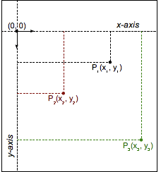

{{CSSRef}}

[Тип даних](/uk/docs/Web/CSS/CSS_Types) [CSS](/uk/docs/Web/CSS) **`<transform-function>`** (функція перетворення) представляє перетворення, що впливає на вигляд елемента. [Функції](/uk/docs/Web/CSS/CSS_Functions) перетворення можуть обертати, змінювати розмір, спотворювати чи переміщати елемент у двовимірному, чи тривимірному просторі. Цей тип вживається у властивості {{cssxref("transform")}}.

## Синтаксис

Тип даних `<transform-function>` задається за допомогою однієї з перетворювальних функцій, перелічених нижче. Кожна функція застосовує геометричну операцію, або у двовимірному, або в тривимірному просторі.

### Матричне перетворення

- [`matrix()`](/uk/docs/Web/CSS/transform-function/matrix)
  - : Описує однорідну двовимірну матрицю перетворення.
- [`matrix3d()`](/uk/docs/Web/CSS/transform-function/matrix3d)
  - : Описує тривимірне перетворення у вигляді однорідної матриці 4×4.

### Перспектива

- [`perspective()`](/uk/docs/Web/CSS/transform-function/perspective)
  - : Задає відстань між користувачем і планом z=0.

### Обертання

- [`rotate()`](/uk/docs/Web/CSS/transform-function/rotate)
  - : Обертає елемент навколо фіксованої точки на двовимірному плані.
- [`rotate3d()`](/uk/docs/Web/CSS/transform-function/rotate3d)
  - : Обертає елемент навколо фіксованої осі в тривимірному просторі.
- [`rotateX()`](/uk/docs/Web/CSS/transform-function/rotateX)
  - : Обертає елемент навколо горизонтальної осі.
- [`rotateY()`](/uk/docs/Web/CSS/transform-function/rotateY)
  - : Обертає елемент навколо вертикальної осі.
- [`rotateZ()`](/uk/docs/Web/CSS/transform-function/rotateZ)
  - : Обертає елемент навколо осі Z.

### Масштабування (зміна розміру)

- [`scale()`](/uk/docs/Web/CSS/transform-function/scale)
  - : Масштабує елемент у двовимірному просторі.
- [`scale3d()`](/uk/docs/Web/CSS/transform-function/scale3d)
  - : Масштабує елемент у тривимірному просторі.
- [`scaleX()`](/uk/docs/Web/CSS/transform-function/scaleX)
  - : Масштабує елемент по горизонталі.
- [`scaleY()`](/uk/docs/Web/CSS/transform-function/scaleY)
  - : Масштабує елемент по вертикалі.
- [`scaleZ()`](/uk/docs/Web/CSS/transform-function/scaleZ)
  - : Масштабує елемент по осі Z.

### Нахиляння (спотворення)

- [`skew()`](/uk/docs/Web/CSS/transform-function/skew)
  - : Нахиляє елемент на двовимірному плані.
- [`skewX()`](/uk/docs/Web/CSS/transform-function/skewX)
  - : Нахиляє елемент по горизонталі.
- [`skewY()`](/uk/docs/Web/CSS/transform-function/skewY)
  - : Нахиляє елемент по вертикалі.

### Переклад (пересування)

- [`translate()`](/uk/docs/Web/CSS/transform-function/translate)
  - : Перекладає елемент на двовимірному плані.
- [`translate3d()`](/uk/docs/Web/CSS/transform-function/translate3d)
  - : Перекладає елемент у тривимірному просторі.
- [`translateX()`](/uk/docs/Web/CSS/transform-function/translateX)
  - : Перекладає елемент по горизонталі.
- [`translateY()`](/uk/docs/Web/CSS/transform-function/translateY)
  - : Перекладає елемент по вертикалі.
- [`translateZ()`](/uk/docs/Web/CSS/transform-function/translateZ)
  - : Перекладає елемент по осі Z.

## Опис

Для опису розміру та форми елемента HTML, як і різноманітних застосованих до нього перетворень, можуть вживатися різні координатні моделі. Найпоширеніша з них – [Декартова система координат](https://uk.wikipedia.org/wiki/%D0%94%D0%B5%D0%BA%D0%B0%D1%80%D1%82%D0%BE%D0%B2%D0%B0_%D1%81%D0%B8%D1%81%D1%82%D0%B5%D0%BC%D0%B0_%D0%BA%D0%BE%D0%BE%D1%80%D0%B4%D0%B8%D0%BD%D0%B0%D1%82) хоч іноді також вживаються [однорідні координати](https://uk.wikipedia.org/wiki/%D0%9E%D0%B4%D0%BD%D0%BE%D1%80%D1%96%D0%B4%D0%BD%D1%96_%D0%BA%D0%BE%D0%BE%D1%80%D0%B4%D0%B8%D0%BD%D0%B0%D1%82%D0%B8).

### Декартові координати

У Декартовій системі координат двовимірна точка описується за допомогою двох значень: координати x (абсциси) та координати y (ординати). Це позначається векторним записом `(x, y)`.



У CSS (і більшості комп'ютерної графіки) початок координат `(0, 0)` представляє _верхній лівий_ кут будь-якого елемента. Додатні координати – зліва та справа від початку координат, а від'ємні – згори та зліва. Таким чином, точка за 2 одиниці справа та за 5 одиниць внизу буде `(2, 5)`, а точка за 3 одиниці зліва та 12 одиниці згори буде `(-3, -12)`.

### Функції перетворення

Функції перетворення змінюють вигляд елемента, змінюючи значення його координат. Лінійна функція трансформації описується за допомогою матриці 2×2, як у прикладі нижче:

<math><mrow><mo>(</mo><mtable><mtr><mtd><mi>a</mi></mtd><mtd><mi>c</mi></mtd></mtr> <mtr><mtd><mi>b</mi></mtd><mtd><mi>d</mi></mtd></mtr></mtable><mo>)</mo></mrow></math>

Ця функція застосовується до елемента за допомогою перемноження матриць. Таким чином, кожна координата змінюється відповідно до значень у матриці:

<math><mrow><mo>(</mo><mtable><mtr><mtd><mi>a</mi></mtd><mtd><mi>c</mi></mtd></mtr> <mtr><mtd><mi>b</mi></mtd><mtd><mi>d</mi></mtd></mtr> </mtable><mo>)</mo></mrow><mrow><mo>(</mo><mtable><mtr><mtd><mi>x</mi></mtd></mtr><mtr><mtd><mi>y</mi></mtd></mtr> </mtable><mo>)</mo></mrow><mo>=</mo> <mrow><mo>(</mo><mtable><mtr><mtd><mi>a</mi><mi>x</mi><mo>+</mo><mi>c</mi><mi>y</mi></mtd> </mtr><mtr><mtd><mi>b</mi><mi>x</mi><mo>+</mo><mi>d</mi><mi>y</mi></mtd></mtr></mtable><mo>)</mo></mrow></math>

Можна навіть застосовувати декілька перетворень підряд:

<math><mrow><mo>(</mo><mtable><mtr><mtd><msub><mi>a</mi><mn>1</mn></msub></mtd> <mtd><msub><mi>c</mi><mn>1</mn></msub></mtd> </mtr><mtr><mtd><msub><mi>b</mi><mn>1</mn></msub></mtd> <mtd><msub><mi>d</mi><mn>1</mn></msub></mtd> </mtr></mtable><mo>)</mo></mrow><mrow><mo>(</mo><mtable><mtr><mtd><msub><mi>a</mi><mn>2</mn></msub></mtd> <mtd><msub><mi>c</mi><mn>2</mn></msub></mtd> </mtr><mtr><mtd><msub><mi>b</mi><mn>2</mn></msub></mtd> <mtd><msub><mi>d</mi><mn>2</mn></msub></mtd> </mtr></mtable><mo>)</mo></mrow><mo>=</mo> <mrow><mo>(</mo><mtable><mtr><mtd><msub><mi>a</mi><mn>1</mn></msub> <msub><mi>a</mi><mn>2</mn></msub> <mo>+</mo> <msub><mi>c</mi><mn>1</mn></msub> <msub><mi>b</mi><mn>2</mn></msub> </mtd><mtd><msub><mi>a</mi><mn>1</mn></msub> <msub><mi>c</mi><mn>2</mn></msub> <mo>+</mo> <msub><mi>c</mi><mn>1</mn></msub> <msub><mi>d</mi><mn>2</mn></msub> </mtd></mtr><mtr><mtd><msub><mi>b</mi><mn>1</mn></msub> <msub><mi>a</mi><mn>2</mn></msub> <mo>+</mo> <msub><mi>d</mi><mn>1</mn></msub> <msub><mi>b</mi><mn>2</mn></msub> </mtd><mtd><msub><mi>b</mi><mn>1</mn></msub> <msub><mi>c</mi><mn>2</mn></msub> <mo>+</mo> <msub><mi>d</mi><mn>1</mn></msub> <msub><mi>d</mi><mn>2</mn></msub></mtd></mtr></mtable><mo>)</mo></mrow></math>

За допомогою такого запису можна описати, а отже – скомпонувати, більшість поширених перетворень: обертання, масштабування, нахиляння. (Фактично, всі перетворення, що є лінійними функціями, можуть бути так описані.) Складені перетворення застосовуються справа наліво.

Проте одне важливе перетворення не є лінійним, а отже – повинно мати особливий випадок при застосуванні такого запису: перекладання. Вектор перекладання `(tx, ty)` повинен бути виражений окремо, як два додаткові параметри.

> **Примітка:** [Однорідні координати](https://uk.wikipedia.org/wiki/%D0%9E%D0%B4%D0%BD%D0%BE%D1%80%D1%96%D0%B4%D0%BD%D1%96_%D0%BA%D0%BE%D0%BE%D1%80%D0%B4%D0%B8%D0%BD%D0%B0%D1%82%D0%B8), хоч і хитріші за Декартові, у [проєктивній геометрії](https://uk.wikipedia.org/wiki/%D0%9F%D1%80%D0%BE%D1%94%D0%BA%D1%82%D0%B8%D0%B2%D0%BD%D0%B0_%D0%B3%D0%B5%D0%BE%D0%BC%D0%B5%D1%82%D1%80%D1%96%D1%8F) призводять до матриць перетворення 3×3, і можуть виражати переклад як лінійну функцію.

> **Примітка:** Функції перетворення вживаються з властивістю `transform`, але не з окремими властивостями перетворення – {{cssxref("translate")}}, {{cssxref("scale")}} чи {{cssxref("rotate")}}.

## Приклади

### Порівняння функцій перетворення

Наступний приклад містить тривимірний куб, створений з елементів DOM і перетворень, а також меню вибору, яке дає змогу вибрати різні функції для перетворення куба, щоб порівняти вплив різних типів.

Оберіть один тип, і відповідне перетворення застосовується до куба; за 2 секунди куб повертається до початкового стану. Його початковий стан – трохи обернений за допомогою `transform3d()`, щоб спостерігався ефект усіх перетворень.

#### HTML

```html
<main>
  <section id="example-element">
    <div class="face front">1</div>
    <div class="face back">2</div>
    <div class="face right">3</div>
    <div class="face left">4</div>
    <div class="face top">5</div>
    <div class="face bottom">6</div>
  </section>

  <div class="select-form">
    <label for="transfunction">Оберіть функцію перетворення</label>
    <select id="transfunction">
      <option selected>Оберіть функцію</option>
      <option>rotate(360deg)</option>
      <option>rotateX(360deg)</option>
      <option>rotateY(360deg)</option>
      <option>rotateZ(360deg)</option>
      <option>rotate3d(1, 1, 1, 90deg)</option>
      <option>scale(1.5)</option>
      <option>scaleX(1.5)</option>
      <option>scaleY(1.5)</option>
      <option>scaleZ(1.5)</option>
      <option>scale3d(1, 1.5, 1.5)</option>
      <option>skew(17deg, 13deg)</option>
      <option>skewX(17deg)</option>
      <option>skewY(17deg)</option>
      <option>translate(100px, 100px)</option>
      <option>translateX(100px)</option>
      <option>translateY(100px)</option>
      <option>translateZ(100px)</option>
      <option>translate3d(50px, 50px, 50px)</option>
      <option>perspective(200px)</option>
      <option>matrix(1, 2, -1, 1, 80, 80)</option>
      <option>matrix3d(1,0,0,0,0,1,3,0,0,0,1,0,50,100,0,1.1)</option>
    </select>
  </div>
</main>
```

#### CSS

```css
main {
  width: 400px;
  height: 200px;
  padding: 50px;
  background-image: linear-gradient(135deg, white, cyan, white);
}

#example-element {
  width: 100px;
  height: 100px;
  transform-style: preserve-3d;
  transition: transform 1.5s;
  transform: rotate3d(1, 1, 1, 30deg);
}

.face {
  display: flex;
  align-items: center;
  justify-content: center;
  width: 100%;
  height: 100%;
  position: absolute;
  backface-visibility: inherit;
  font-size: 60px;
  color: #fff;
}

.front {
  background: rgb(90 90 90 / 70%);
  transform: translateZ(50px);
}

.back {
  background: rgb(0 210 0 / 70%);
  transform: rotateY(180deg) translateZ(50px);
}

.right {
  background: rgb(210 0 0 / 70%);
  transform: rotateY(90deg) translateZ(50px);
}

.left {
  background: rgb(0 0 210 / 70%);
  transform: rotateY(-90deg) translateZ(50px);
}

.top {
  background: rgb(210 210 0 / 70%);
  transform: rotateX(90deg) translateZ(50px);
}

.bottom {
  background: rgb(210 0 210 / 70%);
  transform: rotateX(-90deg) translateZ(50px);
}

.select-form {
  margin-top: 50px;
}
```

#### JavaScript

```js
const selectElem = document.querySelector("select");
const example = document.querySelector("#example-element");

selectElem.addEventListener("change", () => {
  if (selectElem.value === "Оберіть функцію") {
    return;
  } else {
    example.style.transform = `rotate3d(1, 1, 1, 30deg) ${selectElem.value}`;
    setTimeout(() => {
      example.style.transform = "rotate3d(1, 1, 1, 30deg)";
    }, 2000);
  }
});
```

#### Результат

{{EmbedLiveSample('porivniannia-funktsii-peretvorennia', '100%', 300)}}

## Специфікації

{{Specifications}}

## Сумісність із браузерами

{{Compat}}

## Дивіться також

- Властивість CSS {{cssxref("transform")}}
- Окремі властивості перетворення:
  - {{cssxref("translate")}}
  - {{cssxref("scale")}}
  - {{cssxref("rotate")}}
