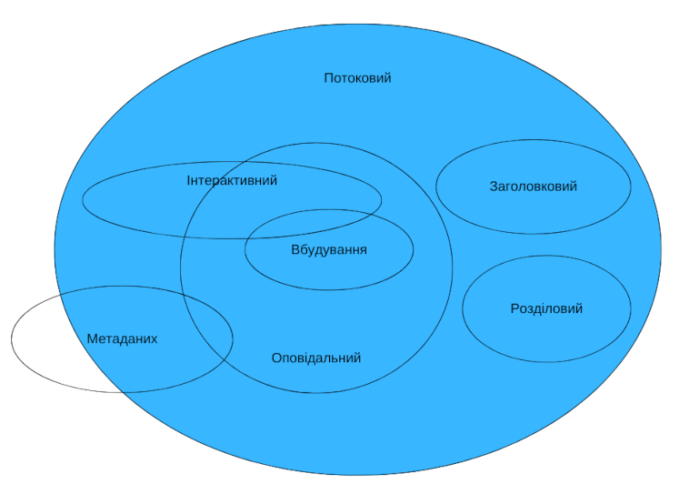

{{HTMLSidebar}}

Більшість елементів [HTML](/uk/docs/Web/HTML) є членами однієї чи кількох **категорій вмісту** — ці категорії групують елементи, що поділяють спільні характеристики. Це розпливчасте групування (воно насправді не створює взаємозв'язків між елементами категорій), але допомагає визначити й описати спільну поведінку категорій та пов'язані з ними правила, особливо коли мова про заплутані подробиці. Крім цього, елемент може не бути членом _жодної_ з цих категорій.

Є три різновиди категорій вмісту:

- Головні категорії вмісту, що описують загальні правила, котрі поділяються багатьма елементами.
- Категорії вмісту форм, що описують правила, спільні для елементів, котрі стосуються форм.
- Особливі категорії вмісту, що описують рідкісні категорії, які поділяються лишень кількома елементами, іноді лише в конкретному контексті.

> **Примітка:** Більш докладне обговорення таких категорій вмісту та відповідної їм функціональності лежить поза обсягом цієї статті; на цю тему може бути доречним прочитати [відповідні частини специфікації HTML](https://html.spec.whatwg.org/multipage/dom.html#kinds-of-content).

[](/uk/docs/Web/HTML/Content_categories/content_categories_venn.png)

## Головні категорії вмісту

### Вміст метаданих

Елементи, що належать до категорії _вмісту метаданих_, видозмінюють представлення чи поведінку решти документа, задають посилання на інші документи чи доносять іншу _супутню_ інформацію.

Елементи, що належать до цієї категорії: {{HTMLElement("base")}}, {{HTMLElement("link")}}, {{HTMLElement("meta")}}, {{HTMLElement("noscript")}}, {{HTMLElement("script")}}, {{HTMLElement("style")}} і {{HTMLElement("title")}}.

### Потоковий вміст

Потоковий вміст – широка категорія, що охоплює більшість елементів, котрі можуть з'явитися в елементі {{HTMLElement("body")}}, включно з елементами заголовків, розділовими, оповідальними елементами, елементами вбудування, інтерактивними та формовими елементами. Крім цього, до неї належать текстові вузли (крім тих, що містять лише пробільні символи).

Потокові елементи:

- {{HTMLElement("a")}}
- {{HTMLElement("abbr")}}
- {{HTMLElement("address")}}
- {{HTMLElement("article")}}
- {{HTMLElement("aside")}}
- {{HTMLElement("audio")}}
- {{HTMLElement("b")}}
- {{HTMLElement("bdo")}}
- {{HTMLElement("bdi")}}
- {{HTMLElement("blockquote")}}
- {{HTMLElement("br")}}
- {{HTMLElement("button")}}
- {{HTMLElement("canvas")}}
- {{HTMLElement("cite")}}
- {{HTMLElement("code")}}
- {{HTMLElement("data")}}
- {{HTMLElement("datalist")}}
- {{HTMLElement("del")}}
- {{HTMLElement("details")}}
- {{HTMLElement("dfn")}}
- {{HTMLElement("dialog")}}
- {{HTMLElement("div")}}
- {{HTMLElement("dl")}}
- {{HTMLElement("em")}}
- {{HTMLElement("embed")}}
- {{HTMLElement("fieldset")}}
- {{HTMLElement("figure")}}
- {{HTMLElement("footer")}}
- {{HTMLElement("form")}}
- {{HTMLElement("Heading_Elements", "<code>&lt;h1&gt;</code>-<code>&lt;h6&gt;</code>")}}
- {{HTMLElement("header")}}
- {{HTMLElement("hgroup")}}
- {{HTMLElement("hr")}}
- {{HTMLElement("i")}}
- {{HTMLElement("iframe")}}
- {{HTMLElement("img")}}
- {{HTMLElement("input")}}
- {{HTMLElement("ins")}}
- {{HTMLElement("kbd")}}
- {{HTMLElement("label")}}
- {{HTMLElement("main")}}
- {{HTMLElement("map")}}
- {{HTMLElement("mark")}}
- {{MathMLElement("math")}}
- {{HTMLElement("menu")}}
- {{HTMLElement("meter")}}
- {{HTMLElement("nav")}}
- {{HTMLElement("noscript")}}
- {{HTMLElement("object")}}
- {{HTMLElement("ol")}}
- {{HTMLElement("output")}}
- {{HTMLElement("p")}}
- {{HTMLElement("picture")}}
- {{HTMLElement("pre")}}
- {{HTMLElement("progress")}}
- {{HTMLElement("q")}}
- {{HTMLElement("ruby")}}
- {{HTMLElement("s")}}
- {{HTMLElement("samp")}}
- {{HTMLElement("search")}}
- {{HTMLElement("script")}}
- {{HTMLElement("section")}}
- {{HTMLElement("select")}}
- {{HTMLElement("slot")}}
- {{HTMLElement("small")}}
- {{HTMLElement("span")}}
- {{HTMLElement("strong")}}
- {{HTMLElement("sub")}}
- {{HTMLElement("sup")}}
- {{SVGElement("svg")}}
- {{HTMLElement("table")}}
- {{HTMLElement("template")}}
- {{HTMLElement("textarea")}}
- {{HTMLElement("time")}}
- {{HTMLElement("u")}}
- {{HTMLElement("ul")}}
- {{HTMLElement("var")}}
- {{HTMLElement("video")}}
- {{HTMLElement("wbr")}}
- простий текст

До цієї категорії належать іще кілька елементів, але лише за виконання певних умов:

- {{HTMLElement("area")}}, коли є нащадком елемента {{HTMLElement("map")}}
- {{HTMLElement("link")}}, коли присутній атрибут [itemprop](/uk/docs/Web/HTML/Global_attributes/itemprop)
- {{HTMLElement("meta")}}, коли присутній атрибут [itemprop](/uk/docs/Web/HTML/Global_attributes/itemprop)
- {{HTMLElement("style")}}, коли присутній атрибут `scoped` {{deprecated_inline}}

### Розділовий вміст

Розділовий вміст, підмножина потокового вмісту, утворює [розділ у поточному плані](/uk/docs/Web/HTML/Element/Heading_Elements), визначаючи область дії елементів {{HTMLElement("header")}} і {{HTMLElement("footer")}}.

Елементи, що належать до цієї категорії: {{HTMLElement("article")}}, {{HTMLElement("aside")}}, {{HTMLElement("nav")}} і {{HTMLElement("section")}}.

### Заголовковий вміст

Заголовковий вміст, підмножина потокового вмісту, визначає заголовок розділу. Це визначення застосовується як до розділів, позначених явним елементом [розділового вмісту](#rozdilovyi-vmist), так і до неявно визначених самим заголовковим вмістом.

Елементи, що належать до цієї категорії – {{HTMLElement("Heading_Elements", "<code>&lt;h1&gt;</code>-<code>&lt;h6&gt;</code>")}} і {{HTMLElement("hgroup")}}.

> **Примітка:** Хоч елемент {{HTMLElement("header")}} з високою ймовірністю міститиме заголовковий вміст, сам він не є заголовковим вмістом.

### Оповідальний вміст

Оповідальний вміст, підмножина потокового вмісту, включає текст і розмітку всередині документа. Серії елементів оповідального вмісту утворюють абзаци.

Елементи, що належать до цієї категорії:

- {{HTMLElement("abbr")}}
- {{HTMLElement("audio")}}
- {{HTMLElement("b")}}
- {{HTMLElement("bdi")}}
- {{HTMLElement("bdo")}}
- {{HTMLElement("br")}}
- {{HTMLElement("button")}}
- {{HTMLElement("canvas")}}
- {{HTMLElement("cite")}}
- {{HTMLElement("code")}}
- {{HTMLElement("data")}}
- {{HTMLElement("datalist")}}
- {{HTMLElement("dfn")}}
- {{HTMLElement("em")}}
- {{HTMLElement("embed")}}
- {{HTMLElement("i")}}
- {{HTMLElement("iframe")}}
- {{HTMLElement("img")}}
- {{HTMLElement("input")}}
- {{HTMLElement("kbd")}}
- {{HTMLElement("label")}}
- {{HTMLElement("mark")}}
- {{MathMLElement("math")}}
- {{HTMLElement("meter")}}
- {{HTMLElement("noscript")}}
- {{HTMLElement("object")}}
- {{HTMLElement("output")}}
- {{HTMLElement("picture")}}
- {{HTMLElement("progress")}}
- {{HTMLElement("q")}}
- {{HTMLElement("ruby")}}
- {{HTMLElement("s")}}
- {{HTMLElement("samp")}}
- {{HTMLElement("script")}}
- {{HTMLElement("select")}}
- {{HTMLElement("slot")}}
- {{HTMLElement("small")}}
- {{HTMLElement("span")}}
- {{HTMLElement("strong")}}
- {{HTMLElement("sub")}}
- {{HTMLElement("sup")}}
- {{SVGElement("svg")}}
- {{HTMLElement("template")}}
- {{HTMLElement("textarea")}}
- {{HTMLElement("time")}}
- {{HTMLElement("u")}}
- {{HTMLElement("var")}}
- {{HTMLElement("video")}}
- {{HTMLElement("wbr")}}
- простий текст (що містить не лише пробільні елементи).

До цієї категорії належать іще кілька елементів, але лише за виконання певних умов:

- {{HTMLElement("a")}}, коли містить лише оповідальний вміст
- {{HTMLElement("area")}}, коли є нащадком елемента {{HTMLElement("map")}}
- {{HTMLElement("del")}}, коли містить лише оповідальний вміст
- {{HTMLElement("ins")}}, коли містить лише оповідальний вміст
- {{HTMLElement("link")}}, коли присутній атрибут [itemprop](/uk/docs/Web/HTML/Global_attributes/itemprop)
- {{HTMLElement("map")}}, коли містить лише оповідальний вміст
- {{HTMLElement("meta")}}, коли присутній атрибут [itemprop](/uk/docs/Web/HTML/Global_attributes/itemprop)

### Вбудований вміст

Вбудований вміст, підмножина потокового вмісту, імпортує інші ресурси чи вставляє в документ вміст з іншої мови розмітки чи простору імен. Серед елементів, що належать до цієї категорії:

- {{HTMLElement("audio")}}
- {{HTMLElement("canvas")}}
- {{HTMLElement("embed")}}
- {{HTMLElement("iframe")}}
- {{HTMLElement("img")}}
- {{MathMLElement("math")}}
- {{HTMLElement("object")}}
- {{HTMLElement("picture")}}
- {{SVGElement("svg")}}
- {{HTMLElement("video")}}

### Інтерактивний вміст

Інтерактивний вміст, підмножина потокового вмісту, включає елементи, котрі розроблені конкретно для взаємодії з користувачем. Серед елементів, що належать до цієї категорії:

- {{HTMLElement("button")}}
- {{HTMLElement("details")}}
- {{HTMLElement("embed")}}
- {{HTMLElement("iframe")}}
- {{HTMLElement("label")}}
- {{HTMLElement("select")}}
- {{HTMLElement("textarea")}}

Частина елементів належить до цієї категорії лише за певних умов:

- {{HTMLElement("a")}}, якщо присутній атрибут [`href`](/uk/docs/Web/HTML/Element/a#href)
- {{HTMLElement("audio")}}, коли присутній атрибут [`controls`](/uk/docs/Web/HTML/Element/audio#controls)
- {{HTMLElement("img")}}, коли присутній атрибут [`usemap`](/uk/docs/Web/HTML/Element/img#usemap)
- {{HTMLElement("input")}}, коли атрибут [type](/uk/docs/Web/HTML/Element/input#type-typ) не має значення "hidden"
- {{HTMLElement("object")}}, коли присутній атрибут [`usemap`](/uk/docs/Web/HTML/Element/object#usemap)
- {{HTMLElement("video")}}, коли присутній атрибут [`controls`](/uk/docs/Web/HTML/Element/video#controls)

### Відчутний вміст

Вміст є відчутним, коли він не є ані порожнім, ані прихованим; це вміст, що виводиться і є істотним. Елементи, чия модель – потоковий вміст, повинні містити принаймні один вузол, що є відчутним.

### Формовий вміст

Формовий вміст – це підмножина потокового вмісту, що складається з елементів, котрі мають форму-власника, представлену в атрибуті **form**, і може використовуватися всюди, де очікується потоковий вміст. Форма-власник може бути або контейнерним елементом {{HTMLElement("form")}}, або елементом, чий id вказаний в атрибуті **form**.

- {{HTMLElement("button")}}
- {{HTMLElement("fieldset")}}
- {{HTMLElement("input")}}
- {{HTMLElement("label")}}
- {{HTMLElement("meter")}}
- {{HTMLElement("object")}}
- {{HTMLElement("output")}}
- {{HTMLElement("progress")}}
- {{HTMLElement("select")}}
- {{HTMLElement("textarea")}}

Ця категорія містить декілька підкатегорій:

- перелічені
  - : Елементи, котрі перелічені в колекціях {{domxref("HTMLFormElement.elements", "form.elements")}} і `fieldset.elements`. Включає {{HTMLElement("button")}}, {{HTMLElement("fieldset")}}, {{HTMLElement("input")}}, {{HTMLElement("object")}}, {{HTMLElement("output")}}, {{HTMLElement("select")}} і {{HTMLElement("textarea")}}.
- підписні
  - : Елементи, що можуть бути пов'язані з елементами {{HTMLElement("label")}}. Включає {{HTMLElement("button")}}, {{HTMLElement("input")}}, {{HTMLElement("meter")}}, {{HTMLElement("output")}}, {{HTMLElement("progress")}}, {{HTMLElement("select")}} і {{HTMLElement("textarea")}}.
- подавальні
  - : Елементи, що можуть використовуватися для конструювання набору даних форми, коли вона подається. Включає {{HTMLElement("button")}}, {{HTMLElement("input")}}, {{HTMLElement("object")}}, {{HTMLElement("select")}} і {{HTMLElement("textarea")}}.
- скидані
  - : Елементи, на котрі може повпливати скидання форми. Включає {{HTMLElement("input")}}, {{HTMLElement("output")}}, {{HTMLElement("select")}} і {{HTMLElement("textarea")}}.

## Другорядні категорії вмісту

На додачу є кілька другорядних класифікацій елементів, про котрі також може бути корисно знати.

### Елементи підтримки сценаріїв

**Елементи підтримки сценаріїв** – елементи, котрі безпосередньо не докладаються до зображеного виводу документа. Натомість вони служать підтримкою сценаріям, або вміщаючи, або задаючи код сценаріїв, або вміщаючи дані, котрі будуть використані сценаріями.

Елементи підтримки сценаріїв:

- {{HTMLElement("script")}}
- {{HTMLElement("template")}}

## Модель прозорого вмісту

Коли елемент має модель прозорого вмісту, то його вміст мусить мати таку структуру, що була б дійсним HTML 5, навіть коли сам прозорий елемент був би прибраний і заміщений власними дочірніми елементами.

Наприклад, елементи {{HTMLElement("del")}} і {{HTMLElement("ins")}} – є прозорими:

```html
<p>
  Ми вважаємо ці істини <del><em>священними &amp; незаперечними</em></del>
  <ins>самоочевидними</ins>.
</p>
```

Якщо ці елементи прибрати, то такий уривок все одно буде дійсним HTML (хоч і не коректною українською).

```html
<p>
  Ми вважаємо ці істини <em>священними &amp; незаперечними</em> самоочевидними.
</p>
```
