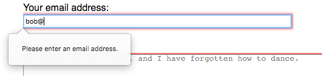
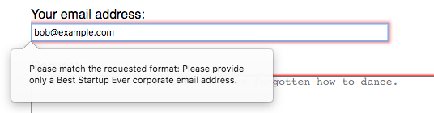

{{HTMLSidebar}}

Елементи {{HTMLElement("input")}} типу **`email`** (електронна пошта) використовуються, аби дати користувачам змогу вводити й редагувати адресу електронної пошти, або, якщо заданий атрибут [`multiple`](/uk/docs/Web/HTML/Attributes/multiple), список таких адрес.

{{EmbedInteractiveExample("pages/tabbed/input-email.html", "tabbed-shorter")}}

Значення поля автоматично валідується, аби пересвідчитись, що воно або порожнє, або є коректно відформатованою адресою електронної пошти (або списком таких адрес), перед поданням форми. Автоматично застосовуються псевдокласи CSS {{cssxref(":valid")}} і {{cssxref(":invalid")}} – аби візуально позначити те, чи є поточне значення поля дійсною адресою електронної пошти.

## Значення

Атрибут [`value`](/uk/docs/Web/HTML/Element/input#value-znachennia) елемента {{HTMLElement("input")}} містить рядок, що автоматично валідується на відповідність синтаксисові електронних пошт. Якщо конкретніше, то є три можливі формати значень, що пройдуть валідацію:

1. Порожній рядок, котрий позначає, що користувач не ввів значення, або що значення було прибрано.
2. Одна коректно відформатована адреса електронної пошти. Це не обов'язково означає, що вона існує, але вона щонайменше коректно відформатована. Простіше кажучи, це щось типу `username@domain` або `username@domain.tld`. Звісно, тут набагато більше нюансів, дивіться {{Glossary("regular expression", "регулярний вираз")}}, що відповідає алгоритмові валідації електронної пошти, в розділі [Валідація](#validatsiia).
3. Якщо і лише якщо заданий атрибут [`multiple`](/uk/docs/Web/HTML/Element/input#multiple-kilka), то значення може бути списком коректно відформатованих розділених комами адрес електронної пошти. Всі пробіли на початку та в кінці кожної адреси в списку – прибираються.

Дивіться деталі того, як валідуються адреси електронної пошти, щоб пересвідчитися, що вони коректно відформатовані, в розділі [Валідація](#validatsiia).

## Додаткові атрибути

На додачу до атрибутів, що працюють в усіх елементах {{HTMLElement("input")}}, незалежно від їхнього типу, поля `email` підтримують наступні атрибути.

### list

Значення атрибута list – це {{domxref("Element.id", "id")}} елемента {{HTMLElement("datalist")}}, розташованого в тому ж документі. {{HTMLElement("datalist")}} надає список наперед означених значень для пропонування користувачеві в цьому полі. Будь-які значення списку, що не є сумісними з[`type`](/uk/docs/Web/HTML/Element/input#type-typ), не включаються в запропоновані варіанти. Надані значення є пропозиціями, а не вимогами: користувачі можуть як обрати з наперед визначеного списку, так і надати інше значення.

### maxlength

Найбільша довжина рядка (у кодових одиницях UTF-16), який користувач може ввести в поле `email`. Це повинно бути ціле число, не менше 0. Якщо не задано `maxlength`, або якщо задано недійсне значення, то поле `email` не має максимальної довжини. Це значення повинно бути більше або рівне значенню `minlength`.

Таке поле провалить [валідацію обмежень](/uk/docs/Web/HTML/Constraint_validation), якщо довжина текстового значення поля перевищує `maxlength` кодових одиниць UTF-16. Валідація обмежень застосовується лише тоді, коли значення змінив користувач.

### minlength

Найменша довжина рядка (у кодових одиницях UTF-16), який користувач може ввести в поле `email`. Це повинно бути невід'ємне ціле число, менше або рівне `maxlength`. Якщо не задано `minlength`, або якщо недійсне значення, то поле `email` не має мінімальної довжини.

Таке поле провалить [валідацію обмежень](/uk/docs/Web/HTML/Constraint_validation), якщо довжина тексту, введеного в поле, менша за `minlength` кодових одиниць UTF-16. Валідація обмежень застосовується лише тоді, коли значення змінив користувач.

### multiple

Булів атрибут, котрий, коли присутній, позначає, що користувач може ввести список з декількох адрес електронної пошти, розділених комами та, необов'язково, пробільними символами. Дивіться приклад у [Прийманні кількох адрес електронної пошти](#pryimannia-kilkokh-adres-elektronnoi-poshty), або деталі в [Атрибуті HTML – multiple](/uk/docs/Web/HTML/Attributes/multiple).

> **Примітка:** Зазвичай, якщо задати атрибут [`required`](/uk/docs/Web/HTML/Element/input#required-oboviazkovyi), то користувач повинен увести дійсну адресу електронної пошти, щоб поле вважалось дійсним. Проте якщо додати атрибут `multiple`, то список з нуля адрес (порожній рядок, або рядок, що складається з пробілів) є дійсним значенням. Інакше кажучи, користувач не зобов'язаний вводити навіть одну адресу, якщо задано `multiple`, незалежно від значення `required`.

### pattern

Атрибут `pattern`, коли заданий, є регулярним виразом, котрому повинно відповідати [`value`](/uk/docs/Web/HTML/Element/input#value-znachennia), щоб пройти [валідацію обмежень](/uk/docs/Web/HTML/Constraint_validation). Це повинен бути дійсний регулярний вираз JavaScript, у такому вигляді, як використовується типом {{jsxref("RegExp")}}, і такому, як це задокументовано в [посібнику з регулярних виразів](/uk/docs/Web/JavaScript/Guide/Regular_expressions); при компіляції такого виразу використовується позначка `'u'`, аби патерн оброблявся як послідовність кодових точок Unicode, а не символів {{Glossary("ASCII")}}. Скісних рисок на кінцях тексту патерну бути не повинно.

Якщо заданий патерн не заданий або недійсний, то регулярний вираз не застосовується, і цей атрибут цілковито ігнорується.

> **Примітка:** Використовуйте атрибут [`title`](/uk/docs/Web/HTML/Element/input#title-zaholovok), аби задати текст, котрий більшість браузерів покаже як спливну підказку, для пояснення, які вимоги для перевірки патерном. Крім цього, варто додати поруч інший текст з поясненнями.

Дивіться подробиці та приклад у розділі [Валідація патерном](#validatsiia-paternom).

### `placeholder`

Атрибут `placeholder` – це рядок, що надає користувачам стислу підказку щодо того, якого роду інформація очікується в полі. Це повинно бути слово або коротка фраза, що показує очікуваний тип даних, а не пояснювальне повідомлення. Такий текст _не повинен_ містити повернення каретки або розриву рядка.

Якщо вміст контрольного елемента має один напрям письма ({{Glossary("LTR", "зліва направо")}} або {{Glossary("RTL", "справа наліво")}}), а заповнювач треба показати в іншому напрямі, то можна використати в заповнювачі символи двонапрямленого алгоритму форматування Unicode; більше інформації у статті [Як використовувати контрольні символи Unicode у двонапрямленому тексті](https://www.w3.org/International/questions/qa-bidi-unicode-controls).

> **Примітка:** Уникайте використання атрибута `placeholder`, якщо це можливо. Він є менш семантично корисним, ніж інші способи пояснення форми, і може призводити до неочікуваних технічних проблем зі вмістом. Більше інформації в [підписах `<input>`](/uk/docs/Web/HTML/Element/input#pidpysy).

### `readonly`

Булів атрибут, котрий, якщо присутній, означає, що користувач не може редагувати поле. Проте `value` цього поля усе ж може бути змінено кодом JavaScript, шляхом безпосереднього присвоєння властивості `value` об'єкта {{domxref("HTMLInputElement")}}.

> **Примітка:** Оскільки таке поле не може мати значення, `required` не діє на поля, на котрих також задано атрибут `readonly`.

### `size`

Атрибут `size` – це числове значення, що вказує на те, якої ширини в символах повинно бути поле введення. Значення цього атрибута повинно бути числом, більшим за нуль, а усталене значення – 20. Оскільки розмір символів буває різний, така ширина може бути, а може й не бути точною, і на її розмірність не варто покладатися; результівне поле може бути вужчим або ширшим за задану кількість символів, залежно від самих цих символів та шрифту (застосованих налаштувань {{cssxref("font")}}).

Це _не_ задає обмеження того, скільки символів користувач може ввести в поле. Це лише приблизно задає те, скільки символів водночас буде видно. Аби задати верхню межу довжини введених даних, слід використовувати атрибут [`maxlength`](#maxlength).

## Застосування полів електронної пошти

Адреси електронної пошти – серед текстових даних, котрі найчастіше вводять у Вебі; вони використовуються при автентифікації на вебсайтах, при запитах інформації, для підтвердження замовлень, для Інтернет-пошти, і так далі. Таким чином, тип поля `email` може суттєво полегшити роботу веброзробника, адже він допомагає спростити розробку користувацького інтерфейсу та логіку навколо адрес електронної пошти. При створенні поля електронної пошти з коректним значенням `type`, `email`, автоматично додається валідація того, що введений текст щонайменше має коректну форму як прийнятна адреса електронної пошти. Це може допомогти уникнути випадків, при яких користувач робить хибодрук в адресі чи надає недійсну адресу.

Проте важливо зазначити, що цього недостатньо, аби пересвідчитися, що введений текст – адреса електронної пошти, що реально існує, відповідає користувачеві на сайті або є прийнятною в іще якомусь розумінні. Валідація цього поля лишень пересвідчується, що значення в ньому є коректно відформатованим, як адреса електронної пошти.

> **Примітка:** Крім цього, критично необхідно пам'ятати, що користувач може погратися з вашим HTML за лаштунками, тож ваш сайт _не повинен_ використовувати цю валідацію для жодних потреб безпеки. Ви _повинні_ перевірити адресу електронної пошти на боці сервера, при будь-якій операції, на безпеку якої може повпливати введений текст.

### Просте поле електронної пошти

Наразі всі браузери, що мають реалізацію такого елемента, реалізовують його як стандартне текстове поле з базовими можливостями валідації. Проте специфікація дозволяє браузерам широкий погляд на це. Наприклад, елемент може бути інтегрований зі вбудованою адресною книгою користувацького пристрою, аби дозволити вибір адрес електронної пошти з її списку. У своєму найбазовішому варіанті поле `email` може бути реалізовано так:

```html
<input id="emailAddress" type="email" />
```

{{EmbedLiveSample('proste-pole-elektronnoi-poshty', 600, 40)}}

Зверніть увагу, що це поле вважається дійсним, коли порожнє, а також коли введена одна коректно відформатована адреса, а інакше – дійсним не вважається. Якщо додати атрибут [`required`](/uk/docs/Web/HTML/Element/input#required-oboviazkovyi), то приймаються лише коректно відформатовані адреси електронної пошти; тоді поле вже не вважається дійсним, коли порожнє.

### Приймання кількох адрес електронної пошти

Додавання булевого атрибута [`multiple`](/uk/docs/Web/HTML/Attributes/multiple) налаштовує поле для приймання кількох адрес електронної пошти.

```html
<input id="emailAddress" type="email" multiple />
```

{{EmbedLiveSample('pryimannia-kilkokh-adres-elektronnoi-poshty', 600, 40)}}

Це поле тепер вважається дійсним, коли введена одна адреса, а також коли введена будь-яка кількість адрес, розділених комами, а також (необов'язково) будь-якою кількістю пробільних символів.

> **Примітка:** Коли застосовано `multiple`, то значення _може_ бути порожнім.

Приклади дійсних рядків, коли задано `multiple`:

- `""`
- `"me@example"`
- `"me@example.org"`
- `"me@example.org,you@example.org"`
- `"me@example.org, you@example.org"`
- `"me@example.org,you@example.org, us@example.org"`

Приклади недійсних рядків:

- `","`
- `"me"`
- `"me@example.org you@example.org"`

### Заповнювачі

Іноді зручно надати контекстну підказку щодо того, який вигляд повинні приймати дані. Це може бути особливо важливо, якщо дизайн сторінки не надає описових підписів для кожного {{HTMLElement("input")}}. Саме в такому випадку корисні **заповнювачі**. Заповнювач – це значення, що демонструє вигляд, який повинно приймати `value`, шляхом виведення прикладу дійсного значення, котрий показується всередині поля редагування, коли `value` елемента – "". Коли дані введені в поле, заповнювач зникає; якщо поле спорожнити, то заповнювач з'являється знову.

Тут є поле `email` із заповнювачем `sophie@example.com`. Зверніть увагу на те, що заповнювач зникає і з'являється при змінах вмісту поля редагування.

```html
<input type="email" placeholder="sophie@example.com" />
```

{{EmbedLiveSample('zapovniuvachi', 600, 40)}}

### Контроль розміру поля

Можна контролювати не лише фізичну довжину поля введення, а й мінімальну й максимальну довжину тексту в полі.

#### Фізичний розмір елемента поля

Фізичний розмір поля введення можна контролювати за допомогою атрибута [`size`](/uk/docs/Web/HTML/Element/input#size-rozmir). У ньому можна задавати число символів, котре поле може показувати водночас. У цьому прикладі поле редагування `email` – 15 символів завширшки:

```html
<input type="email" size="15" />
```

{{EmbedLiveSample('fizychnyi-rozmir-elementa-polia', 600, 40)}}

#### Довжина значення елемента

Атрибут `size` не пов'язаний з обмеженнями введеної адреси електронної пошти, тож поля з ним можуть вписуватися в невеликий простір, але все одно приймати довгі адреси. Мінімальну ж довжину адреси, у символах, можна задати за допомогою атрибута [`minlength`](/uk/docs/Web/HTML/Element/input#minlength-minimalna-dovzhyna); аналогічно, атрибут [`maxlength`](/uk/docs/Web/HTML/Element/input#maxlength-maksymalna-dovzhyna) призначений для задання максимальної довжини адреси електронної пошти.

Приклад нижче створює поле введення адреси електронної пошти 32 символи завширшки, що вимагає, аби вміст був не коротшим за 3 символи та не довшим за 64.

```html
<input type="email" size="32" minlength="3" maxlength="64" />
```

{{EmbedLiveSample("dovzhyna-znachennia-elementa", 600, 40)}}

### Надання усталених варіантів

#### Надання одного усталеного значення за допомогою атрибута value

Як завжди, усталене значення поля `email` можна задати за допомогою атрибута [`value`](/uk/docs/Web/HTML/Element/input#value-znachennia):

```html
<input type="email" value="default@example.com" />
```

{{EmbedLiveSample("nadannia-odnoho-ustalenoho-znachennia-za-dopomohoiu-atrybuta-value", 600, 40)}}

#### Пропонування значень

Понад це, можна надати список усталених варіантів, серед яких користувач може зробити вибір, задавши атрибут [`list`](/uk/docs/Web/HTML/Element/input#list-spysok). Це не обмежить його вибір цими варіантами, але дасть змогу вибрати найпоширеніші адреси електронної пошти швидше. Ці варіанти також є підказками для [`autocomplete`](/uk/docs/Web/HTML/Element/input#autocomplete). Атрибут `list` задає ідентифікатор елемента {{HTMLElement("datalist")}}, котрий, своєю чергою, містить один елемент {{HTMLElement("option")}} на кожне пропоноване значення; атрибут `value` кожного елемента `option` є відповідним пропонованим значенням для поля електронної пошти.

```html
<input type="email" size="40" list="defaultEmails" />

<datalist id="defaultEmails">
  <option value="jbond007@mi6.defence.gov.uk"></option>
  <option value="jbourne@unknown.net"></option>
  <option value="nfury@shield.org"></option>
  <option value="tony@starkindustries.com"></option>
  <option value="hulk@grrrrrrrr.arg"></option>
</datalist>
```

{{EmbedLiveSample("proponuvannia-znachen", 600, 40)}}

За присутності елемента {{HTMLElement("datalist")}} і його дочірніх {{HTMLElement("option")}}, браузер запропонує задані значення як потенційні значення адреси електронної пошти; вони здебільшого виводяться як спливне вікно або спадне меню, що містить пропозиції. Хоч конкретний користувацький досвід на різних браузерах може відрізнятися, здебільшого клацання на полі виводить спадне меню запропонованих адрес. Після цього, поки користувач друкує, список відфільтровується, аби показувати лише відповідні значення. Кожний надрукований символ звужує список, поки користувач не зробить вибір або не додрукує власне значення.

## Валідація

Для полів `email` доступні два рівні валідації. По-перше, є стандартний рівень, доступний всім елементам {{HTMLElement("input")}}, котрий автоматично пересвідчується, що вміст відповідає вимогам дійсної адреси електронної пошти. Але крім цього, є іще варіант додаткового фільтрування, аби пересвідчитись, що виконані якісь власні вимоги, якщо такі є.

> **Застереження:** Валідація форм HTML _не_ є заміною сценаріїв, що пересвідчуються в тому, що введені дані мають коректний формат.Занадто легко підлаштувати HTML, щоб обійти валідацію, або навіть геть її прибрати. Також можна обійти HTML взагалі, й подавати дані безпосередньо на сервер. Якщо ваш код на серверному боці не може валідувати дані, котрі отримує, то може статись лихо, коли в вашу базу даних введуть некоректно відформатовані дані (або завеликі дані, дані не того типу, і так далі).

### Базова валідація

Браузери автоматично надають валідацію, аби пересвідчитись, що лише текст, що відповідає стандартному форматові адрес електронної пошти Інтернету, був уведений в поле. Браузери використовують алгоритм, рівносильний наступному регулярному виразові:

```js
/^[a-zA-Z0-9.!#$%&'*+/=?^_`{|}~-]+@[a-zA-Z0-9](?:[a-zA-Z0-9-]{0,61}[a-zA-Z0-9])?(?:\.[a-zA-Z0-9](?:[a-zA-Z0-9-]{0,61}[a-zA-Z0-9])?)*$/;
```

Аби дізнатись більше про те, як працює валідація форм, і як скористатися властивостями CSS {{cssxref(":valid")}} і {{cssxref(":invalid")}} для оформлення поля залежно від того, чи є його поточне значення дійсним, дивіться [Валідацію даних форми](/uk/docs/Learn/Forms/Form_validation).

> **Примітка:** Відомі проблеми специфікації, пов'язані з міжнародними доменними іменами й валідацією адрес електронної пошти в HTML. Дивіться подробиці у [Ваді W3C 15489](https://www.w3.org/Bugs/Public/show_bug.cgi?id=15489).

### Валідація патерном

Якщо є потреба обмежити введену електронну пошту сильніше, ніж просто "будь-який рядок, що схожий на адресу електронної пошти", то можна використати атрибут [`pattern`](/uk/docs/Web/HTML/Element/input#pattern-patern), аби задати {{Glossary("regular expression", "регулярний вираз")}}, котрому повинно відповідати значення, аби бути дійсним. Якщо заданий атрибут [`multiple`](/uk/docs/Web/HTML/Element/input#multiple-kilka), то кожний окремий елемент розділеного комами списку значень повинен відповідати цьому {{Glossary("regular expression", "регулярному виразові")}}.

Наприклад, скажімо, що розробляється сторінка для співробітників ТОВ "Найкращий стартап усіх часів", котра дасть їм змогу зв'язатися зі своїм IT-відділом для отримання допомоги. У нашій спрощеній формі користувач повинен увести свою адресу електронної пошти й повідомлення, що описує проблему, з якою потрібна допомога. Потрібно пересвідчитися, що користувач не лише ввів дійсну адресу, а й, з міркувань безпеки, що ця адреса – внутрішня корпоративна.

Оскільки поля типу `email` виконують і стандартну валідацію електронної пошти, _і_ згідно з заданим атрибутом [`pattern`](/uk/docs/Web/HTML/Element/input#pattern-patern), це можна легко реалізувати. Погляньмо, як:

```css hidden
body {
  font: 16px sans-serif;
}

.emailBox {
  padding-bottom: 20px;
}

.messageBox {
  padding-bottom: 20px;
}

label {
  line-height: 22px;
}

label::after {
  content: ":";
}
```

```html
<form>
  <div class="emailBox">
    <label for="emailAddress">Ваша адреса електронної пошти</label><br />
    <input
      id="emailAddress"
      type="email"
      size="64"
      maxlength="64"
      required
      placeholder="username@beststartupever.com"
      pattern=".+@beststartupever\.com"
      title="Будь ласка, вводьте лише корпоративну адресу Найкращого стартапу всіх часів" />
  </div>

  <div class="messageBox">
    <label for="message">Запит</label><br />
    <textarea
      id="message"
      cols="80"
      rows="8"
      required
      placeholder="Мої черевики затісні, і я забув, як танцювати."></textarea>
  </div>
  <input type="submit" value="Надіслати запит" />
</form>
```

{{EmbedLiveSample("validatsiia-paternom", 700, 300)}}

Наша {{HTMLElement("form", "форма")}} містить один {{HTMLElement("input")}} типу `email` для адреси електронної пошти користувача, {{HTMLElement("textarea")}} для повідомлення відділові IT, а також `<input>` типу [`"submit"`](/uk/docs/Web/HTML/Element/input/submit), що утворює кнопку для подання форми. Кожне текстове поле має пов'язаний з ним {{HTMLElement("label")}}, аби дати користувачам знати, що від них очікується.

Погляньмо уважніше на поле введення адреси електронної пошти. Його атрибути [`size`](/uk/docs/Web/HTML/Element/input#size-rozmir) і [`maxlength`](/uk/docs/Web/HTML/Element/input#maxlength-maksymalna-dovzhyna) обидва мають значення 64, аби демонструвати простір для 64 символів адреси, а також щоб обмежити кількість уведених символів максимумом 64. Заданий атрибут [`required`](/uk/docs/Web/HTML/Element/input#required-oboviazkovyi), через що введення дійсної адреси є обов'язковим.

Доданий відповідний [`placeholder`](/uk/docs/Web/HTML/Element/input#placeholder), `username@beststartupever.com`, аби продемонструвати, з чого складається дійсне значення. Цей рядок показує і те, що повинна бути введена адреса електронної пошти, і те, що це повинен бути корпоративний обліковий запис на beststartupever.com. Це на додачу до факту того, що використання типу `email` призводить до валідації тексту, щоб пересвідчитись, що він відформатований як адреса електронної пошти. Якщо текст у полі не є адресою електронної пошти, то буде помилка, яка має якийсь такий вигляд:



Якщо так все й залишити, то буде хоча б валідація коректних адрес електронної пошти. Але хочеться піти іще трохи далі – пересвідчитись, що адреса електронної пошти має форму "_ім'якористувача<_@beststartupever.com>". Саме для цього застосуємо [`pattern`](/uk/docs/Web/HTML/Element/input#pattern-patern). Задамо атрибут `pattern` зі значенням `.+@beststartupever.com`. Цей простий регулярний вираз вимагає рядка, що складається зі щонайменше одного символу будь-якого роду, після якого "@", а потім – доменне ім'я "beststartupever.com".

Зверніть увагу, що це й близько не адекватний фільтр для дійсних адрес електронної пошти: такий регулярний вираз дозволяє штуки роду " @beststartupever.com" (зверніть увагу на пробіл на початку) або "@@beststartupever.com", що геть не є дійсними адресами. Проте браузер запускає над уведеним текстом і стандартний фільтр адрес електронної пошти, _і_ наш власний патерн. Як наслідок, виходить валідація, що має суть "пересвідчитись, що це нагадує дійсну адресу електронної пошти, і якщо це так, то пересвідчитись що це також адреса на beststartupever.com."

Варто використовувати вкупі з `pattern` атрибут [`title`](/uk/docs/Web/HTML/Global_attributes#title). Якщо його додати, то `title` _повинен_ описувати патерн. Тобто він повинен пояснювати, в якому форматі повинні бути дані, а не будь-що інше. Це пов'язано з тим, що значення `title` може бути показано або зачитано як частина повідомлення помилки валідації. Наприклад, браузер може видати повідомлення "Введений текст не відповідає обов'язковому патерну.", після чого буде задане значення `title`. Якщо `title` містить щось типу "Адреса електронної пошти", то результатом буде повідомлення "Введений текст не відповідає обов'язковому патерну. Адреса електронної пошти", що не дуже добре.

Саме тому замість цього задається рядок "Будь ласка, вводьте лише корпоративну адресу електронної пошти Найкращого стартапу всіх часів". Завдяки цьому результівне повне повідомлення помилки буде чимось типу "Введений текст не відповідає обов'язковому патерну. Будь ласка, вводьте лише корпоративну адресу електронної пошти Найкращого стартапу всіх часів."



> **Примітка:** Якщо є проблеми з написанням регулярних виразів валідації та вони не працюють коректно, перевірте консоль свого браузера: там можуть бути корисні повідомлення помилок, що допоможуть розв'язати проблему.

## Приклади

Тут маємо поле електронної пошти з ідентифікатором `emailAddress`, котре приймає до 256 символів. Саме поле фізично завширшки 64 символи, і показує текст `user@example.gov` як заповнювач, завжди, коли поле порожнє. Крім цього, завдяки атрибуту [`multiple`](/uk/docs/Web/HTML/Attributes/multiple) це поле налаштовано приймати від користувача нуль або більше адрес електронної пошти, розділених комами, як це описано в [Прийманні кількох адрес електронної пошти](#pryimannia-kilkokh-adres-elektronnoi-poshty). І наостанок, атрибут [`list`](/uk/docs/Web/HTML/Element/input#list-spysok) містить ідентифікатор {{HTMLElement("datalist")}}, чиї дочірні {{HTMLElement("option")}} задають список запропонованих значень, серед яких користувач може обирати.

На додачу, елемент {{HTMLElement("label")}} використовується для встановлення підпису поля електронної пошти, і його атрибут [`for`](/uk/docs/Web/HTML/Element/label#for) посилається на ідентифікатор `emailAddress` елемента {{HTMLElement("input")}}. Завдяки такому зв'язку двох елементів, клацання підпису переведе фокус на елемент поля.

```html
<label for="emailAddress">Електронна пошта</label><br />
<input
  id="emailAddress"
  type="email"
  placeholder="user@example.gov"
  list="defaultEmails"
  size="64"
  maxlength="256"
  multiple />

<datalist id="defaultEmails">
  <option value="jbond007@mi6.defence.gov.uk"></option>
  <option value="jbourne@unknown.net"></option>
  <option value="nfury@shield.org"></option>
  <option value="tony@starkindustries.com"></option>
  <option value="hulk@grrrrrrrr.arg"></option>
</datalist>
```

{{EmbedLiveSample('pryklady', 600, 80)}}

## Технічний підсумок

<table class="properties">
  <tbody>
    <tr>
      <td><strong><a href="#znachennia">Значення</a></strong></td>
      <td>
        Рядок, що представляє адресу електронної пошти, або є порожнім
      </td>
    </tr>
    <tr>
      <td><strong>Події</strong></td>
      <td>
        {{domxref("HTMLElement/change_event", "change")}} і
        {{domxref("Element/input_event", "input")}}
      </td>
    </tr>
    <tr>
      <td><strong>Підтримувані спільні атрибути</strong></td>
      <td>
        <a href="/uk/docs/Web/HTML/Element/input#autocomplete"><code>autocomplete</code></a>,
        <a href="/uk/docs/Web/HTML/Element/input#list-spysok"><code>list</code></a>,
        <a href="/uk/docs/Web/HTML/Element/input#maxlength-maksymalna-dovzhyna"><code>maxlength</code></a>,
        <a href="/uk/docs/Web/HTML/Element/input#minlength-minimalna-dovzhyna"><code>minlength</code></a>,
        <a href="/uk/docs/Web/HTML/Element/input#multiple-kilka"><code>multiple</code></a>,
        <a href="/uk/docs/Web/HTML/Element/input#name-imia"><code>name</code></a>,
        <a href="/uk/docs/Web/HTML/Element/input#pattern-patern"><code>pattern</code></a>,
        <a href="/uk/docs/Web/HTML/Element/input#placeholder"><code>placeholder</code></a>,
        <a href="/uk/docs/Web/HTML/Element/input#readonly-lyshe-dlia-chytannia"><code>readonly</code></a>,
        <a href="/uk/docs/Web/HTML/Element/input#required-oboviazkovyi"><code>required</code></a>,
        <a href="/uk/docs/Web/HTML/Element/input#size-rozmir"><code>size</code></a> і
        <a href="/uk/docs/Web/HTML/Element/input#type-typ"><code>type</code></a>
      </td>
    </tr>
    <tr>
      <td><strong>Атрибути IDL</strong></td>
      <td><code>list</code> і <code>value</code></td>
    </tr>
    <tr>
      <td><strong>Інтерфейс DOM</strong></td>
      <td><p>{{domxref("HTMLInputElement")}}</p></td>
    </tr>
    <tr>
      <td><strong>Методи</strong></td>
      <td>
        {{domxref("HTMLInputElement.select", "select()")}}
      </td>
    </tr>
    <tr>
      <td><strong>Неявна роль ARIA</strong></td>
      <td>
        без атрибута <code>list</code>:
        <code><a href="/uk/docs/Web/Accessibility/ARIA/Roles/textbox_role">textbox</a></code><br />
        з атрибутом <code>list</code>: <code><a href="/uk/docs/Web/Accessibility/ARIA/Roles/combobox_role">combobox</a></code>
      </td>
    </tr>
  </tbody>
</table>

## Специфікації

{{Specifications}}

## Сумісність із браузерами

{{Compat}}

## Дивіться також

- [Посібник форм HTML](/uk/docs/Learn/Forms)
- {{HTMLElement("input")}}
- [`<input type="tel">`](/uk/docs/Web/HTML/Element/input/tel)
- [`<input type="url">`](/uk/docs/Web/HTML/Element/input/url)
- Атрибути:

  - [`list`](/uk/docs/Web/HTML/Element/input#list-spysok)
  - [`minlength`](/uk/docs/Web/HTML/Attributes/minlength)
  - [`maxlength`](/uk/docs/Web/HTML/Attributes/maxlength)
  - [`multiple`](/uk/docs/Web/HTML/Attributes/multiple)
  - [`pattern`](/uk/docs/Web/HTML/Attributes/pattern)
  - [`placeholder`](/uk/docs/Web/HTML/Element/input#placeholder)
  - [`readonly`](/uk/docs/Web/HTML/Attributes/readonly)
  - [`size`](/uk/docs/Web/HTML/Attributes/size)

- [Сумісність властивостей CSS](/uk/docs/Learn/Forms/Property_compatibility_table_for_form_controls)
