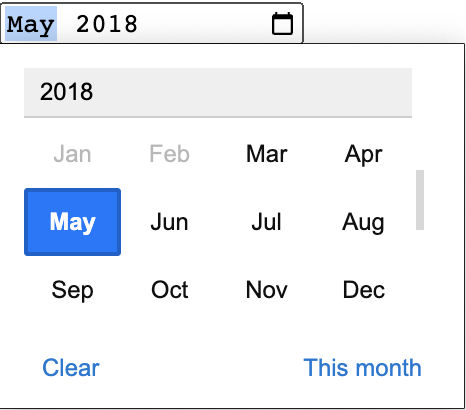
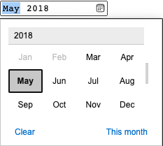
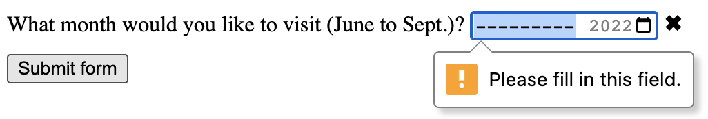
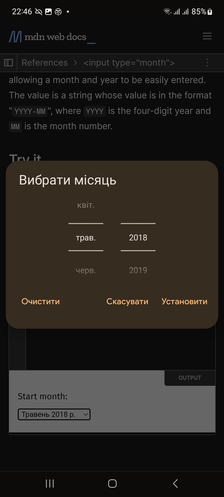

{{HTMLSidebar}}

Елементи {{HTMLElement("input")}} типу **`month`** (місяць) створює поля введення, що дають користувачеві змогу задати місяць і рік, дозволяючи легко їх ввести. Значенням є рядок, чиє значення має формат "`YYYY-MM`", де `YYYY` – це чотирицифровий рік, а `MM` – номер місяця.

{{EmbedInteractiveExample("pages/tabbed/input-month.html", "tabbed-shorter")}}

Вигляд цього контрольного елемента, загалом, відрізняється від браузера до браузера; наразі підтримка не повна: лише Chrome, Opera й Edge на настільних комп'ютерах, а також сучасні версії більшості мобільних браузерів мають робочі реалізації.
У браузерах, що не підтримують полів `month`, цей елемент доладно відступає до простого [`<input type="text">`](/uk/docs/Web/HTML/Element/input/text), а іще може бути автоматична валідація введеного тексту, аби пересвідчитись, що він має очікуваний формат.

Для тих, хто використовує браузер, що не підтримує `month`, знімок екрана нижче демонструє, який вигляд це має в Chrome та Opera.
Клацання стрілки донизу з правого боку викликає інтерфейс вибору дати, що дає змогу обрати місяць і рік.



Контрольний елемент `month` у Microsoft Edge має такий вигляд:



## Значення

Рядок, що представляє значення місяця та року, введене в поле, у формі YYYY-MM (чотири або більше цифр року, потім дефіс ("`-`"), після якого – дві цифри місяця).
Такий формат рядка місяця, вживаний цим типом поля, описаний в [Рядках місяця](/uk/docs/Web/HTML/Date_and_time_formats#riadky-misiatsia).

### Задання усталеного значення

Усталене значення контрольного елемента можна задати в атрибуті [`value`](/uk/docs/Web/HTML/Element/input#value-znachennia), отак:

```html
<label for="bday-month">В якому місяці ви народилися?</label>
<input id="bday-month" type="month" name="bday-month" value="2001-06" />
```

{{EmbedLiveSample('zadannia-ustalenoho-znachennia', 600, 60)}}

Одна річ, котру слід зауважити, полягає в тому, що показаний формат дати відрізняється від фактичного `value`; більшість {{Glossary("User agent", "користувацьких агентів")}} демонструє рік та місяць в формі, згідній з локаллю, заданою як локаль операційної системи користувача, натомість `value` завжди має формат `yyyy-MM`.

Коли значення вище подається на сервер, наприклад, то воно має вигляд `bday-month=1978-06`.

### Задання значення засобами JavaScript

Також отримувати та задавати значення дати в JavaScript можна за допомогою властивості {{domxref("HTMLInputElement.value")}}, наприклад, так:

```html
<label for="bday-month">В якому місяці ви народилися?</label>
<input id="bday-month" type="month" name="bday-month" />
```

```js
const monthControl = document.querySelector('input[type="month"]');
monthControl.value = "2001-06";
```

{{EmbedLiveSample("zadannia-znachennia-zasobamy-javascript", 600, 60)}}

## Додаткові атрибути

На додачу до атрибутів, спільних для елементів {{HTMLElement("input")}}, поля місяця приймають наступні.

### list

Значення атрибута list – це {{domxref("Element.id", "id")}} елемента {{HTMLElement("datalist")}}, розташованого в тому самому документі.
{{HTMLElement("datalist")}} надає список наперед визначених значень, що пропонуються користувачеві як значення для цього поля.
Будь-які значення в списку, несумісні з [`type`](/uk/docs/Web/HTML/Element/input#type-typ), не виводяться як запропоновані варіанти.
Надані значення пропонуються, а не вимагаються: користувач може як обрати з такого наперед визначеного списку, так і ввести інше значення.

### max

Найпізніші рік з місяцем, що приймаються, у форматі рядка, описаному в розділі [Значення](#znachennia) вище.
Якщо введене в елемент [`value`](/uk/docs/Web/HTML/Element/input#value-znachennia) перевищує це значення, то елемент не проходить [валідацію обмежень](/uk/docs/Web/HTML/Constraint_validation).
Якщо значення атрибута `max` не є дійсним рядком у форматі "`yyyy-MM`", то елемент не має максимального значення.

Це значення повинно задавати пару року та місяця, що є пізнішою або рівною парі, заданій в атрибуті `min`.

### min

Найраніші рік з місяцем, в тому самому форматі "`yyyy-MM`", описаному вище.
Якщо [`value`](/uk/docs/Web/HTML/Element/input#value-znachennia) елемента менше за це значення, то такий елемент не проходить [валідацію обмежень](/uk/docs/Web/HTML/Constraint_validation).
Якщо значення, задане для `min`, не є дійсним рядком року та місяця, то поле не має мінімального значення.

Це значення повинно бути парою року та місяця, що є ранішою або рівною парі, заданій в атрибуті `max`.

### readonly

Булів атрибут, котрий, коли присутній, означає, що таке поле не може бути змінено користувачем.
Проте його `value` все одно може бути змінено з коду JavaScript, що безпосередньо задає значення властивості {{domxref("HTMLInputElement.value")}}.

> **Примітка:** У зв'язку з тим, що поле, доступне лише для прочитання, не може мати значення, `required` ніяк не діє на поля, на котрих також задано атрибут `readonly`.

### step

Атрибут `step` – це число, що задає гранулярність, котрої повинно дотримуватись значення, або особливе значення `any`, описане нижче.
Лише значення, що відповідають основі крокування ([`min`](#min), якщо цей атрибут задано, а інакше – [`value`](/uk/docs/Web/HTML/Element/input#value-znachennia), або відповідне усталене значення, якщо ці атрибути не задані), вважаються дійсними.

Рядкове значення `any` означає, що крокування не накладається, і приймається будь-яке значення (з урахуванням інших обмежень, як то [`min`](#min) і [`max`](#max)).

> **Примітка:** Коли дані, введені користувачем, не відповідають налаштуванням крокування, то {{Glossary("User agent", "користувацький агент")}} може заокруглити до найближчого дійсного значення, віддаючи перевагу числам в додатному напрямку, коли є два рівновіддалені варіанти.

Для полів `month` значення `step` задаються в місяцях, з масштабним фактором 1 (оскільки числове значення за лаштунками – також в місяцях).
Усталене значення `step` – 1 місяць.

## Використання полів місяця

Поля, що стосуються дат (включно з `month`), на перший погляд, здаються зручними; вони обіцяють легкий користувацький інтерфейс для вибору дат, а також нормалізують формат даних, що надсилається на сервер, незалежно від локалі користувача.
Проте з `<input type="month">` є проблеми, тому що серед основних браузерів чимало його ще не підтримує.

Зрештою, погляньмо на просте та складніше застосування `<input type="month">`, а тоді ми дамо пораду щодо розв'язання проблеми з підтримкою браузерами – в розділі [Робота з підтримкою браузерами](#robota-z-pidtrymkoiu-brauzeramy)).

### Базове використання month

Найпростіше використання `<input type="month">` включає базову комбінацію елементів {{HTMLElement("input")}} і {{htmlelement("label")}}, як це видно нижче:

```html
<form>
  <label for="bday-month">В якому місяці ви народилися?</label>
  <input id="bday-month" type="month" name="bday-month" />
</form>
```

{{EmbedLiveSample('bazove-vykorystannia-month', 600, 40)}}

### Задання максимальної та мінімальної дат

Атрибути [`min`](/uk/docs/Web/HTML/Element/input#min-minimum) і [`max`](/uk/docs/Web/HTML/Element/input#max-maksymum) можна використовувати для обмеження діапазону дат, з котрого може обирати користувач.
В наступному прикладі задано мінімальний місяць `1900-01` і максимальний – `2013-12`:

```html
<form>
  <label for="bday-month">В якому місяці ви народилися?</label>
  <input
    id="bday-month"
    type="month"
    name="bday-month"
    min="1900-01"
    max="2013-12" />
</form>
```

{{EmbedLiveSample('zadannia-maksymalnoi-ta-minimalnoi-dat', 600, 40)}}

Результатом тут є наступне:

- Можуть бути вибрані місяці лише між січнем 1900 і груднем 2013; до місяців поза цим діапазоном не можна докрутити в контрольному елементі.
- Залежно від браузера, що використовується, може виявитись, що місяць поза заданим діапазоном не можна вибрати в інтерфейсі вибору місяця (наприклад, в Edge), або що вони є недійсними (дивіться розділ [Валідації](#validatsiia)), але їх все одно можна вибрати (наприклад, у Chrome).

### Контроль розміру поля

`<input type="month">` не підтримує атрибутів розміру форм, наприклад, [`size`](/uk/docs/Web/HTML/Element/input#size-rozmir).
Для задання його розміру доведеться вдатися до [CSS](/uk/docs/Web/CSS).

## Валідація

Усталено `<input type="month">` не застосовує до введених значень жодної валідації. Загалом реалізації користувацького інтерфейсу не дозволяють вводити нічого, що не є датою, що корисно, але все одно можна подати форму, в якій поле `month` буде порожнім, або ввести недійсну дату (наприклад, 32 квітня).

Щоб цього уникнути, можна використати [`min`](/uk/docs/Web/HTML/Element/input#min-minimum) і [`max`](/uk/docs/Web/HTML/Element/input#max-maksymum) – для обмеження доступних даних (дивіться [Задання максимальної та мінімальної дат](#zadannia-maksymalnoi-ta-minimalnoi-dat)), і на додачу – застосувати атрибут [`required`](/uk/docs/Web/HTML/Element/input#required-oboviazkovyi), аби зробити введення дати обов'язковим.
Як наслідок, браузери, що це підтримують, покажуть помилку, якщо спробувати подати дату, що лежить поза заданими межами, або порожнє поле.

Погляньмо на приклад; тут задано мінімальну та максимальну дати, а також поле зроблено обов'язковим:

```html
<form>
  <div>
    <label for="month">
      В якому місяці ви хотіли б приїхати (від червня до вересня)?
    </label>
    <input
      id="month"
      type="month"
      name="month"
      min="2022-06"
      max="2022-09"
      required />
    <span class="validity"></span>
  </div>
  <div>
    <input type="submit" value="Подати форму" />
  </div>
</form>
```

Якщо спробувати подати форму, не задавши як місяць, так і рік (або з датою поза заданими межами), то браузер покаже помилку.
Спробуйте погратися з цим прикладом:

{{EmbedLiveSample('validatsiia', 600, 120)}}

Ось знімок екрана для тих, хто не використовує браузер, що це підтримує:



Ось CSS, застосований до прикладу вище.
Тут ми користуємося властивостями CSS {{cssxref(":valid")}} і {{cssxref(":invalid")}}, аби оформити поле на основі того, чи є поточне його значення дійсним.
Довелося поставити піктограми в {{htmlelement("span")}} поруч з полем, а не в саме поле, тому що в Chrome згенерований вміст розташовується всередині контрольного елемента форми, і його не можна ефективно оформити чи продемонструвати.

```css
div {
  margin-bottom: 10px;
  position: relative;
}

input[type="number"] {
  width: 100px;
}

input + span {
  padding-right: 30px;
}

input:invalid + span::after {
  position: absolute;
  content: "✖";
  padding-left: 5px;
}

input:valid + span::after {
  position: absolute;
  content: "✓";
  padding-left: 5px;
}
```

> **Застереження:** Валідація форм HTML _не_ є заміною сценаріїв, котрі пересвідчуються, що введені дані мають відповідний формат.
> Занадто легко будь-кому підлаштувати HTML, дозволивши собі обійти валідацію, чи взагалі її прибрати.
> Також хтось може обійти HTML узагалі та подати дані безпосередньо на сервер.
> Якщо ваш серверний код не може валідувати дані, котрі отримує, то може статись лихо, коли подадуть некоректно відформатовані дані (або завеликі дані, дані не того типу, і так далі).

## Робота з підтримкою браузерами

Як згадувалося вище, головна проблема при використанні полів дат під час написання цієї статті – те, що серед головних браузерів чимало іще не мають реалізації їх усіх; лише Chrome, Opera та Edge підтримують їх на настільних комп'ютерах, а також більшість сучасних браузерів на мобільних. Наприклад, інтерфейс `month` на Chrome для Android має такий вигляд:



Браузери, що підтримки не мають, доладно відступають до текстового поля, але це породжує проблеми щодо сталості користувацького інтерфейсу (виведений контрольний елемент відрізняється), а також обробки даних.

Друга проблема – суттєвіша з двох.
Як згадувалося вище, в полі `month` фактичне значення завжди нормалізується до формату `yyyy-mm`.
З іншого боку, у своєму усталеному налаштуванні поле `text` не має уявлення, в якому форматі повинна бути дата, і це є проблемою через кількість різних способів, якими люди записують дати.
Наприклад:

- `mmyyyy` (072022)
- `mm/yyyy` (07/2022)
- `mm-yyyy` (07-2022)
- `yyyy-mm` (2022-07)
- `Місяць yyyy` (Липень 2022)
- і так далі…

Один зі способів це обійти – додати полю `month` атрибут [`pattern`](/uk/docs/Web/HTML/Element/input#pattern-patern).
Попри те, що поле `month` його не використовує, якщо браузер відступить до обробки його як поля `text`, то такий патерн буде застосований.
Наприклад, спробуйте переглянути наступне демо в браузері, що не підтримує поля `month`:

```html
<form>
  <div>
    <label for="month">
      В якому місяці ви хотіли б приїхати (від червня до вересня)?
    </label>
    <input
      id="month"
      type="month"
      name="month"
      min="2022-06"
      max="2022-09"
      required
      pattern="[0-9]{4}-[0-9]{2}" />
    <span class="validity"></span>
  </div>
  <div>
    <input type="submit" value="Подати форму" />
  </div>
</form>
```

{{EmbedLiveSample('robota-z-pidtrymkoiu-brauzeramy', 600, 100)}}

Якщо спробувати його подати, то буде видно, що браузер тепер показує повідомлення про помилку (та підсвічує недійсне поле), якщо введені дані не відповідають патернові `nnnn-nn`, де `n` – цифра від 0 до 9.
Звісно, це не зупинить людей від уведення недійсних дат (наприклад, `0000-42`), або некоректно відформатованих дат, що відповідають цьому патернові.

Іще є проблема з тим, що користувач не обов'язково знає, який формат серед багатьох – очікується.
Треба зробити ще дещо.

```css hidden
div {
  margin-bottom: 10px;
  position: relative;
}

input[type="number"] {
  width: 100px;
}

input + span {
  padding-right: 30px;
}

input:invalid + span::after {
  position: absolute;
  content: "✖";
  padding-left: 5px;
}

input:valid + span::after {
  position: absolute;
  content: "✓";
  padding-left: 5px;
}
```

Найкращий спосіб працювати з датами в формах у кросбраузерний спосіб (поки всі головні браузери не почнуть їх як слід підтримувати) полягає в тому, щоб дозволити користувачам вводити місяць і рік в окремих контрольних елементах (для цього популярні {{htmlelement("select")}}; дивіться реалізацію нижче), або ж використовувати бібліотеки JavaScript, наприклад, втулку [jQuery date picker](https://jqueryui.com/datepicker/).

## Приклади

У цьому прикладі створюються два набори елементів інтерфейсу, кожний з яких розроблений, аби дати користувачеві змогу вибрати місяць і рік.
Перший варіант – нативне поле `month`, а другий – пара елементів {{HTMLElement("select")}}, що дають змогу вибрати місяць і рік окремо, для сумісності з браузерами, що поки не підтримують `<input type="month">`.

{{EmbedLiveSample('pryklady', 600, 140)}}

### HTML

Форма, що запитує місяць і рік, має такий вигляд:

```html
<form>
  <div class="nativeDatePicker">
    <label for="month-visit">В якому місяці ви хотіли б нас відвідати?</label>
    <input type="month" id="month-visit" name="month-visit" />
    <span class="validity"></span>
  </div>
  <p class="fallbackLabel">В якому місяці ви хотіли б нас відвідати?</p>
  <div class="fallbackDatePicker">
    <div>
      <span>
        <label for="month">Місяць:</label>
        <select id="month" name="month">
          <option selected value="January">Січень</option>
          <option value="February">Лютий</option>
          <option value="March">Березень</option>
          <option value="April">Квітень</option>
          <option value="May">Травень</option>
          <option value="June">Червень</option>
          <option value="July">Липень</option>
          <option value="August">Серпень</option>
          <option value="September">Вересень</option>
          <option value="October">Жовтень</option>
          <option value="November">Листопад</option>
          <option value="December">Грудень</option>
        </select>
      </span>
      <span>
        <label for="year">Рік:</label>
        <select id="year" name="year"></select>
      </span>
    </div>
  </div>
</form>
```

Елемент {{HTMLElement("div")}} з ідентифікатором `nativeDatePicker` використовує поле типу `month`, щоб запитати місяць і рік, а `<div>` з ідентифікатором `fallbackDatePicker` замість цього використовує пару елементів `<select>`.
Перший з них запитує місяць, а другий – рік.

В елемент `<select>` для вибору місяця жорстко закодовані назви місяців, адже вони не змінюються (якщо опустити локалізацію).
Список доступних значень року – генерується динамічно, залежно від поточного року (шукайте детальні пояснення того, як ці функції працюють, в коментарях до коду нижче).

```css hidden
div {
  margin-bottom: 10px;
  position: relative;
}

input[type="number"] {
  width: 100px;
}

input + span {
  padding-right: 30px;
}

input:invalid + span::after {
  position: absolute;
  content: "✖";
  padding-left: 5px;
}

input:valid + span::after {
  position: absolute;
  content: "✓";
  padding-left: 5px;
}
```

### JavaScript

Код JavaScript, що обробляє вибір конкретного підходу й налаштовує список років для виводу в ненативному `<select>` з роками – нижче.

Можливо, найцікавіша частина прикладу – код зі з'ясування доступних можливостей.
Аби з'ясувати, чи підтримує браузер `<input type="month">`, створюється новий елемент {{htmlelement("input")}} зі спробою задати його `type` зі значенням `month`, а тоді негайно перевіряється, який тип фактично було задано.
Браузери, що не підтримують тип `month`, повернуть `text`, оскільки це те, до чого відступає поле місяця, коли не підтримується.
Якщо `<input type="month">` не підтримується, то нативний інтерфейс вибору приховується, і виводиться запасний.

```js
// Отримати елементи користувацького інтерфейсу
const nativePicker = document.querySelector(".nativeDatePicker");
const fallbackPicker = document.querySelector(".fallbackDatePicker");
const fallbackLabel = document.querySelector(".fallbackLabel");

const yearSelect = document.querySelector("#year");
const monthSelect = document.querySelector("#month");

// Спершу приховати запасний варіант
fallbackPicker.style.display = "none";
fallbackLabel.style.display = "none";

// Перевірити, чи відступає нове поле дати до текстового поля, чи ні
const test = document.createElement("input");

try {
  test.type = "month";
} catch (e) {
  console.log(e.description);
}

// Якщо це так, то запустити код всередині блоку if () {}
if (test.type === "text") {
  // Приховати нативний інтерфейс і показати запасний
  nativePicker.style.display = "none";
  fallbackPicker.style.display = "block";
  fallbackLabel.style.display = "block";

  // Заповнити роками динамічно
  // (місяці – завжди одні й ті ж, а тому – жорстко закодовані)
  populateYears();
}

function populateYears() {
  // Отримати поточний рік у вигляді числа
  const date = new Date();
  const year = date.getFullYear();

  // Зробити цей рік, а також 100 років перед ним, доступними в <select> року
  for (let i = 0; i <= 100; i++) {
    const option = document.createElement("option");
    option.textContent = year - i;
    yearSelect.appendChild(option);
  }
}
```

> **Примітка:** Пам'ятайте, що частина років уміщає 53 тижні (дивіться [Кількість тижнів у році](https://en.wikipedia.org/wiki/ISO_week_date#Weeks_per_year))!
> Це доведеться враховувати при розробці промислових застосунків.

## Технічний підсумок

<table class="properties">
  <tbody>
    <tr>
      <td><strong><a href="#znachennia">Значення</a></strong></td>
      <td>
        Рядок, що представляє місяць і рік, або порожній рядок.
      </td>
    </tr>
    <tr>
      <td><strong>Події</strong></td>
      <td>
        {{domxref("HTMLElement/change_event", "change")}} і
        {{domxref("Element/input_event", "input")}}
      </td>
    </tr>
    <tr>
      <td><strong>Доступні спільні атрибути</strong></td>
      <td>
        <a href="/uk/docs/Web/HTML/Element/input#autocomplete"><code>autocomplete</code></a>,
        <a href="/uk/docs/Web/HTML/Element/input#list-spysok"><code>list</code></a>,
        <a href="/uk/docs/Web/HTML/Element/input#readonly-lyshe-dlia-chytannia"><code>readonly</code></a> і
        <a href="/uk/docs/Web/HTML/Element/input#step-krok"><code>step</code></a>.
      </td>
    </tr>
    <tr>
      <td><strong>Атрибути IDL</strong></td>
      <td><code>value</code></td>
    </tr>
    <tr>
      <td><strong>Інтерфейс DOM</strong></td>
      <td><p>{{domxref("HTMLInputElement")}}</p></td>
    </tr>
    <tr>
      <td><strong>Методи</strong></td>
      <td>
        {{domxref("HTMLInputElement.select", "select()")}},
        {{domxref("HTMLInputElement.stepDown", "stepDown()")}},
        {{domxref("HTMLInputElement.stepUp", "stepUp()")}}.
      </td>
    </tr>
    <tr>
      <td><strong>Неявна роль ARIA</strong></td>
      <td><a href="https://www.w3.org/TR/html-aria/#dfn-no-corresponding-role"><code>немає відповідної ролі</code></a></td>
    </tr>
  </tbody>
</table>

## Специфікації

{{Specifications}}

## Сумісність із браузерами

{{Compat}}

## Дивіться також

- Узагальнений елемент {{HTMLElement("input")}} та інтерфейс, що використовується для роботи з ним – {{domxref("HTMLInputElement")}}
- [Формати дати та часу, що використовуються в HTML](/uk/docs/Web/HTML/Date_and_time_formats)
- [Підручник з інтерфейсу вибору дати та часу](/uk/docs/Learn/Forms/Basic_native_form_controls#interfeis-vyboru-daty-ta-chasu)
- [`<input type="datetime-local">`](/uk/docs/Web/HTML/Element/input/datetime-local), [`<input type="date">`](/uk/docs/Web/HTML/Element/input/date), [`<input type="time">`](/uk/docs/Web/HTML/Element/input/time) і [`<input type="week">`](/uk/docs/Web/HTML/Element/input/week)
- [Сумісність властивостей CSS](/uk/docs/Learn/Forms/Property_compatibility_table_for_form_controls)
