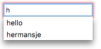

{{HTMLSidebar}}

Елементи {{HTMLElement("input")}} типу **`search`** (пошук) – це текстові поля, розроблені для введення користувачами пошукових запитів. Функціонально вони ідентичні до полів [`text`](/uk/docs/Web/HTML/Element/input/text), але можуть бути оформлені інакше з боку {{Glossary("User agent", "користувацького агента")}}.

{{EmbedInteractiveExample("pages/tabbed/input-search.html", "tabbed-standard")}}

## Значення

Атрибут [`value`](/uk/docs/Web/HTML/Element/input#value-znachennia) містить рядок, що представляє значення, вміщене в пошуковому полі. Його можна отримати в JavaScript за допомогою властивості [`HTMLInputElement.value`](/uk/docs/Web/API/HTMLInputElement#value-znachennia).

```js
searchTerms = mySearch.value;
```

Якщо на поле не накладено жодних обмежень валідації (докладніше про це в розділі [Валідації](#validatsiia)), то значення може бути будь-яким рядком тексту, або порожнім рядком (`""`).

## Додаткові атрибути

На додачу до атрибутів, що діють на всіх елементах {{HTMLElement("input")}}, незалежно від їхнього типу, пошукові поля приймають наступні атрибути.

### list

Значення атрибута list – це {{domxref("Element.id", "id")}} елемента {{HTMLElement("datalist")}}, розташованого в тому самому документі. {{HTMLElement("datalist")}} надає список наперед визначених значень, що пропонуються користувачам для поля. Всі значення в списку, несумісні з [`type`](/uk/docs/Web/HTML/Element/input#type-typ), не включаються в список запропонованих варіантів. Ці значення подаються як пропозиції, а не вимога: користувачі можуть як обирати зі списку, так і ввести щось своє.

### maxlength

Максимальна довжина рядка (в кодових одиницях UTF-16), котрий користувач може ввести в пошукове поле. Це повинно бути ціле числове значення, 0 або більше. Якщо не задано `maxlength`, або якщо задано недійсне значення, то пошукове поле не має максимальної довжини. Це значення також повинно бути більшим або рівним значенню `minlength`.

Поле не пройде [валідацію обмежень](/uk/docs/Web/HTML/Constraint_validation), якщо довжина введеного в поле тексту перевищує `maxlength` кодових одиниць UTF-16 завдовжки. Валідація обмежень відбувається лише тоді, коли значення змінюється користувачем.

### minlength

Мінімальна довжина рядка (в кодових одиницях UTF-16), котрий користувач може ввести в пошукове поле. Це повинно бути невід'ємне ціле числове значення, менше або рівне значенню, заданому `maxlength`. Якщо не задано `minlength`, або якщо задано недійсне значення, то пошукове поле не має мінімальної довжини.

Пошукове поле не пройде [валідацію обмежень](/uk/docs/Web/HTML/Constraint_validation), якщо довжина введеного в поле тексту – менша за `minlength` кодових одиниць UTF-16 завдовжки. Валідація обмежень відбувається лише тоді, коли значення змінюється користувачем.

### pattern

Атрибут `pattern`, коли заданий, є регулярним виразом, котрому повинно відповідати [`value`](/uk/docs/Web/HTML/Element/input#value-znachennia), щоб пройти [валідацію обмежень](/uk/docs/Web/HTML/Constraint_validation). Це повинен бути дійсний регулярний вираз JavaScript, подібний до тих, що використовуються типом {{jsxref("RegExp")}}, і що задокументовані в нашому [посібнику з регулярних виразів](/uk/docs/Web/JavaScript/Guide/Regular_expressions); при компіляції регулярного виразу задається позначка `'u'`, тож патерн обробляється як послідовність кодових точок Unicode, а не як {{Glossary("ASCII")}}. На кінцях тексту патерну не повинно бути скісних рисок.

Якщо заданий патерн – не заданий або недійсний, то регулярний вираз не застосовується, і цей атрибут цілком ігнорується.

> [!NOTE]
> Слід використовувати атрибут [`title`](/uk/docs/Web/HTML/Element/input#title-zaholovok), щоб задати текст, котрий більшість браузерів показує як підказку для пояснення того, яким вимогам повинен відповідати текст, аби відповідати патерну. Також слід додати інший пояснювальний текст поруч.

Дивіться деталі та приклад у розділі [Задання патерну](#zadannia-paternu).

### placeholder

Атрибут `placeholder` – це рядок, що надає користувачам стислу підказку щодо того, якого роду інформація очікується в полі. Це повинно бути слово або коротка фраза, що показує очікуваний тип даних, а не пояснювальне повідомлення. Такий текст _не повинен_ містити повернення каретки або розриву рядка.

Якщо вміст контрольного елемента має один напрям письма ({{Glossary("LTR", "зліва направо")}} або {{Glossary("RTL", "справа наліво")}}), а заповнювач треба показати в іншому напрямі, то можна використати в заповнювачі символи двонапрямленого алгоритму форматування Unicode; більше інформації у статті [Як використовувати контрольні символи Unicode у двонапрямленому тексті](https://www.w3.org/International/questions/qa-bidi-unicode-controls).

> [!NOTE]
> Уникайте використання атрибута `placeholder`, якщо це можливо. Він є менш семантично корисним, ніж інші способи пояснення форми, і може призводити до неочікуваних технічних проблем зі вмістом. Більше інформації в [підписах `<input>`](/uk/docs/Web/HTML/Element/input#pidpysy).

### readonly

Булів атрибут, котрий, якщо присутній, означає, що користувач не може редагувати поле. Проте `value` цього поля усе ж може бути змінено кодом JavaScript, шляхом безпосереднього присвоєння властивості `value` об'єкта {{domxref("HTMLInputElement")}}.

> [!NOTE]
> Оскільки таке поле не може мати значення, `required` не діє на поля, на котрих також задано атрибут `readonly`.

### size

Атрибут `size` – це числове значення, що вказує на те, якої ширини в символах повинно бути поле введення. Значення цього атрибута повинно бути числом, більшим за нуль, а усталене значення – 20. Оскільки розмір символів буває різний, така ширина може бути, а може й не бути точною, і на її розмірність не варто покладатися; результівне поле може бути вужчим або ширшим за задану кількість символів, залежно від самих цих символів та шрифту (застосованих налаштувань {{cssxref("font")}}).

Це _не_ задає обмеження того, скільки символів користувач може ввести в поле. Це лише приблизно задає те, скільки символів водночас буде видно. Аби задати верхню межу довжини введених даних, слід використовувати атрибут [`maxlength`](#maxlength).

### spellcheck

[`spellcheck`](/uk/docs/Web/HTML/Global_attributes/spellcheck) – це глобальний атрибут, що використовується для позначення того, чи потрібно вмикати для елемента перевірку правопису. Він може використовуватись на будь-якому редагованому вмісті, але тут розглядається специфіка, що стосується застосування `spellcheck` до елементів {{HTMLElement("input")}}. Дозволені значення `spellcheck`:

- `false`
  - : Вимкнути перевірку правопису для цього елемента.
- `true`
  - : Ввімкнути перевірку правопису для цього елемента.
- "" (порожній рядок) або без значення
  - : Виконувати усталену поведінку елемента щодо перевірки правопису. Ця усталена поведінка може залежати від налаштування `spellcheck` батьківського елемента та інших чинників.

Поле введення може мати ввімкнену перевірку правопису, якщо не має атрибута [readonly](#readonly) і не є вимкненим.

Значення, повернене при зчитуванні `spellcheck`, може не відповідати реальному станові перевірки правопису на контрольному елементі, якщо налаштування {{Glossary("User agent", "користувацького агента")}} відкидають власне налаштування елемента.

## Нестандартні атрибути

Пошуковим полям введення доступні наступні нестандартні атрибути. Як правило, слід уникати їх використання, якщо це можливо.

### autocorrect

Атрибут `autocorrect`, розширення Safari, це рядок, що позначає вмикання автоматичного виправлення при редагуванні поля користувачем. Дозволені значення:

- `on`
  - : Ввімкнути автоматичне виправлення хибодруків, а також обробку текстових замін, якщо вони налаштовані.
- `off`
  - : Вимкнути автоматичне виправлення та текстові заміни.

### incremental

Булів атрибут `incremental` – це розширення WebKit і Blink (тобто підтримується Safari, Opera, Chrome тощо), котрий, якщо присутній, каже {{Glossary("User agent", "користувацькому агентові")}} обробляти поле як живий пошук. Поки користувач редагує значення поля, користувацький агент надсилає об'єктові {{domxref("HTMLInputElement")}}, що представляє поле пошуку, події {{domxref("HTMLInputElement/search_event", "search")}}. Це дає змогу оновлювати результати пошуку в коді в реальному часі, по ходу редагування пошуку користувачем.

Якщо `incremental` не заданий, то подія {{domxref("HTMLInputElement/search_event", "search")}} надсилається лише тоді, коли користувач явно запускає пошук (наприклад, натиснувши клавішу <kbd>Enter</kbd> або <kbd>Return</kbd> при редагуванні поля).

Подія `search` обмежена в частоті, тож вона не надсилається частіше за визначений реалізацією інтервал.

### results

Атрибут `results`, що підтримується лише Safari, це числове значення, що дає змогу перевизначити максимальну кількість записів, що виводиться в нативному спадному меню попередніх пошукових запитів елемента {{HTMLElement("input")}}.

Це значення повинно бути невід'ємним десятковим числом. Якщо його немає, або якщо задано недійсне значення, то використовується усталене максимальне число записів.

## Застосування пошукових полів

Елементи `<input>` типу `search` – вельми подібні до полів типу `text`, окрім того, що вони створені конкретно для обробки пошукових запитів. По суті вони рівносильні у своїй поведінці, але користувацькі агенти можуть вирішити усталено оформлювати їх інакше (і, звісно, сайти можуть використовувати списки стилів, аби застосовувати до них власне оформлення).

### Базовий приклад

```html
<form>
  <div>
    <input type="search" id="mySearch" name="q" />
    <button>Шукати</button>
  </div>
</form>
```

Це візуалізується отак:

{{EmbedLiveSample("bazovyi-pryklad", 600, 40)}}

`q` – найпоширеніше значення атрибута `name`, що дається пошуковим полям, хоч це й не вимагається. При поданні пара ім'я-значення, що надсилається на сервер, має вигляд `q=шукане`.

> [!NOTE]
> Не слід забувати задавати своїм полям [`name`](/uk/docs/Web/HTML/Element/input#name-imia), бо інакше – нічого не буде надіслано.

### Різниця між пошуковим та текстовим типами поля

Головна різниця полягає в способі, в який браузери такі поля обробляють. Перше, що слід зауважити: частина браузерів показує піктограму хрестика, котру можна клацнути, щоб мати змогу миттєво прибрати пошуковий запит; в Chrome ця дія також запускається натисканням Escape. Наступний знімок екрана – з Chrome:


На додачу до цього, сучасні браузери мають тенденцію до автоматичного збереження пошукових запитів, введених раніше на доменах, котрі з'являються як варіанти автодоповнення при наступному пошуку в пошукових полях на тому самому домені. Це допомагає користувачам, котрі мають тенденцію до пошуку за подібними чи тими самими запитами. Цей знімок екрана – з Firefox:



Тепер погляньмо на кілька корисних метод, котрі можна застосувати до пошукових форм.

### Задання заповнювачів

Всередині пошукового поля можна дати змістовний заповнювач, котрий служитиме підказкою щодо того, що робити з полем, за допомогою атрибута [`placeholder`](/uk/docs/Web/HTML/Element/input#placeholder-zapovniuvach). Погляньте на наступний приклад:

```html
<form>
  <div>
    <input
      type="search"
      id="mySearch"
      name="q"
      placeholder="Шукати на сайті…" />
    <button>Шукати</button>
  </div>
</form>
```

Візуалізація заповнювача – нижче

{{EmbedLiveSample("zadannia-zapovniuvachiv", 600, 40)}}

### Підписи та доступність пошукових форм

Одна з проблем пошукових форм – їхня доступність. Загальноприйнята практика проєктування – не давати пошуковому полю підпису (хоч у нього може бути піктограма збільшувального скла чи щось подібне), адже призначення пошукового поля зазвичай доволі очевидне для зрячих користувачів, у зв'язку зі своїм розташуванням ([цей приклад показує типовий патерн](https://mdn.github.io/learning-area/accessibility/aria/website-aria-roles/)).

Проте це може призводити до спантеличення користувачів читачів з екрана, адже вони не отримують жодного словесного повідомлення про те, чим є пошукове поле. Один зі способів це обійти, не змінюючи візуальний дизайн, – використовувати можливості [WAI-ARIA](/uk/docs/Learn/Accessibility/WAI-ARIA_basics):

- Атрибут `role` зі значенням `search` на елементі `<form>` змусить читачів з екрана оголошувати те, що ця форма є пошуковою.
- Якщо цього не достатньо, то можна використати атрибут [`aria-label`](/uk/docs/Web/Accessibility/ARIA/Attributes/aria-label) на самому {{HTMLElement("input")}}. Його значення повинно бути описовим текстовим підписом, котрий зачитають читачі з екрана; цей атрибут використовується як невізуальний еквівалент `<label>`.

Погляньмо на приклад:

```html
<form role="search">
  <div>
    <input
      type="search"
      id="mySearch"
      name="q"
      placeholder="Шукати на сайті…"
      aria-label="Пошук у вмісті сайту" />
    <button>Шукати</button>
  </div>
</form>
```

Те, як це візуалізується, видно нижче:

{{EmbedLiveSample("pidpysy-ta-dostupnist-poshukovykh-form", 600, 40)}}

Немає візуальної відмінності від попереднього прикладу, але користувачі читачів з екрана отримають набагато більше інформації.

> [!NOTE]
> Дивіться більше інформації про такі можливості з доступності в [Дороговказах та віхах](/uk/docs/Learn/Accessibility/WAI-ARIA_basics#dorohovkazy-ta-vikhy).

### Фізичний розмір елемента введення

Фізичний розмір поля введення можна контролювати за допомогою атрибута [`size`](/uk/docs/Web/HTML/Element/input#size-rozmir). Так можна задавати число символів, котре водночас може показувати поле. У цьому прикладі, скажімо, пошукове поле – 30 символів завширшки:

```html
<form>
  <div>
    <input
      type="search"
      id="mySearch"
      name="q"
      placeholder="Шукати на сайті…"
      size="30" />
    <button>Шукати</button>
  </div>
</form>
```

Результат – отаке ширше поле введення:

{{EmbedLiveSample('fizychnyi-rozmir-elementa-vvedennia', 600, 40)}}

## Валідація

Елементи `<input>` типу `search` мають такі ж можливості валідації, що й звичайні поля `text`. Не дуже ймовірно, що вам знадобиться використовувати можливості валідації до пошукових полів. У багатьох випадках користувачам доводиться просто дозволити шукати що завгодно, однак є кілька випадків, вартих осмислення, як то пошук даних відомого формату.

> [!NOTE]
> Валідація форм HTML _не_ є замінником серверних сценаріїв, котрі пересвідчуються, що введені дані мають відповідний формат. Кому завгодно занадто легко внести зміни в HTML, котрі дозволять обійти валідацію чи взагалі її усунути. Також можливо, що хтось обійде HTML взагалі й подасть дані напряму на сервер. Якщо серверний код не справляється з валідацією отриманих даних, може трапитись лихо, коли подаються невідповідно форматовані дані (або дані, що є завеликими, мають помилковий тип і так далі).

### Примітка щодо оформлення

Для оформлення дійсних та недійсних елементів форми доступні корисні псевдокласи – {{cssxref(":valid")}} та {{cssxref(":invalid")}}. У цьому розділі використовується наступний CSS, котрий ставить позначку біля полів, що містять дійсні значення, і хрестик – біля полів, що містять недійсні.

```css
input:invalid ~ span::after {
  content: "✖";
  padding-left: 5px;
  position: absolute;
}

input:valid ~ span::after {
  content: "✓";
  padding-left: 5px;
  position: absolute;
}
```

Ця техніка також вимагає, щоб після елемента форми стояв елемент {{htmlelement("span")}}, котрий діє як тримач піктограм. Це знадобилося, бо частина типів полів у частині браузерів не надто коректно показує піктограми, поставлені після них.

### Обов'язковість заповнення поля

Атрибут [`required`](/uk/docs/Web/HTML/Element/input#required-oboviazkovyi) можна використати як легкий спосіб зробити введення значення в поле обов'язковим перед дозволом на подання:

```html
<form>
  <div>
    <input
      type="search"
      id="mySearch"
      name="q"
      placeholder="Шукати на сайті…"
      required />
    <button>Шукати</button>
    <span class="validity"></span>
  </div>
</form>
```

```css hidden
input {
  margin-right: 10px;
}

input:invalid ~ span::after {
  content: "✖";
  padding-left: 5px;
  position: absolute;
}

input:valid ~ span::after {
  content: "✓";
  padding-left: 5px;
  position: absolute;
}
```

Це візуалізується так:

{{EmbedLiveSample('oboviazkovist-zapovnennia-polia', 600, 40)}}

На додачу до цього, якщо спробувати подати форму, в яку не введено пошуковий запит, то браузер покаже повідомлення. Наступний приклад – з Firefox:


При спробах подати форму з різного роду недійсними даними в полях – будуть показані різні повідомлення; приклади – нижче.

### Довжина значення поля

Мінімальну довжину в символах уведеного значення можна задати за допомогою атрибута [`minlength`](/uk/docs/Web/HTML/Element/input#minlength-minimalna-dovzhyna); подібно до цього – є [`maxlength`](/uk/docs/Web/HTML/Element/input#maxlength-maksymalna-dovzhyna) для задання максимальної довжини.

Приклад нижче вимагає, щоб уведене значення було 4-8 символів завдовжки.

```html
<form>
  <div>
    <label for="mySearch">Шукати користувача</label>
    <input
      type="search"
      id="mySearch"
      name="q"
      placeholder="Ідентифікатори користувачів бувають 4-8 символів завдовжки"
      required
      size="30"
      minlength="4"
      maxlength="8" />
    <button>Шукати</button>
    <span class="validity"></span>
  </div>
</form>
```

```css hidden
input {
  margin-right: 10px;
}

input:invalid ~ span::after {
  content: "✖";
  padding-left: 5px;
  position: absolute;
}

input:valid ~ span::after {
  content: "✓";
  padding-left: 5px;
  position: absolute;
}
```

Це візуалізується так:

{{EmbedLiveSample('dovzhyna-znachennia-polia', 600, 40)}}

Якщо спробувати подати форму з менш ніж 4 символами, то буде показано відповідне повідомлення про помилку (котре відрізняється в різних браузерах). Якщо спробувати ввести понад 8 символів, то браузер не дасть цього зробити.

### Задання патерну

Для задання регулярного виразу, котрому повинно відповідати введене значення, аби вважатися дійсним, можна використати атрибут [`pattern`](/uk/docs/Web/HTML/Element/input#pattern-patern) (дивіться простий експрес-курс у [Валідуванні за регулярним виразом](/uk/docs/Learn/Forms/Form_validation#validuvannia-za-rehuliarnym-vyrazom)).

Погляньмо на приклад. Скажімо, що необхідно створити пошукову форму для ідентифікаторів продуктів, а всі ідентифікатори починаються з двох літер, після яких – чотири цифри. Наступний приклад таке покриває:

```html
<form>
  <div>
    <label for="mySearch">Шукати продукт за ідентифікатором:</label>
    <input
      type="search"
      id="mySearch"
      name="q"
      placeholder="дві літери, після яких – чотири цифри"
      required
      size="30"
      pattern="[A-z]{2}[0-9]{4}" />
    <button>Шукати</button>
    <span class="validity"></span>
  </div>
</form>
```

```css hidden
input {
  margin-right: 10px;
}

input:invalid ~ span::after {
  content: "✖";
  padding-left: 5px;
  position: absolute;
}

input:valid ~ span::after {
  content: "✓";
  padding-left: 5px;
  position: absolute;
}
```

Це візуалізується так:

{{EmbedLiveSample('zadannia-paternu', 600, 40)}}

## Приклади

Добрий приклад використання пошукової форми в контексті можна побачити в нашому прикладі [website-aria-roles](https://github.com/mdn/learning-area/tree/main/accessibility/aria/website-aria-roles) ([той же приклад в дії](https://mdn.github.io/learning-area/accessibility/aria/website-aria-roles/)).

## Технічний підсумок

<table class="properties">
  <tbody>
    <tr>
      <td><strong><a href="#znachennia">Значення</a></strong></td>
      <td>
        Рядок, що представляє значення, вміщене в пошуковому полі.
      </td>
    </tr>
    <tr>
      <td><strong>Події</strong></td>
      <td>
        {{domxref("HTMLElement/change_event", "change")}} та
        {{domxref("Element/input_event", "input")}}
      </td>
    </tr>
    <tr>
      <td><strong>Доступні загальні атрибути</strong></td>
      <td>
        <a href="/uk/docs/Web/HTML/Element/input#autocomplete"><code>autocomplete</code></a>,
        <a href="/uk/docs/Web/HTML/Element/input#list-spysok"><code>list</code></a>,
        <a href="/uk/docs/Web/HTML/Element/input#maxlength-maksymalna-dovzhyna"><code>maxlength</code></a>,
        <a href="/uk/docs/Web/HTML/Element/input#minlength-minimalna-dovzhyna"><code>minlength</code></a>,
        <a href="/uk/docs/Web/HTML/Element/input#pattern-patern"><code>pattern</code></a>,
        <a href="/uk/docs/Web/HTML/Element/input#placeholder-zapovniuvach"><code>placeholder</code></a>,
        <a href="/uk/docs/Web/HTML/Element/input#required-oboviazkovyi"><code>required</code></a>,
        <a href="/uk/docs/Web/HTML/Element/input#size-rozmir"><code>size</code></a>.
      </td>
    </tr>
    <tr>
      <td><strong>Атрибути IDL</strong></td>
      <td><code>value</code></td>
    </tr>
    <tr>
      <td><strong>Інтерфейс DOM</strong></td>
      <td><p>{{domxref("HTMLInputElement")}}</p></td>
    </tr>
    <tr>
      <td><strong>Методи</strong></td>
      <td>
        {{domxref("HTMLInputElement.select", "select()")}},
        {{domxref("HTMLInputElement.setRangeText", "setRangeText()")}},
        {{domxref("HTMLInputElement.setSelectionRange", "setSelectionRange()")}}.
      </td>
    </tr>
     <tr>
      <td><strong>Неявна роль ARIA</strong></td>
      <td>без атрибута <code>list</code>: <code><a href="/uk/docs/Web/Accessibility/ARIA/Roles/searchbox_role">searchbox</a></code></td>
      <td>з атрибутом <code>list</code>: <code><a href="/uk/docs/Web/Accessibility/ARIA/Roles/combobox_role">combobox</a></code></td>
    </tr>
  </tbody>
</table>

## Специфікації

{{Specifications}}

## Сумісність із браузерами

{{Compat}}

## Дивіться також

- [Форми HTML](/uk/docs/Learn/Forms)
- {{HTMLElement("input")}} та інтерфейс {{domxref("HTMLInputElement")}}, на якому він заснований
- [`<input type="text">`](/uk/docs/Web/HTML/Element/input/text)
- [Сумісність властивостей CSS](/uk/docs/Learn/Forms/Property_compatibility_table_for_form_controls)
