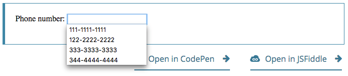

{{HTMLSidebar}}

Елементи {{HTMLElement("input")}} типу **`tel`** (телефон) використовуються, щоб дати користувачам змогу вводити телефонні номери. На відміну від [`<input type="email">`](/uk/docs/Web/HTML/Element/input/email) і [`<input type="url">`](/uk/docs/Web/HTML/Element/input/url), значення такого поля перед поданням форми не валідується автоматично згідно з певним форматом, тому що формати телефонних номерів у світі – дуже різні.

{{EmbedInteractiveExample("pages/tabbed/input-tel.html", "tabbed-standard")}}

Попри факт того, що поля `tel` – фактично ідентичні щодо стандартних полів `text`, від них є користь, найперше – те, що мобільні браузери, особливо на мобільних телефонах, можуть вивести спеціальну клавіатуру, оптимізовану для введення номерів телефонів. Також застосування для телефонних номерів спеціального типу поля робить додавання власної валідації та обробку таких номерів зручнішими.

> **Примітка:** Браузери, що не підтримують тип `tel`, відступають до стандартного поля {{HTMLElement("input/text", "text")}}.

## Значення

Атрибут [`value`](/uk/docs/Web/HTML/Element/input#value) елемента {{HTMLElement("input")}} містить рядок, що або представляє номер телефону, або є порожнім (`""`).

## Додаткові атрибути

На додачу до атрибутів, що працюють на всіх елементах {{HTMLElement("input")}}, незалежно від їхніх типів, поля телефонних номерів підтримують наступні атрибути.

### list

Значення атрибута list – це {{domxref("Element.id", "id")}} елемента {{HTMLElement("datalist")}}, розташованого в тому самому документі. {{HTMLElement("datalist")}} надає список наперед визначених значень, що пропонуються користувачам для поля. Всі значення в списку, несумісні з [`type`](/uk/docs/Web/HTML/Element/input#type), не включаються в список запропонованих варіантів. Ці значення подаються як пропозиції, а не вимога: користувачі можуть як обирати зі списку, так і ввести інше значення.

### maxlength

Максимальна довжина рядка (в кодових одиницях UTF-16), котрий користувач може ввести в поле номера телефону. Це повинно бути ціле числове значення, 0 або більше. Якщо не задано `maxlength`, або якщо задано недійсне значення, то таке поле не має максимальної довжини. Це значення також повинно бути більшим або рівним значенню `minlength`.

Поле не пройде [валідацію обмежень](/uk/docs/Web/HTML/Constraint_validation), якщо довжина введеного в поле тексту перевищує `maxlength` кодових одиниць UTF-16 завдовжки.

### minlength

Мінімальна довжина рядка (в кодових одиницях UTF-16), котрий користувач може ввести в поле номера телефону. Це повинно бути невід'ємне ціле числове значення, менше або рівне значенню, заданому `maxlength`. Якщо не задано `minlength`, або якщо задано недійсне значення, то таке поле не має мінімальної довжини.

Поле номера телефону не пройде [валідацію обмежень](/uk/docs/Web/HTML/Constraint_validation), якщо довжина введеного в поле тексту – менша за `minlength` кодових одиниць UTF-16 завдовжки.

### pattern

Атрибут `pattern`, коли заданий, є регулярним виразом, котрому повинно відповідати [`value`](/uk/docs/Web/HTML/Element/input#value), щоб пройти [валідацію обмежень](/uk/docs/Web/HTML/Constraint_validation). Це повинен бути дійсний регулярний вираз JavaScript, подібний до тих, що використовуються типом {{jsxref("RegExp")}}, і що задокументовані в нашому [посібнику з регулярних виразів](/uk/docs/Web/JavaScript/Guide/Regular_expressions); при компіляції регулярного виразу задається позначка `'u'`, тож патерн обробляється як послідовність кодових точок Unicode, а не як ASCII. На кінцях тексту патерну не повинно бути скісних рисок.

Якщо заданий патерн – не заданий або недійсний, то регулярний вираз не застосовується, і цей атрибут цілком ігнорується.

> **Примітка:** Слід використовувати атрибут [`title`](/uk/docs/Web/HTML/Element/input#title), щоб задати текст, котрий більшість браузерів показує як підказку для пояснення того, яким вимогам повинен відповідати текст, аби відповідати патерну. Також слід додати інший пояснювальний текст поруч.

Дивіться деталі та приклад у розділі [Валідація за патерном](#validatsiia-za-paternom).

### placeholder

Атрибут `placeholder` – це рядок, що надає користувачам стислу підказку щодо того, якого роду інформація очікується в полі. Це повинно бути слово або коротка фраза, що показує очікуваний тип даних, а не пояснювальне повідомлення. Такий текст _не повинен_ містити повернення каретки або розриву рядка.

Якщо вміст контрольного елемента має один напрям письма ({{Glossary("LTR", "зліва направо")}} або {{Glossary("RTL", "справа наліво")}}), а заповнювач треба показати в іншому напрямі, то можна використати в заповнювачі символи двонапрямленого алгоритму форматування Unicode; більше інформації у статті [Як використовувати контрольні символи Unicode у двонапрямленому тексті](https://www.w3.org/International/questions/qa-bidi-unicode-controls).

> **Примітка:** Уникайте використання атрибута `placeholder`, якщо це можливо. Він є менш семантично корисним, ніж інші способи пояснення форми, і може призводити до неочікуваних технічних проблем зі вмістом. Більше інформації в [підписах `<input>`](/uk/docs/Web/HTML/Element/input#labels).

### readonly

Булів атрибут, котрий, якщо присутній, означає, що користувач не може редагувати поле. Проте `value` цього поля усе ж може бути змінено кодом JavaScript, шляхом безпосереднього присвоєння властивості `value` об'єкта {{domxref("HTMLInputElement")}}.

> **Примітка:** Оскільки таке поле не може мати значення, `required` не діє на поля, на котрих також задано атрибут `readonly`.

### size

Атрибут `size` – це числове значення, що вказує на те, якої ширини в символах повинно бути поле введення. Значення цього атрибута повинно бути числом, більшим за нуль, а усталене значення – 20. Оскільки розмір символів буває різний, така ширина може бути, а може й не бути точною, і на її розмірність не варто покладатися; результівне поле може бути вужчим або ширшим за задану кількість символів, залежно від самих цих символів та шрифту (застосованих налаштувань {{cssxref("font")}}).

Це _не_ задає обмеження того, скільки символів користувач може ввести в поле. Це лише приблизно задає те, скільки символів водночас буде видно. Аби задати верхню межу довжини введених даних, слід використовувати атрибут [`maxlength`](#maxlength).

## Нестандартні атрибути

Полям введення номерів телефонів доступні наступні нестандартні атрибути. Як правило, слід уникати їх використання, якщо це можливо.

### autocorrect

Атрибут `autocorrect`, розширення Safari, це рядок, що позначає вмикання автоматичного виправлення при редагуванні поля користувачем. Дозволені значення:

- `on`
  - : Ввімкнути автоматичне виправлення хибодруків, а також обробку текстових замін, якщо вони налаштовані.
- `off`
  - : Вимкнути автоматичне виправлення та текстові заміни.

### mozactionhint

Розширення Mozilla, котре надає підказку, наприклад, про те, якого роду дія буде виконана, якщо користувач натисне під час редагування поля клавішу <kbd>Enter</kbd> або <kbd>Return</kbd>.

Цей атрибут став нерекомендованим – натомість слід використовувати глобальний атрибут [`enterkeyhint`](/uk/docs/Web/HTML/Global_attributes#enterkeyhint).

## Застосування телефонних полів

Номери телефонів – тип даних, що в Інтернеті збирається дуже часто. При створенні будь-якого роду реєстрації або інтернет-магазину, наприклад, з високою імовірністю ви запитаєте в користувача його номер телефон, або для комерційних потреб, або задля зв'язку в надзвичайній ситуації. Враховуючи те, наскільки часто доводиться вводити номери телефонів, шкода, що створення універсального рішення для валідації таких номерів на практиці дуже складне або неможливе.

На щастя, можна оцінити вимоги на власному сайті та реалізувати відповідний рівень валідації самотужки. Дивіться подробиці в [Валідації](#validatsiia) нижче.

### Спеціальні клавіатури

Одна з головних переваг `<input type="tel">` полягає в тому, що цей тип змушує мобільні браузери показувати спеціальну клавіатуру для введення номерів телефонів. Наприклад, ось на що схожі такі клавіатури на кількох пристроях.

| Firefox для Android                                      | WebKit iOS (Safari/Chrome/Firefox)                              |
| -------------------------------------------------------- | --------------------------------------------------------------- |
|  |  |

### Просте телефонне поле

У своїй найпростішій формі телефонне поле може бути реалізовано так:

```html
<label for="telNo">Номер телефону:</label>
<input id="telNo" name="telNo" type="tel" />
```

{{EmbedLiveSample('proste-telefonne-pole', 600, 40)}}

Тут не відбувається нічого магічного. При поданні на сервер дані поля вище могли б бути представлені, наприклад, як `telNo=+12125553151`.

### Заповнювачі

Іноді корисно подати контекстну підказку щодо того, яку форму повинні приймати дані в полі. Це може бути особливо важливим, якщо дизайн сторінки не містить описових підписів для кожного {{HTMLElement("input")}}. Саме в такому випадку в дію вступають **заповнювачі**. Заповнювач – це значення, що демонструє форму, котру повинно приймати `value`, у вигляді прикладу дійсного значення; таке значення демонструється всередині поля, коли `value` елемента – `""`. Щойно в поле введено дані, заповнювач зникає; якщо поле знову стає порожнім, то заповнювач з'являється знову.

Нижче – поле `tel` із заповнювачем `123-4567-8901`. Зверніть увагу на те, як заповнювач зникає та з'являється знов при змінах вмісту поля.

```html
<input id="telNo" name="telNo" type="tel" placeholder="123-4567-8901" />
```

{{EmbedLiveSample('zapovniuvachi', 600, 40)}}

### Контроль розміру поля

Можна контролювати не лише фізичну довжину поля, а й мінімальну та максимальну дозволену довжину введеного тексту.

#### Фізичний розмір елемента поля

Фізичний розмір поля введення можна контролювати за допомогою атрибута [`size`](/uk/docs/Web/HTML/Element/input#size) – задаючи число символів, котре поле може показувати водночас. У цьому прикладі поле редагування `tel` – 20 символів завширшки:

```html
<input id="telNo" name="telNo" type="tel" size="20" />
```

{{EmbedLiveSample('fizychnyi-rozmir-elementa-polia', 600, 40)}}

#### Довжина значення елемента

Атрибут `size` працює окремо від обмежень довжини введеного номера телефону. Мінімальну довжину такого номера в символах можна задати за допомогою атрибута [`minlength`](/uk/docs/Web/HTML/Element/input#minlength); аналогічно, для задання максимальної довжини – [`maxlength`](/uk/docs/Web/HTML/Element/input#maxlength).

Приклад нижче створює поле введення номера телефону 20 символів завширшки, що вимагає, аби вміст не був коротшим за 9 символів або довшим за 14 символів.

```html
<input
  id="telNo"
  name="telNo"
  type="tel"
  size="20"
  minlength="9"
  maxlength="14" />
```

{{EmbedLiveSample("dovzhyna-znachennia-elementa", 600, 40)}}

> **Примітка:** Атрибути вище впливають на [валідацію](#validatsiia): введення у прикладі вище вважатиметься недійсним, якщо довжина значення – менша за 9 символів або більша за 14. Більшість браузерів навіть не дозволить ввести значення, довше за максимум.

### Задання усталених варіантів

#### Задання одного усталеного за допомогою атрибута value

Як завжди, можна задати усталене значення для поля `tel` – шляхом задання його атрибута [`value`](/uk/docs/Web/HTML/Element/input#value):

```html
<input id="telNo" name="telNo" type="tel" value="333-4444-4444" />
```

{{EmbedLiveSample("zadannia-odnoho-ustalenoho-za-dopomohoiu-atrybuta-value", 600, 40)}}

#### Пропонування значень

Іще краще: можна запропонувати список з усталених значень номерів телефонів, серед яких користувач може обрати. Щоб таке реалізувати, слід застосувати атрибут [`list`](/uk/docs/Web/HTML/Element/input#list). Це не обмежує користувача такими варіантами, а й так само дозволяє їм обрати найчастіше вживані номери телефонів швидше. Також це надає підказку для [`autocomplete`](/uk/docs/Web/HTML/Element/input#autocomplete). Атрибут `list` задає ідентифікатор елемента {{HTMLElement("datalist")}}, котрий своєю чергою містить по одному елементу {{HTMLElement("option")}} на пропоноване значення; `value` кожного `option` є відповідним пропонованим значенням для поля номера телефону.

```html
<label for="telNo">Номер телефону: </label>
<input id="telNo" name="telNo" type="tel" list="defaultTels" />

<datalist id="defaultTels">
  <option value="111-1111-1111"></option>
  <option value="122-2222-2222"></option>
  <option value="333-3333-3333"></option>
  <option value="344-4444-4444"></option>
</datalist>
```

{{EmbedLiveSample("proponuvannia-znachen", 600, 40)}}

За присутності елемента {{HTMLElement("datalist")}} та його нащадків {{HTMLElement("option")}}, браузер використовує задані значення як потенційні значення номера телефону; зазвичай вони виводяться як спливний блок або спадне меню, що містить пропозиції. Хоч конкретний користувацький досвід на різних браузерах може бути різним, зазвичай клацання поля редагування призводить до виведення спадного меню пропонованих телефонних номерів. Потім, по ходу друкування користувача, список підлаштовується, аби демонструвати лише відповідні відфільтровані значення. Кожний надрукований символ зменшує список, поки користувач не зробить вибір або не введе власне значення.

Ось знімок екрана того, який вигляд це може мати.



## Валідація

Як уже згадувалося вище, доволі складно запропонувати універсальну клієнтську валідацію телефонних номерів. Що ж можна з цим зробити? Погляньмо на варіанти.

> **Застереження:** Валідація форм HTML _не_ є заміною серверних сценаріїв, що пересвідчуються в тому, що введені дані мають коректний формат.Занадто легко підлаштувати HTML, щоб обійти валідацію, або навіть геть її прибрати. Також можна обійти HTML взагалі, й подавати дані безпосередньо на сервер. Якщо ваш код на серверному боці не може валідувати дані, котрі отримує, то може статись лихо, коли в вашу базу даних введуть некоректно відформатовані дані (або завеликі дані, дані не того типу, і так далі).

### Обов'язковість телефонних номерів

Зробити, щоб порожнє поле вважалось недійсним і не подавалось на сервер, можна за допомогою атрибута [`required`](/uk/docs/Web/HTML/Element/input#required). Наприклад, використаймо такий HTML:

```html
<form>
  <div>
    <label for="telNo">Уведіть номер телефону (обов'язково): </label>
    <input id="telNo" name="telNo" type="tel" required />
    <span class="validity"></span>
  </div>
  <div>
    <button>Надіслати</button>
  </div>
</form>
```

І додаймо наступний CSS, щоб виділити дійсне введення галкою, а недійсне – хрестом:

```css
div {
  margin-bottom: 10px;
  position: relative;
}

input[type="number"] {
  width: 100px;
}

input + span {
  padding-right: 30px;
}

input:invalid + span::after {
  position: absolute;
  content: "✖";
  padding-left: 5px;
  color: #8b0000;
}

input:valid + span::after {
  position: absolute;
  content: "✓";
  padding-left: 5px;
  color: #009000;
}
```

Вивід має такий вигляд:

{{EmbedLiveSample("oboviazkovist-telefonnykh-nomeriv", 700, 70)}}

### Валідація за патерном

За потреби іще сильніше обмежити введені номери, щоб вони відповідали конкретному патерну, можна використати атрибут [`pattern`](/uk/docs/Web/HTML/Element/input#pattern), котрий приймає за значення {{Glossary("regular expression", "регулярний вираз")}}, котрому повинні відповідати введені значення.

У цьому прикладі використовується такий же CSS, як вище, а HTML змінений наступним чином:

```html
<form>
  <div>
    <label for="telNo"> Уведіть номер телефону (в формі xxx-xxx-xxxx): </label>
    <input
      id="telNo"
      name="telNo"
      type="tel"
      required
      pattern="[0-9]{3}-[0-9]{3}-[0-9]{4}" />
    <span class="validity"></span>
  </div>
  <div>
    <button>Надіслати</button>
  </div>
</form>
```

```css hidden
div {
  margin-bottom: 10px;
  position: relative;
}

input[type="number"] {
  width: 100px;
}

input + span {
  padding-right: 30px;
}

input:invalid + span::after {
  position: absolute;
  content: "✖";
  padding-left: 5px;
  color: #8b0000;
}

input:valid + span::after {
  position: absolute;
  content: "✓";
  padding-left: 5px;
  color: #009000;
}
```

{{EmbedLiveSample("validatsiia-za-paternom", 700, 70)}}

Зверніть увагу на те, що введене значення виводиться як недійсне, якщо немає збігу з патерном xxx-xxx-xxxx; наприклад, 41-323-421 не приймається. Так само не приймається 800-MDN-ROCKS. Проте 865-555-6502 – приймається. Цей конкретний патерн, очевидно, корисний лише для певних локалей: в реальному застосунку, мабуть, доведеться давати різний патерн, залежно від локалі користувача.

## Приклади

У цьому прикладі виводиться простий інтерфейс з елементом {{htmlelement("select")}}, що дає користувачам змогу вибрати те, в якій вони країні перебувають, і набір з елементів `<input type="tel">`, що дають змогу вводити окремі частини номерів телефонів; немає жодних перешкод щодо того, щоб мати декілька полів `tel`.

Кожне поле має атрибути [`placeholder`](/uk/docs/Web/HTML/Element/input#placeholder), для виведення для зрячих користувачів підказку щодо того, що в таке поле вводити, [`pattern`](/uk/docs/Web/HTML/Element/input#pattern) – щоб змушувати вводити як відповідну частину конкретну кількість символів, і атрибут [`aria-label`](/uk/docs/Web/Accessibility/ARIA/Attributes/aria-label) – щоб вміщати підказку про те, що вводити, котра буде озвучена користувачам читачів з екрана.

```html
<form>
  <div>
    <label for="country">Оберіть свою країну:</label>
    <select id="country" name="country">
      <option value="UK">Великобританія</option>
      <option selected value="US">США</option>
      <option value="Germany">Німеччина</option>
    </select>
  </div>
  <div>
    <p>Уведіть свій номер телефону:</p>
    <span class="areaDiv">
      <input
        id="areaNo"
        name="areaNo"
        type="tel"
        required
        placeholder="Код зони"
        pattern="[0-9]{3}"
        aria-label="Код зони" />
      <span class="validity"></span>
    </span>
    <span class="number1Div">
      <input
        id="number1"
        name="number1"
        type="tel"
        required
        placeholder="Перша частина"
        pattern="[0-9]{3}"
        aria-label="Перша частина номеру" />
      <span class="validity"></span>
    </span>
    <span class="number2Div">
      <input
        id="number2"
        name="number2"
        type="tel"
        required
        placeholder="Друга частина"
        pattern="[0-9]{4}"
        aria-label="Друга частина номеру" />
      <span class="validity"></span>
    </span>
  </div>
  <div>
    <button>Надіслати</button>
  </div>
</form>
```

JavaScript – відносно простий: він містить обробник подій {{domxref("HTMLElement.change_event", "onchange")}}, котрий, коли змінюється значення `<select>`, оновлює `pattern`, `placeholder` і `aria-label` елемента `<input>`, щоб відповідати форматові телефонних номерів для відповідної країни чи території.

```js
const selectElem = document.querySelector("select");
const inputElems = document.querySelectorAll("input");

selectElem.onchange = () => {
  for (let i = 0; i < inputElems.length; i++) {
    inputElems[i].value = "";
  }

  if (selectElem.value === "US") {
    inputElems[2].parentNode.style.display = "inline";

    inputElems[0].placeholder = "Код зони";
    inputElems[0].pattern = "[0-9]{3}";

    inputElems[1].placeholder = "Перша частина";
    inputElems[1].pattern = "[0-9]{3}";
    inputElems[1].setAttribute("aria-label", "Перша частина номеру");

    inputElems[2].placeholder = "Друга частина";
    inputElems[2].pattern = "[0-9]{4}";
    inputElems[2].setAttribute("aria-label", "Друга частина номеру");
  } else if (selectElem.value === "UK") {
    inputElems[2].parentNode.style.display = "none";

    inputElems[0].placeholder = "Код зони";
    inputElems[0].pattern = "[0-9]{3,6}";

    inputElems[1].placeholder = "Місцевий номер";
    inputElems[1].pattern = "[0-9]{4,8}";
    inputElems[1].setAttribute("aria-label", "Місцевий номер");
  } else if (selectElem.value === "Germany") {
    inputElems[2].parentNode.style.display = "inline";

    inputElems[0].placeholder = "Код зони";
    inputElems[0].pattern = "[0-9]{3,5}";

    inputElems[1].placeholder = "Перша частина";
    inputElems[1].pattern = "[0-9]{2,4}";
    inputElems[1].setAttribute("aria-label", "Перша частина номеру");

    inputElems[2].placeholder = "Друга частина";
    inputElems[2].pattern = "[0-9]{4}";
    inputElems[2].setAttribute("aria-label", "Друга частина номеру");
  }
};
```

Цей приклад має такий вигляд:

{{EmbedLiveSample('pryklady', 600, 140)}}

Це цікава ідея, котра демонструє потенційне розв'язання проблеми роботи з телефонними номерами у різних країнах. Довелось би розширити приклад, звісно, щоб задавати коректний патерн для кожної потенційної країни, а це чимало роботи, і все одно не було б стовідсоткової гарантії, що користувачі введуть свої номери коректно.

Це змушує замислитися: чи варто лізти в цю біду на клієнтському боці, коли можна просто дозволити користувачам ввести свій номер у будь-якому бажаному форматі на боці клієнта, а потім валідувати й почистити його на боці сервера. Але вибір – за вами.

```css hidden
div {
  margin-bottom: 10px;
  position: relative;
}

input[type="number"] {
  width: 100px;
}

input + span {
  padding-right: 30px;
}

input:invalid + span::after {
  position: absolute;
  content: "✖";
  padding-left: 5px;
  color: #8b0000;
}

input:valid + span::after {
  position: absolute;
  content: "✓";
  padding-left: 5px;
  color: #009000;
}
```

## Технічний підсумок

<table class="properties">
  <tbody>
    <tr>
      <td><strong><a href="#zhachennia">Значення</a></strong></td>
      <td>
        Рядок, що представляє телефонний номер, або є порожнім
      </td>
    </tr>
    <tr>
      <td><strong>Події</strong></td>
      <td>
        {{domxref("HTMLElement/change_event", "change")}} та
        {{domxref("HTMLElement/input_event", "input")}}
      </td>
    </tr>
    <tr>
      <td><strong>Доступні спільні атрибути</strong></td>
      <td>
        <a href="/uk/docs/Web/HTML/Element/input#autocomplete"><code>autocomplete</code></a>,
        <a href="/uk/docs/Web/HTML/Element/input#list"><code>list</code></a>,
        <a href="/uk/docs/Web/HTML/Element/input#maxlength"><code>maxlength</code></a>,
        <a href="/uk/docs/Web/HTML/Element/input#minlength"><code>minlength</code></a>,
        <a href="/uk/docs/Web/HTML/Element/input#pattern"><code>pattern</code></a>,
        <a href="/uk/docs/Web/HTML/Element/input#placeholder"><code>placeholder</code></a>,
        <a href="/uk/docs/Web/HTML/Element/input#readonly"><code>readonly</code></a> і
        <a href="/uk/docs/Web/HTML/Element/input#size"><code>size</code></a>
      </td>
    </tr>
    <tr>
      <td><strong>Атрибути IDL</strong></td>
      <td>
        <code>list</code>, <code>selectionStart</code>,
        <code>selectionEnd</code>, <code>selectionDirection</code> і
        <code>value</code>
      </td>
    </tr>
    <tr>
      <td><strong>Інтерфейс DOM</strong></td>
      <td><p>{{domxref("HTMLInputElement")}}</p></td>
    </tr>
    <tr>
      <td><strong>Методи</strong></td>
      <td>
        {{domxref("HTMLInputElement.select", "select()")}},
        {{domxref("HTMLInputElement.setRangeText", "setRangeText()")}},
        {{domxref("HTMLInputElement.setSelectionRange", "setSelectionRange()")}}
      </td>
    </tr>
    <tr>
      <td><strong>Неявна роль ARIA</strong></td>
      <td>без атрибута <code>list</code>:
                <code><a href="/uk/docs/Web/Accessibility/ARIA/Roles/textbox_role">textbox</a></code></td>
      <td>з атрибутом <code>list</code>: <code><a href="/uk/docs/Web/Accessibility/ARIA/Roles/combobox_role">combobox</a></code></td>
    </tr>
  </tbody>
</table>

## Специфікації

{{Specifications}}

## Сумісність із браузерами

{{Compat}}

## Дивіться також

- [Посібник з форм HTML](/uk/docs/Learn/Forms)
- {{HTMLElement("input")}}

  - [`<input type="text">`](/uk/docs/Web/HTML/Element/input/text)
  - [`<input type="email">`](/uk/docs/Web/HTML/Element/input/email)

- [Сумісність властивостей CSS](/uk/docs/Learn/Forms/Property_compatibility_table_for_form_controls)
