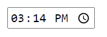
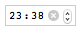
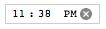
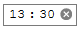
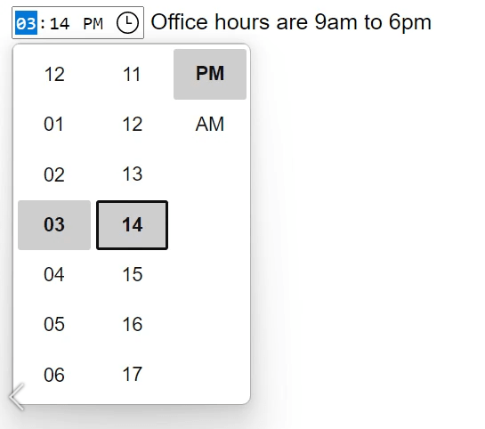
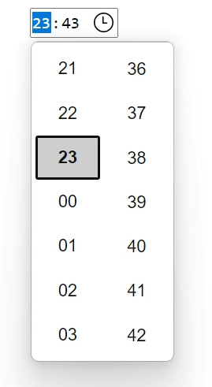

{{HTMLSidebar}}

Елементи {{HTMLElement("input")}} типу **`time`** (час) утворюють поля введення, призначені для того, щоб дозволити користувачам легко вводити час (години та хвилини, а також, за бажанням, секунди).

Користувацький інтерфейс цього елемента керування відрізняється в різних браузерах; дивіться докладніше про це в розділі [Сумісність із браузерами](#sumisnist-iz-brauzeramy). У браузерах, що його не підтримують, цей елемент доладно відступає до [`<input type="text">`](/uk/docs/Web/HTML/Element/input/text).

{{EmbedInteractiveExample("pages/tabbed/input-time.html", "tabbed-standard")}}

## Зовнішній вигляд

### Chrome та Opera

У Chrome та Opera елемент керування **`time`** – простий, з полями для введення годин і хвилин у 12- або 24-годинному форматі, залежно від локалі операційної системи, а також зі стрілками вгору та вниз для збільшення або зменшення вибраної компоненти. У деяких версіях надається кнопка «X» для очищення значення елемента керування.

 12-годинне

 24-годинне

### Firefox

Елемент керування `time` у Firefox – дуже схожий на елемент Chrome, окрім того, що не має стрілок вгору та вниз. Він так само використовує 12- або 24-годинний формат для введення часу, залежно від локалі операційної системи. Кнопка «X» надається для очищення значення елемента керування.

 12-годинне

 24-годинне

### Edge

Елемент керування `time` в Edge – дещо складніший, він відкриває інтерфейс вибору години та хвилини з прокрутними барабанами. Він, так само як Chrome, використовує 12- або 24-годинний формат для введення часу, залежно від локалі операційної системи:

 12-годинне

 24-годинне

## Значення

Рядок, що містить значення часу, введеного в поле введення.

### Задання атрибута value

Усталене значення поля можна задати при створенні елемента `<input>` шляхом включення в атрибут [`value`](/uk/docs/Web/HTML/Element/input#value-znachennia) дійсного часу, наприклад:

```html
<label for="appt-time">Виберіть час запису: </label>
<input id="appt-time" type="time" name="appt-time" value="13:30" />
```

{{EmbedLiveSample('zadannia-atrybuta-value', 600, 60)}}

### Задання значення за допомогою JavaScript

Також отримати та задати значення часу можна за допомогою властивості `value` {{domxref("HTMLInputElement")}} у JavaScript, наприклад:

```js
const timeControl = document.querySelector('input[type="time"]');
timeControl.value = "15:30";
```

### Формат значення часу

Значення поля `time` завжди має 24-годинний формат, що включає нулі на початку: `hh:mm`, незалежно від формату введення, який, ймовірно, вибирається на основі локалі користувача (або з боку користувацького агента). Якщо час включає секунди (дивіться [Використання атрибута step](#vykorystannia-atrybuta-step)), то формат завжди має вигляд `hh:mm:ss`. Дізнатися більше про формат значення часу, який використовується цим типом поля вводу, можна у розділі [Рядків часу](/uk/docs/Web/HTML/Date_and_time_formats#riadky-chasu).

У цьому прикладі можна побачити значення поля часу, увівши час та побачивши, як це значення змінюється.

По-перше, погляньмо на HTML. Він досить простий, з підписом та полем введення, що вже бачено раніше, але з додаванням елемента {{HTMLElement("p")}} зі {{HTMLElement("span")}}, щоб відображати значення поля `time`:

```html
<form>
  <label for="startTime">Час початку: </label>
  <input type="time" id="startTime" />
  <p>
    Значення поля <code>time</code>: <code> "<span id="value">–</span>"</code>.
  </p>
</form>
```

Код JavaScript додає до поля часу логіку, що відстежує подію {{domxref("Element/input_event", "input")}}, яка спрацьовує кожного разу, коли змінюється вміст елемента введення. Коли це стається, вміст `<span>` замінюється новим значенням елемента введення.

```js
const startTime = document.getElementById("startTime");
const valueSpan = document.getElementById("value");

startTime.addEventListener(
  "input",
  () => {
    valueSpan.innerText = startTime.value;
  },
  false,
);
```

{{EmbedLiveSample("format-znachennia-chasu", 600, 80)}}

Коли подається форма, що містить поле `time`, то його значення перед додаванням до даних форми – кодується. Запис у дані форми для поля часу завжди має форму `name=hh%3Amm`, або`name=hh%3Amm%3Ass`, якщо включено секунди (дивіться [Використання атрибута step](#vykorystannia-atrybuta-step)).

## Додаткові атрибути

На додачу до атрибутів, спільних для всіх елементів {{HTMLElement("input")}}, поля `time` приймають наступні.

> **Примітка:** На відміну від багатьох типів даних, значення часу мають **періодичний інтервал**, а отже – значення досягають найвищого можливого значення, а потім знову повертаються до початку. Наприклад, якщо задати `min` зі значенням `14:00` та `max` зі значенням `2:00`, то це означає, що допустимі значення часу починаються о 14:00, проходять через північ до наступного дня, закінчуючись о 2:00. Дивіться більше в розділі [min і max по два боки від півночі](#min-i-max-po-dva-boky-vid-pivnochi) цієї статті.

### list

Значення атрибута list – це {{domxref("Element.id", "id")}} елемента {{HTMLElement("datalist")}}, розташованого в тому самому документі. {{HTMLElement("datalist")}} надає список наперед визначених значень, що пропонуються користувачем для поля. Всі значення, що несумісні з [`type`](/uk/docs/Web/HTML/Element/input#type-typ), не включаються в список запропонованих варіантів. Ці варіанти є пропозиціями, а не обов'язковими: користувачі можуть як обирати серед них, так і ввести інше значення.

### max

Рядок, що вказує на найпізніший час, що буде прийнятий, заданий у тому самому [форматі значення часу](#format-znachennia-chasu), описаному вище. Якщо заданий рядок не є дійсним часом, то максимальне значення не задається.

### min

Рядок, що задає найраніший час, що буде прийнятий, заданий у тому самому [форматі значення часу](#format-znachennia-chasu), описаному вище. Якщо заданий рядок не є дійсним часом, то мінімальне значення не задається.

### readonly

Булів атрибут, котрий, якщо присутній, означає, що користувач не може редагувати поле. Проте `value` цього поля усе ж може бути змінено кодом JavaScript, шляхом безпосереднього присвоєння властивості `value` об'єкта {{domxref("HTMLInputElement")}}.

> **Примітка:** Оскільки таке поле не може мати значення, `required` не діє на поля, на котрих також задано атрибут `readonly`.

### step

Атрибут `step` – це число, що задає дискретність, якій повинно відповідати значення, або спеціальне значення `any`, описане нижче. Лише значення, що дорівнюють основі для кроку ([`min`](#min), якщо цей атрибут задано, інакше – [`value`](/uk/docs/Web/HTML/Element/input#value-znachennia), іще інакше – відповідне усталене значення) є дійсними.

Рядкове значення `any` означає, що крокування не накладається, і дозволено будь-яке значення (за винятком інших обмежень, як то [`min`](#min) і [`max`](#max)).

> **Примітка:** Коли введені користувачем дані не відповідають налаштуванням крокування, то {{Glossary("User agent", "користувацький агент")}} може округлити до найближчого дійсного значення, віддаючи перевагу числам у позитивному напрямку, коли є два однаково близьких варіанти.

Для полів `time` значення `step` дається в секундах, з масштабним фактором 1000 (оскільки за лаштунками числове значення зберігається в мілісекундах). Усталене значення `step` – 60, що відповідає 60 секундам (або 1 хвилині, або 60.000 мілісекунд).

_Наразі неясно, що означає значення `any` для `step`, коли воно використовується з полями `time`. Ця інформація буде оновлена, щойно буде визначена._

## Використання полів часу

### Базове використання time

Найпростіше використання `<input type="time">` включає базову комбінацію елементів `<input>` і {{htmlelement("label")}}, як показано нижче:

```html
<form>
  <label for="appt-time">Оберіть час запису: </label>
  <input id="appt-time" type="time" name="appt-time" />
</form>
```

{{EmbedLiveSample('bazove-vykorystannia-time', 600, 40)}}

### Контроль розміру поля

Елемент `<input type="time">` не підтримує атрибути розміру форми, як то [`size`](/uk/docs/Web/HTML/Element/input#size-rozmir), оскільки час завжди має приблизно однакову довжину в символах. Для потреб задання розміру доведеться використовувати [CSS](/uk/docs/Web/CSS).

### Використання атрибута step

Для зміни кількості часу, на котру відбувається стрибок при інкременті або декременті, можна скористатися атрибутом [`step`](/uk/docs/Web/HTML/Element/input#step-krok) (наприклад, так, щоб час змінювався на 10 хвилин при кожному клацанні маленьких віджетів стрілок).

> **Примітка:** Ця властивість має деякі дивні ефекти в різних браузерах, тому не є повністю надійною.

Цей атрибут приймає ціле числове значення, рівне числу секунд, на котре повинен відбуватися інкремент; усталене значення – 60 секунд, тобто одна хвилина. Якщо задати значення, менше за 60 секунд (1 хвилину), то поле `time` покаже віконце для введення секунд поряд з годинами та хвилинами:

```html
<form>
  <label for="appt-time">Оберіть час запису: </label>
  <input id="appt-time" type="time" name="appt-time" step="2" />
</form>
```

{{EmbedLiveSample('vykorystannia-atrybuta-step', 600, 40)}}

У Chrome та Opera, котрі є єдиними браузерами, що показують стрілки інкременту та декременту, клацання по стрілках змінює значення секунд на 2 секунди, але не впливає на години або хвилини. Хвилини (або години) можуть використовуватися для стрибків, якщо вказати кількість хвилин (або годин) у секундах, наприклад, 120 для 2 хвилин, або 7200 для 2 годин).

У Firefox стрілок немає, тож значення `step` не застосовується. Проте його присутність _додає_ віконце введення секунд поряд з віконцем введення хвилин.

Схоже на те, що значення кроків не діє в Edge.

> **Примітка:** Схоже, використання `step` призводить до того, що валідація не працює належним чином (як показано в наступному розділі).

## Валідація

Усталено `<input type="time">` не застосовує до введених значень жодної валідації, окрім того, що інтерфейс користувацького агента, загалом, не дозволяє ввести нічого, крім значення часу. Це корисно (за умови, що введення часу повністю підтримується користувацьким агентом), але не можна повністю покладатися на те, що значення буде коректним часовим рядком, оскільки воно може бути порожнім рядком (`""`), що допускається. Також можливо, що значення буде приблизно мати вигляд дійсного часу, але не буде коректним, наприклад, `25:05`.

### Задання максимального та мінімального часу

Для обмеження діапазону допустимих значень часу, котрі може обрати користувач, можна використовувати атрибути [`min`](/uk/docs/Web/HTML/Element/input#min-minimum) і [`max`](/uk/docs/Web/HTML/Element/input#max-maksymum). У наступному прикладі задається мінімальний час `12:00` та максимальний час `18:00`:

```html
<form>
  <label for="appt-time">
    Оберіть час запису (робочі години з 12:00 до 18:00):
  </label>
  <input id="appt-time" type="time" name="appt-time" min="12:00" max="18:00" />
  <span class="validity"></span>
</form>
```

{{EmbedLiveSample('zadannia-maksymalnoho-ta-minimalnoho-chasu', 600, 40)}}

Ось CSS, використаний у прикладі вище. Тут використовуються властивості CSS {{cssxref(":valid")}} та {{cssxref(":invalid")}}, щоб оформити поле на основі того, чи є поточне значення дійсним. Довелося помістити піктограми на {{htmlelement("span")}} поряд з введенням, а не на саме поле, оскільки в Chrome згенерований вміст розміщується всередині елемента керування формою, і його не можна ефективно стилізувати або показати.

```css
div {
  margin-bottom: 10px;
  position: relative;
}

input[type="number"] {
  width: 100px;
}

input + span {
  padding-right: 30px;
}

input:invalid + span::after {
  position: absolute;
  content: "✖";
  padding-left: 5px;
}

input:valid + span::after {
  position: absolute;
  content: "✓";
  padding-left: 5px;
}
```

Результатом є те, що:

- Лише час між 12:00 і 18:00 вважатиметься дійсним; час поза цим діапазоном буде позначений як недійсний.
- Залежно від браузера, може виявитися, що час поза межами заданого діапазону не може бути навіть обраним у віконці вибору часу (наприклад, Edge).

#### min і max по два боки від півночі

Якщо задати атрибут [`min`](/uk/docs/Web/HTML/Element/input#min-minimum) зі значенням, що більше за значення атрибута [`max`](/uk/docs/Web/HTML/Element/input#max-maksymum), то отриманий діапазон загорнеться через північ, і вийде дійсний діапазон, що перетинає північ. Така функціональність не підтримується жодними іншими типами полів. Хоча ця функція [передбачена в специфікації HTML](https://html.spec.whatwg.org/multipage/input.html#has-a-reversed-range), вона ще не підтримується у всіх браузерах. Браузери на основі Chrome підтримують її починаючи з версії 82, а Firefox додав її у версії 76. Safari на момент написання цієї статті (версія 14.1) не підтримує цю функцію. Будьте готові до такої ситуації:

```js
const input = document.createElement("input");
input.type = "time";
input.min = "23:00";
input.max = "01:00";
input.value = "23:59";

if (input.validity.valid && input.type === "time") {
  // Розвернений діапазон <input type=time> підтримується
} else {
  // Розвернений діапазон <input type=time> не підтримується
}
```

### Обов'язковість часу

На додачу можна скористатися атрибутом [`required`](/uk/docs/Web/HTML/Element/input#required-oboviazkovyi), щоб зробити заповнення часу обов'язковим. В результаті, браузери, що це підтримують, покажуть помилку, якщо спробувати подати час, що виходить за задані межі, або пусте поле часу.

Погляньмо на приклад; тут задано мінімальний і максимальний час, а також поле зроблено обов'язковим:

```html
<form>
  <div>
    <label for="appt-time">
      Оберіть час запису (робочі години з 12:00 до 18:00):
    </label>
    <input
      id="appt-time"
      type="time"
      name="appt-time"
      min="12:00"
      max="18:00"
      required />
    <span class="validity"></span>
  </div>
  <div>
    <input type="submit" value="Подати форму" />
  </div>
</form>
```

Якщо спробувати подати форму з незаповненим часом (або часом поза заданими межами), то браузер покаже помилку. Спробуйте погратися з цим прикладом:

{{EmbedLiveSample('oboviazkovist-chasu', 600, 120)}}

> **Застереження:** Валідація форм HTML _не_ є заміною сценаріїв, що пересвідчуються в тому, що введені дані мають коректний формат.Занадто легко підлаштувати HTML, щоб обійти валідацію, або навіть геть її прибрати. Також можна обійти HTML взагалі, й подавати дані безпосередньо на сервер. Якщо ваш код на серверному боці не може валідувати дані, котрі отримує, то може статись лихо, коли в вашу базу даних введуть некоректно відформатовані дані (або завеликі дані, дані не того типу, і так далі).

## Робота з браузерною підтримкою

Як зазначалося, старі версії Safari та деякі інші, менш поширені браузери не підтримують нативно поля часу. В цілому, підтримка досить хороша — особливо на мобільних платформах, де зазвичай дуже гарні користувацькі інтерфейси для задання часових значень. Наприклад, вибір часу в Chrome для Android має такий вигляд:


Браузери, що не підтримують поля часу, доладно відступають до текстового поля, але це створює проблеми як з точки зору єдності інтерфейсу користувача (представлений елемент керування буде іншим), так і з точки зору обробки даних.

Друга проблема є більш серйозною; як зазначалося раніше, значення полів `time` завжди нормалізуються до формату `hh:mm` або `hh:mm:ss`. З іншого боку, у текстовому полі браузер усталено не знає, в якому форматі має бути час, і є кілька способів, у які люди записують час, наприклад:

- `3.00 pm`
- `3:00pm`
- `15:00`
- `3 година дня`
- тощо.

Один зі способів обійти це — використати на полі `time` атрибут [`pattern`](/uk/docs/Web/HTML/Element/input#pattern-patern). Навіть попри те, що поле `time` його не використовує, то запасне поле `text` – буде. Наприклад, спробуйте переглянути наступний приклад у браузері, що не підтримує поля часу:

```html
<form>
  <div>
    <label for="appt-time">
      Оберіть час запису (робочі години від 12:00 до 18:00):
    </label>
    <input
      id="appt-time"
      type="time"
      name="appt-time"
      min="12:00"
      max="18:00"
      required
      pattern="[0-9]{2}:[0-9]{2}" />
    <span class="validity"></span>
  </div>
  <div>
    <input type="submit" value="Подати форму" />
  </div>
</form>
```

{{EmbedLiveSample('robota-z-brauzernoiu-pidtrymkoiu', 600, 100)}}

Якщо спробувати подати цю форму, то буде видно, що браузери без підтримки полів часу показують тепер повідомлення про помилку (та виділяють поле як недійсне), якщо введене значення не відповідає шаблону `nn:nn`, де `n` — це число від 0 до 9. Звісно, це не зупинить людей від введення недійсного часу, або неправильно відформатованого часу, що відповідають патернові.

Крім цього, є проблема з тим, що користувач не має жодного уявлення про те, в якому форматі очікується час.

```css hidden
div {
  margin-bottom: 10px;
  position: relative;
}

input[type="number"] {
  width: 100px;
}

input + span {
  padding-right: 30px;
}

input:invalid + span::after {
  position: absolute;
  content: "✖";
  padding-left: 5px;
}

input:valid + span::after {
  position: absolute;
  content: "✓";
  padding-left: 5px;
}
```

Найкращий наразі спосіб розв'язання проблеми з часом у формах кросбраузерним шляхом — дозволити користувачу вводити години та хвилини (і секунди, якщо потрібно) в окремих елементах керування (для цього популярні елементи {{htmlelement("select")}}, див. приклад нижче), або використовувати бібліотеки JavaScript, такі як [втулок вибору часу jQuery](https://timepicker.co/).

## Приклади

У цьому прикладі створюються два набори елементів інтерфейсу для вибору часу: нативний інтерфейс, створений за допомогою `<input type="time">`, а також набір з двох елементів {{htmlelement("select")}} для вибору годин та хвилин у старих браузерах, що не підтримують нативне введення.

{{EmbedLiveSample('pryklady', 600, 140)}}

HTML має такий вигляд:

```html
<form>
  <div class="nativeTimePicker">
    <label for="appt-time">
      Оберіть час запису (робочі години від 12:00 до 18:00):
    </label>
    <input
      id="appt-time"
      type="time"
      name="appt-time"
      min="12:00"
      max="18:00"
      required />
    <span class="validity"></span>
  </div>
  <p class="fallbackLabel">
    Оберіть час запису (робочі години від 12:00 до 18:00):
  </p>
  <div class="fallbackTimePicker">
    <div>
      <span>
        <label for="hour">Година:</label>
        <select id="hour" name="hour"></select>
      </span>
      <span>
        <label for="minute">Хвилина:</label>
        <select id="minute" name="minute"></select>
      </span>
    </div>
  </div>
</form>
```

Значення годин та хвилин для відповідних елементів {{htmlelement("select")}} генеруються динамічно.

```css hidden
div {
  margin-bottom: 10px;
  position: relative;
}

input[type="number"] {
  width: 100px;
}

input + span {
  padding-right: 30px;
}

input:invalid + span::after {
  position: absolute;
  content: "✖";
  padding-left: 5px;
}

input:valid + span::after {
  position: absolute;
  content: "✓";
  padding-left: 5px;
}
```

Інша частина коду, що може бути цікавою, — це код виявлення можливостей — для з'ясування того, чи підтримує браузер `<input type="time">`, створюється новий елемент {{htmlelement("input")}}, робиться спроба задати його тип як `time`, а потім відразу перевірка, який тип встановлено: браузери, які не підтримують `time`, повернуть `text`, оскільки тип `time` відступає до типу `text`. Якщо `<input type="time">` не підтримується, то нативний інтерфейс приховується, і замість нього виводиться заміна інтерфейсу вибору (елементи {{htmlelement("select")}}).

```js
// Оголошення змінних
const nativePicker = document.querySelector(".nativeTimePicker");
const fallbackPicker = document.querySelector(".fallbackTimePicker");
const fallbackLabel = document.querySelector(".fallbackLabel");

const hourSelect = document.querySelector("#hour");
const minuteSelect = document.querySelector("#minute");

// Приховування запасного варіанта на початку
fallbackPicker.style.display = "none";
fallbackLabel.style.display = "none";

// Перевірка того, чи новий ввід часу відступає до текстового поля, чи ні
const test = document.createElement("input");

try {
  test.type = "time";
} catch (e) {
  console.log(e.description);
}

// Якщо відступає, виконується код всередині блоку if () {}
if (test.type === "text") {
  // Приховати нативний інтерфейс і показати запасний
  nativePicker.style.display = "none";
  fallbackPicker.style.display = "block";
  fallbackLabel.style.display = "block";

  // Заповнити години та хвилини динамічно
  populateHours();
  populateMinutes();
}

function populateHours() {
  // Заповнити <select> годин 6 робочими годинами дня
  for (let i = 12; i <= 18; i++) {
    const option = document.createElement("option");
    option.textContent = i;
    hourSelect.appendChild(option);
  }
}

function populateMinutes() {
  // заповнити <select> хвилин 60 хвилинами кожної хвилини
  for (let i = 0; i <= 59; i++) {
    const option = document.createElement("option");
    option.textContent = i < 10 ? `0${i}` : i;
    minuteSelect.appendChild(option);
  }
}

// зробити так, щоб якщо година – 18, то значення хвилин задавалось як 00:
// не можна обирати час після 18:00
function setMinutesToZero() {
  if (hourSelect.value === "18") {
    minuteSelect.value = "00";
  }
}

hourSelect.onchange = setMinutesToZero;
minuteSelect.onchange = setMinutesToZero;
```

## Технічний підсумок

<table class="properties">
  <tbody>
    <tr>
      <td><strong><a href="#znachennia">Значення</a></strong></td>
      <td>Рядок, що представляє час, або порожній.</td>
    </tr>
    <tr>
      <td><strong>Події</strong></td>
      <td>
        {{domxref("HTMLElement/change_event", "change")}} та
        {{domxref("Element/input_event", "input")}}
      </td>
    </tr>
    <tr>
      <td><strong>Доступні спільні атрибути</strong></td>
      <td>
        <a href="/uk/docs/Web/HTML/Element/input#autocomplete"><code>autocomplete</code></a>,
        <a href="/uk/docs/Web/HTML/Element/input#list-spysok"><code>list</code></a>,
        <a href="/uk/docs/Web/HTML/Element/input#readonly-lyshe-dlia-chytannia"><code>readonly</code></a> і
        <a href="/uk/docs/Web/HTML/Element/input#step-krok"><code>step</code></a>
      </td>
    </tr>
    <tr>
      <td><strong>Атрибути IDL</strong></td>
      <td>
        <code>value</code>, <code>valueAsDate</code>,
        <code>valueAsNumber</code> і <code>list</code>.
      </td>
    </tr>
    <tr>
      <td><strong>Інтерфейс DOM</strong></td>
      <td><p>{{domxref("HTMLInputElement")}}</p></td>
    </tr>
    <tr>
      <td><strong>Методи</strong></td>
      <td>
        {{domxref("HTMLInputElement.select", "select()")}},
        {{domxref("HTMLInputElement.stepDown", "stepDown()")}}
        і
        {{domxref("HTMLInputElement.stepUp", "stepUp()")}}.
      </td>
    </tr>
     <tr>
      <td><strong>Неявна роль ARIA</strong></td>
      <td><a href="https://www.w3.org/TR/html-aria/#dfn-no-corresponding-role"><code>немає відповідної ролі</code></a></td>
    </tr>
  </tbody>
</table>

## Специфікації

{{Specifications}}

## Сумісність із браузерами

{{Compat}}

## Дивіться також

- Загальний елемент {{HTMLElement("input")}} та інтерфейс, що використовується для роботи з ним, – {{domxref("HTMLInputElement")}}
- [Формати дати та часу, що використовуються в HTML](/uk/docs/Web/HTML/Date_and_time_formats)
- [Підручник з інтерфейсу вибору дати та часу](/uk/docs/Learn/Forms/Basic_native_form_controls#interfeis-vyboru-daty-ta-chasu)
- [`<input type="datetime-local">`](/uk/docs/Web/HTML/Element/input/datetime-local), [`<input type="date">`](/uk/docs/Web/HTML/Element/input/date), [`<input type="week">`](/uk/docs/Web/HTML/Element/input/week) і [`<input type="month">`](/uk/docs/Web/HTML/Element/input/month)
- [Сумісність властивостей CSS](/uk/docs/Learn/Forms/Property_compatibility_table_for_form_controls)
