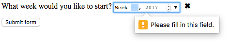

{{HTMLSidebar}}

Елементи {{HTMLElement("input")}} типу **`week`** (тиждень) створюють поля введення, що дають змогу легко ввести рік та [номер тижня ISO 8601](https://en.wikipedia.org/wiki/ISO_8601#Week_dates) протягом цього року (тобто тиждень від 1 до [52 або 53](https://en.wikipedia.org/wiki/ISO_8601#Week_dates)).

{{EmbedInteractiveExample("pages/tabbed/input-week.html", "tabbed-shorter")}}

Користувацький інтерфейс цього контрольного елемента у різних браузерах відрізняється; кросбраузерна підтримка наразі трохи обмежена, і лише Chrome, Opera та Microsoft Edge зараз його підтримують. У браузерах, що його не підтримують, цей контрольний елемент доладно відступає, працюючи ідентично до [`<input type="text">`](/uk/docs/Web/HTML/Element/input/text).

![Поле введення, у котрому видно 'week 01, 2017'. Фон 2017 такий же синій, як і фокусне кільце. У полі введення є 3 піктограми: x – очистити, дзиґа з малими стрілками вгору і вниз, і більша стрілка вниз. Календар з'являється під полем введення, встановлений на січень 2017 року. Перший стовпчик календаря - тиждень: 52, 1, 2, 3, 4, 5. Повний календар місяця знаходиться праворуч від нього. Виділено рядок з тижнем 1 і датами з 2 по 8 січня. На тому ж рядку, що і місяць, є кнопки для переходу вправо і вліво – для наступних і попередніх місяців.](week-control-chrome.png)

## Значення

Рядок, що представляє значення тижня-року, введеного в поле. Формат дати та часу, що використовується цим типом введення, описано в розділі [Рядки тижнів](/uk/docs/Web/HTML/Date_and_time_formats#riadky-tyzhniv).

Задати усталене значення поля можна шляхом додання цього значення в атрибуті [`value`](/uk/docs/Web/HTML/Element/input#value-znachennia), наприклад:

```html
<label for="week">У якому тижні ви хотіли б розпочати?</label>
<input id="week" type="week" name="week" value="2017-W01" />
```

{{EmbedLiveSample('znachennia', 600, 60)}}

Річ, котру слід зауважити: відображений формат може відрізнятися від фактичного `value`, яке завжди форматується як `yyyy-Www`. Коли вищезазначене значення подається на сервер, наприклад, браузери можуть відображати його як `Week 01, 2017`, але надіслане значення завжди матиме вигляд `week=2017-W01`.

Також отримати та задати значення можна в JavaScript – за допомогою властивості елемента поля {{domxref("HTMLInputElement.value", "value")}}, наприклад:

```js
const weekControl = document.querySelector('input[type="week"]');
weekControl.value = "2017-W45";
```

## Додаткові атрибути

На додачу до атрибутів, що спільні для елементів {{HTMLElement("input")}}, поля тижня мають наступні атрибути.

### max

Найпізніші (за часом) рік та номер тижня, у форматі рядка, що описаний в розділі [Значення](#znachennia) вище, що будуть прийняті. Якщо [`value`](/uk/docs/Web/HTML/Element/input#value-znachennia), введене в елемент, перевищує це значення, елемент не пройде [перевірку обмежень](/uk/docs/Web/HTML/Constraint_validation). Якщо значення атрибута `max` не є дійсним рядком тижня, то такий елемент не має максимального значення.

Це значення має бути більшим або рівним року та тижню, вказаним в атрибуті `min`.

### min

Найраніші рік та номер тижня, що будуть прийняті. Якщо [`value`](/uk/docs/Web/HTML/Element/input#value-znachennia), введене в елемент, менше цього значення, елемент не пройде [перевірку обмежень](/uk/docs/Web/HTML/Constraint_validation). Якщо значення атрибута `min` не є дійсним рядком тижня, то такий елемент не має мінімального значення.

Це значення має бути меншим або рівним року та тижню, вказаним в атрибуті `max`.

### readonly

Булів атрибут, котрий, якщо є, означає, що це поле не може бути змінено користувачем. Проте його `value` може бути змінено за допомогою JavaScript коду, що безпосередньо задає властивість `value` {{domxref("HTMLInputElement")}}.

> **Примітка:** Оскільки поле, що має атрибут `readonly`, не може мати значення, `required` не має жодного ефекту на поля з атрибутом `readonly`.

### step

Атрибут `step` – це число, що вказує на дискретність, котрій повинно відповідати значення, або спеціальне значення `any`, що описане нижче. Лише значення, котрі дорівнюють основі для кроку ([`min`](#min), якщо вказано, інакше – [`value`](/uk/docs/Web/HTML/Element/input#value-znachennia), і ще інакше – відповідне усталене значення) є дійсними.

Рядкове значення `any` означає, що крокування не накладається, і дозволяється будь-яке значення (з урахуванням інших обмежень, як то [`min`](#min) та [`max`](#max)).

> **Примітка:** Коли дані, введені користувачем, не відповідають налаштуванням крокування, {{Glossary("User agent", "користувацький агент")}} може округлити до найближчого дійсного значення, віддаючи перевагу числам в додатному напрямку, коли є два рівновіддалені варіанти.

Для полів `week` значення `step` дається в тижнях, з масштабним фактором 604.800.000 (оскільки за лаштунками часове значення зберігається в мілісекундах). Усталене значення `step` – 1, що позначає 1 тиждень. Усталене значення основи крокування дорівнює -259.200.000, що є початком першого тижня 1970 року (`"1970-W01"`).

_Наразі неясно, що означає для `step` значення `"any"`, коли воно використовується на полях `week`. Цей розділ буде оновлено, як тільки ця інформація буде визначена._

## Застосування полів тижнів

На перший погляд, поля тижнів – зручні, адже вони надають легкий користувацький інтерфейс для вибору тижнів, а також нормалізують формат даних, що надсилається на сервер, незалежно від браузера чи локалі користувача. Проте з полями `<input type="week">` є проблеми, оскільки підтримка не гарантована у всіх браузерах.

Розгляньмо базове та складніше застосування `<input type="week">`, а потім запропонуємо поради щодо пом'якшення проблеми підтримки браузерами (дивіться [Роботу з підтримкою браузерами](#robota-z-pidtrymkoiu-brauzeramy)).

### Базове застосування week

Найпростіше застосування `<input type="week">` включає базову комбінацію з елементів `<input>` і {{htmlelement("label")}}, як видно нижче:

```html
<form>
  <label for="week">У якому тижні ви хотіли б розпочати?</label>
  <input id="week" type="week" name="week" />
</form>
```

{{EmbedLiveSample('bazove-zastosuvannia-week', 600, 40)}}

### Контроль розміру поля

`<input type="week">` не підтримує атрибути розміру форми, наприклад, [`size`](/uk/docs/Web/HTML/Element/input#size-rozmir). Для потреб задання розміру доведеться обмежитись [CSS](/uk/docs/Web/CSS).

### Застосування атрибута step

Повинна була б бути змога використовувати атрибут [`step`](/uk/docs/Web/HTML/Element/input#step-krok), щоб змінити кількість тижнів, які перескакуються при інкременті або декременті значення, проте, схоже, що він ніяк не діє в браузерах, що підтримують тип поля `week`.

## Валідація

Усталено `<input type="week">` не застосовує до введених значень жодної валідації. Реалізації інтерфейсу користувача, як правило, не дозволяють задати нічого, що не є дійсними тижнем-роком, що допомагає, але все одно можна відправити поле пустим, і ви, можливо, захочете обмежити діапазон доступних тижнів.

### Задання максимального та мінімального тижнів

Можна скористатися атрибутами [`min`](/uk/docs/Web/HTML/Element/input#min-minimum) і [`max`](/uk/docs/Web/HTML/Element/input#max-maksymum), щоб обмежити дійсні тижні, які може вибрати користувач. У наступному прикладі задано мінімальне значення `Тиждень 01, 2017` та максимальне значення `Тиждень 52, 2017`:

```html
<form>
  <label for="week">У якому тижні ви хотіли б розпочати?</label>
  <input id="week" type="week" name="week" min="2017-W01" max="2017-W52" />
  <span class="validity"></span>
</form>
```

{{EmbedLiveSample('zadannia-maksymalnoho-ta-minimalnoho-tyzhniv', 600, 40)}}

Ось CSS, використаний у прикладі вище. Тут використовуються властивості CSS {{cssxref(":valid")}} та {{cssxref(":invalid")}}, щоб стилізувати поле на основі того, чи є поточне значення дійсним. Довелося помістити піктограми на {{htmlelement("span")}} поруч з полем, а не на саме поле, оскільки в Chrome всередині елементу керування формою розміщується згенерований вміст, і він не може бути ефективно стилізований або показаний.

```css
div {
  margin-bottom: 10px;
  position: relative;
}

input[type="number"] {
  width: 100px;
}

input + span {
  padding-right: 30px;
}

input:invalid + span::after {
  position: absolute;
  content: "✖";
  padding-left: 5px;
}

input:valid + span::after {
  position: absolute;
  content: "✓";
  padding-left: 5px;
}
```

Результатом є те, що лише тижні між W01 і W52 2017 року вважаються дійсними та можуть бути вибрані в браузерах, що підтримують цей тип поля.

### Обов'язковість значень тижнів

На додачу, можна скористатися атрибутом [`required`](/uk/docs/Web/HTML/Element/input#required-oboviazkovyi), щоб зробити заповнення поля обов'язковим. В результаті браузери, що підтримують цей тип поля, показуватимуть помилку, якщо спробувати подати пусте поле тижня.

Погляньмо на приклад; тут задано мінімальний та максимальний тижні, а також поле зроблено обов'язковим:

```html
<form>
  <div>
    <label for="week">У якому тижні ви хотіли б розпочати?</label>
    <input
      id="week"
      type="week"
      name="week"
      min="2017-W01"
      max="2017-W52"
      required />
    <span class="validity"></span>
  </div>
  <div>
    <input type="submit" value="Подати форму" />
  </div>
</form>
```

Якщо спробувати подати форму без значення, то браузер покаже помилку. Тепер спробуйте погратися з цим прикладом:

{{EmbedLiveSample('oboviazkovist-znachen-tyzhniv', 600, 120)}}

Ось знімок екрана для тих, хто користується браузером без підтримки полів `week`:



> **Застереження:** Валідація форм HTML _не_ є заміною серверних сценаріїв, що пересвідчуються в тому, що введені дані мають коректний формат. Занадто легко підлаштувати HTML, щоб обійти валідацію, або навіть геть її прибрати. Також можна обійти HTML взагалі, й подавати дані безпосередньо на сервер. Якщо ваш код на серверному боці не може валідувати дані, котрі отримує, то може статись лихо, коли в вашу базу даних введуть некоректно відформатовані дані (або завеликі дані, дані не того типу, і так далі).

## Робота з підтримкою браузерами

Як зазначалося вище, наразі основна проблема використання полів `week` — це підтримка браузерами: їх не підтримують Safari та Firefox на настільних комп'ютерах, а також старі версії IE.

Мобільні платформи, як от Android та iOS, використовують такий тип полів ідеально, надаючи спеціалізовані елементи керування із користувальницьким інтерфейсом, що дає змогу легко вибирати значення в середовищі з дотиковим екраном. Наприклад, вибір тижня в Chrome для Android має такий вигляд:


Браузери без підтримки `week` доладно відступають до текстового поля, але це утворює проблеми як щодо сталості користувацького інтерфейсу (представлений елемент керування буде іншим), так і обробки даних.

Друга проблема з двох – серйозніша. Як зазначалося вище, з полем `week` фактичне значення завжди нормалізується до формату `yyyy-Www`. Коли браузер відступає до звичайного текстового поля, то немає нічого, що б допомогло користувачеві правильно відформатувати введене значення (і це точно не інтуїтивно). Є чимало способів, у які люди можуть вводити значення тижня; наприклад:

- `Тиждень 1 2017`
- `Січ 2-8 2017`
- `2017-W01`
- тощо

Наразі найкращий спосіб використання тижнів-років у формах у кросбраузерний спосіб – це дозволити користувачеві вводити номер тижня та рік в окремих елементах керування (популярними є елементи {{htmlelement("select")}}; див. приклад нижче), або використовувати бібліотеки JavaScript, наприклад, [віконце вибору дати jQuery](https://jqueryui.com/datepicker/).

## Приклади

У цьому прикладі створюються два набори елементів користувацького інтерфейсу для вибору тижнів: нативний інтерфейс вибору, створений за допомогою `<input type="week">`, та набір з двох елементів {{htmlelement("select")}} для вибору тижнів-років у старих браузерах, які не підтримують тип поля `week`.

{{EmbedLiveSample('pryklady', 600, 140)}}

HTML має такий вигляд:

```html
<form>
  <div class="nativeWeekPicker">
    <label for="week">У якому тижні ви хотіли б розпочати?</label>
    <input
      id="week"
      type="week"
      name="week"
      min="2017-W01"
      max="2018-W52"
      required />
    <span class="validity"></span>
  </div>
  <p class="fallbackLabel">У якому тижні ви хотіли б розпочати?</p>
  <div class="fallbackWeekPicker">
    <div>
      <span>
        <label for="week">Тиждень:</label>
        <select id="fallbackWeek" name="week"></select>
      </span>
      <span>
        <label for="year">Рік:</label>
        <select id="year" name="year">
          <option value="2017" selected>2017</option>
          <option value="2018">2018</option>
        </select>
      </span>
    </div>
  </div>
</form>
```

Значення тижнів генеруються динамічно за допомогою коду JavaScript, наведеного нижче.

```css hidden
div {
  margin-bottom: 10px;
  position: relative;
}

input[type="number"] {
  width: 100px;
}

input + span {
  padding-right: 30px;
}

input:invalid + span::after {
  position: absolute;
  content: "✖";
  padding-left: 5px;
}

input:valid + span::after {
  position: absolute;
  content: "✓";
  padding-left: 5px;
}
```

Іще одна частина коду, що може бути цікавою, – код зі з'ясування можливостей браузера. Щоб з'ясувати, чи підтримує браузер `<input type="week">`, створюється новий елемент {{htmlelement("input")}}, робиться спроба задати його тип як `week`, а потім одразу перевірка, який тип задано фактично. Браузери, які не підтримують цей тип, повертають `text`, тому що тип `week` відступає до типу `text`. Якщо `<input type="week">` не підтримується, нативний інтерфейс вибору приховується, а замість нього виводиться запасний (елементи {{htmlelement("select")}}).

```js
// Отримати елементи користувацького інтерфейсу
const nativePicker = document.querySelector(".nativeWeekPicker");
const fallbackPicker = document.querySelector(".fallbackWeekPicker");
const fallbackLabel = document.querySelector(".fallbackLabel");

const yearSelect = document.querySelector("#year");
const weekSelect = document.querySelector("#fallbackWeek");

// Спершу приховати запасні
fallbackPicker.style.display = "none";
fallbackLabel.style.display = "none";

// Перевірити, чи нове поле дати відступає до текстового поля, чи ні
const test = document.createElement("input");

try {
  test.type = "week";
} catch (e) {
  console.log(e.description);
}

// Якщо так, то виконати код всередині блоку if () {}
if (test.type === "text") {
  // Приховати нативний інтерфейс вибору і показати запасний
  nativePicker.style.display = "none";
  fallbackPicker.style.display = "block";
  fallbackLabel.style.display = "block";

  // динамічно заповнити тижні
  populateWeeks();
}

function populateWeeks() {
  // заповнити select тижнів 52 тижнями
  for (let i = 1; i <= 52; i++) {
    const option = document.createElement("option");
    option.textContent = i < 10 ? `0${i}` : i;
    weekSelect.appendChild(option);
  }
}
```

> **Примітка:** Пам'ятайте, що деякі роки мають 53 тижні (див. [Тижні на рік](https://en.wikipedia.org/wiki/ISO_week_date#Weeks_per_year))! Це необхідно враховувати при розробці промислових застосунків.

## Технічний підсумок

<table class="properties">
  <tbody>
    <tr>
      <td><strong><a href="#znachennia">Значення</a></strong></td>
      <td>
        Рядок, що представляє тиждень і рік, або є порожнім
      </td>
    </tr>
    <tr>
      <td><strong>Події</strong></td>
      <td>
        {{domxref("HTMLElement/change_event", "change")}} та
        {{domxref("HTMLElement/input_event", "input")}}
      </td>
    </tr>
    <tr>
      <td><strong>Доступні спільні атрибути</strong></td>
      <td>
        <a href="/uk/docs/Web/HTML/Element/input#autocomplete"><code>autocomplete</code></a>,
        <a href="/uk/docs/Web/HTML/Element/input#list"><code>list</code></a>,
        <a href="/uk/docs/Web/HTML/Element/input#readonly"><code>readonly</code></a> та
        <a href="/uk/docs/Web/HTML/Element/input#step"><code>step</code></a>
      </td>
    </tr>
    <tr>
      <td><strong>Атрибути IDL</strong></td>
      <td>
        <code>value</code>, <code>valueAsDate</code>,
        <code>valueAsNumber</code> і <code>list</code>.
      </td>
    </tr>
    <tr>
      <td><strong>Інтерфейс DOM</strong></td>
      <td><p>{{domxref("HTMLInputElement")}}</p></td>
    </tr>
    <tr>
      <td><strong>Методи</strong></td>
      <td>
        {{domxref("HTMLInputElement.select", "select()")}},
        {{domxref("HTMLInputElement.stepDown", "stepDown()")}}
        і {{domxref("HTMLInputElement.stepUp", "stepUp()")}}
      </td>
    </tr>
    <tr>
      <td><strong>Неявна роль ARIA</strong></td>
      <td><a href="https://www.w3.org/TR/html-aria/#dfn-no-corresponding-role"><code>немає відповідної ролі</code></a></td>
    </tr>
  </tbody>
</table>

## Специфікації

{{Specifications}}

## Сумісність із браузерами

{{Compat}}

## Дивіться також

- Узагальнений елемент {{HTMLElement("input")}} та інтерфейс, що використовується для роботи з ним, {{domxref("HTMLInputElement")}}
- [Формати дати та часу, що вживаються в HTML](/uk/docs/Web/HTML/Date_and_time_formats)
- [`<input type="datetime-local">`](/uk/docs/Web/HTML/Element/input/datetime-local), [`<input type="date">`](/uk/docs/Web/HTML/Element/input/date), [`<input type="time">`](/uk/docs/Web/HTML/Element/input/time) і [`<input type="month">`](/uk/docs/Web/HTML/Element/input/month)
- [Сумісність властивостей CSS](/uk/docs/Learn/Forms/Property_compatibility_table_for_form_controls)
