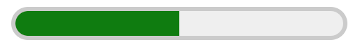

{{HTMLSidebar}}

Елемент [HTML](/uk/docs/Web/HTML) **`<meter>`** (вимірювач, лічильник) представляє або скалярне значення в межах відомого діапазону, або дробове значення.

{{EmbedInteractiveExample("pages/tabbed/meter.html", "tabbed-shorter")}}

## Атрибути

Цей елемент приймає [глобальні атрибути](/uk/docs/Web/HTML/Global_attributes).

- `value`

  - : Поточне числове значення. Воно повинно перебувати в діапазоні між мінімальним і максимальним значеннями (атрибутом `min` і атрибутом `max`), якщо вони задані. Якщо цей атрибут не заданий, або заданий некоректно, то значенням вважається `0`. Якщо цей атрибут заданий, але його значення лежить поза діапазоном, заданим атрибутом `min` і атрибутом `max`, то значення вважається рівним найближчому кінцю діапазону.

    > **Примітка:** Якщо атрибут `value` не лежить в діапазоні від `0` до `1` (включно), то атрибути `min` і `max` повинні визначати такий діапазон, щоб значення атрибута `value` перебувало в ньому.

- `min`
  - : Нижня числова межа вимірюваного діапазону. Повинна бути меншою за максимальне значення (атрибут `max`), якщо задана. Якщо не задана, то мінімальним значенням вважається `0`.
- `max`
  - : Верхня числова межа вимірюваного діапазону. Повинна бути більшою за мінімальне значення (атрибут `min`), якщо задана. Якщо не задана, то максимальним значенням вважається `1`.
- `low`
  - : Верхня числова межа нижнього кінця вимірюваного діапазону. Вона повинна бути більшою за мінімальне значення (атрибут `min`), а також меншою за значення high і максимальне значення (атрибути `high` і `max` відповідно), якщо вони задані. Якщо не задана, або якщо вона менша за мінімальне значення, то значенням `low` вважається мінімальне значення.
- `high`
  - : Нижня числова межа верхнього кінця вимірюваного діапазону. Вона повинна бути меншою за максимальне значення (атрибут `max`), а також більшою за значення low і мінімальне значення (атрибути `low` і `min` відповідно), якщо вони задані. Якщо не задана, або якщо вона більша за максимальне значення, то значенням `high` вважається максимальне значення.
- `optimum`
  - : Цей атрибут вказує оптимальне числове значення. Він повинен перебувати в межах діапазону (як визначено атрибутом `min` і атрибутом `max`). Коли використовується разом з атрибутом `low` і атрибутом `high`, то вказує, яка частина діапазону вважається бажаною. Наприклад, якщо він знаходиться між атрибутом `min` і атрибутом `low`, то нижній діапазон вважається бажаним. Браузер може розфарбовувати смугу лічильника по різному в залежності від того, чи є задане значення меншим, чи є рівним оптимальному.
- `form`
  - : Цей необов'язковий атрибут вживається для явного задання {{HTMLElement("form", "форми")}}-власника елемента `<meter>`. Коли він пропущений, то `<meter>` пов'язаний з елементом-предком `<form>`, або ж зв'язок з формою заданий атрибутом `form` на іншому елементі-предку, наприклад, на {{HTMLElement("fieldset")}}, якщо такий є. Якщо цей атрибут присутній, то його значення повинно бути [`id`](/uk/docs/Web/HTML/Global_attributes/id) елемента `<form>` у тому ж самому дереві елементів.

## Приклади

### Простий приклад

#### HTML

```html
<p>
  Розігрійте піч до <meter min="200" max="500" value="350">350 градусів</meter>.
</p>
```

#### Результат

{{EmbedLiveSample("prostyi-pryklad", 300, 60)}}

У Google Chrome результівний лічильник має такий вигляд:



### Приклад з високим і низьким діапазонами

Зверніть увагу на те, що в цьому прикладі пропущений атрибут [`min`](#min). Це дозволено, адже його усталене значення – `0`.

#### HTML

```html
<p>
  Він отримав <meter low="69" high="80" max="100" value="84">B</meter> за іспит.
</p>
```

#### Результат

{{EmbedLiveSample("pryklad-z-vysokym-i-nyzkym-diapazonamy", 300, 60)}}

У Google Chrome результівний лічильник має такий вигляд:


## Технічний підсумок

<table class="properties">
  <tbody>
    <tr>
      <th scope="row">
        <a href="/uk/docs/Web/HTML/Content_categories"
          >Категорії вмісту</a
        >
      </th>
      <td>
        <a href="/uk/docs/Web/HTML/Content_categories#potokovyi-vmist"
          >Потоковий вміст</a
        >,
        <a href="/uk/docs/Web/HTML/Content_categories#opovidalnyi-vmist"
          >оповідальний вміст</a
        >, підписний вміст, відчутний вміст.
      </td>
    </tr>
    <tr>
      <th scope="row">Дозволений вміст</th>
      <td>
        <a href="/uk/docs/Web/HTML/Content_categories#opovidalnyi-vmist"
          >Оповідальний вміст</a
        >, але серед його нащадків не повинно бути елементів <code>&#x3C;meter></code>.
      </td>
    </tr>
    <tr>
      <th scope="row">Пропуск тега</th>
      <td>{{no_tag_omission}}</td>
    </tr>
    <tr>
      <th scope="row">Дозволені батьківські елементи</th>
      <td>
        Всі елементи, що приймають
        <a href="/uk/docs/Web/HTML/Content_categories#opovidalnyi-vmist"
          >оповідальний вміст</a
        >.
      </td>
    </tr>
    <tr>
      <th scope="row">Неявна роль ARIA</th>
      <td>
        <a href="https://www.w3.org/TR/html-aria/#dfn-no-corresponding-role"
          >Немає відповідної ролі</a
        >
      </td>
    </tr>
    <tr>
      <th scope="row">Дозволені ролі ARIA</th>
      <td>Жодної дозволеної ролі</td>
    </tr>
    <tr>
      <th scope="row">Інтерфейс DOM</th>
      <td>{{domxref("HTMLMeterElement")}}</td>
    </tr>
  </tbody>
</table>

## Специфікації

{{Specifications}}

## Сумісність із браузерами

{{Compat}}

## Дивіться також

- {{HTMLElement("progress")}}
- {{cssxref("::-webkit-meter-bar")}}, {{cssxref("::-webkit-meter-inner-element")}}, {{cssxref("::-webkit-meter-even-less-good-value")}}, {{cssxref("::-webkit-meter-optimum-value")}}, {{cssxref("::-webkit-meter-suboptimum-value")}} – нестандартні псевдоелементи
