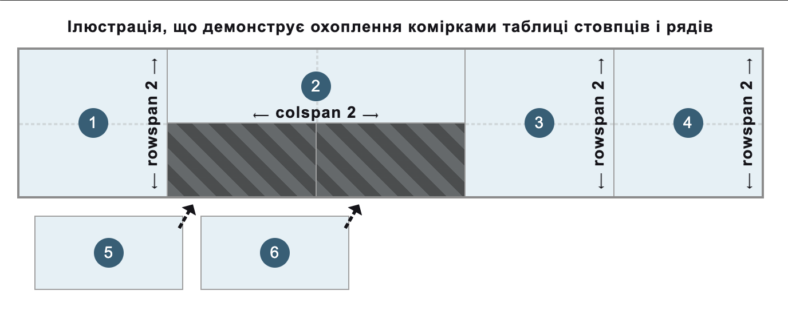

{{HTMLSidebar}}

Елемент [HTML](/uk/docs/Web/HTML) **`<td>`** визначає комірку таблиці, яка містить дані та може використовуватися як дочірній елемент елемента {{HTMLElement("tr")}}.

{{InteractiveExample("Демо HTML: &lt;td&gt;", "tabbed-taller")}}

```html interactive-example
<table>
  <caption>
    Зірки іншопланетного футболу
  </caption>
  <tr>
    <th scope="col">Гравець</th>
    <th scope="col">Глубли</th>
    <th scope="col">За-таак</th>
  </tr>
  <tr>
    <th scope="row">ТР-7</th>
    <td>7</td>
    <td>4.569</td>
  </tr>
  <tr>
    <th scope="row">Хіреш Одо</th>
    <td>7</td>
    <td>7.223</td>
  </tr>
  <tr>
    <th scope="row">Мія Улун</th>
    <td>9</td>
    <td>6.219</td>
  </tr>
</table>
```

```css interactive-example
th,
td {
  border: 1px solid rgb(160 160 160);
  padding: 8px 10px;
}

th[scope="col"] {
  background-color: #505050;
  color: #fff;
}

th[scope="row"] {
  background-color: #d6ecd4;
}

td {
  text-align: center;
}

tr:nth-of-type(even) {
  background-color: #eee;
}

table {
  border-collapse: collapse;
  border: 2px solid rgb(140 140 140);
  font-family: sans-serif;
  font-size: 0.8rem;
  letter-spacing: 1px;
}

caption {
  caption-side: bottom;
  padding: 10px;
}
```

## Атрибути

Цей елемент приймає [глобальні атрибути](/uk/docs/Web/HTML/Global_attributes).

- `colspan`
  - : Містить невід'ємне ціле число, яке вказує, скільки стовпців комірка даних охоплює або розширює. Усталене значення – `1`. Користувацькі агенти відкидають значення, більші за 1000, як неправильні, замінюючи їх усталеним значенням (`1`).
- `headers`
  - : Створює список розділених пробілами рядків, кожен з яких відповідає атрибуту `id` елементів {{HTMLElement("th")}}, які надають заголовки для цієї комірки таблиці.
- `rowspan`
  - : Містить невід'ємне ціле число, яке вказує, скільки рядків комірка даних охоплює або розширює. Усталене значення – `1`. Якщо його значенням задано `0`, комірка розширюється до кінця розділу групування таблиці ({{HTMLElement("thead")}}, {{HTMLElement("tbody")}}, {{HTMLElement("tfoot")}}, навіть якщо він неявно визначений), до якого належить ця комірка. Значення, більші за `65534`, обрізаються до `65534`.

### Нерекомендовані атрибути

Наступні атрибути є нерекомендованими та не повинні використовуватися. Вони задокументовані нижче лише для довідки при оновленні наявного коду та заради історичної цікавості.

- `abbr` {{deprecated_inline}}

  - : Містить короткий, скорочений опис вмісту комірки даних. Деякі користувацькі агенти, такі як програми для читання тексту, можуть подавати цей опис перед самим вмістом. Поміщайте скорочений вміст всередину комірки, а (довший) опис – в атрибут [`title`](/uk/docs/Web/HTML/Global_attributes/title), оскільки цей атрибут є нерекомендованим. Або, що ще краще, вставляйте вміст в саму комірку даних, а засобами CSS [візуально обрізайте текст, що не вміщається](/uk/docs/Web/CSS/text-overflow).

- `align` {{deprecated_inline}}

  - : Задає горизонтальне вирівнювання комірки даних. Можливі значення {{Glossary("enumerated", "перелічені")}}: `left`, `center`, `right`, `justify` і `char`. Значення `char`, коли підтримується, вирівнює текстовий вміст за символом, визначеним в атрибуті [`char`](#char) і зміщенням, визначеним в атрибуті [`charoff`](#charoff). Натомість слід використовувати властивість CSS {{cssxref("text-align")}}, адже цей атрибут – нерекомендований.

- `axis` {{deprecated_inline}}

  - : Містить список розділених пробілами рядків, кожен з яких відповідає атрибуту `id` групи комірок, до яких застосовується комірка даних.

- `bgcolor` {{deprecated_inline}}

  - : Визначає фоновий колір комірки даних. Значенням є колір HTML; або [шестицифровий шістнадцятковий код RGB](/uk/docs/Web/CSS/hex-color), перед яким стоїть `#`, або [ключове слово кольору](/uk/docs/Web/CSS/named-color). Інші значення {{cssxref("color_value", "&lt;color&gt")}} CSS не підтримуються. Натомість слід використовувати властивість CSS {{cssxref("background-color")}}, адже цей атрибут – нерекомендований.

- `char` {{deprecated_inline}}

  - : Нічого не робить. Спочатку задуманий, аби задавати вирівнювання вмісту за символом комірки даних. Серед типових значень – крапка (`.`), для вирівнювання чисел і грошових значень. Якщо [`align`](#align) не задано з `char`, цей атрибут ігнорується.

- `charoff` {{deprecated_inline}}

  - : Нічого не робить. Спочатку задуманий, аби вказати кількість символів для зміщення вмісту комірки даних від символу вирівнювання, заданого в атрибуті [`char`](#char).

- `height` {{deprecated_inline}}

  - : Визначає рекомендовану висоту комірки даних. Натомість слід використовувати властивість CSS {{cssxref("height")}}, адже цей атрибут – нерекомендований.

- `scope` {{deprecated_inline}}

  - : Визначає комірки, яких стосується елемент-заголовок (визначений в {{HTMLElement("th")}}). Можливі значення {{Glossary("enumerated", "перелічені")}}: `row`, `col`, `rowgroup` і `colgroup`. Використовуйте цей атрибут лише на елементі {{HTMLElement("th")}}, щоб визначити рядок або стовпець, для якого він є заголовком, оскільки цей атрибут є нерекомендованим для елемента `<td>`.

- `valign` {{deprecated_inline}}

  - : Задає вертикальне вирівнювання комірки даних. Можливі значення {{Glossary("enumerated", "перелічені")}}: `baseline`, `bottom`, `middle` і `top`. Натомість слід використовувати властивість CSS {{cssxref("vertical-align")}}, адже цей атрибут – нерекомендований.

- `width` {{deprecated_inline}}

  - : Визначає рекомендовану ширину комірки даних. Натомість слід використовувати властивість CSS {{cssxref("width")}}, адже цей атрибут – нерекомендований.

## Примітки щодо використання

- `<td>` можна використовувати лише всередині елемента {{HTMLElement("tr")}}.
- Коли атрибути [`colspan`](#colspan) і [`rowspan`](#rowspan) використовуються для охоплення комірками-заголовками кількох стовпців і рядів, то комірки без цих атрибутів (з усталеним значенням `1`) автоматично вписуються у вільні доступні місця в структурі таблиці, що охоплюють комірки 1x1, як показано на наступному рисунку:

  

  > [!NOTE]
  > Ці атрибути не повинні використовуватися для перекриття комірок.

## Приклади

Дивіться повний приклад таблиці, де вводяться загальноприйняті стандарти та найкращі практики, на сторінці {{HTMLElement("table")}}.

### Базові комірки даних

Цей приклад використовує елементи `<td>` разом з іншими елементами, що стосуються таблиць, для введення базової таблиці з даними про фонетичний алфавіт.

#### HTML

Частина рядів таблиці (елементів {{HTMLElement("tr")}}) містить як комірки-заголовки (елементи {{HTMLElement("th")}}), так і елементи комірок даних `<td>`. Елемент {{HTMLElement("th")}}, який є першим дочірнім елементом кожного ряду, формує перший стовпець таблиці, при цьому кожен `<th>` надає заголовок рядка для комірок даних у цьому рядку. Кожен відповідний `<td>` елемент містить дані, вирівняні з відповідними коміркою-заголовком стовпця та коміркою-заголовком рядка.

> [!NOTE]
> В нормальному випадку для групування рядів із заголовками у розділи заголовка таблиці та тіла таблиці, відповідно, застосовуються елементи групування {{HTMLElement("thead")}} і {{HTMLElement("tbody")}}. Ці елементи відсутні в цьому прикладі для зменшення складності та зосередження на використанні комірок даних.

```html
<table>
  <tr>
    <th scope="row">A</th>
    <td>Альфа</td>
    <td>АЛЬ фа</td>
  </tr>
  <tr>
    <th scope="row">B</th>
    <td>Браво</td>
    <td>БРА во</td>
  </tr>
  <tr>
    <th scope="row">C</th>
    <td>Чарлі</td>
    <td>ЧАР лі</td>
  </tr>
  <tr>
    <th scope="row">D</th>
    <td>Дельта</td>
    <td>ДЕЛЬ та</td>
  </tr>
</table>
```

#### CSS

Для стилізації таблиці та її комірок застосовано трохи базового CSS. Щоб чергувати вигляд комірок і зробити інформацію в таблиці легше зрозумілою, використано [селектори атрибутів](/uk/docs/Web/CSS/Attribute_selectors) і псевдоклас {{cssxref(":nth-of-type")}}.

```css
td,
th {
  border: 1px solid rgb(160 160 160);
  padding: 8px 10px;
}

tr:nth-of-type(odd) td {
  background-color: #eee;
}

tr th[scope="row"] {
  background-color: #d6ecd4;
}
```

```css hidden
table {
  border-collapse: collapse;
  border: 2px solid rgb(140 140 140);
  font-family: sans-serif;
  font-size: 0.8rem;
  letter-spacing: 1px;
}
```

#### Результат

{{EmbedLiveSample("bazovi-komirky-danykh", 650, 140)}}

### Охоплення кількох стовпців чи рядів

Цей приклад розширяє та покращує базову таблицю з [попереднього прикладу](#bazovi-komirky-danykh), додавши ще одну комірку – "ABC".

#### HTML

Додаткова комірка даних (елемент `<td>`) вводиться всередині першого ряду (елемента {{HTMLElement("tr")}}). Це створює четвертий стовпець у таблиці.

За допомогою атрибута [`rowspan`](#rowspan) комірка "ABC" охоплює перші три ряди таблиці. Останні комірки даних наступних рядів кожна охоплюють по два стовпці. Це зроблено за допомогою атрибута [`colspan`](#colspan), що дає змогу правильно вирівнювати їх у структурі таблиці. Зверніть увагу, що до таблиці додано додатковий ряд (елемент {{HTMLElement("tr")}}), щоб проілюструвати це.

```html
<table>
  <tr>
    <th scope="row">A</th>
    <td>Альфа</td>
    <td>АЛЬ фа</td>
    <td rowspan="3">ABC</td>
  </tr>
  <tr>
    <th scope="row">B</th>
    <td>Браво</td>
    <td>БРА во</td>
  </tr>
  <tr>
    <th scope="row">C</th>
    <td>Чарлі</td>
    <td>ЧАР лі</td>
  </tr>
  <tr>
    <th scope="row">D</th>
    <td>Дельта</td>
    <td colspan="2">ДЕЛЬ та</td>
  </tr>
  <tr>
    <th scope="row">E</th>
    <td>Ехо</td>
    <td colspan="2">ІК о</td>
  </tr>
</table>
```

#### CSS

Для вибору та стилізації доданої комірки даних "ABC" використовуються псевдокласи {{cssxref(":first-of-type")}} та {{cssxref(":last-of-type")}}.

```css
tr:first-of-type td:last-of-type {
  width: 60px;
  background-color: #505050;
  color: #fff;
  font-weight: bold;
  text-align: center;
}

td,
th {
  border: 1px solid rgb(160 160 160);
  padding: 8px 10px;
}

tr:nth-of-type(odd) td {
  background-color: #eee;
}

tr th[scope="row"] {
  background-color: #d6ecd4;
}
```

```css hidden
table {
  border-collapse: collapse;
  border: 2px solid rgb(140 140 140);
  font-family: sans-serif;
  font-size: 0.8rem;
  letter-spacing: 1px;
}
```

#### Результат

{{EmbedLiveSample("okhoplennia-kilkokh-stovptsiv-chy-riadiv", 650, 170)}}

### Зв'язування комірок даних з комірками-заголовками

Для складніших відносин між комірками даних (елементами `<td>`) та комірками-заголовками (елементами {{HTMLElement("th")}}) самого лише використання елементів {{HTMLElement("th")}} з атрибутом [`scope`](/uk/docs/Web/HTML/Element/th#scope) може бути недостатньо для допоміжних технологій, особливо для читачів з екрана.

#### HTML

Аби покращити {{Glossary("accessibility", "доступність")}} [попереднього прикладу](#okhoplennia-kilkokh-stovptsiv-chy-riadiv) та дати читачам з екрана змогу, наприклад, озвучувати заголовки, пов'язані з кожною коміркою даних, можна додати атрибут [`headers`](#headers), а також атрибути [`id`](/uk/docs/Web/HTML/Global_attributes/id). Кожна комірка-заголовок ряду (елемент {{HTMLElement("th")}}), яка пов'язана з коміркою даних "ABC", тобто літерами "A", "B" та "C", отримує унікальний ідентифікатор за допомогою атрибута [`id`](/uk/docs/Web/HTML/Global_attributes/id). Комірка даних "ABC" (елемент `<td>`) потім використовує ці значення `id` у списку, розділеному пробілами, в атрибуті [`headers`](#headers).

> [!NOTE]
> Рекомендовано використовувати в атрибуті [`id`](/uk/docs/Web/HTML/Global_attributes/id) більш описові та корисні значення. Кожен `id` в документі повинен бути унікальним для цього документа. У цьому прикладі значення `id` – одиничні символи, щоб зосередитися на концепції атрибута [`headers`](#headers).

```html
<table>
  <tr>
    <th id="a" scope="row">A</th>
    <td>Альфа</td>
    <td>АЛЬ фа</td>
    <td headers="a b c" rowspan="3">ABC</td>
  </tr>
  <tr>
    <th id="b" scope="row">B</th>
    <td>Браво</td>
    <td>БРА во</td>
  </tr>
  <tr>
    <th id="c" scope="row">C</th>
    <td>Чарлі</td>
    <td>ЧАР лі</td>
  </tr>
  <tr>
    <th scope="row">D</th>
    <td>Дельта</td>
    <td colspan="2">ДЕЛЬ та</td>
  </tr>
  <tr>
    <th scope="row">E</th>
    <td>Ехо</td>
    <td colspan="2">ІК о</td>
  </tr>
</table>
```

#### Результат

Хоч [візуальний результат](#rezultat-2) не змінився порівняно з [попереднім прикладом таблиці](#okhoplennia-kilkokh-stovptsiv-chy-riadiv), кожна комірка даних (`<td>`) тепер явно пов'язана з коміркою-заголовком ряду (`<th>`).

## Технічний підсумок

<table class="properties">
  <tbody>
    <tr>
      <th scope="row">
        <a href="/uk/docs/Web/HTML/Content_categories"
          >Категорії вмісту</a
        >
      </th>
      <td>Розділовий корінь.</td>
    </tr>
    <tr>      <th scope="row">Дозволений вміст</th>
      <td>
        <a href="/uk/docs/Web/HTML/Content_categories#potokovyi-vmist"
          >Потоковий вміст</a
        >.
      </td>
    </tr>
    <tr>
      <th scope="row">Пропуск тега</th>
      <td>
        Початковий тег – обов'язковий.<br />Кінцевий тег можна пропустити, якщо
        після нього зразу стоїть елемент {{HTMLElement("th")}} або
        <code>&lt;td&gt;</code>, або якщо в батьківському елементі далі немає даних.
      </td>
    </tr>
    <tr>
      <th scope="row">Дозволені батьківські елементи</th>
      <td>Елемент {{HTMLElement("tr")}}.</td>
    </tr>
    <tr>
      <th scope="row">Неявна роль ARIA</th>
      <td>
        <code
          ><a href="/uk/docs/Web/Accessibility/ARIA/Roles/cell_role"
            >cell</a
          ></code
        >,
        якщо є нащадком елемента {{HTMLElement("table")}}, або <code
          ><a href="/uk/docs/Web/Accessibility/ARIA/Roles/gridcell_role"
            >gridcell</a
          ></code
        >,
        якщо є нащадком елемента з роллю <code
          ><a href="/uk/docs/Web/Accessibility/ARIA/Roles/grid_role"
            >grid</a
          ></code
        >
      </td>
    </tr>
    <tr>
      <th scope="row">Дозволені ролі ARIA</th>
      <td>Всі</td>
    </tr>
    <tr>
      <th scope="row">Інтерфейс DOM</th>
      <td>{{domxref("HTMLTableCellElement")}}</td>
    </tr>
  </tbody>
</table>

## Специфікації

{{Specifications}}

## Сумісність із браузерами

{{Compat}}

## Дивіться також

- [Навчання – Основи таблиць HTML](/uk/docs/Learn_web_development/Core/Structuring_content/HTML_table_basics)
- {{HTMLElement("caption")}}, {{HTMLElement("col")}}, {{HTMLElement("colgroup")}}, {{HTMLElement("table")}}, {{HTMLElement("tbody")}}, {{HTMLElement("tfoot")}}, {{HTMLElement("th")}}, {{HTMLElement("thead")}}, {{HTMLElement("tr")}} – інші елементи, що стосуються таблиць
- {{cssxref("background-color")}} – властивість CSS для задання фонового кольору кожної комірки даних
- {{cssxref("border")}} – властивість CSS для керування межами комірок даних
- {{cssxref("height")}} – властивість CSS для керування рекомендованою висотою кожної комірки даних
- {{cssxref("text-align")}} – властивість CSS для горизонтального вирівнювання вмісту кожної комірки даних
- {{cssxref("vertical-align")}} – властивість CSS для вертикального вирівнювання вмісту кожної комірки даних
- {{cssxref("width")}} – властивість CSS для керування рекомендованою шириною кожної комірки даних
- {{cssxref(":nth-of-type")}}, {{cssxref(":first-of-type")}}, {{cssxref(":last-of-type")}} – псевдокласи CSS для вибору потрібних комірок даних
