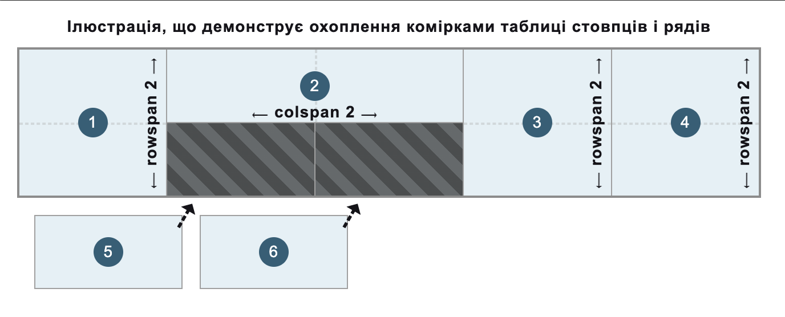

{{HTMLSidebar}}

Елемент [HTML](/uk/docs/Web/HTML) **`<th>`** визначає комірку як заголовок групи комірок таблиці та може використовуватися як дочірній елемент елемента {{HTMLElement("tr")}}. Конкретна природа цієї групи визначається атрибутами [`scope`](#scope) і [`headers`](#headers).

{{EmbedInteractiveExample("pages/tabbed/th.html","tabbed-taller")}}

## Атрибути

Цей елемент приймає [глобальні атрибути](/uk/docs/Web/HTML/Global_attributes).

- `abbr`
  - : Короткий, скорочений опис вмісту комірки-заголовка, наданий як альтернативний підпис для використання для комірки-заголовка у разі посилання на неї в інших контекстах. Деякі користувацькі агенти, наприклад, читачі з екрана, можуть подавати цей опис перед самим вмістом.
- `colspan`
  - : Невід'ємне цілочислове значення, що вказує на кількість стовпців, які охоплює або розширює комірка-заголовок. Усталене значення – `1`. Користувацькі агенти відкидають значення, які перевищують 1000, як неправильні, на користь `1`.
- `headers`
  - : Список розділених пробілами рядків, що відповідають атрибутам `id` елементів `<th>`, які надають заголовки для цієї комірки-заголовка.
- `rowspan`
  - : Невід'ємне цілочислове значення, що вказує на кількість рядів, які охоплює або розширює комірка-заголовок. Усталене значення – `1`; якщо його значенням задано `0`, то комірка-заголовок розширюється до кінця розділу групування таблиці ({{HTMLElement("thead")}}, {{HTMLElement("tbody")}}, {{HTMLElement("tfoot")}}, навіть якщо такий розділ визначений неявно), до якого належить `<th>`. Значення, більші за `65534`, обрізаються до `65534`.
- `scope`

  - : Визначає комірки, яких стосується елемент-заголовок (визначений у `<th>`). Можливі значення {{Glossary("enumerated", "перелічені")}}:

    - `row` – заголовок стосується всіх комірок ряду, до якого належить;
    - `col` – заголовок стосується всіх комірок стовпця, до якого належить;
    - `rowgroup` – заголовок належить групі рядків і стосується всіх її комірок;
    - `colgroup` – заголовок належить групі стовпців і стосується всіх її комірок.

    Якщо атрибут `scope` не задано, або якщо його значенням не є ані `row`, ані `col`, ані `rowgroup`, ані `colgroup`, то браузери автоматично вибирають набір комірок, до яких застосовується ця комірка-заголовок.

### Нерекомендовані атрибути

Наступні атрибути є нерекомендованими та не повинні використовуватися. Вони задокументовані нижче лише для довідки при оновленні наявного коду та заради історичної цікавості.

- `align` {{deprecated_inline}}

  - : Задає горизонтальне вирівнювання комірки-заголовка. Можливі значення {{Glossary("enumerated", "перелічені")}}: `left`, `center`, `right`, `justify` і `char`. Значення `char`, коли підтримується, вирівнює текстовий вміст за символом, визначеним в атрибуті [`char`](#char) і зміщенням, визначеним в атрибуті [`charoff`](#charoff). Натомість слід використовувати властивість CSS {{cssxref("text-align")}}, адже цей атрибут – нерекомендований.

- `axis` {{deprecated_inline}}

  - : Містить список розділених пробілами рядків, кожний з яких відповідає атрибуту `id` групи комірок, до яких застосовується комірка-заголовок. Натомість слід використовувати атрибут [`scope`](#scope), адже цей атрибут – нерекомендований.

- `bgcolor` {{deprecated_inline}}

  - : Визначає фоновий колір комірки-заголовка. Значенням є колір HTML; або [шестицифровий шістнадцятковий код RGB](/uk/docs/Web/CSS/hex-color), перед яким стоїть `#`, або [ключове слово кольору](/uk/docs/Web/CSS/named-color). Інші значення {{cssxref("color_value", "&lt;color&gt")}} CSS не підтримуються. Натомість слід використовувати властивість CSS {{cssxref("background-color")}}, адже цей атрибут – нерекомендований.

- `char` {{deprecated_inline}}

  - : Нічого не робить. Спочатку задуманий, аби задавати вирівнювання вмісту за символом комірки-заголовка. Серед типових значень – крапка (`.`), для вирівнювання чисел і грошових значень. Якщо [`align`](#align) не задано з `char`, цей атрибут ігнорується.

- `charoff` {{deprecated_inline}}

  - : Нічого не робить. Спочатку задуманий, аби вказати кількість символів для зміщення вмісту комірки-заголовка від символу вирівнювання, заданого в атрибуті [`char`](#char).

- `height` {{deprecated_inline}}

  - : Визначає рекомендовану висоту комірки-заголовка. Натомість слід використовувати властивість CSS {{cssxref("height")}}, адже цей атрибут – нерекомендований.

- `valign` {{deprecated_inline}}

  - : Задає вертикальне вирівнювання комірки-заголовка. Можливі значення {{Glossary("enumerated", "перелічені")}}: `baseline`, `bottom`, `middle` і `top`. Натомість слід використовувати властивість CSS {{cssxref("vertical-align")}}, адже цей атрибут – нерекомендований.

- `width` {{deprecated_inline}}

  - : Визначає рекомендовану ширину комірки-заголовка. Натомість слід використовувати властивість CSS {{cssxref("width")}}, адже цей атрибут – нерекомендований.

## Примітки щодо використання

- `<th>` можна використовувати лише всередині елемента {{HTMLElement("tr")}}.
- У простих контекстах використання атрибута [`headers`](#headers) може бути зайвим, оскільки він може бути виведений автоматично. Проте деякі допоміжні технології можуть не вивести його правильно, тому задання області застосування заголовка може покращити користувацький досвід.
- Коли атрибути [`colspan`](#colspan) і [`rowspan`](#rowspan) використовуються для охоплення комірками-заголовками кількох стовпців і рядів, то комірки без цих атрибутів (з усталеним значенням `1`) автоматично вписуються у вільні доступні місця в структурі таблиці, що охоплюють комірки 1x1, як показано на наступному рисунку:

  

  > [!NOTE]
  > Ці атрибути не повинні використовуватися для перекриття комірок.

## Приклади

Дивіться повний приклад таблиці, де вводяться загальноприйняті стандарти та найкращі практики, на сторінці {{HTMLElement("table")}}.

### Базові заголовки стовпця та ряду

Цей приклад використовує елементи `<th>` для введення заголовків стовпців та рядів у базову структуру таблиці.

#### HTML

Перший ряд (елемент {{HTMLElement("tr")}}) містить заголовки стовпців (елементи `<th>`), які діють як "назви" стовпців, щоб полегшити розуміння інформації в цих стовпцях та позначити дані. Щоб показати, що кожен заголовок стовпця стосується всіх комірок у відповідному стовпці, атрибут [`scope`](#scope) заданий з `col` (стовпець).

Решта рядів містять основні дані таблиці. Кожен з цих рядів має заголовок рядка (елемент `<th>`), вставлений як перша комірка. Це утворює стовпець з заголовками рядків як перший стовпець таблиці. Аналогічно до заголовків стовпців, атрибут [`scope`](#scope) заданий з `row`, щоб вказати, яких комірок стосується кожен заголовок рядка, і в цьому прикладі це всі комірки даних (елементи {{HTMLElement("td")}}) у кожному рядку.

> [!NOTE]
> В нормальному випадку для групування рядів із заголовками у розділи заголовка таблиці та тіла таблиці, відповідно, застосовуються елементи групування {{HTMLElement("thead")}} і {{HTMLElement("tbody")}}. Ці елементи відсутні в цьому прикладі для зменшення складності та зосередження на використанні комірок-заголовків.

```html
<table>
  <tr>
    <th scope="col">Символ</th>
    <th scope="col">Кодове слово</th>
    <th scope="col">Вимова</th>
  </tr>
  <tr>
    <th scope="row">A</th>
    <td>Альфа</td>
    <td>АЛЬ фа</td>
  </tr>
  <tr>
    <th scope="row">B</th>
    <td>Браво</td>
    <td>БРА во</td>
  </tr>
  <tr>
    <th scope="row">C</th>
    <td>Чарлі</td>
    <td>ЧАР лі</td>
  </tr>
  <tr>
    <th scope="row">D</th>
    <td>Дельта</td>
    <td>ДЕЛЬ та</td>
  </tr>
</table>
```

#### CSS

Для стилізації таблиці та її комірок застосовано трохи базового CSS. Щоб націлитися на комірки-заголовки за значеннями атрибута [`scope`](#scope), використовуються [селектори атрибутів](/uk/docs/Web/CSS/Attribute_selectors), і заголовки стовпців і рядків (елементи `<th>`) виділяються та відрізняються один від одного та від комірок даних ({{HTMLElement("td")}}).

```css
th,
td {
  border: 1px solid rgb(160 160 160);
  padding: 8px 10px;
}

th[scope="col"] {
  background-color: #505050;
  color: #fff;
}

th[scope="row"] {
  background-color: #d6ecd4;
}

tr:nth-of-type(odd) td {
  background-color: #eee;
}
```

```css hidden
table {
  border-collapse: collapse;
  border: 2px solid rgb(140 140 140);
  font-family: sans-serif;
  font-size: 0.8rem;
  letter-spacing: 1px;
}
```

#### Результат

{{EmbedLiveSample("bazovi-zaholovky-stovptsia-ta-riadu", 650, 170)}}

### Охоплення кількох стовпців чи рядів

Цей приклад розширяє та покращує базову таблицю з [попереднього прикладу](#bazovi-zaholovky-stovptsia-ta-riadu), додавши другий ряд для додаткових заголовків стовпців.

#### HTML

Доданий ще один ряд таблиці (елемент {{HTMLElement("tr")}}), другий ряд-заголовок, з двома додатковими заголовками стовпців (елементами `<th>`). Таким чином, стовпець "Вимова" розбивається на два стовпці: один для IPA (Міжнародний фонетичний алфавіт) та один для наслідування (оригінальний стовпець вимови). Відповідні комірки даних (елементи {{HTMLElement("td")}}) додаються до кожного наступного рядка.

Як показано в [примітках щодо використання](#prymitky-shchodo-vykorystannia), атрибути [`colspan`](#colspan) і [`rowspan`](#rowspan) можуть бути використані на елементах `<th>`, аби призначити комірки-заголовки відповідним стовпцям і рядам. Щоб отримати "дворядковий" заголовок у структурі таблиці, перші дві комірки-заголовки всередині першого елемента {{HTMLElement("tr")}} охоплюють два ряди. Третя комірка-заголовок охоплює два стовпці (залишаючись у першому ряду). Така структура залишає дві доступні області у третьому та четвертому стовпцях у другому ряду, де автоматично розміщуються два заголовки всередині другого елемента {{HTMLElement("tr")}}, з усталеним значенням `1` для атрибутів [`colspan`](#colspan) і [`rowspan`](#rowspan).

> [!NOTE]
> В нормальному випадку для групування рядів із заголовками у розділи заголовка таблиці та тіла таблиці використовуються елементи групування {{HTMLElement("thead")}} і {{HTMLElement("tbody")}}. Це не реалізовано в цьому прикладі для зосередження на заголовках та охопленні та зменшення складності прикладу.

```html
<table>
  <tr>
    <th scope="col" rowspan="2">Символ</th>
    <th scope="col" rowspan="2">Кодове слово</th>
    <th scope="col" colspan="2">Вимова</th>
  </tr>
  <tr>
    <th scope="col">IPA</th>
    <th scope="col">Наслідування</th>
  </tr>
  <tr>
    <th scope="row">A</th>
    <td>Альфа</td>
    <td>ˈælfa</td>
    <td>АЛЬ фа</td>
  </tr>
  <tr>
    <th scope="row">B</th>
    <td>Браво</td>
    <td>ˈbraːˈvo</td>
    <td>БРА во</td>
  </tr>
  <tr>
    <th scope="row">C</th>
    <td>Чарлі</td>
    <td>ˈtʃɑːli</td>
    <td>ЧАР лі</td>
  </tr>
  <tr>
    <th scope="row">D</th>
    <td>Дельта</td>
    <td>ˈdeltɑ</td>
    <td>ДЕЛЬ та</td>
  </tr>
</table>
```

#### CSS

CSS не змінився від [попереднього прикладу](#bazovi-zaholovky-stovptsia-ta-riadu).

```css hidden
table {
  border-collapse: collapse;
  border: 2px solid rgb(140 140 140);
  font-family: sans-serif;
  font-size: 0.8rem;
  letter-spacing: 1px;
}

th,
td {
  border: 1px solid rgb(160 160 160);
  padding: 8px 10px;
}

th[scope="col"] {
  background-color: #505050;
  color: #fff;
}

th[scope="row"] {
  background-color: #d6ecd4;
}

tr:nth-of-type(odd) td {
  background-color: #eee;
}
```

#### Результат

{{EmbedLiveSample("okhoplennia-kilkokh-stovptsiv-chy-riadiv", 650, 200)}}

### Зв'язування комірок-заголовків з іншими комірками-заголовками

Для складніших відносин між комірками-заголовками використання елементів `th` з атрибутом [`scope`](#scope) самого по собі може бути недостатньо для допоміжних технологій, особливо для читачів з екрана.

#### HTML

Аби покращити {{Glossary("accessibility", "доступність")}} [попереднього прикладу](#okhoplennia-kilkokh-stovptsiv-chy-riadiv) і дати читачам з екрана змогу, наприклад, озвучувати заголовки, пов'язані з кожною коміркою-заголовком, можна додати атрибут [`headers`](#headers) вкупі з [`id`](/uk/docs/Web/HTML/Global_attributes/id). Оскільки стовпець "Вимова" у прикладі розбивається на два стовпці, утворюючи "дворядковий" заголовок, допоміжні технології, такі як читачі з екрана, можуть не змогти визначити, з якими додатковими комірками-заголовками (елементами `<th>`) пов'язана комірка-заголовок "Вимова", і навпаки. Тому атрибут [`headers`](#headers) використовується для комірок-заголовків "Вимова", "IPA" та "Наслідування", щоб зв'язати відповідні комірки-заголовки на основі значень унікальних ідентифікаторів з доданими атрибутами [`id`](/uk/docs/Web/HTML/Global_attributes/id) у вигляді списку, розділеного пробілами.

> [!NOTE]
> Рекомендовано використовувати в атрибуті [`id`](/uk/docs/Web/HTML/Global_attributes/id) більш описові та корисні значення. Кожен `id` в документі повинен бути унікальним для цього документа. У цьому прикладі значення `id` – одиничні символи, щоб зосередитися на концепції атрибута [`headers`](#headers).

```html
<table>
  <tr>
    <th scope="col" rowspan="2">Символ</th>
    <th scope="col" rowspan="2">Кодове слово</th>
    <th scope="col" colspan="2" id="p" headers="i r">Вимова</th>
  </tr>
  <tr>
    <th scope="col" id="i" headers="p">IPA</th>
    <th scope="col" id="r" headers="p">Наслідування</th>
  </tr>
  <tr>
    <th scope="row">A</th>
    <td>Альфа</td>
    <td>ˈælfa</td>
    <td>АЛЬ фа</td>
  </tr>
  <tr>
    <th scope="row">B</th>
    <td>Браво</td>
    <td>ˈbraːˈvo</td>
    <td>БРА во</td>
  </tr>
  <tr>
    <th scope="row">C</th>
    <td>Чарлі</td>
    <td>ˈtʃɑːli</td>
    <td>ЧАР лі</td>
  </tr>
  <tr>
    <th scope="row">D</th>
    <td>Дельта</td>
    <td>ˈdeltɑ</td>
    <td>ДЕЛЬ та</td>
  </tr>
</table>
```

#### Результат

[Візуальний результат](#result-2) не змінився від [попередньої таблиці-прикладу](#okhoplennia-kilkokh-stovptsiv-chy-riadiv).

## Технічний підсумок

<table class="properties">
  <tbody>
    <tr>
      <th scope="row">
        <a href="/uk/docs/Web/HTML/Content_categories"
          >Категорії вмісту</a
        >
      </th>
      <td>Жодних.</td>
    </tr>
    <tr>
      <th scope="row">Дозволений вміст</th>
      <td>
        <a href="/uk/docs/Web/HTML/Content_categories#potokovyi-vmist"
          >Потоковий вміст</a
        >, але серед нащадків не повинно бути жодних колонтитулів, розділового вмісту та заголовків.
      </td>
    </tr>
    <tr>
      <th scope="row">Пропуск тега</th>
      <td>
        Початковий тег – обов'язковий.<br />Кінцевий тег можна пропустити, якщо
        після нього зразу стоїть елемент <code>&lt;th&gt;</code> або
        {{HTMLElement("td")}}, або якщо в батьківському елементі далі немає жодних даних.
      </td>
    </tr>
    <tr>
      <th scope="row">Дозволені батьківські елементи</th>
      <td>Елемент {{HTMLElement("tr")}}.</td>
    </tr>
    <tr>
      <th scope="row">Неявна роль ARIA</th>
      <td>
        <a href="/uk/docs/Web/Accessibility/ARIA/Roles/columnheader_role"><code>columnheader</code></a> або <a href="/uk/docs/Web/Accessibility/ARIA/Roles/rowheader_role"><code>rowheader</code></a>
      </td>
    </tr>
    <tr>
      <th scope="row">Дозволені ролі ARIA</th>
      <td>Всі</td>
    </tr>
    <tr>
      <th scope="row">Інтерфейс DOM</th>
      <td>{{domxref("HTMLTableCellElement")}}</td>
    </tr>
  </tbody>
</table>

## Специфікації

{{Specifications}}

## Сумісність із браузерами

{{Compat}}

## Дивіться також

- [Навчання – Основи таблиць HTML](/uk/docs/Learn_web_development/Core/Structuring_content/HTML_table_basics)
- {{HTMLElement("caption")}}, {{HTMLElement("col")}}, {{HTMLElement("colgroup")}}, {{HTMLElement("table")}}, {{HTMLElement("tbody")}}, {{HTMLElement("td")}}, {{HTMLElement("tfoot")}}, {{HTMLElement("thead")}}, {{HTMLElement("tr")}} – інші елементи, що стосуються таблиць
- {{cssxref("background-color")}} – властивість CSS для задання фонового кольору кожної комірки-заголовка
- {{cssxref("border")}} – властивість CSS для керування межами комірок-заголовків
- {{cssxref("height")}} – властивість CSS для керування рекомендованою висотою кожної комірки-заголовка
- {{cssxref("text-align")}} – властивість CSS для горизонтального вирівнювання вмісту кожної комірки-заголовка
- {{cssxref("vertical-align")}} – властивість CSS для вертикального вирівнювання вмісту кожної комірки-заголовка
- {{cssxref("width")}} – властивість CSS для керування рекомендованою шириною кожної комірки-заголовка
- {{cssxref(":nth-of-type")}}, {{cssxref(":first-of-type")}}, {{cssxref(":last-of-type")}} – псевдокласи CSS для вибору потрібних комірок-заголовків
