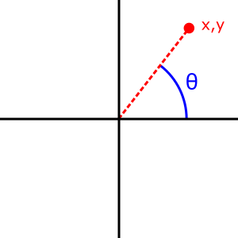

{{JSRef}}

Статичний метод **`Math.atan2()`** повертає плоский кут (в радіанах) між додатним напрямком осі Ox, і променем з точки (0,0) до точки (x,y), для переданих аргументів `Math.atan2(y,x)`.

{{EmbedInteractiveExample("pages/js/math-atan2.html")}}

## Синтаксис

```js-nolint
Math.atan2(y, x)
```

### Параметри

- `y`
  - : Координата Y точки.
- `x`
  - : Координата X точки.

### Повернене значення

Кут у радіанах (від -π до π включно) між додатним напрямком осі Ox і променем від точки (0,0) до точки (x,y).

## Опис

Метод `Math.atan2()` вимірює кут проти годинникової стрілки θ, в радіанах, між додатним напрямком осі Ox і точкою `(x, y)`. Зверніть увагу, що аргументи цієї функції – спочатку координата y, а потім координата x.



`Math.atan2()` передають аргументи `x` та `y` окремо, а [`Math.atan()`](/uk/docs/Web/JavaScript/Reference/Global_Objects/Math/atan) передають співвідношення між цими двома аргументами. `Math.atan2(y, x)` відрізняється від `Math.atan(y / x)` у наступних випадках:

| `x`                  | `y`         | `Math.atan2(y, x)` | `Math.atan(y / x)` |
| -------------------- | ----------- | ------------------ | ------------------ |
| `Infinity`           | `Infinity`  | π / 4              | `NaN`              |
| `Infinity`           | `-Infinity` | -π / 4             | `NaN`              |
| `-Infinity`          | `Infinity`  | 3π / 4             | `NaN`              |
| `-Infinity`          | `-Infinity` | -3π / 4            | `NaN`              |
| 0                    | 0           | 0                  | `NaN`              |
| 0                    | -0          | -0                 | `NaN`              |
| < 0 (включно з `-0`) | 0           | π                  | 0                  |
| < 0 (включно з `-0`) | -0          | -π                 | 0                  |
| `-Infinity`          | > 0         | π                  | -0                 |
| -0                   | > 0         | π / 2              | -π / 2             |
| `-Infinity`          | < 0         | -π                 | 0                  |
| -0                   | < 0         | -π / 2             | π / 2              |

На додачу до цього, для точок у другому та третьому квадрантах (`x < 0`) `Math.atan2()` видає кут, менший за <math><semantics><mrow><mo>-</mo><mfrac><mi>π</mi><mn>2</mn></mfrac></mrow><annotation encoding="TeX">-\frac{\pi}{2}</annotation></semantics></math> або більший за <math><semantics><mfrac><mi>π</mi><mn>2</mn></mfrac><annotation encoding="TeX">\frac{\pi}{2}</annotation></semantics></math>.

Оскільки `atan2()` – це статичний метод об'єкта `Math`, його потрібно завжди використовувати у вигляді `Math.atan2()`, а не як метод власноруч створеного об'єкта `Math` (`Math` не є конструктором).

## Приклади

### Застосування Math.atan2()

```js
Math.atan2(90, 15); // 1.4056476493802699
Math.atan2(15, 90); // 0.16514867741462683
```

### Різниця між Math.atan2(y, x) і Math.atan(y / x)

Наступний сценарій друкує всі вихідні дані, що видають різні значення, бувши переданими в `Math.atan2(y, x)` та `Math.atan(y / x)`.

```js
const formattedNumbers = new Map([
  [-Math.PI, "-π"],
  [(-3 * Math.PI) / 4, "-3π/4"],
  [-Math.PI / 2, "-π/2"],
  [-Math.PI / 4, "-π/4"],
  [Math.PI / 4, "π/4"],
  [Math.PI / 2, "π/2"],
  [(3 * Math.PI) / 4, "3π/4"],
  [Math.PI, "π"],
  [-Infinity, "-∞"],
  [Infinity, "∞"],
]);
function format(template, ...args) {
  return String.raw(
    { raw: template },
    ...args.map((num) =>
      (Object.is(num, -0)
        ? "-0"
        : (formattedNumbers.get(num) ?? String(num))
      ).padEnd(5),
    ),
  );
}
console.log(`| x     | y     | atan2 | atan  |
|-------|-------|-------|-------|`);
for (const x of [-Infinity, -1, -0, 0, 1, Infinity]) {
  for (const y of [-Infinity, -1, -0, 0, 1, Infinity]) {
    const atan2 = Math.atan2(y, x);
    const atan = Math.atan(y / x);
    if (!Object.is(atan2, atan)) {
      console.log(format`| ${x} | ${y} | ${atan2} | ${atan} |`);
    }
  }
}
```

Вивід – такий:

```plain
| x     | y     | atan2 | atan  |
|-------|-------|-------|-------|
| -∞    | -∞    | -3π/4 | NaN   |
| -∞    | -1    | -π    | 0     |
| -∞    | -0    | -π    | 0     |
| -∞    | 0     | π     | -0    |
| -∞    | 1     | π     | -0    |
| -∞    | ∞     | 3π/4  | NaN   |
| -1    | -∞    | -π/2  | π/2   |
| -1    | -1    | -3π/4 | π/4   |
| -1    | -0    | -π    | 0     |
| -1    | 0     | π     | -0    |
| -1    | 1     | 3π/4  | -π/4  |
| -1    | ∞     | π/2   | -π/2  |
| -0    | -∞    | -π/2  | π/2   |
| -0    | -1    | -π/2  | π/2   |
| -0    | -0    | -π    | NaN   |
| -0    | 0     | π     | NaN   |
| -0    | 1     | π/2   | -π/2  |
| -0    | ∞     | π/2   | -π/2  |
| 0     | -0    | -0    | NaN   |
| 0     | 0     | 0     | NaN   |
| ∞     | -∞    | -π/4  | NaN   |
| ∞     | ∞     | π/4   | NaN   |
```

## Специфікації

{{Specifications}}

## Сумісність із браузерами

{{Compat}}

## Дивіться також

- {{jsxref("Math.acos()")}}
- {{jsxref("Math.asin()")}}
- {{jsxref("Math.atan()")}}
- {{jsxref("Math.cos()")}}
- {{jsxref("Math.sin()")}}
- {{jsxref("Math.tan()")}}
