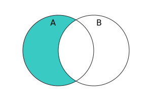

{{JSRef}}

Об'єкт **`Set`** (множина) дає змогу зберігати унікальні значення будь-якого типу, як {{Glossary("Primitive", "примітивні")}}, так і посилання на об'єкти.

## Опис

Об'єкти `Set` є колекціями значень. Конкретне значення в множині **може зустрітись лише раз**, воно є неповторним у межах колекції цієї множини. Ітерування елементів `Set` відбувається в порядку додання. _Порядок додання_ відповідає порядкові, в якому кожен елемент був успішно вставлений у множину методом [`add()`](/uk/docs/Web/JavaScript/Reference/Global_Objects/Set/add) (тобто коли до виклику `add()` у множині не було ідентичного елемента).

Специфікація вимагає, щоб множини були реалізовані "так, щоб в середньому час доступу був сублінійним відносно числа елементів колекції". Таким чином, внутрішньо вони можуть бути представлені як геш-таблиця (з доступом O(1)), як дерево пошуку (з доступом O(log(N))) або будь-яка інша структура даних, поки складність доступу краща за O(N).

### Рівність значень

Рівність значень заснована на алгоритмі [SameValueZero](/uk/docs/Web/JavaScript/Equality_comparisons_and_sameness#same-value-zero_equality). (Раніше використовувався алгоритм [SameValue](/uk/docs/Web/JavaScript/Equality_comparisons_and_sameness#same-value_equality_using_object.is), котрий розглядав `0` і `-0` як різні значення. Перевірте [сумісність із браузерами](#sumisnist-iz-brauzeramy).) Це означає, що значення {{jsxref("NaN")}} вважається рівним іншому значенню `NaN` (попри те, що `NaN !== NaN`), а всі решта значень перевіряються на рівність згідно з семантикою оператора `===`.

### Швидкодія

Метод [`has`](/uk/docs/Web/JavaScript/Reference/Global_Objects/Set/has) перевіряє, чи присутнє значення в множині, використовуючи підхід, що в середньому є швидшим за перевірку більшості елементів, що були до того додані до множини. Для прикладу, це в середньому швидше, ніж метод [`Array.prototype.includes`](/uk/docs/Web/JavaScript/Reference/Global_Objects/Array/includes), коли масив має `length`, що дорівнює значенню `size` множини.

### Композиція множин

Об'єкт `Set` пропонує методи, що дають змогу компонувати множини, як це робиться у математиці. Серед цих методів:

<table>
  <thead>
    <tr>
      <th scope="col">Метод</th>
      <th scope="col">Тип поверненого значення</th>
      <th scope="col">Математичний еквівалент</th>
      <th scope="col">Діаграма Венна</th>
    </tr>
  </thead>
  <tbody>
    <tr>
      <td>{{jsxref("Set/difference", "A.difference(B)")}}</td>
      <td><code>Set</code></td>
      <td>
        <math><semantics><mrow><mi>A</mi><mo>∖</mo><mi>B</mi></mrow><annotation encoding="TeX">A\setminus B</annotation></semantics></math>
      </td>
      <td style="margin:0;padding:0"></td>
    </tr>
    <tr>
      <td>{{jsxref("Set/intersection", "A.intersection(B)")}}</td>
      <td><code>Set</code></td>
      <td>
        <math><semantics><mrow><mi>A</mi><mo>∩</mo><mi>B</mi></mrow><annotation encoding="TeX">A\cap B</annotation></semantics></math>
      </td>
      <td style="margin:0;padding:0"></td>
    </tr>
    <tr>
      <td>{{jsxref("Set/symmetricDifference", "A.symmetricDifference(B)")}}</td>
      <td><code>Set</code></td>
      <td>
        <math><semantics><mrow><mo stretchy="false">(</mo><mi>A</mi><mo>∖</mo><mi>B</mi><mo stretchy="false">)</mo><mo>∪</mo><mo stretchy="false">(</mo><mi>B</mi><mo>∖</mo><mi>A</mi><mo stretchy="false">)</mo></mrow><annotation encoding="TeX">(A\setminus B)\cup(B\setminus A)</annotation></semantics></math>
      </td>
      <td style="margin:0;padding:0"></td>
    </tr>
    <tr>
      <td>{{jsxref("Set/union", "A.union(B)")}}</td>
      <td><code>Set</code></td>
      <td>
        <math><semantics><mrow><mi>A</mi><mo>∪</mo><mi>B</mi></mrow><annotation encoding="TeX">A\cup B</annotation></semantics></math>
      </td>
      <td style="margin:0;padding:0"></td>
    </tr>
    <tr>
      <td>{{jsxref("Set/isDisjointFrom", "A.isDisjointFrom(B)")}}</td>
      <td><code>Boolean</code></td>
      <td>
        <math><semantics><mrow><mi>A</mi><mo>∩</mo><mi>B</mi><mo>=</mo><mi>∅</mi></mrow><annotation encoding="TeX">A\cap B = \empty</annotation></semantics></math>
      </td>
      <td style="margin:0;padding:0"></td>
    </tr>
    <tr>
      <td>{{jsxref("Set/isSubsetOf", "A.isSubsetOf(B)")}}</td>
      <td><code>Boolean</code></td>
      <td>
        <math><semantics><mrow><mi>A</mi><mo>⊆</mo><mi>B</mi></mrow><annotation encoding="TeX">A\subseteq B</annotation></semantics></math>
      </td>
      <td style="margin:0;padding:0"></td>
    </tr>
    <tr>
      <td>{{jsxref("Set/isSupersetOf", "A.isSupersetOf(B)")}}</td>
      <td><code>Boolean</code></td>
      <td>
        <math><semantics><mrow><mi>A</mi><mo>⊇</mo><mi>B</mi></mrow><annotation encoding="TeX">A\supseteq B</annotation></semantics></math>
      </td>
      <td style="margin:0;padding:0"></td>
    </tr>
  </tbody>
</table>

Щоб бути більш узагальненими, ці методи приймають не лише об'єкти `Set`, але й будь-що, що є [множиноподібним](#mnozhynopodibni-obiekty).

### Множиноподібні об'єкти

Усі [методи композиції множин](#kompozytsiia-mnozhyn) вимагають того, щоб значення {{jsxref("Operators/this", "this")}} було справжнім примірником `Set`, але їх аргументи повинні бути хоча б множиноподібними. _Множиноподібний об'єкт_ – це об'єкт, що має наступне:

- Властивість {{jsxref("Set/size", "size")}}, що містить число.
- Метод {{jsxref("Set/has", "has()")}}, який приймає елемент і повертає булеве значення.
- Метод {{jsxref("Set/keys", "keys()")}}, який повертає [ітератор](/uk/docs/Web/JavaScript/Reference/Iteration_protocols) елементів множини.

Наприклад, об'єкти {{jsxref("Map")}} є множиноподібними, оскільки вони також мають {{jsxref("Map/size", "size")}}, {{jsxref("Map/has", "has()")}} і {{jsxref("Map/keys", "keys()")}}, тому вони поводяться неначе множини ключів, коли використовуються у методах множин:

```js
const a = new Set([1, 2, 3]);
const b = new Map([
  [1, "один"],
  [2, "два"],
  [4, "чотири"],
]);
console.log(a.union(b)); // Set(4) {1, 2, 3, 4}
```

> **Примітка:** Протокол множиноподібності закликає для видачі елементів метод `keys()`, а не [`[Symbol.iterator]()`](/uk/docs/Web/JavaScript/Reference/Global_Objects/Set/Symbol.iterator). Це зроблено для того, щоб відображення були дієвими множиноподібними об'єктами, адже в випадку відображень ітератор видає _записи_, проте метод `has()` приймає _ключі_.
> [Масиви](/uk/docs/Web/JavaScript/Reference/Global_Objects/Array) не є множиноподібними, тому що не мають метода `has()` і властивості `size`, а їх метод `keys()` видає індекси, а не елементи. Об'єкти {{jsxref("WeakSet")}} також не є множиноподібними, оскільки не мають метода `keys()`.

### Set-подібні API браузера

**`Set`-подібні об'єкти** браузера (або "множиноподібні об'єкти") - це інтерфейси [API Вебу](/uk/docs/Web/API), що з багатьох боків поводяться подібно до `Set`.

Як і в `Set`, елементи можуть бути ітеровані в тому ж порядку, в якому вони додані до такого об'єкта.
Також `Set`-подібні об'єкти та `Set` мають властивості та методи, що поділяють однакові назви та поведінку.
Проте, на відміну від `Set`, вони дозволяють лише певний наперед визначений тип для кожного зі своїх елементів.

Дозволені типи задані у визначенні специфікації IDL.
Наприклад, {{domxref("GPUSupportedFeatures")}} – це `Set`-подібний об'єкт, що повинен використовувати рядки як ключі та значення.
Це визначено в специфікації IDL нижче:

```webidl
interface GPUSupportedFeatures {
  readonly setlike<DOMString>;
};
```

`Set`-подібні об'єкти – або доступні лише для зчитування, або також і для запису (дивіться ключове слово `readonly` в IDL вище).

- `Set`-подібні об'єкти лише для зчитування мають властивість [`size`](#set.prototype.size) і методи: [`entries()`](#set.prototype.entries), [`forEach()`](#set.prototype.foreach), [`has()`](#set.prototype.has), [`keys()`](#set.prototype.keys), [`values()`](#set.prototype.values) та [`Symbol.iterator`](#set.prototypeiterator).
- Записні `Set`-подібні об'єкти на додачу мають такі методи: [`clear()`](#set.prototype.clear), [`delete()`](#set.prototype.delete) та [`add()`](#set.prototype.add).

Ці методи та властивості мають таку ж логіку, як рівносильні аналоги в `Set`, окрім обмеження щодо типів елементів.

Нижче – приклади `Set`-подібних браузерних об'єктів лише для зчитування:

- {{domxref("GPUSupportedFeatures")}}
- {{domxref("XRAnchorSet")}}

А це – приклади записних `Set`-подібних браузерних об'єктів:

- {{domxref("CustomStateSet")}}
- {{domxref("FontFaceSet")}}
- {{domxref("Highlight")}}

## Конструктор

- {{jsxref("Set/Set", "Set()")}}
  - : Створює новий об'єкт `Set`.

## Статичні властивості

- [`Set[Symbol.species]`](/uk/docs/Web/JavaScript/Reference/Global_Objects/Set/Symbol.species)
  - : Функція-конструктор, що використовується для створення похідних об'єктів.

## Властивості примірника

Ці властивості означені на `Set.prototype` і є спільними для всіх примірників `Set`.

- {{jsxref("Object/constructor", "Set.prototype.constructor")}}
  - : Функція-конструктор, що створила об'єкт-примірник. Для примірників `Set` початковим значенням є конструктор {{jsxref("Set/Set", "Set")}}.
- {{jsxref("Set.prototype.size")}} (розмір)
  - : Повертає кількість значень, присутніх в об'єкті `Set`.
- `Set.prototype[Symbol.toStringTag]`
  - : Початкове значення властивості [`Symbol.toStringTag`](/uk/docs/Web/JavaScript/Reference/Global_Objects/Symbol/toStringTag) – рядок `"Set"`. Ця властивість використовується в {{jsxref("Object.prototype.toString()")}}.

## Методи примірника

- {{jsxref("Set.prototype.add()")}} (додати)
  - : Додає новий елемент зі вказаним значенням до об'єкта `Set`, якщо елемента з таким само значенням іще в `Set` немає.
- {{jsxref("Set.prototype.clear()")}} (очистити)
  - : Усуває з об'єкта `Set` всі значення.
- {{jsxref("Set.prototype.delete()")}} (видалити)
  - : Усуває елемент, пов'язаний із `value`, та повертає булеве значення, що вказує, чи був елемент успішно усунутий. Після цього `Set.prototype.has(value)` поверне `false`.
- {{jsxref("Set.prototype.difference()")}}
  - : Приймає множину та повертає нову множину, що містить елементи, присутні в поточній множині, але відсутні в переданій.
- {{jsxref("Set.prototype.entries()")}} (записи)
  - : Повертає новий об'єкт-ітератор, що містить **масив із `[value, value]`** для кожного елемента в об'єкті `Set`, у порядку їх додання. Це подібно до об'єкта {{jsxref("Map")}}, якби _ключ_ кожного запису був би водночас власним _значенням_.
- {{jsxref("Set.prototype.forEach()")}} (для кожного)
  - : Один раз викликає `callbackFn` для кожного значення, присутнього в об'єкті `Set`, у порядку їх додання. Якщо наданий параметр `thisArg`, то він використовуватиметься при кожному виклику `callbackFn` як значення `this`.
- {{jsxref("Set.prototype.has()")}} (має)
  - : Повертає булеве значення, що вказує, чи є елемент із даним значенням в об'єкті `Set`.
- {{jsxref("Set.prototype.intersection()")}}
  - : Приймає множину та повертає нову множину, що вміщає елементи, присутні як у поточній множині, так і в переданій.
- {{jsxref("Set.prototype.isDisjointFrom()")}}
  - : Приймає множину та повертає булеве значення, яке вказує на те, чи відсутні в поточної та переданої множини спільні елементи.
- {{jsxref("Set.prototype.isSubsetOf()")}}
  - : Приймає множину та повертає булеве значення, яке вказує на те, чи всі елементи поточної множини присутні в переданій.
- {{jsxref("Set.prototype.isSupersetOf()")}}
  - : Приймає множину та повертає булеве значення, яке вказує на те, чи всі елементи переданої множини присутні в поточній.
- {{jsxref("Set.prototype.keys()")}} (ключі)
  - : Псевдонім для {{jsxref("Set.prototype.values()")}}.
- {{jsxref("Set.prototype.symmetricDifference()")}}
  - : Приймає множину та повертає нову множину, що вміщає елементи, присутні в поточній множині або в переданій, але не в них обох.
- {{jsxref("Set.prototype.union()")}}
  - : Приймає множину та повертає нову множину, що вміщає елементи, присутні в одній з множин або в них обох.
- {{jsxref("Set.prototype.values()")}} (значення)
  - : Повертає новий об'єкт-ітератор, що видає **значення** для кожного елемента в об'єкті `Set`, у порядку їх додання.
- {{jsxref("Set.prototype.Symbol.iterator()", "Set.prototype[Symbol.iterator]()")}}
  - : Повертає новий об'єкт-ітератор, що видає **значення** для кожного елемента в об'єкті `Set`, у порядку їх додання.

## Приклади

### Використання об'єкта Set

```js
const mySet1 = new Set();

mySet1.add(1); // Set(1) { 1 }
mySet1.add(5); // Set(2) { 1, 5 }
mySet1.add(5); // Set(2) { 1, 5 }
mySet1.add("якийсь текст"); // Set(3) { 1, 5, 'якийсь текст' }
const o = { a: 1, b: 2 };
mySet1.add(o);

mySet1.add({ a: 1, b: 2 }); // o посилається на інший об'єкт, тому це нормально

mySet1.has(1); // true
mySet1.has(3); // false, оскільки 3 не додавали до множини
mySet1.has(5); // true
mySet1.has(Math.sqrt(25)); // true
mySet1.has("Якийсь Текст".toLowerCase()); // true
mySet1.has(o); // true

mySet1.size; // 5

mySet1.delete(5); // усуває 5 з множини
mySet1.has(5); // false, 5 була усунута

mySet1.size; // 4, оскільки одне значення щойно було усунуто

mySet1.add(5); // Set(5) { 1, 'якийсь текст', {...}, {...}, 5 } - видалений раніше елемент буде доданий заново; він не збереже позиції, що мав до видалення

console.log(mySet1); // Set(5) { 1, "якийсь текст", {…}, {…}, 5 }
```

### Ітерування множин

Ітерування множин обходить елементи в порядку їх додавання.

```js
for (const item of mySet1) {
  console.log(item);
}
// 1, "якийсь текст", { "a": 1, "b": 2 }, { "a": 1, "b": 2 }, 5

for (const item of mySet1.keys()) {
  console.log(item);
}
// 1, "якийсь текст", { "a": 1, "b": 2 }, { "a": 1, "b": 2 }, 5

for (const item of mySet1.values()) {
  console.log(item);
}
// 1, "якийсь текст", { "a": 1, "b": 2 }, { "a": 1, "b": 2 }, 5

// тут ключі збігаються зі значеннями
for (const [key, value] of mySet1.entries()) {
  console.log(key);
}
// 1, "якийсь текст", { "a": 1, "b": 2 }, { "a": 1, "b": 2 }, 5

// За допомогою Array.from перетворює об'єкт Set на об'єкт Array
const myArr = Array.from(mySet1); // [1, "якийсь текст", {"a": 1, "b": 2}, {"a": 1, "b": 2}, 5]

// наступне також запрацює, якщо запустити в контексті документа HTML
mySet1.add(document.body);
mySet1.has(document.querySelector("body")); // true

// перетворення між Set та Array
const mySet2 = new Set([1, 2, 3, 4]);
console.log(mySet2.size); // 4
console.log([...mySet2]); // [1, 2, 3, 4]

// перетин можна імітувати за допомогою
const intersection = new Set([...mySet1].filter((x) => mySet2.has(x)));

// різницю можна імітувати за допомогою
const difference = new Set([...mySet1].filter((x) => !mySet2.has(x)));

// Обійти записи множини за допомогою forEach()
mySet2.forEach((value) => {
  console.log(value);
});
// 1
// 2
// 3
// 4
```

### Реалізація базових дій з множинами

```js
// Чи є надмножиною
function isSuperset(set, subset) {
  for (const elem of subset) {
    if (!set.has(elem)) {
      return false;
    }
  }
  return true;
}

// Об'єднання
function union(setA, setB) {
  const _union = new Set(setA);
  for (const elem of setB) {
    _union.add(elem);
  }
  return _union;
}

// Перетин
function intersection(setA, setB) {
  const _intersection = new Set();
  for (const elem of setB) {
    if (setA.has(elem)) {
      _intersection.add(elem);
    }
  }
  return _intersection;
}

// Симетрична різниця
function symmetricDifference(setA, setB) {
  const _difference = new Set(setA);
  for (const elem of setB) {
    if (_difference.has(elem)) {
      _difference.delete(elem);
    } else {
      _difference.add(elem);
    }
  }
  return _difference;
}

// Різниця
function difference(setA, setB) {
  const _difference = new Set(setA);
  for (const elem of setB) {
    _difference.delete(elem);
  }
  return _difference;
}

// Приклади
const setA = new Set([1, 2, 3, 4]);
const setB = new Set([2, 3]);
const setC = new Set([3, 4, 5, 6]);

isSuperset(setA, setB); // повертає true
union(setA, setC); // повертає Set {1, 2, 3, 4, 5, 6}
intersection(setA, setC); // повертає Set {3, 4}
symmetricDifference(setA, setC); // повертає Set {1, 2, 5, 6}
difference(setA, setC); // повертає Set {1, 2}
```

### Зв'язок з масивами

```js
const myArray = ["value1", "value2", "value3"];

// Використати звичайний конструктор Set, щоб перетворити масив на множину
const mySet = new Set(myArray);

mySet.has("значення1"); // повертає true

// Використати синтаксис розгортання, щоб перетворити множину на масив
console.log([...mySet]); // Покаже точно такий самий масив, як myArray
```

### Усунення дублікатів з масиву

```js
// Використання для усунення дублікатів з масиву
const numbers = [2, 13, 4, 4, 2, 13, 13, 4, 4, 5, 5, 6, 6, 7, 5, 32, 13, 4, 5];

console.log([...new Set(numbers)]); // [2, 13, 4, 5, 6, 7, 32]
```

### Зв'язок із рядками

```js
// Чутливо до регістру (множина буде містити "F" і "f" окремо)
new Set("Firefox"); // Set(7) [ "F", "i", "r", "e", "f", "o", "x" ]

// Пропуск дублікатів ("f" зустрічається в рядку двічі, але множина буде містити лише одне входження)
new Set("firefox"); // Set(6) [ "f", "i", "r", "e", "o", "x" ]
```

### Використання множини для пересвідчення щодо унікальності всіх значень у списку

```js
const array = Array.from(document.querySelectorAll("[id]")).map((e) => e.id);

const set = new Set(array);
console.assert(set.size === array.length);
```

## Специфікації

{{Specifications}}

## Сумісність із браузерами

{{Compat}}

## Дивіться також

- [Поліфіл `Set` у `core-js`](https://github.com/zloirock/core-js#set)
- {{jsxref("Map")}}
- {{jsxref("WeakMap")}}
- {{jsxref("WeakSet")}}
