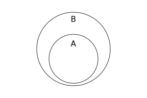

{{JSRef}}

Метод **`isSubsetOf()`** (є підмножиною щодо) примірників {{jsxref("Set")}} приймає множину і повертає булеве значення, що вказує, чи всі елементи поточної множини присутні в переданій множині.

## Синтаксис

```js-nolint
isSubsetOf(other)
```

### Параметри

- `other`
  - : Об'єкт {{jsxref("Set")}}, або [множиноподібний](/uk/docs/Web/JavaScript/Reference/Global_Objects/Set#mnozhynopodibni-obiekty) об'єкт.

### Повернене значення

`true`, якщо всі елементи поточної множини також присутні в множині `other`, і `false` в іншому випадку.

## Опис

У математичному записі _підмножина_ визначається як:

<math display="block"><semantics><mrow><mi>A</mi><mo>⊆</mo><mi>B</mi><mo stretchy="false">⇔</mo><mo>∀</mo><mi>x</mi><mo>∊</mo><mi>A</mi><mo>,</mo><mspace width="0.16666666666666666em"></mspace><mi>x</mi><mo>∊</mo><mi>B</mi></mrow><annotation encoding="TeX">A\subseteq B \Leftrightarrow \forall x\in A,\,x\in B</annotation></semantics></math>

А за допомогою діаграми Венна:



> **Примітка:** Відношення _підмножини_ не є _справжньою підмножиною_, тобто `isSubsetOf()` повертає `true`, якщо `this` і `other` містять одні й ті ж елементи.

Метод `isSubsetOf()` приймає [множиноподібні](/uk/docs/Web/JavaScript/Reference/Global_Objects/Set#mnozhynopodibni-obiekty) об'єкти в параметрі `other`. Він вимагає, щоб {{jsxref("Operators/this", "this")}} було справжнім примірником {{jsxref("Set")}}, оскільки безпосередньо отримує базові дані, збережені в `this`, без закликання будь-якого користувацького коду. Далі, його логіка залежить від розмірів `this` і `other`:

- Якщо у `this` більше елементів, ніж `other.size`, то метод безпосередньо повертає `false`.
- Інакше – він ітерує по елементах `this`, і повертає `false`, якщо будь-який елемент `e` у `this` змушує `other.has(e)` повернути [хибне](/uk/docs/Glossary/Falsy) значення. Інакше, він повертає `true`.

## Приклади

### Застосування isSubsetOf()

Множина кратних 4 (<20) є підмножиною парних чисел (<20):

```js
const fours = new Set([4, 8, 12, 16]);
const evens = new Set([2, 4, 6, 8, 10, 12, 14, 16, 18]);
console.log(fours.isSubsetOf(evens)); // true
```

Множина простих чисел (<20) не є підмножиною всіх непарних чисел (<20), оскільки 2 є простим числом, але не непарним:

```js
const primes = new Set([2, 3, 5, 7, 11, 13, 17, 19]);
const odds = new Set([3, 5, 7, 9, 11, 13, 15, 17, 19]);
console.log(primes.isSubsetOf(odds)); // false
```

Рівносильні множини є підмножинами одна одної:

```js
const set1 = new Set([1, 2, 3]);
const set2 = new Set([1, 2, 3]);
console.log(set1.isSubsetOf(set2)); // true
console.log(set2.isSubsetOf(set1)); // true
```

## Специфікації

{{Specifications}}

## Сумісність із браузерами

{{Compat}}

## Дивіться також

- [Поліфіл `Set.prototype.isSubsetOf` у складі `core-js`](https://github.com/zloirock/core-js#new-set-methods)
- {{jsxref("Set.prototype.difference()")}}
- {{jsxref("Set.prototype.intersection()")}}
- {{jsxref("Set.prototype.isDisjointFrom()")}}
- {{jsxref("Set.prototype.isSupersetOf()")}}
- {{jsxref("Set.prototype.symmetricDifference()")}}
- {{jsxref("Set.prototype.union()")}}
