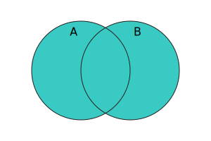

{{JSRef}}

Метод **`union()`** (об'єднання) примірників {{jsxref("Set")}} приймає множину і повертає нову множину, що містить елементи, які належать або до поточної множини, або до переданої, або до них обох.

## Синтаксис

```js-nolint
union(other)
```

### Параметри

- `other`
  - : Об'єкт {{jsxref("Set")}}, або [множиноподібний](/uk/docs/Web/JavaScript/Reference/Global_Objects/Set#mnozhynopodibni-obiekty) об'єкт.

### Повернене значення

Новий об'єкт {{jsxref("Set")}}, що містить елементи, які належать або до поточної множини, або до множини `other`, або до них обох.

## Опис

У математичному записі _об'єднання_ визначається так:

<math display="block"><semantics><mrow><mi>A</mi><mo>∪</mo><mi>B</mi><mo>=</mo><mo stretchy="false">{</mo><mi>x</mi><mo>∣</mo><mi>x</mi><mo>∊</mo><mi>A</mi><mtext>&nbsp;or&nbsp;</mtext><mi>x</mi><mo>∊</mo><mi>B</mi><mo stretchy="false">}</mo></mrow><annotation encoding="TeX">A\cup B = \{x\midx\in A\text{ or }x\in B\}</annotation></semantics></math>

А за допомогою діаграми Венна:



Метод `union()` приймає [множиноподібні](/uk/docs/Web/JavaScript/Reference/Global_Objects/Set#mnozhynopodibni-obiekty) об'єкти в параметрі `other`. Він вимагає, щоб {{jsxref("Operators/this", "this")}} було справжнім примірником {{jsxref("Set")}}, оскільки безпосередньо отримує базові дані, збережені в `this`, без закликання будь-якого користувацького коду. Далі він ітерує по `other`, викликавши її метод `keys()`, і створює нову множину з усіма елементами `this`, після яких йдуть усі елементи `other`, які не містяться в `this`.

Порядок елементів у поверненій множині: спочатку ті, що є у `this`, а потім ті, що є лише в `other`.

## Приклади

### Застосування union()

Наступний приклад обчислює об'єднання між множиною парних чисел (<10) та множиною квадратів натуральних чисел (<10). Результатом є множина чисел, які є або парними, або квадратами натуральних чисел, або і першим, і другим.

```js
const evens = new Set([2, 4, 6, 8]);
const squares = new Set([1, 4, 9]);
console.log(evens.union(squares)); // Set(6) { 2, 4, 6, 8, 1, 9 }
```

## Специфікації

{{Specifications}}

## Сумісність із браузерами

{{Compat}}

## Дивіться також

- [Поліфіл `Set.prototype.union` у складі `core-js`](https://github.com/zloirock/core-js#new-set-methods)
- {{jsxref("Set.prototype.difference()")}}
- {{jsxref("Set.prototype.intersection()")}}
- {{jsxref("Set.prototype.isDisjointFrom()")}}
- {{jsxref("Set.prototype.isSubsetOf()")}}
- {{jsxref("Set.prototype.isSupersetOf()")}}
- {{jsxref("Set.prototype.symmetricDifference()")}}
